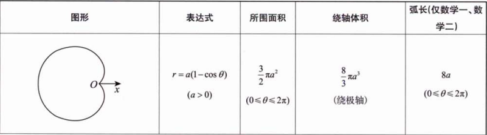

# 考研数二—高数笔记

## 1. $\int e^{-x} x \, dx$ 积分求解

**解法(分部积分 + 凑微分)：**

首先，利用凑微分：
$$
\because \int e^{-x} \, dx = -\int e^{-x} d(-x) = -e^{-x}
$$
$$
\therefore \frac{d(-e^{-x})}{dx} = e^{-x} \quad \Rightarrow \quad d(-e^{-x}) = e^{-x} dx
$$

原式可改写为：
$$
\int x \, d(-e^{-x})
$$

应用分部积分公式 $\int u \, dv = uv - \int v \, du$：
$$
= x \cdot (-e^{-x}) - \int (-e^{-x}) \, dx
$$
$$
= -x e^{-x} + \int e^{-x} \, dx
$$
$$
= -x e^{-x} - e^{-x} + C
$$

**最终结果：**
$$
\boxed{\int e^{-x} x \, dx = -xe^{-x} - e^{-x} + C}
$$

---

## 2. $\int \frac{1}{x+a} \, dx = \ln |x+a| + C$

> **注意：绝对值勿漏！**

---

## 3. 不等式：$\frac{x}{1+x} < \ln(1+x) < x$

> 来源：2026版 张宇《1000题》第6章第6题；25基础30讲P53

---

## 4. 立方和与立方差公式

- **立方和公式：**
  $$
  a^3 + b^3 = (a + b)(a^2 - ab + b^2)
  $$

- **立方差公式：**
  $$
  a^3 - b^3 = (a - b)(a^2 + ab + b^2)
  $$

---

## 5. 常用积分与恒等式

- $\int x e^x \, dx = e^x (x - 1) + C$ （建议记忆）

- $\int \frac{1}{(1+x)^2} \, dx = -\int 1 \, d\left(\frac{1}{1+x}\right) = -\frac{1}{1+x} + C$

- **重要恒等式：**
  $$
  \int e^x [f(x) + f'(x)] \, dx = e^x f(x) + C
  $$

---

## 6. 二倍角公式

### 基本形式：

$$
\begin{cases}
\sin 2\alpha = 2 \sin \alpha \cos \alpha \\
\cos 2\alpha = \cos^2 \alpha - \sin^2 \alpha \quad (\text{且 } \sin^2 \alpha + \cos^2 \alpha = 1)
\end{cases}
$$

### 推导形式：

$$
\begin{cases}
\cos 2\alpha = 2 \cos^2 \alpha - 1 \\
\cos^2 \alpha = \dfrac{1 + \cos 2\alpha}{2}
\end{cases}
\quad
\begin{cases}
\cos 2\alpha = 1 - 2 \sin^2 \alpha \\
\sin^2 \alpha = \dfrac{1 - \cos 2\alpha}{2}
\end{cases}
$$

---

## 7. 积分公式：$\int \frac{1}{x^2 - a^2} \, dx$

$$
\int \frac{1}{x^2 - a^2} \, dx = \frac{1}{2a} \ln \left| \frac{x - a}{x + a} \right| + C
$$

---

## 8. 关于 $\int \frac{1}{1 + x^4} \, dx$ 类积分的技巧

**方法：** 分子分母同除以 $x^2$，将分母写成 $(x - \frac{1}{x})'$ 或 $(x + \frac{1}{x})'$ 的形式，再提到 $d$ 后面进行换元。

---

## 9. 三角代换（用于根号内含平方项）

- $\sqrt{a^2 - x^2} \quad \Rightarrow \quad x = a \sin t$
- $\sqrt{a^2 + x^2} \quad \Rightarrow \quad x = a \tan t$
- $\sqrt{x^2 - a^2} \quad \Rightarrow \quad x = a \sec t$

---

## 10. 三角恒等式推导

由基本恒等式 $\sin^2 t + \cos^2 t = 1$ 推导：

- 两边同除以 $\cos^2 t$ 得：
  $$
  1 + \tan^2 t = \sec^2 t \quad \text{其中} \quad \sec t = \frac{1}{\cos t}
  $$

- 两边同除以 $\sin^2 t$ 得：
  $$
  1 + \cot^2 t = \csc^2 t \quad \text{其中} \quad \cot t = \frac{\cos t}{\sin t} = \frac{1}{\tan t}, \quad \csc t = \frac{1}{\sin t}
  $$

---

## 11. 特殊三角函数积分

- $\int \tan^2 x \, dx = \int (\sec^2 x - 1) \, dx = \tan x - x + C$

- $\int \cot^2 x \, dx = \int (\csc^2 x - 1) \, dx = -\cot x - x + C$

## 12. 万能公式（Weierstrass substitution）

令 $t = \tan\frac{x}{2}$，则有：

- $x = 2 \arctan t$
- $dx = \dfrac{2}{1 + t^2} dt$

由此可得：

- **正弦：**
  $$
  \sin x = 2 \sin\frac{x}{2} \cos\frac{x}{2} = \frac{2 \tan\frac{x}{2}}{\tan^2\frac{x}{2} + 1} = \frac{2t}{1 + t^2}
  $$

- **余弦：**
  $$
  \cos x = \cos^2\frac{x}{2} - \sin^2\frac{x}{2} = \frac{1 - \tan^2\frac{x}{2}}{1 + \tan^2\frac{x}{2}} = \frac{1 - t^2}{1 + t^2}
  $$

- **正切：**
  $$
  \tan x = \frac{\sin x}{\cos x} = \frac{2t}{1 - t^2}
  $$

> **用途：** 将任意关于 $\sin x$ 和 $\cos x$ 的有理函数积分转化为关于 $t$ 的有理函数积分。

---

## 13. 形如 $\int \frac{A \sin x + B \cos x}{C \sin x + D \cos x} \, dx$ 的积分

**解法：**

设分子为分母及其导数的线性组合：
$$
A \sin x + B \cos x = P \cdot (C \sin x + D \cos x) + Q \cdot (C \sin x + D \cos x)'
$$

其中：
$$
(C \sin x + D \cos x)' = C \cos x - D \sin x
$$

代入并比较系数，解出常数 $P$ 和 $Q$。

则原积分为：
$$
\int \frac{P \cdot (\text{分母}) + Q \cdot (\text{分母})'}{\text{分母}} \, dx = \int \left( P + Q \cdot \frac{(\text{分母})'}{\text{分母}} \right) dx = Px + Q \ln |\text{分母}| + C
$$

---

## 14. $\int \csc x \, dx = \int \frac{1}{\sin x} \, dx$

标准结果：
$$
\int \csc x \, dx = \ln | \csc x - \cot x | + C
$$

> 也可写作 $\ln \left| \tan \frac{x}{2} \right| + C$，两者等价。

---

## 15. 积化和差公式

- $\cos(\alpha + \beta) = \cos \alpha \cos \beta - \sin \alpha \sin \beta$

- $\sin \alpha \cdot \sin \beta = \dfrac{ \cos(\alpha - \beta) - \cos(\alpha + \beta) }{2}$

- $\sin(\alpha + \beta) = \sin \alpha \cos \beta + \cos \alpha \sin \beta$

- $\sin \alpha \cdot \cos \beta = \dfrac{ \sin(\alpha + \beta) + \sin(\alpha - \beta) }{2}$

---

## 16. 辅助角公式

对于形如 $a \sin \alpha + b \cos \alpha$ 的式子，可化为：

$$
a \sin \alpha + b \cos \alpha = \sqrt{a^2 + b^2} \cdot \sin(\alpha + \varphi)
$$

其中：
$$
\tan \varphi = \frac{b}{a}, \quad \varphi \in \left(-\frac{\pi}{2}, \frac{\pi}{2}\right)
$$

> 也可写成 $\sqrt{a^2 + b^2} \cdot \cos(\alpha - \theta)$，其中 $\tan \theta = \frac{a}{b}$。

---

## 17. 反常积分敛散性“万能公式”

考虑积分：
$$
\int_0^{+\infty} \frac{1}{x^\alpha \ln^\beta x} \, dx
$$

其敛散性需分别讨论在 $x \to 0^+$ 和 $x \to +\infty$ 两端的行为：

- **当 $x \to 0^+$ 时：**
  - 若 $\alpha < 1$，收敛；
  - 若 $\alpha = 1$，且 $\beta > 1$，收敛；
  - 否则发散。

- **当 $x \to +\infty$ 时：**
  - 若 $\alpha > 1$，收敛；
  - 若 $\alpha = 1$，且 $\beta > 1$，收敛；
  - 否则发散。

> **结论：** 整个积分收敛当且仅当两端均收敛。

---

## 18. 关于 $\int_0^1 (\ln u)^k \, du$ 的说明

该积分是**收敛的**。

虽然当 $u \to 0^+$ 时，$\ln u \to -\infty$，但对数函数增长非常缓慢，其幂次函数 $(\ln u)^k$ 的衰减速度远慢于任何幂函数 $u^p$（$p > 0$），因此不会导致积分发散。

> **补充：** 实际上，$\int_0^1 (\ln u)^k \, du = (-1)^k \cdot k!$ （可通过换元 $u = e^{-t}$ 证明）。

---

## 19. 高斯积分与伽马函数

### 高斯积分：

- $\int_0^{+\infty} e^{-x^2} \, dx = \dfrac{\sqrt{\pi}}{2}$
- $\int_{-\infty}^{+\infty} e^{-x^2} \, dx = \sqrt{\pi}$
- $\int_0^{+\infty} e^{-x} \, dx = 1$

### Γ函数 (Gamma Function)

**定义:**
$$
\Gamma(\alpha) = \int_{0}^{+\infty} x^{\alpha-1} e^{-x} dx \quad (\alpha > 0)
$$
*注：通过变量代换 $x = t^2$ 可得 $\Gamma(\alpha) = 2 \int_{0}^{+\infty} t^{2\alpha-1} e^{-t^2} dt$。*

**递推公式:**

$$
\Gamma(\alpha+1) = \int_{0}^{+\infty} x^{\alpha} e^{-x} dx = -\int_{0}^{+\infty} x^{\alpha} d(e^{-x}) = -x^{\alpha}e^{-x}\Big|_{0}^{+\infty} + \int_{0}^{+\infty} e^{-x} \cdot \alpha x^{\alpha-1} dx = \alpha \Gamma(\alpha)
$$

即：

$$
\Gamma(\alpha+1) = \alpha \Gamma(\alpha)
$$

> $\int_0^{+\infty} x^n e^{-x} \, dx = n!$ （当 $n$ 为非负整数时）
>
> **Tips:** 详见《25基础30讲》P179。

---

## 20. 积分绝对值不等式

对于 $b \ge a$，有：

$$
\left| \int_a^b f(x) \, dx \right| \le \int_a^b |f(x)| \, dx
$$

> **说明：** 这是积分基本性质之一，源于绝对值三角不等式。

---

## 21. 柯西-施瓦茨不等式（积分形式）

来源：凯积分不等式专题 P11

- 对于区间 $[a, b]$ 上的函数 $f(x), g(x)$，有：
  $$
  \int_a^b f \, dx \cdot \int_a^b g \, dx \ge \left( \int_a^b \sqrt{f \cdot g} \, dx \right)^2
  $$

- 更标准的形式（平方积分）：
  $$
  \int_a^b f^2 \, dx \cdot \int_a^b g^2 \, dx \ge \left( \int_a^b f \cdot g \, dx \right)^2
  $$

- 或写成：
  $$
  \left| \int_a^b f(x) g(x) \, dx \right| \le \sqrt{ \int_a^b f^2(x) \, dx } \cdot \sqrt{ \int_a^b g^2(x) \, dx }
  $$

---

## 22. 特殊积分恒等式$\int_0^\pi x f(\sin x) \, dx$

$$
\int_0^\pi x f(\sin x) \, dx = \pi \int_0^{\frac{\pi}{2}} f(\sin x) \, dx
$$

> **推导提示：** 利用区间对称性（令 $u = \pi - x$），再相加即可推得。

---

## 23. 半圆面积公式

$$
\int_0^a \sqrt{a^2 - x^2} \, dx = \frac{1}{4} \pi a^2
$$

> **几何意义：** 此积分表示半径为 $a$ 的上半圆在第一象限部分的面积，即四分之一圆的面积。

---

## 24. 伽马函数与阶乘的关系 $\int_0^{+\infty} x^n e^{-x} \, dx$

$$
\int_0^{+\infty} x^n e^{-x} \, dx = n!
$$

> **说明：** 这是伽马函数 $\Gamma(n+1) = n!$ 在正整数上的特例。

---

## 25. 周期函数的积分性质

设 $f(x)$ 是以 $T$ 为周期的函数，则：

- 在一个完整周期内积分值相同：
  $$
  \int_a^{a+T} f(x) \, dx = \int_0^T f(x) \, dx
  $$

- 在 $n$ 个完整周期内积分：
  $$
  \int_a^{a+nT} f(x) \, dx = n \int_0^T f(x) \, dx
  $$

---

## 26. 关于 $\sin x$ 的积分图像

图示：$\sin x$ 在 $[0, 2\pi]$ 上的图像。

- 从 $0$ 到 $\pi$ 为“拱形”，其下方面积为：
  $$
  \int_0^\pi \sin x \, dx = 2
  $$

- 从 $\pi$ 到 $2\pi$ 为“谷形”，面积为 $-2$，总积分为 $0$。

> **结论：** 一个完整周期内 $\sin x$ 的积分为 $0$。

---

## 27. 利用二重积分计算平面图形的面积

设平面区域 $D$ 的极坐标方程为 $r = r(\theta)$，其中 $\alpha \le \theta \le \beta$，则面积为：

$$
S = \iint_D 1 \, dx dy = \int_\alpha^\beta d\theta \int_0^{r(\theta)} r \, dr = \frac{1}{2} \int_\alpha^\beta r^2(\theta) \, d\theta
$$

> **核心思想：** 将面积微元 $dA$ 转换为极坐标下的扇形面积微元 $\frac{1}{2} r^2 d\theta$。

---

## 28. 利用二重积分计算旋转体体积

设平面区域 $D$ 绕直线 $L: ax + by + c = 0$（该直线不穿过区域 $D$）旋转一周，所得旋转体体积为 $V$，则：

$$
V = \iint_D 2\pi r(x,y) \, d\sigma
$$

其中，$r(x,y)$ 是区域 $D$ 上点 $(x,y)$ 到直线 $L$ 的距离：

$$
r(x,y) = \frac{|ax + by + c|}{\sqrt{a^2 + b^2}}
$$

> **原理：** 帕普斯定理（Pappus's Centroid Theorem）的积分形式。

---

## 29. 函数 $x^a + y^a = 1$ 的图像

讨论不同 $a$ 值下曲线在第一象限的形状：

- **① $a = 1$：** 直线段 $x + y = 1$，连接 $(1,0)$ 和 $(0,1)$。
- **② $a > 1$：** 曲线向原点方向“凹陷”，更接近正方形。
- **③ $a < 1$：** 曲线向原点方向“凸出”，更接近菱形。

> **备注：** 当 $a \to \infty$ 时，图形趋近于单位正方形；当 $a \to 0^+$ 时，图形趋近于坐标轴。

---

## 30. 利用二重积分定义求极限

考虑极限：
$$
\lim_{n \to \infty} \sum_{i=1}^n \sum_{j=1}^n f\left(\frac{i}{n}, \frac{j}{n}\right) \cdot \frac{1}{n^2}
$$

这实际上是函数 $f(x,y)$ 在区域 $D = \{(x,y) \mid 0 \le x \le 1, 0 \le y \le 1\}$ 上的黎曼和，因此：

$$
\lim_{n \to \infty} \sum_{i=1}^n \sum_{j=1}^n f\left(\frac{i}{n}, \frac{j}{n}\right) \cdot \frac{1}{n^2} = \iint_D f(x,y) \, dx dy
$$

> **说明：** 当 $n \to \infty$ 时，$\frac{i}{n} \to x \in [0,1]$, $\frac{j}{n} \to y \in [0,1]$，划分趋于无穷细。

---

## 31. 利用定积分定义求极限（一维情况）

考虑极限：
$$
\lim_{n \to \infty} \sum_{i=1}^n f\left(\frac{i}{n}\right) \cdot \frac{1}{n}
$$

这是函数 $f(x)$ 在区间 $[0,1]$ 上的黎曼和，因此：

$$
\lim_{n \to \infty} \sum_{i=1}^n f\left(\frac{i}{n}\right) \cdot \frac{1}{n} = \int_0^1 f(x) \, dx
$$

> **核心思想：** 将离散求和转化为连续积分，是考研数学中常见的极限计算方法。

---

## 32. 矩形区域上的二重积分可分离性

设积分区域 $D = [a, b] \times [a, b]$，则对于可分离变量的函数 $f(x)g(y)$，有：

$$
\iint_D f(x) g(y) \, dx dy = \int_a^b f(x) \, dx \cdot \int_a^b g(y) \, dy = \left( \int_a^b f(x) \, dx \right) \left( \int_a^b g(x) \, dx \right)
$$

> **用途：** 常用于利用二重积分证明积分不等式，通常需结合轮换对称性或变量代换。

---

## 33. 二重积分的轮换对称性

如果积分区域 $D$ 关于直线 $y = x$ 对称，则：

- 函数值交换：
  $$
  \iint_D f(x,y) \, d\sigma = \iint_D f(y,x) \, d\sigma
  $$

- 坐标变量交换：
  $$
  \iint_D x \, d\sigma = \iint_D y \, d\sigma
  $$

- 函数平均值：
  $$
  \iint_D f(x,y) \, d\sigma = \frac{1}{2} \iint_D \left[ f(x,y) + f(y,x) \right] \, d\sigma
  $$

> **核心思想：** 利用对称性简化计算或证明等式/不等式。

---

## 34. “点火公式”（Wallis 公式 / 三角函数幂次积分）

### ① 定义与基本关系：

令 $I_n = \int_0^{\frac{\pi}{2}} \sin^n x \, dx = \int_0^{\frac{\pi}{2}} \cos^n x \, dx$

- 若 \( n = 2m \)（\( m \in \mathbb{N}^+ \)）为正偶数：
  \[
  I_n = \frac{n-1}{n} \cdot \frac{n-3}{n-2} \cdot \cdots \cdot \frac{3}{4} \cdot \frac{1}{2} \cdot \frac{\pi}{2}
  \]

- 若 \( n = 2m+1 \)（\( m \in \mathbb{N}^+ \)，即 \( n \geq 3 \) 奇数）：
  \[
  I_n = \frac{n-1}{n} \cdot \frac{n-3}{n-2} \cdot \cdots \cdot \frac{4}{5} \cdot \frac{2}{3} \cdot 1
  \]

> 注意：偶数情形的最后一个分数是 \(\frac{1}{2}\)，**不是** \(\frac{2}{3} \cdot \frac{1}{2}\)。

### ② 扩展到 $[0, \pi]$ 区间：

- $\int_0^{\pi} \sin^n x \, dx = 2 \int_0^{\frac{\pi}{2}} \sin^n x \, dx = 2I_n$，$n$ 为正整数。

- $\int_0^{\pi} \cos^n x \, dx = \begin{cases} 
2 \int_0^{\frac{\pi}{2}} \cos^n x \, dx = 2I_n & \text{当 } n \text{ 为正偶数} \\
0 & \text{当 } n \text{ 为正奇数}
\end{cases}$

### ③ 扩展到 $[0, 2\pi]$ 区间：

- $\int_0^{2\pi} \sin^n x \, dx = \int_0^{2\pi} \cos^n x \, dx = \begin{cases} 
4 \cdot I_n = 4 \int_0^{\frac{\pi}{2}} \sin^n x \, dx & \text{当 } n \text{ 为正偶数} \\
0 & \text{当 } n \text{ 为正奇数}
\end{cases}$

> **记忆口诀：** “点火公式”中，偶数次幂结果含 $\frac{\pi}{2}$，奇数次幂结果不含；区间扩大一倍，积分值相应加倍（偶函数）或为零（奇函数）。

---

## 35. 形如 $\int \sqrt{\frac{1-t}{1+t}} \, dt$ 的积分

**解法推荐：分子有理化**

原式：
$$
\int \sqrt{\frac{1-t}{1+t}} \, dt
$$

分子分母同乘 $\sqrt{1-t}$ 进行有理化：
$$
= \int \frac{\sqrt{1-t} \cdot \sqrt{1-t}}{\sqrt{1+t} \cdot \sqrt{1-t}} \, dt = \int \frac{1-t}{\sqrt{(1+t)(1-t)}} \, dt = \int \frac{1-t}{\sqrt{1-t^2}} \, dt
$$

拆分为两项：
$$
= \int \frac{1}{\sqrt{1-t^2}} \, dt - \int \frac{t}{\sqrt{1-t^2}} \, dt
$$

分别求解：
- 第一项是反正弦函数：$\int \frac{1}{\sqrt{1-t^2}} \, dt = \arcsin t + C_1$
- 第二项用凑微分：$\int \frac{t}{\sqrt{1-t^2}} \, dt = -\sqrt{1-t^2} + C_2$

**最终结果：**
$$
\boxed{\int \sqrt{\frac{1-t}{1+t}} \, dt = \arcsin t + \sqrt{1-t^2} + C}
$$

> **替代方法：** 也可令 $u = \sqrt{\frac{1-t}{1+t}}$，但过程较繁琐，推荐使用上述“分子有理化”法。

---

## 36. $(a+b)^n$ 公式（二项式定理）

### 展开式：

$$
(a+b)^3 = a^3 + 3a^2b + 3ab^2 + b^3 = C_3^0 a^3 b^0 + C_3^1 a^2 b^1 + C_3^2 a^1 b^2 + C_3^3 a^0 b^3
$$

### 通式：

$$
(a+b)^n = \sum_{k=0}^{n} C_n^k \, a^{n-k} b^k
$$

其中，组合数 $C_n^k = \binom{n}{k} = \dfrac{n!}{k!(n-k)!}$

> **性质：**
> - 共有 $n+1$ 项。
> - 第 $k+1$ 项为 $T_{k+1} = C_n^k a^{n-k} b^k$。

---

## 37. 一阶微分方程求解

### ① 可分离变量型微分方程

**形式：**
$$
y' = f(x) \cdot g(y)
$$

**解法：**

将变量分离：
$$
\frac{dy}{dx} = f(x) \cdot g(y) \quad \Rightarrow \quad \frac{1}{g(y)} \, dy = f(x) \, dx
$$

两边同时积分：
$$
\int \frac{1}{g(y)} \, dy = \int f(x) \, dx + C
$$

---

### ② 齐次型微分方程

**形式：**
$$
\frac{dy}{dx} = \varphi\left(\frac{y}{x}\right)
$$

**解法：**

令 $u = \frac{y}{x}$，则 $y = ux$，对 $x$ 求导得：
$$
\frac{dy}{dx} = u + x \frac{du}{dx}
$$

代入原方程：
$$
u + x \frac{du}{dx} = \varphi(u)
$$

整理为可分离变量形式：
$$
\frac{du}{\varphi(u) - u} = \frac{dx}{x}
$$

两边积分即可求解。

---

### ③ 一阶线性微分方程

**形式：**
形如 $y' + P(x)y = Q(x)$ 的方程称为一阶线性微分方程。

**通解公式：**
$$
y = e^{-\int P(x) \, dx} \left[ \int e^{\int P(x) \, dx} \cdot Q(x) \, dx + C \right]
$$

> **Tips:** 推导过程详见《25张宇基础30讲》P269。

---

## 38. 伯努利方程 (仅数一)

> **Tips:** 数二考生亦可通过提示“换元”解题。

**形式：**
$$
\frac{dy}{dx} + P(x)y = Q(x)y^n \quad (n \neq 0, 1)
$$

**解法：**

1.  **变形：** 方程两边同除以 $y^n$：
    $$
    y^{-n} \frac{dy}{dx} + P(x) y^{1-n} = Q(x)
    $$

2.  **换元：** 令 $z = y^{1-n}$，对 $x$ 求导：
    $$
    \frac{dz}{dx} = (1-n) y^{-n} \frac{dy}{dx}
    \quad \Rightarrow \quad
    y^{-n} \frac{dy}{dx} = \frac{1}{1-n} \frac{dz}{dx}
    $$

3.  **代入：** 将上式代入变形后的方程：
    $$
    \frac{1}{1-n} \frac{dz}{dx} + P(x) z = Q(x)
    $$

4.  **求解：** 此时得到一个关于 $z$ 的一阶线性微分方程，按标准方法求解即可。

---

## 39. 二阶可降阶微分方程

### (1) $y'' = f(x, y')$ 型 （方程中不显含未知函数 $y$）

**解法：**

令 $y' = p$，则 $y'' = p'$，原方程化为：
$$
\frac{dp}{dx} = f(x, p)
$$
这是一个关于 $p$ 和 $x$ 的一阶微分方程（$p = p(x)$“赶尽杀绝 $y$”）。

- 解得其通解为 $p = \varphi(x, C_1)$。
- 由于 $p = y'$，即 $y' = \varphi(x, C_1)$。
- 再对 $x$ 积分一次，得到原方程的通解：
  $$
  y = \int \varphi(x, C_1) \, dx + C_2
  $$

---

### (2) $y'' = f(y, y')$ 型 （方程中不显含自变量 $x$）

**解法：**

令 $y' = p$，则 $y'' = \frac{dp}{dx} = \frac{dp}{dy} \cdot \frac{dy}{dx} = p \frac{dp}{dy}$，原方程化为：
$$
p \frac{dp}{dy} = f(y, p)
$$
这是一个关于 $p$ 和 $y$ 的一阶微分方程（$p = p(y)$“斩草除根 $x$”）。

- 解得其通解为 $p = \varphi(y, C_1)$。
- 由于 $p = \frac{dy}{dx}$，即 $\frac{dy}{dx} = \varphi(y, C_1)$。
- 分离变量得：
  $$
  \frac{dy}{\varphi(y, C_1)} = dx
  $$
- 两边积分得：
  $$
  \int \frac{dy}{\varphi(y, C_1)} = x + C_2
  $$
  即得原方程的通解。

---

### (3) $y'' = f(y')$ 型

此类型既不显含 $y$，也不显含 $x$，可按 **(1)** 中“不显含 $y$”的方法处理。

> **Tips:** 通过换元法将其化为一阶方程求解。

---

## 40. 二阶常系数齐次线性微分方程

**标准形式：**
$$
y'' + py' + qy = 0 \quad , \text{其中 } p, q \text{ 为常数}
$$

**理论基础：**

若 $y_1(x), y_2(x)$ 是该方程的两个解，且它们线性无关（即 $\frac{y_1(x)}{y_2(x)} \neq \text{常数}$），则方程的通解为：
$$
y(x) = C_1 y_1(x) + C_2 y_2(x)
$$

**求解步骤：**

1.  **写出特征方程：**
    $$
    r^2 + pr + q = 0
    $$

2.  **求特征根：**
    $$
    r_{1,2} = \frac{-p \pm \sqrt{p^2 - 4q}}{2}
    $$

3.  **根据特征根的不同情况，写出通解：**

    - **① 两个不相等的实根 ($r_1 \neq r_2$)：**
      $$
      y = C_1 e^{r_1 x} + C_2 e^{r_2 x}
      $$

    - **② 两个相等的实根 ($r_1 = r_2 = r$)：**
      $$
      y = (C_1 + C_2 x) e^{rx}
      $$

    - **③ 一对共轭复根 ($p^2 - 4q < 0$)，设 $r = \alpha \pm \beta i$：**
      $$
      y = e^{\alpha x} (C_1 \cos \beta x + C_2 \sin \beta x)
      $$

---

## 41. 二阶常系数非齐次线性微分方程

**标准形式：**
$$
y'' + py' + qy = f(x) \quad (f(x) \neq 0)
$$
其中 $p, q$ 为常数，$f(x)$ 为已知的连续函数。

---

### 通解结构

若 $y_h(x) = C_1 y_1(x) + C_2 y_2(x)$ 是对应的齐次方程 $y'' + py' + qy = 0$ 的通解，$y_p^*(x)$ 是原非齐次方程的一个特解，则原方程的通解为：
$$
y(x) = y_h(x) + y_p^*(x)
$$

> **核心思想：** 非齐次方程的通解 = 齐次方程的通解 + 非齐次方程的一个特解。

---

### 解的叠加性

1.  若 $y_{p1}^*(x)$ 是方程 $y'' + py' + qy = f_1(x)$ 的解，$y_{p2}^*(x)$ 是方程 $y'' + py' + qy = f_2(x)$ 的解，则 $y_{p1}^*(x) + y_{p2}^*(x)$ 是方程 $y'' + py' + qy = f_1(x) + f_2(x)$ 的解。

2.  若 $y_{p1}^*$ 和 $y_{p2}^*$ 都是方程 $y'' + py' + qy = f(x)$ 的特解，则 $y_{p1}^* - y_{p2}^*$ 是对应齐次方程 $y'' + py' + qy = 0$ 的解。

---

### 特解的设定方法（待定系数法）

#### ① 当 $f(x) = P_n(x) e^{\alpha x}$ 时

其中 $P_n(x)$ 为 $x$ 的 $n$ 次多项式。

- **特解形式：** $y_p^* = e^{\alpha x} Q_n(x) x^k$
  - $Q_n(x)$ 为与 $P_n(x)$ 同次的多项式。
  - $k$ 由 $\alpha$ 是否为特征根决定：
    $$
    k =
    \begin{cases}
    0, & \text{若 } \alpha \text{ 不是特征根} \\
    1, & \text{若 } \alpha \text{ 是单特征根} \\
    2, & \text{若 } \alpha \text{ 是二重特征根}
    \end{cases}
    $$

> **提示：** “$e^{\alpha x}$ 照抄”，只需确定 $k$ 值。

---

#### ② 当 $f(x) = e^{\alpha x} [P_m(x) \cos \beta x + P_n(x) \sin \beta x]$ 时

其中 $P_m(x), P_n(x)$ 分别为 $x$ 的 $m$ 次、$n$ 次多项式。

- **特解形式：** $y_p^* = e^{\alpha x} [Q_l^{(1)}(x) \cos \beta x + Q_l^{(2)}(x) \sin \beta x] x^k$
  - $l = \max\{m, n\}$。
  - $Q_l^{(1)}(x), Q_l^{(2)}(x)$ 为两个不同的 $l$ 次多项式。
  - $k$ 由 $\alpha \pm \beta i$ 是否为特征根决定：
    $$
    k =
    \begin{cases}
    0, & \text{若 } \alpha \pm \beta i \text{ 不是特征根} \\
    1, & \text{若 } \alpha \pm \beta i \text{ 是特征根}
    \end{cases}
    $$

> **提示：** “$e^{\alpha x}$ 照抄”，只需确定 $k$ 值。

---

### 示例

#### 例1：求解 $y'' - 2y' + 5y = e^x$

1.  **求齐次通解：**
    特征方程：$r^2 - 2r + 5 = 0$，解得 $r_{1,2} = 1 \pm 2i$。
    齐次通解：$y_h = e^x (C_1 \cos 2x + C_2 \sin 2x)$。

2.  **设特解：**
    $f(x) = e^x = 1 \cdot e^x$，即 $\alpha = 1$，$P_n(x) = 1$（0次多项式）。
    因 $\alpha = 1$ 不是特征根（特征根为 $1 \pm 2i$），故 $k=0$。
    设 $y_p^* = a e^x$。

3.  **代入原方程求系数：**
    $y_p^* = a e^x$, $y_p^{*'} = a e^x$, $y_p^{*''} = a e^x$。
    代入：$a e^x - 2a e^x + 5a e^x = e^x \Rightarrow 4a e^x = e^x \Rightarrow a = \frac{1}{4}$。

4.  **写出通解：**
    $$
    y = e^x (C_1 \cos 2x + C_2 \sin 2x) + \frac{1}{4} e^x
    $$

---

#### 例2：求解 $y'' - 2y' + 5y = -e^x \cos 2x$

1.  **求齐次通解：** 同上，$y_h = e^x (C_1 \cos 2x + C_2 \sin 2x)$。

2.  **设特解：**
    $f(x) = -e^x \cos 2x$，即 $\alpha = 1, \beta = 2$。
    因 $\alpha \pm \beta i = 1 \pm 2i$ 正好是特征根，故 $k=1$。
    设 $y_p^* = e^x (A \cos 2x + B \sin 2x) x$。

> **注意：** 此处的 $x^k$ 是为了消除与齐次解的重复项。

---

## 42. $n$ ($n \ge 2$) 阶常系数齐次线性微分方程

对于形如 $y^{(n)} + a_{n-1} y^{(n-1)} + \dots + a_1 y' + a_0 y = 0$ 的方程，其通解由特征根决定：

- **① 若 $r$ 为单实根：** 对应解为 $Ce^{rx}$。
- **② 若 $r$ 为 $k$ 重实根：** 对应解为 $(C_1 + C_2 x + C_3 x^2 + \dots + C_k x^{k-1}) e^{rx}$。
- **③ 若 $r$ 为单复根 $\alpha \pm \beta i$：** 对应解为 $e^{\alpha x} (C_1 \cos \beta x + C_2 \sin \beta x)$。

> **核心思想：** 每一个特征根对应一组基本解，所有基本解的线性组合即为通解。

---

## 43. 欧拉方程 (仅数一)

> **Tips:** 数二考生亦可通过提示“换元”解题。

**标准形式：**
$$
x^2 \frac{d^2y}{dx^2} + px \frac{dy}{dx} + qy = f(x)
$$

**解法：**

1.  **当 $x > 0$ 时：**
    令 $x = e^t$，则 $t = \ln x$，$\frac{dt}{dx} = \frac{1}{x}$。
    - 一阶导数：$\frac{dy}{dx} = \frac{dy}{dt} \cdot \frac{dt}{dx} = \frac{1}{x} \frac{dy}{dt}$
    - 二阶导数：
      $$
      \frac{d^2y}{dx^2} = \frac{d}{dx} \left( \frac{1}{x} \frac{dy}{dt} \right) = -\frac{1}{x^2} \frac{dy}{dt} + \frac{1}{x^2} \frac{d^2y}{dt^2}
      $$

    代入原方程，化简得：
    $$
    \frac{d^2y}{dt^2} + (p-1) \frac{dy}{dt} + qy = f(e^t)
    $$
    此为常系数线性微分方程，可按常规方法求解。

    最后，用 $t = \ln x$ 回代成 $x$ 的函数，即可得到原方程的解。

2.  **当 $x < 0$ 时：**
    令 $x = -e^t$，同理可得相同形式的常系数方程。

---

## 44. 关于 $y'' + py' + qy = 0$ 中求 $\int_0^\infty y(x) \, dx$ 型积分

若要求 $\int_0^\infty y(x) \, dx$ 收敛，则必须满足：

- 特征根 $\lambda_{1,2} < 0$。否则，积分不收敛。
- 且此时必有 $\lim_{x \to \infty} y(x) = 0$ 和 $\lim_{x \to \infty} y'(x) = 0$。

> **说明：** 这是保证解在无穷远处衰减到零的必要条件，从而使得积分收敛。

---

## 45. 求解一阶线性微分方程的通解时，若原式不满足常见形式

当原方程无法直接写成 $y' = f(x)g(y)$ 或 $y' + P(x)y = Q(x)$ 时，可以考虑对换 $x$ 和 $y$ 的地位，将方程改写为：

$$
x' + P(y) x = Q(y)
$$

其中 $x' = \frac{dx}{dy}$。

这样，原方程就变成了关于 $x$ 作为因变量、$y$ 作为自变量的一阶线性微分方程，可以直接套用通解公式求解。

---

## 46. 使用变限积分表达的一阶线性微分方程通解

一阶线性微分方程 $y' + P(x)y = Q(x)$ 的通解公式：

$$
y = e^{-\int P(x) \, dx} \left[ \int e^{\int P(x) \, dx} \cdot Q(x) \, dx + C \right]
$$

该公式亦可写成变限积分形式：

$$
y = e^{-\int_{x_0}^x P(t) \, dt} \left[ \int_{x_0}^x Q(t) e^{\int_{x_0}^t P(s) \, ds} \, dt + C \right]
$$

> **Tips:** 在使用变限积分求导时，被积函数中不能含有求导变量（即积分上限或下限中的变量）。

> **参考：** 见《26 张宇 1000题》第15章第10题。

---

## 47. 拉格朗日乘数法 (求极值)

**问题：** 求目标函数 $u = f(x, y, z)$ 在约束条件 $\begin{cases} \varphi(x, y, z) = 0 \\ \psi(x, y, z) = 0 \end{cases}$ 下的最值。

**解法步骤：**

1.  **构造辅助函数（拉格朗日函数）：**
    $$
    F(x, y, z, \lambda, \mu) = f(x, y, z) + \lambda \varphi(x, y, z) + \mu \psi(x, y, z)
    $$
    > **注：** 辅助函数中的自变量个数 = 目标函数自变量个数 + 约束条件个数。

2.  **令所有偏导数为零：**
    $$
    \begin{cases}
    F'_x = f'_x + \lambda \varphi'_x + \mu \psi'_x = 0 \\
    F'_y = f'_y + \lambda \varphi'_y + \mu \psi'_y = 0 \\
    F'_z = f'_z + \lambda \varphi'_z + \mu \psi'_z = 0 \\
    F'_\lambda = \varphi(x, y, z) = 0 \\
    F'_\mu = \psi(x, y, z) = 0
    \end{cases}
    $$

3.  **解方程组：** 解得备选点 $P_i$ ($i=1, 2, 3, \dots, n$)，并计算 $f(P_i)$ 的值。
4.  **确定最值：** 取其中的最大值 $u_{\max}$ 和最小值 $u_{\min}$，即为所求。

> **Tips:** 对于简单函数，可考虑直接将约束条件代入目标函数消元；对于复杂函数，则需使用拉格朗日乘数法。

---

## 48. 无条件极值 (二元函数)

设函数 $z = f(x, y)$ 在点 $(x_0, y_0)$ 处具有一阶偏导数，且在该点取极值，则必有：
$$
f'_x(x_0, y_0) = 0, \quad f'_y(x_0, y_0) = 0
$$

**步骤：**

1.  **求驻点：** 解方程组 $\begin{cases} f'_x(x, y) = 0 \\ f'_y(x, y) = 0 \end{cases}$，得到可能为极值的坐标点 $(x_0, y_0)$。

2.  **二阶充分条件：** 记
    $$
    A = f''_{xx}(x_0, y_0), \quad B = f''_{xy}(x_0, y_0), \quad C = f''_{yy}(x_0, y_0)
    $$
    并计算判别式 $\Delta = AC - B^2$。

    - 若 $\Delta > 0$：
      - $A < 0$ $\Rightarrow$ 存在极大值。
      - $A > 0$ $\Rightarrow$ 存在极小值。
    - 若 $\Delta < 0$ $\Rightarrow$ 不是极值点。
    - 若 $\Delta = 0$ $\Rightarrow$ 方法失效，需用定义法判断。

> **补充说明：** 对于一般函数，若在 $(x_0, y_0)$ 处的极限 $\lim_{(x,y) \to (x_0,y_0)} f(x,y)$ 与函数值 $f(x_0, y_0)$ 不相等，或极限不存在，该点不是极值点。通常在考研数学中，判别法失效的情况下，极值大概率不存在，但需要证明。

---

## 49. 全微分形式不变性

设 $z = f(u, v)$，而 $u, v$ 又是 $x, y$ 的函数，即 $u = u(x, y)$, $v = v(x, y)$。

则 $z$ 在点 $(x, y)$ 处的全微分为：
$$
dz = \frac{\partial z}{\partial u} du + \frac{\partial z}{\partial v} dv
$$

**核心性质：**

无论 $u, v$ 是自变量还是中间变量，其全微分的形式保持不变。

> **解释：** 这是因为多元函数微分遵循链式求导法则，求导后新函数与原函数具有完全相同的复合结构。

---

## 50. 隐函数求导 (公式法)

### ① 二元隐函数 $F(x, y) = 0$

若方程 $F(x, y) = 0$ 在点 $(x_0, y_0)$ 的某邻域内满足：
- $F(x, y)$ 具有一阶连续偏导数。
- $F_y'(x_0, y_0) \neq 0$。

则在该点附近可确定一个单值函数 $y = f(x)$，且其导数为：
$$
\frac{dy}{dx} = -\frac{F_x'(x, y)}{F_y'(x, y)}
$$

---

### ② 三元隐函数 $F(x, y, z) = 0$

若方程 $F(x, y, z) = 0$ 在点 $(x_0, y_0, z_0)$ 的某邻域内满足：
- $F(x, y, z)$ 具有一阶连续偏导数。
- $F_z'(x_0, y_0, z_0) \neq 0$。

则在该点附近可确定一个单值函数 $z = f(x, y)$，且其偏导数为：
$$
\frac{\partial z}{\partial x} = -\frac{F_x'(x, y, z)}{F_z'(x, y, z)}, \quad \frac{\partial z}{\partial y} = -\frac{F_y'(x, y, z)}{F_z'(x, y, z)}
$$

---

## 51. 一元函数与多元函数的性质关系图

下图为一元函数和多元函数中“可微”、“连续”、“极限存在”、“可导/偏导存在”之间的逻辑关系总结：

> **关键点：**
> - 对于一元函数，“可微”与“可导”是等价的。
> - 对于多元函数，“可微”蕴含“连续”和“偏导存在”，但“偏导存在”不能推出“可微”，“连续”也不能推出“可微”。

---

## 52. 可微的判别步骤 (以二元函数为例)

判断函数 $z = f(x, y)$ 在点 $(x_0, y_0)$ 处是否可微，按以下步骤进行：

1.  **计算全增量：**
    $$
    \Delta z = f(x_0 + \Delta x, y_0 + \Delta y) - f(x_0, y_0)
    $$

2.  **写出线性增量：**
    $$
    A \Delta x + B \Delta y
    $$
    其中 $A = f'_x(x_0, y_0)$, $B = f'_y(x_0, y_0)$，即在该点处的两个偏导数值。

3.  **作极限判断：**
    $$
    \lim_{\substack{\Delta x \to 0 \\ \Delta y \to 0}} \frac{\Delta z - (A \Delta x + B \Delta y)}{\sqrt{(\Delta x)^2 + (\Delta y)^2}} = 0
    $$
    若该极限等于 $0$，则函数 $z = f(x, y)$ 在点 $(x_0, y_0)$ 处可微。

> **Tips:** 一元函数可微的判别方法：
> - 计算 $\Delta y = f(x_0 + \Delta x) - f(x_0)$。
> - 线性增量为 $A \Delta x = f'(x_0) \Delta x$。
> - 判断极限：
>   $$
>   \lim_{\Delta x \to 0} \frac{\Delta y - A \Delta x}{\Delta x} = 0
>   $$
>   若成立，则 $y = f(x)$ 在 $x_0$ 处可微。

## 53.微分与导数的关系

#### 1. 微分的定义

在点 $x = x_0$ 处，函数 $y = f(x)$ 的微分 $dy$ 定义为：
$$
\left. dy \right|_{x=x_0} = f'(x_0) \cdot dx
$$

- **解释**：
  - $f'(x_0)$ 是函数 $f(x)$ 在点 $x_0$ 处的**导数值**，代表该点切线的斜率。
  - $dx$ 是自变量 $x$ 的一个**无穷小增量**（微分），可以看作是 $\Delta x$ 的极限形式。
  - $dy$ 是因变量 $y$ 对应的**线性主部**，即当 $x$ 变化 $dx$ 时，$y$ 的近似变化量。
  - 这个公式表明：**微分 = 导数 × 自变量微分**。

---

#### 2. 函数增量与微分的关系
函数在 $x_0$ 点的总增量 $\Delta y$ 可以分解为：
$$
\Delta x = dx, \quad \Delta y = dy + o(\Delta x)
$$

- **解释**：
  - $\Delta x$ 是自变量的有限增量，但在微分理论中，我们常将其等同于 $dx$。
  - $\Delta y = f(x_0 + \Delta x) - f(x_0)$ 是函数值的真实增量。
  - $o(\Delta x)$ 是比 $\Delta x$ 更高阶的无穷小量，表示 $\Delta y$ 中不能被线性部分 $dy$ 描述的“误差”或“非线性部分”。
  - 这个等式说明：**函数的真实增量 = 线性近似（微分）+ 高阶无穷小误差**。

---

#### 3. 导数的极限定义与微分的关系推导
通过极限过程，可以从增量比推导出导数：
$$
\lim_{\Delta x \to 0} \frac{\Delta y}{\Delta x} = \lim_{\Delta x \to 0} \frac{A \Delta x}{\Delta x} + \lim_{\Delta x \to 0} \frac{o(\Delta x)}{\Delta x} = A = f'(x_0)
$$

- **详细推导说明**：
  - 将 $\Delta y = dy + o(\Delta x)$ 代入增量比 $\frac{\Delta y}{\Delta x}$。
  - 由于 $dy = f'(x_0) \cdot dx = f'(x_0) \cdot \Delta x$（这里令 $A = f'(x_0)$），所以：
    $$
    \frac{\Delta y}{\Delta x} = \frac{f'(x_0) \cdot \Delta x + o(\Delta x)}{\Delta x} = f'(x_0) + \frac{o(\Delta x)}{\Delta x}
    $$
  - 当 $\Delta x \to 0$ 时：
    - 第一项 $f'(x_0)$ 保持不变。
    - 第二项 $\frac{o(\Delta x)}{\Delta x} \to 0$（因为 $o(\Delta x)$ 是比 $\Delta x$ 更高阶的无穷小）。
  - 因此：
    $$
    \lim_{\Delta x \to 0} \frac{\Delta y}{\Delta x} = f'(x_0)
    $$
  - 这正是导数的定义！它从“微分近似”的角度重新验证了导数的极限本质。

> **导数 $f'(x_0)$ 是函数在某点的变化率，而微分 $dy$ 是利用这个变化率对函数增量进行线性近似的结果。**

---

## 54. 均值不等式 (调和平均 ≤ 几何平均 ≤ 算术平均 ≤ 平方平均)

对于 $n$ 个非负实数 $x_1, x_2, \dots, x_n \ge 0$，有：
$$
\frac{1}{\frac{1}{x_1} + \frac{1}{x_2} + \cdots + \frac{1}{x_n}} \le \sqrt[n]{x_1 x_2 \cdots x_n} \le \frac{x_1 + x_2 + \cdots + x_n}{n} \le \sqrt{\frac{x_1^2 + x_2^2 + \cdots + x_n^2}{n}}
$$

> **等号成立条件：** 当且仅当 $x_1 = x_2 = \cdots = x_n$ 时取等号。

> **Tips:** 相关题目见《张宇1000题》第13章第21题；《凯哥讲义3》P14。

---

## 55. 柯西不等式 (Cauchy-Schwarz Inequality)

对于两组实数 $(a_1, a_2, \dots, a_n)$ 和 $(b_1, b_2, \dots, b_n)$，有：
$$
(a_1^2 + a_2^2 + \cdots + a_n^2)(b_1^2 + b_2^2 + \cdots + b_n^2) \ge (a_1b_1 + a_2b_2 + \cdots + a_nb_n)^2
$$

> **等号成立条件：** 当且仅当两组数成比例，即存在常数 $\lambda$ 使得 $a_i = \lambda b_i$ ($i=1,2,\dots,n$) 时取等号。
>
> **注意：** 笔记中“均为非负实数”的限定并非必要，柯西不等式对任意实数均成立。

---

## 56. 积分的物理应用

### ① 位移大小：
若速度函数为 $v(t)$，则从时刻 $t_1$ 到 $t_2$ 的位移大小为：
$$
s = \int_{t_1}^{t_2} v(t) \, dt
$$

### ② 总路程：
总路程是速度的绝对值积分：
$$
s = \int_{t_1}^{t_2} |v(t)| \, dt
$$

### ③ 做功：
若力 $F(x)$ 是位置 $x$ 的函数，则从 $a$ 到 $b$ 所做的功为：
$$
W = \int_a^b dW = \int_a^b F(x) \, dx
$$

### ④ 从容器中抽出液体所做的功：
设液体密度为 $\rho$，重力加速度为 $g$，容器在高度 $y$ 处的横截面积为 $A(y)$，需将液体提升到高度 $H$，则所做的功为：
$$
W = \int_{y_1}^{y_2} \rho g A(y) (H - y) \, dy
$$
其中，$(H - y)$ 为在深度 $y$ 处的液体质点需要被提升的距离。

### ⑤ 静水压力：
作用在竖直平板上的静水压力，若平板在深度范围 $[y_1, y_2]$ 内，深度为 $y$ 处的水平宽度为 $L(y)$，则压力为：
$$
F = \int_{y_1}^{y_2} \rho g y \cdot L(y) \, dy
$$

### ⑥ 细杆质心：
若细杆在区间 $[a, b]$ 上的线密度为 $\rho(x)$，则其质心坐标 $\bar{x}$ 为：
$$
\bar{x} = \frac{\int_a^b x \cdot \rho(x) \, dx}{\int_a^b \rho(x) \, dx}
$$

---

## 57. 关于 $f(b) - f(a)$ 型问题的思考

这类问题通常与微分中值定理相关，核心思想是将函数值之差转化为导数或积分形式。

### ① 牛顿-莱布尼茨公式 (微积分基本定理)

若函数 $f(x)$ 在区间 $[a, b]$ 上连续，则：
$$
f(b) - f(a) = \left. f(x) \right|_a^b = \int_a^b f'(x) \, dx
$$

> **要求：** $f(x)$ 在 $[a, b]$ 上连续，且 $f'(x)$ 存在（或至少可积）。

### ② 拉格朗日中值定理

若函数 $f(x)$ 在闭区间 $[a, b]$ 上连续，在开区间 $(a, b)$ 内可导，则至少存在一点 $\xi \in (a, b)$，使得：
$$
f'(\xi) = \frac{f(b) - f(a)}{b - a}
$$

> **Tips:** 相关题目见《张宇1000题》第11章第9题。

---

## 58. 复合函数的单调性

复合函数 $y = f(g(x))$ 的单调性遵循“同增异减”原则：

- **内外层函数单调性相同**：复合函数为**增函数**。
- **内外层函数单调性相反**：复合函数为**减函数**。

> **记忆口诀：** “同增异减”。

---

## 59. 变限积分

### 基本性质：

若 $f(x)$ 在区间 $[a, b]$ 上连续，则函数 $\Phi(x) = \int_a^x f(t) \, dt$ 是 $f(x)$ 在 $[a, b]$ 上的一个原函数。

- $\Phi(x)$ 在 $[a, b]$ 上可导，且 $\Phi'(x) = f(x)$，$\forall x \in [a, b]$。

### 推广形式（莱布尼茨公式）：

若 $u(x), v(x)$ 可导，且 $f(t)$ 连续，则：
$$
\frac{d}{dx} \left[ \int_{v(x)}^{u(x)} f(t) \, dt \right] = f(u(x)) \cdot u'(x) - f(v(x)) \cdot v'(x)
$$

> **Tips:**
> - 只要 $f(x)$ 在积分区间上可积，变限积分函数 $\Phi(x)$ 一定连续。
> - 对变限积分求导时，被积函数中不能含有求导变量 $x$（即积分上下限中的变量）。

---

## 60. 关于 $f(x)$ 在区间 $[a, b]$ 上的平均值

函数 $f(x)$ 在区间 $[a, b]$ 上的平均值定义为：
$$
\bar{f}(x) = \frac{\int_a^b f(x) \, dx}{b - a}
$$

---

## 61. 平面图形面积

### ① 直角坐标系下：

由两条曲线 $y_1(x)$ 和 $y_2(x)$ 围成的图形面积为：
$$
S = \int_a^b |y_1(x) - y_2(x)| \, dx
$$

### ② 极坐标系下：

由两条极径曲线 $r_1(\theta)$ 和 $r_2(\theta)$ 围成的图形面积为：
$$
S = \int_\alpha^\beta \frac{1}{2} |r_1^2(\theta) - r_2^2(\theta)| \, d\theta
$$

---

## 62. 旋转体体积

### ① 绕 $x$ 轴旋转：

由曲线 $y = f(x)$ ($a \le x \le b$) 与 $x$ 轴围成的区域绕 $x$ 轴旋转所得体积为：
$$
V_x = \int_a^b \pi y^2(x) \, dx
$$

### ② 绕 $y$ 轴旋转：

由曲线 $y = f(x)$ ($a \le x \le b$) 与 $y$ 轴围成的区域绕 $y$ 轴旋转所得体积为：
$$
V_y = 2\pi \int_a^b x |y(x)| \, dx
$$

### ③ 绕任意直线 $Ax + By + C = 0$ 旋转：

由曲线 $y = f(x)$ ($a \le x \le b$) 与该直线围成的区域绕此直线旋转所得体积为：
$$
V = \frac{\pi}{(A^2 + B^2)^{\frac{3}{2}}} \int_a^b \left[ Ax + Bf(x) + C \right]^2 \cdot |Af'(x) - B| \, dx
$$

> **Tips:** 记忆口诀：“面积 × 走过的路”。即体积等于截面面积乘以质心走过的距离（帕普斯定理）。

---

## 63. 形心坐标公式

设平面区域 $D$ 的面积为 $A = \iint_D d\sigma$，则其形心 $(\bar{x}, \bar{y})$ 坐标为：

- $\bar{x} = \frac{1}{A} \iint_D x \, d\sigma = \frac{\iint_D x \, d\sigma}{\iint_D d\sigma}$
- $\bar{y} = \frac{1}{A} \iint_D y \, d\sigma = \frac{\iint_D y \, d\sigma}{\iint_D d\sigma}$

> **Tips:**
> - 当积分区域 $D$ 为圆形时，由于对称性，形心 $\bar{x}, \bar{y}$ 已知。
> - 此时，有 $\iint_D x \, d\sigma = \bar{x} \cdot A$，$\iint_D y \, d\sigma = \bar{y} \cdot A$，可以简化二重积分运算。

---

## 64. 平面曲线的弧长公式

### ① 显函数形式：

若曲线方程为 $y = y(x)$ ($a \le x \le b$)，则弧长为：
$$
s = \int_a^b \sqrt{1 + [y'(x)]^2} \, dx
$$

### ② 参数方程形式：

若曲线方程为 $\begin{cases} x = x(t) \\ y = y(t) \end{cases}$ ($\alpha \le t \le \beta$)，则弧长为：
$$
s = \int_\alpha^\beta \sqrt{[x'(t)]^2 + [y'(t)]^2} \, dt
$$

### ③ 极坐标形式：

若曲线方程为 $r = r(\theta)$ ($\alpha \le \theta \le \beta$)，则弧长为：
$$
s = \int_\alpha^\beta \sqrt{[r(\theta)]^2 + [r'(\theta)]^2} \, d\theta
$$

---

## 65.曲率及曲率半径公式

设 $y(x)$ 二阶可导，则曲线 $y = y(x)$ 在点 $(x, y(x))$ 处的**曲率公式**为

$$
k = \frac{|y''|}{[1 + (y')^2]^{\frac{3}{2}}}
$$

**曲率半径的计算公式**
$$
R = \frac{1}{k} = \frac{[1 + (y')^2]^{\frac{3}{2}}}{|y''|} \quad (y'' \ne 0).
$$

> **注**：弯曲程度越大，曲率越大，曲率圆的半径越小。

## 66. $e^x$ 的泰勒级数展开

对于任意实数 $x \in \mathbb{R}$，有：
$$
e^x = \sum_{n=0}^{\infty} \frac{x^n}{n!} = 1 + x + \frac{x^2}{2!} + \frac{x^3}{3!} + \cdots
$$

---

## 67. 反三角函数的复合关系与图像

### ① 复合关系：

$$
\sin(\arcsin x) = x \quad (\text{定义域 } [-1, 1])
$$
但
$$
\arcsin(\sin x) \neq x \quad (\text{除非 } x \in [-\frac{\pi}{2}, \frac{\pi}{2}])
$$

### ② 函数 $f(x) = \arcsin(\sin x)$ 的图像：

该函数是一个周期为 $2\pi$ 的锯齿波形，在区间 $[-\frac{\pi}{2}, \frac{\pi}{2}]$ 上等于 $y=x$，在其他区间通过周期性延拓得到。

**$f(x) = \arcsin(\sin x)$ 的函数图像：**

> **图像特征：** 在每个长度为 $\pi$ 的区间内，图像是斜率为 1 或 -1 的线段，整体呈“之”字形。

---

## 68. 等差数列与等比数列

### ① 等差数列：

- 通项公式：$a_n = a_1 + (n-1)d$
- 前 $n$ 项和：$S_n = \frac{n}{2} [2a_1 + (n-1)d] = \frac{n}{2} (a_1 + a_n)$

### ② 等比数列：

- 通项公式：$a_n = a_1 \cdot q^{n-1}$
- 前 $n$ 项和：
  $$
  S_n =
  \begin{cases}
  n a_1, & q = 1 \\
  \dfrac{a_1(1 - q^n)}{1 - q}, & q \neq 1
  \end{cases}
  $$

- 特殊情况：当 $|q| < 1$ 时，无穷等比级数和为 $S = \frac{a_1}{1-q}$。
- 求和公式：$1 + q + q^2 + \cdots + q^{n-1} = \frac{1 - q^n}{1 - q}$ ($q \neq 1$)

---

## 69. 椭圆方程

### ① 横椭圆（长轴在 $x$ 轴）：

标准方程：
$$
\frac{x^2}{a^2} + \frac{y^2}{b^2} = 1 \quad (a > b > 0)
$$
参数方程：
$$
\begin{cases}
x = a \cos \theta \\
y = b \sin \theta
\end{cases}
\quad , \theta \in [0, 2\pi]
$$

### ② 纵椭圆（长轴在 $y$ 轴）：

标准方程：
$$
\frac{x^2}{b^2} + \frac{y^2}{a^2} = 1 \quad (a > b > 0)
$$
参数方程：
$$
\begin{cases}
x = b \cos \theta \\
y = a \sin \theta
\end{cases}
\quad , \theta \in [0, 2\pi]
$$

> **Tips:** “大者为 $a$”，即 $a$ 总是半长轴，决定椭圆的“定轴向”。

### ③ 椭圆面积与焦距：

- 面积：$S = \pi ab$
- 焦距：$c = \sqrt{a^2 - b^2}$

---

## 70. 已知 $f'(x)$，求含 $f(x)$ 的积分

若题目给出导函数 $f'(x)$，而要求解包含原函数 $f(x)$ 的积分（如 $\int f(x) g(x) dx$），应考虑使用**分部积分法**。

---

## 71. 双曲正弦函数 $\sinh x = \ln(x + \sqrt{x^2 + 1})$

这是一个重要的反双曲函数，其性质如下：

- **奇偶性：** $f(-x) = \ln(-x + \sqrt{(-x)^2 + 1}) = \ln\left(\frac{1}{x + \sqrt{x^2 + 1}}\right) = -\ln(x + \sqrt{x^2 + 1}) = -f(x)$，故为**奇函数**。
- **导数：** $f'(x) = \frac{1}{\sqrt{1+x^2}}$
- **渐近行为：** 当 $x \to 0$ 时，$f(x) \sim x$。

---

## 72. 导数的定义表达式

设函数 $y = f(x)$ 在点 $x_0$ 的某个邻域内有定义，则其导数定义为：

- **增量形式：**
  $$
  f'(x_0) = \lim_{\Delta x \to 0} \frac{f(x_0 + \Delta x) - f(x_0)}{\Delta x}
  $$

- **差商形式：**
  $$
  f'(x_0) = \lim_{x \to x_0} \frac{f(x) - f(x_0)}{x - x_0}
  $$

- **导函数定义：**
  $$
  f'(x) = \lim_{\Delta x \to 0} \frac{f(x + \Delta x) - f(x)}{\Delta x}, \quad x \in I
  $$

> **Tips:**
> - 对称导数：$\lim_{h \to 0} \frac{f(x_0 + h) - f(x_0 - h)}{2h}$ 存在，不能保证 $f'(x_0)$ 存在（仅当 $f(x)$ 在 $x_0$ 处连续时等价）
> - 导数 $f'(x_0)$ 存在 $\Leftrightarrow$ 左右导数存在且相等。

---

## 73. 绝对收敛蕴含收敛

若反常积分 $\int_a^{+\infty} |f(x)| \, dx$ 收敛，则 $\int_a^{+\infty} f(x) \, dx$ 必然收敛。

> **结论：** 绝对收敛 ⇒ 收敛。

---

## 74. 渐近线

### ① 垂直渐近线：

若 $x_0$ 是函数 $f(x)$ 的无定义点或定义区间的端点，且满足：
$$
\lim_{x \to x_0^+} f(x) = \infty \quad \text{或} \quad \lim_{x \to x_0^-} f(x) = \infty
$$
则直线 $x = x_0$ 是一条垂直渐近线。

### ② 水平渐近线：

若极限 $\lim_{x \to +\infty} f(x) = y_1$ 和 $\lim_{x \to -\infty} f(x) = y_2$ 存在，则直线 $y = y_1$ 和 $y = y_2$ 是水平渐近线。

### ③ 斜渐近线：

若极限 $\lim_{x \to \infty} \frac{f(x)}{x} = a$ ($a \neq 0$) 存在，且极限 $\lim_{x \to \infty} [f(x) - ax] = b$ 存在，则直线 $y = ax + b$ 是斜渐近线。

> **求解步骤：**
> 1. 先求 $a = \lim_{x \to \infty} \frac{f(x)}{x}$。
> 2. 再求 $b = \lim_{x \to \infty} [f(x) - ax]$。
> 3. 得到斜渐近线方程 $y = ax + b$。

---

## 75. 高阶无穷小的运算

对于任意实数 $m, n$，有：
$$
x^m \cdot O(x^n) = O(x^{m+n})
$$

> **含义：** 一个无穷小量乘以另一个更高阶的无穷小量，结果仍是更高阶的无穷小量。

---

## 76. 可积的充分条件

在闭区间 $[a, b]$ 上，以下情况下的函数必定可积：

1.  **连续函数：** 若 $f(x)$ 在 $[a, b]$ 上连续，则 $f(x)$ 在该区间上可积。
2.  **单调函数：** 若 $f(x)$ 在 $[a, b]$ 上单调，则 $f(x)$ 在该区间上可积。
3.  **有界且仅有有限个间断点：** 若 $f(x)$ 在 $[a, b]$ 上有界，且仅有有限个第一类间断点（跳跃或可去间断点），则 $f(x)$ 在该区间上可积。

> **重要提示：**
> - “$f(x)$ 可积”意味着其原函数存在，但反之不成立。即“在积分区域上存在原函数”是“可积”的**必要条件**，而非**充分条件**。
> - 因此，“$f(x)$ 可积 $\Rightarrow$ 在积分区域上存在原函数”的说法是**错误的**。

---

## 77. 表格法求解积分 (分部积分法)

表格法是处理形如 $\int P_n(x) e^{ax} dx$、$\int P_n(x) \sin(bx) dx$ 等多项式与指数/三角函数乘积积分的有效方法。

### 方法步骤：

1.  **列表：** 将被积函数中的一个部分（通常是多项式）设为 $u$，另一个部分（通常是指数或三角函数）设为 $v'$。
2.  **求导与积分：** 对 $u$ 反复求导，对 $v'$ 反复积分，直到 $u$ 的某阶导数为零。
3.  **相乘与符号：** 从左上角开始，将 $u$ 的每一项与 $v'$ 对应的下一项错位相乘，符号按 “+ - + - ...” 交替。
4.  **最后项：** 最后一项是 $\int u^{(n)} v^{(n-1)} dx$，其中 $u^{(n)}$ 是最后一项非零导数。

### 示例：求 $\int (x^3 + 2x + 6) e^{2x} \, dx$

| $u$ 的各阶导数 | $v'$ 的各阶原函数     |
| :------------- | :-------------------- |
| $x^3 + 2x + 6$ | $e^{2x}$              |
| $3x^2 + 2$     | $\frac{1}{2} e^{2x}$  |
| $6x$           | $\frac{1}{4} e^{2x}$  |
| $6$            | $\frac{1}{8} e^{2x}$  |
| $0$            | $\frac{1}{16} e^{2x}$ |

计算：
$$
\begin{aligned}
\text{原式} &= (x^3 + 2x + 6) \cdot \frac{1}{2} e^{2x} - (3x^2 + 2) \cdot \frac{1}{4} e^{2x} + 6x \cdot \frac{1}{8} e^{2x} - 6 \cdot \frac{1}{16} e^{2x} + \int 0 \cdot \frac{1}{16} e^{2x} \, dx \\
&= \left( \frac{1}{2} x^3 - \frac{3}{4} x^2 + \frac{7}{4} x + \frac{17}{8} \right) e^{2x} + C
\end{aligned}
$$

---

## 78. 关于 $\int e^{ax} \sin(bx) \, dx$ 和 $\int e^{ax} \cos(bx) \, dx$ 型积分的求解

这类积分可以通过构造一个二阶线性方程组来求解，或者直接使用公式：
$$
\int e^{ax} \sin bx \, dx = 
\frac{
\begin{vmatrix}
(e^{ax})' & (\sin bx)' \\
e^{ax} & \sin bx
\end{vmatrix}
}{a^2 + b^2} + C = 
\frac{a e^{ax} \sin bx - b e^{ax} \cos bx}{a^2 + b^2} + C
$$

$$
\int e^{ax} \cos bx \, dx = 
\frac{
\begin{vmatrix}
(e^{ax})' & (\cos bx)' \\
e^{ax} & \cos bx
\end{vmatrix}
}{a^2 + b^2} + C = 
\frac{a e^{ax} \cos bx + b e^{ax} \sin bx}{a^2 + b^2} + C
$$

> **推导思路：** 设 $I = \int e^{ax} \sin(bx) \, dx$, $J = \int e^{ax} \cos(bx) \, dx$，通过两次分部积分，可以得到关于 $I$ 和 $J$ 的方程组，联立求解即可。

---

## 79. 旋转曲面的面积 (侧面积)

### ① 显函数形式 $y = f(x)$, $a \le x \le b$，绕 $x$ 轴旋转：

$$
S = 2\pi \int_a^b |y| \sqrt{1 + (y')^2} \, dx
$$

### ② 参数方程形式 $L: \begin{cases} x = x(t) \\ y = y(t) \end{cases}$, $\alpha \le t \le \beta$, $x'(t) \neq 0$，绕 $x$ 轴旋转：

$$
S = 2\pi \int_\alpha^\beta |y(t)| \sqrt{[x'(t)]^2 + [y'(t)]^2} \, dt
$$

### ③ 极坐标形式 $r = r(\theta)$, $\alpha \le \theta \le \beta$，绕 $x$ 轴旋转：

$$
S = 2\pi \int_\alpha^\beta |r(\theta) \sin \theta| \sqrt{[r(\theta)]^2 + [r'(\theta)]^2} \, d\theta
$$

> **核心思想：** 侧面积 = 曲线长度 × 旋转半径（平均值）。

---

## 80. 放缩常用的不等式

本节汇总了一系列在证明题和求极限中常用的放缩技巧。

### ① 平均值放缩

对于任意实数 $u_1, u_2, \dots, u_n$：
$$
n \cdot u_{\min} \le u_1 + u_2 + \cdots + u_n \le n \cdot u_{\max}
$$

- 当所有 $u_i \ge 0$ 时，有更紧的下界：
  $$
  1 \cdot u_{\max} \le u_1 + u_2 + \cdots + u_n \le n \cdot u_{\max}
  $$

### ② 绝对值三角不等式

- $|a \pm b| \le |a| + |b|$
- $||a| - |b|| \le |a - b|$
- 推广到 $n$ 项：
  $$
  |a_1 \pm a_2 \pm \cdots \pm a_n| \le |a_1| + |a_2| + \cdots + |a_n|
  $$

### ③ 均值不等式链

对于非负实数 $a, b, c \ge 0$：

- 二元情况：
  $$
  \sqrt{ab} \le \frac{a+b}{2} \le \sqrt{\frac{a^2 + b^2}{2}} \quad \text{且} \quad |ab| \le \frac{a^2 + b^2}{2}
  $$

- 三元情况：
  $$
  \sqrt[3]{abc} \le \frac{a+b+c}{3} \le \sqrt{\frac{a^2 + b^2 + c^2}{3}}
  $$

### ④ 幂函数单调性

设 $a \ge b > 0$，则：

- 当 $m > 0$ 时，$a^m \ge b^m$
- 当 $m < 0$ 时，$a^m \le b^m$

### ⑤ 分式不等式

若 $0 < a < x < b$ 且 $0 < c < y < d$，则：
$$
\frac{c}{b} < \frac{y}{x} < \frac{d}{a}
$$

### ⑥ 三角函数不等式

- 在 $(0, \frac{\pi}{2})$ 区间内：$\sin x < x < \tan x$
- 对于 $x > 0$：$\sin x < x$
- 在 $(0, \frac{\pi}{4})$ 区间内：$x < \tan x < \frac{4}{\pi} x$
- 在 $(0, \frac{\pi}{2})$ 区间内：$\sin x > \frac{2}{\pi} x$ （要求背记）

### ⑦ 积分的绝对值不等式

$$
\left| \int_a^b f(x) \, dx \right| \le \int_a^b |f(x)| \, dx
$$

> **解释：** “积分的代数和”的绝对值 ≤ “各部分绝对值之和”。

### ⑧ 反三角函数不等式

$$
\arctan x \le x \le \arcsin x \quad (0 \le x \le 1)
$$

> **应用：** 可用于证明数列 $\{x_n\}$ 的单调性，例如当 $x_n > 0$ 时，$x_{n+1} = \arctan x_n < x_n$，故 $\{x_n\}$ 单调减少。

### ⑨ 指数不等式

$$
e^x \ge x + 1 \quad (\forall x)
$$

### ⑩ 对数不等式

$$
x - 1 \ge \ln x \quad (x > 0)
$$

### ⑪ 对数函数不等式

对于 $x > 0$：
$$
\frac{1}{1+x} < \ln(1 + \frac{1}{x}) < \frac{1}{x}
$$
$$
\frac{x}{1+x} < \ln(1 + x) < x
$$

> **Tips:** 上述不等式均可通过拉格朗日中值定理证明。

### ⑫ 最值定理

利用闭区间上连续函数必有最大值和最小值的性质进行放缩。

### ⑬ 压缩映射原理

#### i. 数列收敛判定：

对数列 $\{x_n\}$，若存在常数 $k \in (0, 1)$，使得：
$$
|x_{n+1} - a| \le k |x_n - a|, \quad n = 1, 2, \dots
$$
则数列 $\{x_n\}$ 收敛于 $a$。

> **证明：**
> $$
> 0 \le |x_{n+1} - a| \le k |x_n - a| \le k^2 |x_{n-1} - a| \le \cdots \le k^n |x_1 - a| \to 0 \quad (\text{因为 } \lim_{n \to \infty} k^n = 0)
> $$ 故 $\lim_{n \to \infty} |x_{n+1} - a| = 0$，即 $\{x_n\}$ 收敛于 $a$。

#### ii. 迭代数列收敛判定：

对数列 $\{x_n\}$，若 $x_{n+1} = f(x_n)$，$n=1,2,\dots$，且 $f(x)$ 可导，$a$ 是方程 $f(x) = x$ 的唯一解，且 $\forall x \in \mathbb{R}$，有 $|f'(x)| \le k < 1$，则 $\{x_n\}$ 收敛于 $a$。

> **证明：**
> 由拉格朗日中值定理，存在 $\xi$ 介于 $a$ 与 $x_n$ 之间，使得：
> $$
> |x_{n+1} - a| = |f(x_n) - f(a)| = |f'(\xi)| \cdot |x_n - a| \le k |x_n - a|
> $$ 由 i 知，$\{x_n\}$ 收敛于 $a$。

---

## 81. 反常积分计算

反常积分的计算需特别注意其收敛性，通常按以下步骤进行：

1.  **存在瑕点，拆区间：** 若积分区间内或端点处存在瑕点（被积函数无界），需将积分区间在瑕点处拆开。
2.  **拆成多积分（分部），考虑每一项敛散性：** 将原积分拆分为多个定积分或反常积分，分别判断其敛散性。若其中任意一项发散，则整个积分发散。
    - 利用分部积分法时，有：
      $$
      \int u v' \, dx = \int u \, dv = uv - \int v \, du = uv - \int v \cdot u' \, dx
      $$
3.  **对于无穷区间 $(0, +\infty)$：**
    - 可将其拆为 $(0, 1)$ 和 $(1, +\infty)$ 两部分。
    - 对于 $(1, +\infty)$ 部分，可令 $x = \frac{1}{t}$，将其变为 $(0, 1)$ 区间。
    - 对于 $(0, +\infty)$ 整体，可令 $x = \tan t$，将其变为 $t \in (0, \frac{\pi}{2})$。

---

## 82. 区间再现公式

设函数 $f(x)$ 在闭区间 $[a, b]$ 上可积，则有以下恒等式：

- **基本形式：**
  $$
  \int_a^b f(x) \, dx = \int_a^b f(a + b - x) \, dx
  $$

- **推论：**
  $$
  \int_a^b f(x) \, dx = \frac{1}{2} \left( \int_a^b f(x) \, dx + \int_a^b f(a + b - x) \, dx \right)
  $$

- **三角函数应用：**
  - $\int_0^{\frac{\pi}{2}} f(\sin x) \, dx = \int_0^{\frac{\pi}{2}} f(\cos x) \, dx$ （因为 $\sin(\frac{\pi}{2} - x) = \cos x$）
  - $\int_0^{\pi} f(\sin x) \, dx = 2 \int_0^{\frac{\pi}{2}} f(\sin x) \, dx$ （因为 $\sin(\pi - x) = \sin x$，函数关于 $x = \frac{\pi}{2}$ 对称）

> **用途：** 简化对称区间的积分计算。

---

## 83.$f(x)$积分的奇偶性与周期性讨论

(1) $f(x)$ 为可积的奇函数 $\Rightarrow$
$$
\begin{cases}
\int_0^x f(t)dt \text{ 为偶函数}, \\
\int_a^x f(t)dt \text{ 为偶函数 } (a \ne 0).
\end{cases}
$$

此时 $f'(x)$ 为偶函数

> **注** 
> (1) 若 $f(x)$ 为连续的奇函数，则 $\int_a^x f(t)dt + C$ 也是偶函数，故 $f(x)$ 的全体原函数均为偶函数。 
> (2) 只需要被积函数可积，即可有变限积分的相关性质，只有被积函数连续时，才能谈原函数的相关性质，以下同。

(2) $f(x)$ 为可积的偶函数 $\Rightarrow$
$$
\begin{cases}
\int_0^x f(t)dt \text{ 为奇函数}, \\
\int_a^x f(t)dt \, (a \ne 0)
\begin{cases}
\text{若 } \int_a^x f(t)dt = \int_0^x f(t)dt, \text{ 为奇函数}, \\
\text{若 } \int_a^x f(t)dt \ne \int_0^x f(t)dt, \text{ 为非奇非偶函数}.
\end{cases}
\end{cases}
$$

此时 $f'(x)$ 为奇函数

> **注**：若 $f(x)$ 为连续的偶函数，则 $f(x)$ 的全体原函数中，只有 $\int_0^x f(t)dt$ 是奇函数。

(3) $f(x)$ 是可积的且以 $T$ 为周期的周期函数，则 $\int_0^x f(t)dt$ 是以 $T$ 为周期的周期函数 $\Leftrightarrow \int_0^T f(x)dx = 0$。 
$\rightarrow f'(x)$ 也是以 $T$ 为周期

> **注**：$\int_a^x f(t)dt = \int_a^0 f(t)dt + \int_0^x f(t)dt$ 亦是以 $T$ 为周期的周期函数 $(a \ne 0)$。 因为，$\int_a^0 f(t)dt$为常数，$\int_0^x f(t)dt$为周期函数。

---

## 84. 高阶导数（莱布尼兹公式）

莱布尼兹公式用于求两个函数乘积的高阶导数。

- **加法形式：**
  $$
  (u \pm v)^{(n)} = u^{(n)} \pm v^{(n)}
  $$

- **乘法形式：**
  $$
  (uv)^{(n)} = u^{(n)}v + C_n^1 u^{(n-1)} v' + C_n^2 u^{(n-2)} v'' + \cdots + C_n^{n-1} u' v^{(n-1)} + u v^{(n)}
  $$
  或者写成求和形式：
  $$
  (uv)^{(n)} = \sum_{k=0}^{n} C_n^k \, u^{(n-k)} \, v^{(k)}
  $$

其中，组合数 $C_n^k = \binom{n}{k} = \dfrac{n!}{k!(n-k)!}$。

> **记忆方法：** 系数遵循杨辉三角（帕斯卡三角）：
>
> 

> **Tips:** 一般高阶导数题目建议逐级求导，寻找规律，而非直接套用公式。

---

## 85. 凹凸性判别和拐点

### ① 凹凸性判别：

设函数 $f(x)$ 在区间 $I$ 上二阶可导：

- 若 $f''(x) > 0$，则曲线在 $I$ 上是**凹的**。
- 若 $f''(x) < 0$，则曲线在 $I$ 上是**凸的**。

> **记忆口诀：** “二阶导正，图形上凹；二阶导负，图形下凸”。

### ② 拐点判别：

拐点是曲线凹凸性改变的点。若 $x_0$ 是拐点，则：

1.  **必要条件：** $f''(x_0) = 0$。
2.  **充分条件：** 在 $x_0$ 的去心邻域内，$f''(x)$ 变号。
3.  **高阶导数法：** 若 $f(x)$ 在 $x_0$ 处 $n$ 阶可导，且 $f^{(m)}(x_0) = 0$ ($m = 2, 3, \dots, n-1$)，而 $f^{(n)}(x_0) \neq 0$，则当 $n$ 为**奇数**时，$x_0$ 为拐点。

> **核心思想：** 拐点是“曲率”发生改变的点，即二阶导数变号的点。

---

## 86. 极值点的判定

### 必要条件：

若函数 $f(x)$ 在 $x = x_0$ 处可导且取极值，则必有：
$$
f'(x_0) = 0
$$
> **注意：** 此为必要条件，非充分条件。满足 $f'(x_0) = 0$ 的点称为**驻点**，驻点不一定是极值点。

> **Tips:** 驻点一定是可导点，称 $f'(x_0) = 0$，$x_0$ 为驻点。但驻点不一定为极值点。

---

### 判别极值的充分条件：

1.  **第一充分条件（利用一阶导数符号变化）：**
    - 若 $f(x)$ 在 $x_0$ 的去心邻域内可导，且 $f'(x)$ 在 $x_0$ 左右变号，则 $x_0$ 为极值点。
      - 左正右负 $\Rightarrow$ 极大值点。
      - 左负右正 $\Rightarrow$ 极小值点。

2.  **第二充分条件（利用二阶导数）：**
    - 若 $f'(x_0) = 0$ 且 $f''(x_0) \neq 0$，则：
      - $f''(x_0) < 0$ $\Rightarrow$ $f(x)$ 在 $x_0$ 处取极大值。
      - $f''(x_0) > 0$ $\Rightarrow$ $f(x)$ 在 $x_0$ 处取极小值。

3.  **高阶导数法：**
    - 若 $f(x)$ 在 $x = x_0$ 处 $n$ 阶可导，且 $f^{(m)}(x_0) = 0$ ($m = 1, 2, \dots, n-1$)，而 $f^{(n)}(x_0) \neq 0$ ($n \ge 2$)，则：
      - 当 $n$ 为**偶数**时，$x_0$ 为极值点。
        - $f^{(n)}(x_0) < 0$ $\Rightarrow$ 极大值点。
        - $f^{(n)}(x_0) > 0$ $\Rightarrow$ 极小值点。
      - 当 $n$ 为**奇数**时，$x_0$ 为拐点。

---

## 87. 极值点与拐点的结论

### ① 基本关系：

- 不可导点可以同时是拐点和极值点。
- 可导点不能同时是拐点和极值点。（因为极值点要求一阶导数为零或不存在，拐点要求二阶导数变号，两者在可导点处的条件冲突。）

### ② 特殊函数形式：

对于形如 $f(x) = (x - a)^n g(x)$ ($n > 1$) 且 $g(a) \neq 0$ 的函数：

- 当 $n$ 为**偶数**时，$x = a$ 是 $f(x)$ 的**极值点**。
- 当 $n$ 为**奇数**时，$(a, 0)$ 是 $f(x)$ 的**拐点**。

### ③ 一般多项式函数：

对于形如 $f(x) = (x - a_1)^{n_1} (x - a_2)^{n_2} \cdots (x - a_k)^{n_k}$ 的多项式，其中 $n_i$ 为正整数，$a_i$ 互不相等。

记：
- $k_1$ 为 $n_i = 1$ 的个数。
- $k_2$ 为 $n_i > 1$ 且 $n_i$ 为偶数的个数。
- $k_3$ 为 $n_i > 1$ 且 $n_i$ 为奇数的个数。

则：
- **极值点个数**为 $k_1 + 2k_2 + k_3 - 1$。
- **拐点个数**为 $k_1 + 2k_2 + 3k_3 - 2$。

### 另一种解法：通过求导找零点个数

#### 示例1: (2001年真题)
函数 $y = (x-1)^2 (x-3)^2$ 的拐点个数。

- **分析：** 函数有重根 $x=1$ 和 $x=3$，均为偶数次方，故均为极值点。
- **求导：** 对 $y$ 求一阶导和二阶导，找出 $y'$ 和 $y''$ 的零点及其重数。
- **结论：** 该函数有 **2个拐点**。

#### 示例2: (2011年真题)
函数 $y = (x-1)(x-2)^2(x-3)^3(x-4)^4$。

- **分析：** 通过求导并分析各阶导数的零点重数来判断。
- **结论：** 该函数有 **6个驻点，5个极值点，6个拐点**。

### 判断驻点、极值点、拐点个数的方法总结：

- **驻点个数：** 等于 $y'$ 的零点个数。
- **极值点个数：** 等于 $y'$ 的零点中，重数为**奇数**的个数。
- **拐点个数：** 等于 $y''$ 的零点中，重数为**奇数**的个数。

> **核心思想：** 通过分析导数的零点及其重数来判断函数图像的关键特征点。

---

## 88. 反常积分敛散性

### ① 比较判别法

设 $f(x), g(x)$ 在 $[a, +\infty)$ 上连续，且 $0 \le f(x) \le g(x)$ 恒成立，则：

- 若 $\int_a^{+\infty} g(x) \, dx$ 收敛，则 $\int_a^{+\infty} f(x) \, dx$ 也收敛。
- 若 $\int_a^{+\infty} f(x) \, dx$ 发散，则 $\int_a^{+\infty} g(x) \, dx$ 也发散。

### ② 极限比较判别法

设 $f(x), g(x)$ 在 $[a, +\infty)$ 上连续且非负，且 $\lim_{x \to +\infty} \frac{f(x)}{g(x)} = k$，则：

1.  当 $k = 0$ 时：
    - 若 $\int_a^{+\infty} g(x) \, dx$ 收敛，则 $\int_a^{+\infty} f(x) \, dx$ 也收敛。

2.  当 $k = +\infty$ 时：
    - 若 $\int_a^{+\infty} g(x) \, dx$ 发散，则 $\int_a^{+\infty} f(x) \, dx$ 也发散。

3.  当 $k$ 为非零常数时：
    - $\int_a^{+\infty} f(x) \, dx$ 和 $\int_a^{+\infty} g(x) \, dx$ 的敛散性相同。

> **推论：**
> - 当 $x \to +\infty$ 时，若 $f(x)$ 和 $g(x)$ 为同阶无穷小，则两个积分同敛散。
> - 当 $x \to a^+$ 时，若 $f(x)$ 和 $g(x)$ 为同阶无穷大，则 $\int_a^b f(x) \, dx$ 和 $\int_a^b g(x) \, dx$ 同敛散。

---

## 89.P积分的敛散性

### ① 无穷区间上的P积分：

对于 $\int_1^{+\infty} \frac{1}{x^p} \, dx$，结论为：
$$
\begin{cases}
p > 1, & \text{收敛} \\
p \le 1, & \text{发散}
\end{cases}
$$

> **Tips:** 对于 $\int_0^{+\infty} \frac{1}{x^p} \, dx$，无论 $p$ 取多少都发散（因为其在 $0$ 和 $+\infty$ 两端均可能发散）。

### ② 瑕积分上的P积分：

对于 $\int_0^1 \frac{1}{x^p} \, dx$ 或 $\int_a^b \frac{1}{(x-a)^p} \, dx$、$\int_a^b \frac{1}{(x-b)^p} \, dx$，结论为：
$$
\begin{cases}
0 < p < 1, & \text{收敛} \\
p \ge 1, & \text{发散}
\end{cases}
$$

---

## 90.广义P积分敛散性

形如 $\int_e^{+\infty} \frac{1}{x (\ln x)^p} \, dx$、$\int_1^e \frac{1}{x (\ln x)^p} \, dx$、$\int_{e^{100}}^{+\infty} \frac{1}{x (\ln x) (\ln \ln x)^p} \, dx$ 等形式的积分。

通过换元（如令 $t = \ln x$）可以将其转化为标准的P积分，因此结论相似：

### ① 对于 $\int_e^{+\infty} \frac{1}{x (\ln x)^p} \, dx$：

$$
\begin{cases}
p > 1, & \text{收敛} \\
p \le 1, & \text{发散}
\end{cases}
$$

### ② 对于 $\int_1^e \frac{1}{x (\ln x)^p} \, dx$：

$$
\begin{cases}
0 < p < 1, & \text{收敛} \\
p \ge 1, & \text{发散}
\end{cases}
$$

> **核心思想：** 广义P积分的敛散性判断与标准P积分类似，关键在于看对数项的幂次 $p$。

---

## 91. $\arctan x + \arctan \frac{1}{x}$ 的恒等式

该恒等式为：
$$
\arctan x + \arctan \frac{1}{x} =
\begin{cases}
\dfrac{\pi}{2}, & x > 0 \\
-\dfrac{\pi}{2}, & x < 0
\end{cases}
$$

> **注意：** 此恒等式在 $x=0$ 处无定义，因为 $\frac{1}{x}$ 无意义。

---

## 92. 中值定理

### ① 罗尔定理 (Rolle's Theorem)

设函数 $f(x)$ 在闭区间 $[a, b]$ 上连续，在开区间 $(a, b)$ 内可导，且 $f(a) = f(b)$，则至少存在一点 $\xi \in (a, b)$，使得：
$$
f'(\xi) = 0
$$

### ② 拉格朗日中值定理 (Lagrange's Mean Value Theorem)

设函数 $f(x)$ 在闭区间 $[a, b]$ 上连续，在开区间 $(a, b)$ 内可导，则至少存在一点 $\xi \in (a, b)$，使得：
$$
f(b) - f(a) = (b - a) f'(\xi)
$$

### ③ 积分中值定理 (Integral Mean Value Theorem)

设函数 $f(x)$ 在闭区间 $[a, b]$ 上连续，则至少存在一点 $\xi \in [a, b]$，使得：
$$
\int_a^b f(x) \, dx = (b - a) f(\xi)
$$

### ④ 介值定理 (Intermediate Value Theorem)

闭区间上的连续函数，一定可以取到介于其最大值和最小值之间的任意值。

### ⑤ 柯西中值定理 (Cauchy's Mean Value Theorem)

设函数 $f(x), g(x)$ 在闭区间 $[a, b]$ 上连续，在开区间 $(a, b)$ 内可导，且 $g'(x) \neq 0$，则至少存在一点 $\xi \in (a, b)$，使得：
$$
\frac{f(b) - f(a)}{g(b) - g(a)} = \frac{f'(\xi)}{g'(\xi)}
$$

> **Tips:** 在以上所有中值定理中，只有**介值定理**中的 $\xi$ 落在闭区间 $[a, b]$ 上（积分中值定理也是）；其余定理中的 $\xi$ 均落在开区间 $(a, b)$ 内。

---

## 93. 积分因子法构造辅助函数

> **“常用来解中值定理证明题”**

对于形如 $f'(\xi) + f(\xi) g(\xi) = 0$ 的题目，都可以构造辅助函数：
$$
F(x) = f(x) e^{\int g(x) \, dx}
$$

**原理：**
对 $F(x)$ 求导：
$$
F'(x) = f'(x) e^{\int g(x) \, dx} + f(x) \cdot g(x) e^{\int g(x) \, dx} = e^{\int g(x) \, dx} \left[ f'(x) + f(x) g(x) \right]
$$
因此，若 $F'(x) = 0$，则原方程成立。

> **Tips:** 在表达式 $f'(x) + f(x) g(x)$ 上乘以积分因子 $e^{\int g(x) \, dx}$ 后，恰好可以凑成一个函数的导数形式。

> **特殊情况：** 若 $g(x)$ 是一个抽象函数，则需要将公式修改为：
> $$
> F(x) = f(x) \int_a^x g(t) \, dt
> $$

---

## 94. 泰勒定理 (出现高阶导数时)

泰勒定理是处理涉及高阶导数问题的核心工具。

### 1. 带佩亚诺余项的泰勒展开 (用于计算极限)

若函数 $f(x)$ 在 $x = x_0$ 处 $n$ 阶可导，则在 $x_0$ 的邻域内，有：
$$
f(x) = f(x_0) + f'(x_0)(x - x_0) + \frac{f''(x_0)}{2!}(x - x_0)^2 + \cdots + \frac{f^{(n)}(x_0)}{n!}(x - x_0)^n + o\left[(x - x_0)^n\right]
$$

> **特点：** 仅需知道 $f(x)$ 在 $x_0$ 点的各阶导数值，即可写出其局部近似多项式。余项 $o\left[(x - x_0)^n\right]$ 表示当 $x \to x_0$ 时，余项比 $(x - x_0)^n$ 更高阶无穷小。
>
> **用途：** 主要用于求极限或分析函数在某点附近的性态。

---

### 2. 带拉格朗日余项的泰勒展开 (用于证明中值定理问题)

若函数 $f(x)$ 在 $x = x_0$ 处 $n+1$ 阶可导，则在 $x_0$ 的邻域内，有：
$$
f(x) = f(x_0) + f'(x_0)(x - x_0) + \frac{f''(x_0)}{2!}(x - x_0)^2 + \cdots + \frac{f^{(n)}(x_0)}{n!}(x - x_0)^n + \frac{f^{(n+1)}(\xi)}{(n+1)!}(x - x_0)^{n+1}
$$
其中 $\xi$ 介于 $x_0$ 和 $x$ 之间。

> **特点：** 余项是一个具体的表达式，包含一个未知点 $\xi$ 的 $(n+1)$ 阶导数。
>
> **用途：** 主要用于证明题，特别是需要利用中值定理思想的问题。
>
> **Tips:** 选择导数信息多的点作为 $x_0$，而只知道函数值、不知道导数信息的点作为 $x$。

---

### 3. 当 $x_0 = 0$ 时的泰勒公式称为麦克劳林公式

将上述泰勒公式中的 $x_0$ 取为 0，即得麦克劳林公式：

- **带拉格朗日余项：**
  $$
  f(x) = f(0) + f'(0)x + \frac{f''(0)}{2!}x^2 + \cdots + \frac{f^{(n)}(0)}{n!}x^n + \frac{f^{(n+1)}(\xi)}{(n+1)!}x^{n+1}, \quad \xi \in (0, x)
  $$

- **带佩亚诺余项：**
  $$
  f(x) = f(0) + f'(0)x + \frac{f''(0)}{2!}x^2 + \cdots + \frac{f^{(n)}(0)}{n!}x^n + o(x^n)
  $$

---

### 4. 几个重要函数的麦克劳林展开式

以下是几个常用初等函数在 $x=0$ 处的麦克劳林展开式（通常取到 $n$ 阶或特定形式）：

### ① 指数函数：
$$
e^x = 1 + x + \frac{x^2}{2!} + \cdots + \frac{x^n}{n!} + o(x^n)
$$

### ② 正弦函数：
$$
\sin x = x - \frac{x^3}{3!} + \cdots + (-1)^n \frac{x^{2n+1}}{(2n+1)!} + o(x^{2n+1})
$$

### ③ 余弦函数：
$$
\cos x = 1 - \frac{x^2}{2!} + \frac{x^4}{4!} - \cdots + (-1)^n \frac{x^{2n}}{(2n)!} + o(x^{2n})
$$

### ④ 几何级数：
$$
\frac{1}{1-x} = 1 + x + x^2 + \cdots + x^n + o(x^n), \quad |x| < 1
$$

### ⑤ 有理函数：
$$
\frac{1}{1+x} = 1 - x + x^2 - \cdots + (-1)^n x^n + o(x^n), \quad |x| < 1
$$

### ⑥ 对数函数：
$$
\ln(1+x) = x - \frac{x^2}{2} + \frac{x^3}{3} - \cdots + (-1)^{n-1} \frac{x^n}{n} + o(x^n), \quad -1 < x \le 1
$$

### ⑦ 幂函数：
$$
(1+x)^\alpha = 1 + \alpha x + \frac{\alpha(\alpha-1)}{2!}x^2 + \cdots + \frac{\alpha(\alpha-1)\cdots(\alpha-n+1)}{n!}x^n + o(x^n)
$$

> **核心价值：** 这些展开式是进行极限计算、函数逼近和证明题的有力工具。

---

## 95. 零点定理 (Intermediate Value Theorem for Roots)

若函数 $f(x)$ 在闭区间 $[a, b]$ 上连续，且 $f(a) \cdot f(b) < 0$，则 $f(x)$ 在开区间 $(a, b)$ 内**至少有一个根**。

> **核心思想：** 连续函数在区间两端异号，则必穿过零点。

---

## 96. 罗尔定理推论

若函数 $f^{(n)}(x) = 0$ 至多有 $k$ 个根，则原函数 $f(x) = 0$ 至多有 $n + k$ 个根。

> **解释：** 这是罗尔定理的推广。每求一次导数，方程的根的个数最多减少一个。因此，如果第 $n$ 阶导数有 $k$ 个根，那么原函数最多有 $n+k$ 个根。
>
> **记忆口诀：** “阶数换根的个数”。

---

## 97. 泰勒公式 (重要函数的展开式)

以下是几个重要函数在 $x=0$ 处的泰勒展开式（保留到三阶或特定项）：

- $\sin x = x - \dfrac{x^3}{3!} + o(x^3)$
- $\cos x = 1 - \dfrac{x^2}{2!} + \dfrac{x^4}{4!} + o(x^4)$
- $\arcsin x = x + \dfrac{x^3}{3!} + o(x^3)$
- $\tan x = x + \dfrac{x^3}{3} + o(x^3)$
- $\arctan x = x - \dfrac{x^3}{3} + o(x^3)$
- $\ln(1+x) = x - \dfrac{x^2}{2} + \dfrac{x^3}{3} + o(x^3)$
- $e^x = 1 + x + \dfrac{x^2}{2!} + \dfrac{x^3}{3!} + o(x^3)$
- $(1+x)^\alpha = 1 + \alpha x + \dfrac{\alpha(\alpha-1)}{2!}x^2 + o(x^2)$

---

## 98. 常用等价无穷小和重要极限公式

### 当 $x \to 0$ 时：

#### 等价无穷小：
- $\sin x \sim x$
- $\tan x \sim x$
- $\arcsin x \sim x$
- $\arctan x \sim x$
- $\ln(1+x) \sim x$
- $e^x - 1 \sim x$，$1-e^{-x} \sim x$
- $a^x - 1 \sim x \ln a$
- $1 - \cos x \sim \dfrac{1}{2}x^2$
- $(1+x)^\alpha - 1 \sim \alpha x$

#### 高阶无穷小（差值）：

- $x - \sin x \sim \dfrac{1}{6}x^3$
- $\arcsin x - x \sim \dfrac{1}{6}x^3$
- $\tan x - x \sim \dfrac{1}{3}x^3$
- $x - \arctan x \sim \dfrac{x^3}{3}$
- $\ln(1+x) - x \sim -\dfrac{x^2}{2}$

> **Tips:** 这些高阶无穷小关系常用于计算极限中的“差值”问题。

---

## 99. 幂指函数的处理方法

对于形如 $u^v$ 的幂指函数，可将其转化为指数形式：
$$
u^v = e^{v \ln u}
$$

---

## 100. 对数函数的等价关系

当 $x \to 1$ 时：
$$
\ln x \sim x - 1
$$

> **Tips:** 此关系可由 $\ln(1+x) \sim x$ ($x \to 0$) 推导得到，令 $x = t-1$ 即可。常用于计算 $0 \cdot \infty$ 型极限。

---

## 101. 计算 $1^\infty$ 型极限

对于形如 $\lim u^v$ 的极限，其中 $u \to 1$, $v \to \infty$，可用以下公式：
$$
\lim u^v = e^{\lim (u-1) \cdot v}
$$

> **用途：** 主要用于计算 $1^\infty$ 型极限。

---

## 102. $f(x) = |x - x_0| \varphi(x)$ 类型判断$x_{0}$处的可导性

若函数 $\varphi(x)$ 在 $x = x_0$ 处连续，则函数 $f(x) = |x - x_0| \varphi(x)$ 在点 $x_0$ 处可导的充分必要条件为：$\varphi(x_0) = 0$

> **Tips:** 详见《25基础30讲》P65。

---

## 103. 重要极限公式

- $\lim_{x \to 0^+} x^\alpha |\ln x|^\beta = 0$ （其中 $\alpha > 0$）
- $\lim_{x \to 0^+} \dfrac{\sin x}{x} = 1$
- $\lim_{x \to \infty} \left(1 + \dfrac{1}{x}\right)^x = e$
- $\lim_{x \to 0} \left(1 + x\right)^{\frac{1}{x}} = e$

> Tips: 求极限时，$x \to \infty$，抓 $x$ 的最高次项；$x \to 0$，抓 $x$ 的最低次项。

---

## 104.积分基本公式汇总

本节汇总了最常用的基本积分公式，是求解不定积分的基础。

### ① 幂函数积分

$$
\int x^k \, dx = \frac{1}{k+1} x^{k+1} + C, \quad k \neq -1
$$

**特例：**
- $\int \frac{1}{x^2} \, dx = -\frac{1}{x} + C$
- $\int \frac{1}{\sqrt{x}} \, dx = 2\sqrt{x} + C$

### ② 对数函数积分

$$
\int \frac{1}{x} \, dx = \ln |x| + C
$$

### ③ 指数函数积分

$$
\int e^x \, dx = e^x + C
$$

$$
\int a^x \, dx = \frac{a^x}{\ln a} + C, \quad a > 0 \text{ 且 } a \neq 1
$$

> **提示：** $(a^x)' = a^x \cdot \ln a$，因此积分时需除以 $\ln a$。

### ④ 三角函数积分

#### 基本三角函数：
- $\int \sin x \, dx = -\cos x + C$
- $\int \cos x \, dx = \sin x + C$

#### 正切与余切：
- $\int \tan x \, dx = -\ln |\cos x| + C$
- $\int \cot x \, dx = \ln |\sin x| + C$

#### 正割与余割：
- $\int \sec x \, dx = \int \frac{dx}{\cos x} = \ln |\sec x + \tan x| + C$
- $\int \csc x \, dx = \int \frac{dx}{\sin x} = \ln |\csc x - \cot x| + C$

#### 平方三角函数：
- $\int \sec^2 x \, dx = \tan x + C$
- $\int \csc^2 x \, dx = -\cot x + C$

#### 乘积形式：
- $\int \sec x \tan x \, dx = \sec x + C$
- $\int \csc x \cot x \, dx = -\csc x + C$

> **提示：** $(\sec \theta)' = \tan \theta \cdot \sec \theta$；$\cot \alpha = \frac{1}{\tan \alpha}$。

### ⑤ 反三角函数相关积分

- $\int \frac{1}{1+x^2} \, dx = \arctan x + C$
- $\int \frac{1}{a^2 + x^2} \, dx = \frac{1}{a} \arctan \frac{x}{a} + C \quad (a > 0)$

### ⑥ 反三角函数相关积分

- $\int \frac{1}{\sqrt{1-x^2}} \, dx = \arcsin x + C$
- $\int \frac{1}{\sqrt{a^2 - x^2}} \, dx = \arcsin \frac{x}{a} + C \quad (a > 0)$

### ⑦ 根式积分

- $\int \frac{1}{\sqrt{x^2 + a^2}} \, dx = \ln \left( x + \sqrt{x^2 + a^2} \right) + C$ （常见 $a=1$）
- $\int \frac{1}{\sqrt{x^2 - a^2}} \, dx = \ln \left| x + \sqrt{x^2 - a^2} \right| + C \quad (|x| > |a|)$

### ⑧ 分式积分

- $\int \frac{1}{x^2 - a^2} \, dx = \frac{1}{2a} \ln \left| \frac{x-a}{x+a} \right| + C$
- $\int \frac{1}{a^2 - x^2} \, dx = \frac{1}{2a} \ln \left| \frac{x+a}{x-a} \right| + C$

### ⑨ 根式积分

- $\int \sqrt{a^2 - x^2} \, dx = \frac{a^2}{2} \arcsin \frac{x}{a} + \frac{x}{2} \sqrt{a^2 - x^2} + C \quad (a > |x| \ge 0)$

### ⑩ 三角函数平方积分

#### 正弦与余弦平方：
- $\int \sin^2 x \, dx = \frac{x}{2} - \frac{\sin 2x}{4} + C$ （利用恒等式 $\sin^2 x = \frac{1 - \cos 2x}{2}$）
- $\int \cos^2 x \, dx = \frac{x}{2} + \frac{\sin 2x}{4} + C$ （利用恒等式 $\cos^2 x = \frac{1 + \cos 2x}{2}$）

#### 正切与余切平方：
- $\int \tan^2 x \, dx = \tan x - x + C$ （利用恒等式 $\tan^2 x = \sec^2 x - 1$）
- $\int \cot^2 x \, dx = -\cot x - x + C$ （利用恒等式 $\cot^2 x = \csc^2 x - 1$）

## 105.基本求导公式

本节汇总了最常用的基本求导公式，是求解导数的基础。

### 幂函数与指数函数：

- $(x^a)' = a x^{a-1}$ （$a$ 为常数）
- $(a^x)' = a^x \ln a$ （$a > 0, a \neq 1$）
- $(e^x)' = e^x$

### 对数函数：

- $(\log_a x)' = \frac{1}{x \ln a}$ （$a > 0, a \neq 1$）
- $(\ln |x|)' = \frac{1}{x}$

### 三角函数：

- $(\sin x)' = \cos x$
- $(\cos x)' = -\sin x$
- $(\tan x)' = \sec^2 x$
- $(\cot x)' = -\csc^2 x$
- $(\sec x)' = \sec x \tan x$
- $(\csc x)' = -\csc x \cot x$

### 反三角函数：

- $(\arcsin x)' = \frac{1}{\sqrt{1-x^2}}$
- $(\arccos x)' = -\frac{1}{\sqrt{1-x^2}}$
- $(\arctan x)' = \frac{1}{1+x^2}$
- $(\operatorname{arccot} x)' = -\frac{1}{1+x^2}$

### 特殊函数与商法则：

- $\left[ \ln(x + \sqrt{x^2 + 1}) \right]' = \frac{1}{\sqrt{x^2 + 1}}$
- $\left[ \ln(x + \sqrt{x^2 - 1}) \right]' = \frac{1}{\sqrt{x^2 - 1}}$
- $\left( \frac{1}{x} \right)' = -\frac{1}{x^2}$
- $\left[ \frac{u(x)}{v(x)} \right]' = \frac{u'(x)v(x) - u(x)v'(x)}{[v(x)]^2}, \quad v(x) \neq 0$

---

## 106.三角诱导公式

## 107.三角函数图像

## 108.常见的平面图形

> **备注：** 笔记中部分公式可能因手写识别或排版存在小误差，以上已根据标准数学表达式进行校正。建议在使用时结合教材或权威资料核对。
