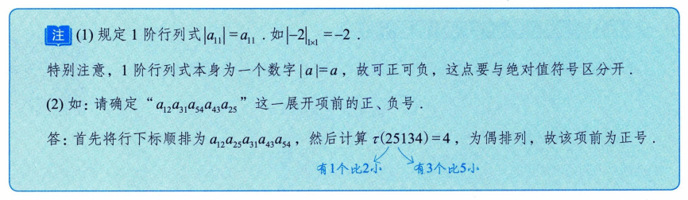
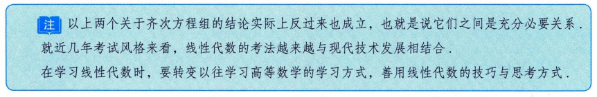
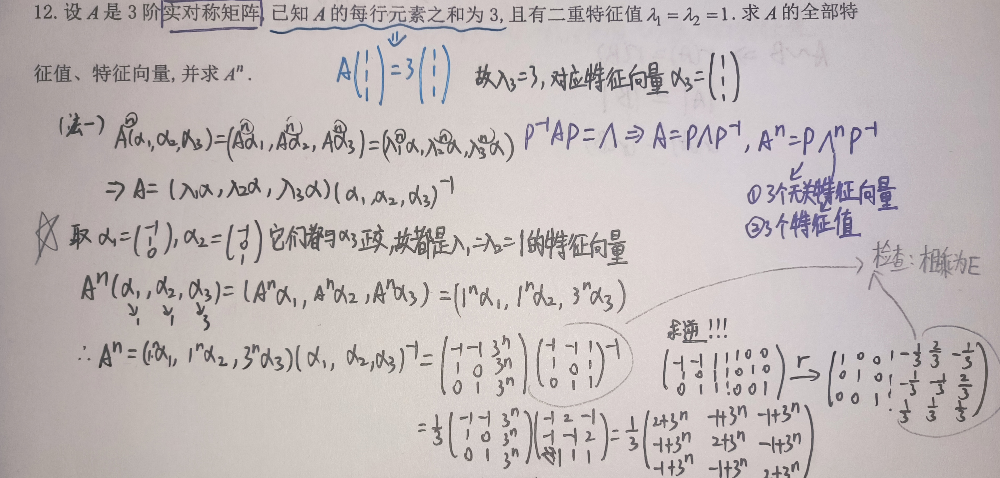

# 考研数二—线代笔记

## 一、行列式

### 1. $ f(x) = x^n + a_{n-1}x^{n-1} + \cdots + a_1x + a_0 $

若 $ f(x) = x^n + a_{n-1}x^{n-1} + \cdots + a_1x + a_0 $ 为 n 次函数，则 $ f(x)=0 $ 的 n 个实根分别记为 $ x_1, x_2, \cdots, x_n $，则必有 $ \sum_{i=1}^{n} x_i = -a_{n-1} $

**例**: $ a, b, c $ 是 $ x^3 - 2x + 4 = 0 $ 的三个根，则 $ x^3 - 0x^2 - 2x + 4 = 0 $，$ a+b+c = -0 = 0 $

### 2. 求行列式（含 x）展开式中的常数项，直接令行列式中 $ x=0 $，直接求值即得。

### 3. 行列式性质

① $ |A| = |A^T| $，行列互换，其值不变

② 某行(列)元素全为 0，行列式为 0

③ 单行可提性，可将公因子 $ k (k \neq 0) $ 提出
$$
\begin{vmatrix}
x & a_1 & b_1 \\
x & a_2 & b_2 \\
x & a_3 & b_3 \\
\end{vmatrix}
= x \cdot
\begin{vmatrix}
1 & a_1 & b_1 \\
1 & a_2 & b_2 \\
1 & a_3 & b_3 \\
\end{vmatrix},
\quad
\begin{vmatrix}
\frac{1}{3} & \frac{2}{3} \\
\frac{1}{3} & \frac{5}{3} \\
\end{vmatrix}
= \frac{1}{3}
\begin{vmatrix}
1 & 2 \\
1 & 5 \\
\end{vmatrix}
$$

④ 单行(列)可拆性，
$$
\begin{vmatrix}
a_{11} & a_{12} & a_{13} \\
a_{21}+b_1 & a_{22}+b_2 & a_{23}+b_3 \\
a_{31} & a_{32} & a_{33} \\
\end{vmatrix}
=
\begin{vmatrix}
a_{11} & a_{12} & a_{13} \\
a_{21} & a_{22} & a_{23} \\
a_{31} & a_{32} & a_{33} \\
\end{vmatrix}
+
\begin{vmatrix}
a_{11} & a_{12} & a_{13} \\
b_1 & b_2 & b_3 \\
a_{31} & a_{32} & a_{33} \\
\end{vmatrix}
$$
> **注意逆用**

⑤ 两行(列)换号，行列式变号

⑥ 两行成比例，行列式值为 0

⑦ 将某行(列)的 k 倍加到另一行(列)，行列式不变

### 4. 余子式、代数余子式

**余子式**: 去掉 $ a_{ij} $ 所在行列后拼起来的 (n-1) 阶行列式，记作 $ M_{ij} $

**代数余子式**: 记作 $ A_{ij} = (-1)^{i+j} M_{ij} $

**行列式展开公式**: 行列式等于行列式的某行(列)元素分别相乘其相应代数余子式求和
但行列式某行(列)元素分别乘以另一行(列)元素的代数余子式后再求和结果为 0。
$$
|A| = a_{i1}A_{i1} + a_{i2}A_{i2} + \cdots + a_{in}A_{in} = \sum_{j=1}^{n} a_{ij}A_{ij} \quad (i=1,2,\cdots,n)
$$

**例如求解**:
$$
M_{31} + 3M_{32} - 2M_{33} + 2M_{34}
= 1 \cdot \underbrace{(-1)^4 M_{31}}_{A_{31}} - 3 \cdot \underbrace{(-1)^5 M_{32}}_{A_{32}} - 2 \cdot \underbrace{(-1)^6 M_{33}}_{A_{33}} - 2 \cdot \underbrace{(-1)^7 M_{34}}_{A_{34}}
$$
> 将 $ A_{3j} $ 对应系数，替换原 $ |A| $ 相应值，再求行列式值。

### 5. 主对角行列式

**主对角行列式**的值等于主对角线上所有元素的乘积：
$$
\begin{vmatrix}
a_{11} &  &  & \\
 & a_{22} &  & \\
 &  & \ddots & \\
 &  &  & a_{nn} \\
\end{vmatrix}
= \prod_{i=1}^{n} a_{ii}
$$

**副对角行列式**
$$
\begin{vmatrix}
 &  &  & a_{1,n} \\
 &  & a_{2,n-1} & \\
 & \cdots &  & \\
a_{n,1} &  &  & \\
\end{vmatrix}
= (-1)^{\frac{n(n-1)}{2}} a_{1n} \cdot a_{2,n-1} \cdots a_{n1}
$$
> **注**: 副对角线元素相乘再乘 $(-1)^{\frac{n(n-1)}{2}}$，以上公式对于三角阵同样成立。

**拉普拉斯展开式**

设 A 为 m 阶矩阵，B 为 n 阶矩阵，则有：
$$
\begin{vmatrix}
A & O \\
O & B \\
\end{vmatrix}
=
\begin{vmatrix}
A & C \\
O & B \\
\end{vmatrix}
=
\begin{vmatrix}
A & O \\
C & B \\
\end{vmatrix}
= |A||B|
$$
$$
\begin{vmatrix}
O & A \\
B & O \\
\end{vmatrix}
=
\begin{vmatrix}
C & A \\
B & O \\
\end{vmatrix}
=
\begin{vmatrix}
O & A \\
B & C \\
\end{vmatrix}
= (-1)^{mn} |A||B| \quad \star
$$

**范德蒙德行列式**
$$
\begin{vmatrix}
1 & 1 & \cdots & 1 \\
x_1 & x_2 & \cdots & x_n \\
x_1^2 & x_2^2 & \cdots & x_n^2 \\
\vdots & \vdots & \ddots & \vdots \\
x_1^{n-1} & x_2^{n-1} & \cdots & x_n^{n-1} \\
\end{vmatrix}
= \prod_{1 \le i < j \le n} (x_j - x_i)
$$
> **关键行**: 行列式值为**第二行**后一项减前一项的所有项的乘积。
> （第一行为 $x^0$，即常数1；后续行依次为 $x^1, x^2, ..., x^{n-1}$）

### 6. 排序和逆序、$n$ 阶行列式的定义

### 7. 克拉默法则

## 二、矩阵

### 1. 同型矩阵可相加
$ C = A + B = (a_{ij})_{m \times n} + (b_{ij})_{m \times n} = (c_{ij})_{m \times n} $
> **即对应元素相加**

### 2. 数乘矩阵
$ kA = Ak = (ka_{ij})_{m \times n} $
> **即 A 的每个元素都乘以 k。**

### 3. 运算法则

*   **加法交换律**: $ A + B = B + A $
*   **加法结合律**: $ (A + B) + C = A + (B + C) $
*   **数乘分配律**: $ k(A + B) = kA + kB $, $ (k + l)A = kA + lA $
*   **数乘结合律**: $ k(lA) = (kl)A = (lk)A $

**矩阵相乘**:
$ c_{ij} = \sum_{k=1}^{s} a_{ik} b_{kj} = a_{i1}b_{1j} + a_{i2}b_{2j} + \cdots + a_{is}b_{sj} \quad (i=1,2,\cdots,m; j=1,2,\cdots,n) $

**转置 (行列互换)**:
*   $ (A^T)^T = A $
*   $ (kA)^T = kA^T $
*   $ (A + B)^T = A^T + B^T $
*   $ (AB)^T = B^T \cdot A^T $
*   **结合律**: $ (AB)C = A(BC) $
*   **分配律**: $ A(B + C) = AB + AC $
*   **数乘结合律**: $ (kA)B = A(kB) = k(AB) $
> **注意**: 一般地，$ AB \neq BA $

**行列式相关性质**:
*   $ |kA| = k^n |A| \neq k|A| $
> **一般地**, $ |A + B| \neq |A| + |B| $
> *   $ A \neq O \not\Rightarrow |A| \neq 0 $
> *   $ A \neq B \not\Rightarrow |A| \neq |B| $
> *   $ |A^T| = |A| $
> *   设 A, B 是同阶方阵，则 $ |AB| = |A||B| $

**对称矩阵与反对称矩阵**:
*   **对称矩阵**: $ A^T = A $
*   **反对称矩阵**: $ A^T = -A $

### 4. 主对角线结论
对于主对角线上元素为 $1, -1, 2$ 的矩阵：
$$
\begin{pmatrix}
1 &  &  \\
 & -1 &  \\
 &  & 2 \\
\end{pmatrix}^{13}
=
\begin{pmatrix}
1^{13} &  &  \\
 & (-1)^{13} &  \\
 &  & 2^{13} \\
\end{pmatrix}
$$
> **其余情况踏踏实实找规律**

### 5. 特殊矩阵的幂
* 对于上三角或下三角矩阵，其幂运算通常保持三角形式。
$$
A = \begin{pmatrix}
1 & 1 & 1 \\
0 & 1 & 1 \\
0 & 0 & 1 \\
\end{pmatrix}
\Rightarrow
A^{-1} = \begin{pmatrix}
1 & -1 & 0 \\
0 & -1 & -1 \\
0 & 0 & 1 \\
\end{pmatrix}
$$

*   **严格三角阵的幂**: 例如一个 3 阶严格上三角矩阵的平方：
$$
\begin{pmatrix}
0 & 1 & 2 \\
0 & 0 & 3 \\
0 & 0 & 0 \\
\end{pmatrix}^2
=
\begin{pmatrix}
0 & 0 & 3 \\
0 & 0 & 0 \\
0 & 0 & 0 \\
\end{pmatrix}
$$
> 注：此处 $3 = 1 \times 3$，直观表现为上三角矩阵的各元素往右上角移动，此处示例矩阵的三次方为 0 。

### 6. 逆矩阵

若存在矩阵 B，使得 $ AB = BA = E $，则称 A 可逆，并记 $ A^{-1} = B $，$ B^{-1} = A $。

**★ A 可逆的充分必要条件是 $ |A| \neq 0 $**

> $ |A| \neq 0 \iff A \text{ 可逆} $

**若 A, B 为同阶可逆方阵，则有**:
*   $ (A^{-1})^{-1} = A $
*   若 $ k \neq 0 $，则 $ (kA)^{-1} = \frac{1}{k} A^{-1} $
*   $ AB $ 可逆，$ (AB)^{-1} = B^{-1}A^{-1} $ (**穿脱原则**)
*   $ A^T $ 可逆，$ (A^T)^{-1} = (A^{-1})^T $
*   $ |A^{-1}| = |A|^{-1} $

**求解 $ A^{-1} $ 的方法**:
① 定义法: $ AB = E $，则 $ A^{-1} = B $
② 公式法: $ A^{-1} = \frac{A^*}{|A|} $ (其中 $ A^* $ 为 A 的伴随矩阵)
③ 初等行变换法: 将矩阵 $ (A, E) $ 通过初等**行**变换化为 $ (E, A^{-1}) $
> **只能作行变换**。
> 或者，将矩阵 $ \begin{pmatrix} A \\ E \end{pmatrix} $ 通过初等**列**变换化为 $ \begin{pmatrix} E \\ A^{-1} \end{pmatrix} $
> **只能作列变换**。

### 7. 伴随矩阵 $ A^* $

伴随矩阵 $ A^* $ 的定义为：
$$
A^* = \begin{bmatrix}
A_{11} & A_{21} & \cdots & A_{n1} \\
A_{12} & A_{22} & \cdots & A_{n2} \\
\vdots & \vdots & \ddots & \vdots \\
A_{1n} & A_{2n} & \cdots & A_{nn} \\
\end{bmatrix}
$$
其中，$ A_{ij} = (-1)^{i+j} M_{ij} $ 是元素 $ a_{ij} $ 的代数余子式。
> **注**: A 的第 i 行元素的代数余子式写在 $ A^* $ 的第 i 列上。

**核心性质**:
*   $ AA^* = A^*A = |A| \cdot E $
*   $ |A^*| = |A|^{n-1} $
*   $ (A^*)^* = |A|^{n-2} A $

**当 $ |A| \neq 0 $ 时** (即 A 可逆):
*   $ A^* = |A| \cdot A^{-1} $
*   $ A = |A| \cdot (A^*)^{-1} $
*   $ A^{-1} = \frac{A^*}{|A|} $

**其他重要公式1**:

*   $ (kA)(kA)^* = |kA| \cdot E $
*   $ (A^T)(A^T)^* = |A^T| \cdot E $
*   $ (A^{-1})(A^{-1})^* = |A^{-1}| \cdot E $
*   $ (A^*)(A^*)^* = |A^*| \cdot E $

**其他重要公式2**:

*   $ (AB)^* = B^* A^* $
*   $ (kA)^* = k^{n-1} A^* $
*   $ (A^T)^* = (A^*)^T $
*   $ (A^{-1})^* = (A^*)^{-1} $

**其他重要公式3**:

*   $ (kA)^{-1} = \frac{1}{k} A^{-1} $
*   $ (kA)^{T} = kA^{T} $
*   $|kA| = k^n|A|$
*   $ |B^{-1}| = |B|^{-1} $
*   $ C \cdot C^* = |C| \cdot E \implies C^* = |C| \cdot C^{-1} $

> **注意**: $ (A+B)^* \neq A^* + B^* $

### 8. 简单分块矩阵的逆

若 A, B 可逆，则有：
$$
\begin{bmatrix}
A & O \\
O & B \\
\end{bmatrix}^{-1}
=
\begin{bmatrix}
A^{-1} & O \\
O & B^{-1} \\
\end{bmatrix},
\quad
\begin{bmatrix}
O & A \\
B & O \\
\end{bmatrix}^{-1}
=
\begin{bmatrix}
O & B^{-1} \\
A^{-1} & O \\
\end{bmatrix}
$$
> **副对角线需换位**

**分块矩阵行列式** (设 A 为 m 阶，C 为 n 阶):
*   $ \begin{vmatrix} A_m & B \\ O & C_n \end{vmatrix} = |A| \cdot |C| $
*   $ \begin{vmatrix} B & A_m \\ C_n & O \end{vmatrix} = (-1)^{mn} |A| \cdot |C| $
*   $ |ABC| = |A| \cdot |B| \cdot |C| $

### 9. 二阶矩阵，求伴随，主对换，副反号

对于二阶矩阵 $ A = \begin{bmatrix} a & b \\ c & d \end{bmatrix} $，其伴随矩阵为 $ A^* = \begin{bmatrix} d & -b \\ -c & a \end{bmatrix} $。
> **口诀**: 主对角线元素互换，副对角线元素变号。

### 10. 初等矩阵 / 初等变换 (倍乘、互换、倍加)

**变换法则**: 左行右列
*   $ E_2(k) $ — 第 2 行乘 k 倍
*   $ E_{12} $ — 第 1, 2 行互换
*   $ E_{31}(k) $ — 第 1 行 k 倍加到第 3 行

**初等矩阵的性质**:
① 初等矩阵的转置仍是初等矩阵: $ E_{ij}^T = E_{ij} $, $ E_i^T(k) = E_i(k) $，$ E_{ij}^T(k) = E_{ji}(k) $
② 初等矩阵的逆:

*   $ E_{ij}^{-1} = E_{ij} $
*   $ E_i^{-1}(k) = E_i(\frac{1}{k}) $
*   $ E_{ij}^{-1}(k) = E_{ij}(-k) $

### 11. 可逆矩阵与秩

*   可逆矩阵可以表示为有限个初等矩阵的乘积；任何可逆矩阵 P，可以拆解成若干初等阵乘积。
*   若 $ |A| \neq 0 $ (即 A 满秩可逆)，则可逆矩阵 $A$ 乘以其他矩阵不改变其秩。
> **初等变换不改变矩阵的秩**

### 12. 矩阵等价

**定义**: 矩阵 A 与 B 等价，记作 $ A \sim B $，是指 A 经过有限次初等变换可以化为 B。
> **充要条件**: $ r(A) = r(B) $

### 13. 秩的性质 (乘积为零)

若 $ A_{m \times n} \cdot B_{n \times s} = O $，则有：
$$
r(A) + r(B) \le n
$$
> **注**: 此处的 $ n $ 是矩阵 A 的列数（也是矩阵 B 的行数）。

### 14. 秩的性质 (与初等变换相关)

*   $ r(A \cdot B) \le r(A) $
*   若 P 可逆，则 $ r(P \cdot A) = r(A) $

**解释**: 对于 $ A \cdot B = C $，C 的列向量可以由 A 的列向量线性表示，C 的行向量可以由 B 的行向量线性表示。

### 15. 正交矩阵

定义: 若方阵 A 满足 $ AA^T = A^TA = E $，则称 A 为正交矩阵。
*   等价于 $ A^{-1} = A^T $
*   等价于 A 的行（列）向量都是单位向量，且行（列）向量两两正交。
> **注**: 对于一个单位行向量 $ (a_1, a_2, \cdots, a_n) $，有 $ a_1^2 + a_2^2 + \cdots + a_n^2 = 1 $。

### 16. 方阵的多项式运算

方阵的多项式可以像数一样相乘和因式分解。
**例**: 设 A 为 n 阶矩阵，则：
$$
(A - E)^5 = A^5 - 5A^4 + 10A^3 - 10A^2 + 5A - E \neq O
$$
可以进行因式分解：
$$
= A(A^4 - 5A^3 + 10A^2 - 10A + 5E) = E
$$
> **注**: 此处推导结果为 E，表明 $ A $ 与括号内的多项式互为逆矩阵。

### 17. 幂等矩阵

$ A^2 = A $ 不能推出 $ A = E $。
> **反例**: 零矩阵 $ O $ 和某些非单位的投影矩阵都满足 $ A^2 = A $。

### 18. 零矩阵的判定

一个矩阵的秩为 0，它的每一个元素都为 0。(显而易见)

### 19. 秩的综合性质

**伴随矩阵的秩**:
对于 n 阶矩阵 A，其伴随矩阵 $ A^* $ 的秩为：
$$
r(A^*) =
\begin{cases}
n & \iff r(A) = n \\
1 & \iff r(A) = n-1 \\
0 & \iff r(A) < n-1 \\
\end{cases}
$$
> **推论**: $ r(A_{n \times n}) = n \iff |A| \neq 0 \iff A \text{ 可逆} $

**其他重要不等式与等式**:
*   $ r(kA) = r(A) $，其中 $ k \neq 0 $
*   $ r(A) \le r(A, b) $，其中 $ (A, b) $ 为 A 的增广矩阵
*   $ r(AB) \le \min\{r(A), r(B)\} $
*   $ r(A + B) \le r(A) + r(B) $
*   $ r(A) = r(PA) = r(AQ) = r(PAQ) $，其中 P, Q 为可逆矩阵
*   $ r(A^T) = r(A) = r(A^TA) = r(A \cdot A^T) $

**再次强调**:
若 $ A_{m \times n} \cdot B_{n \times s} = O $，则 $ r(A) + r(B) \le n $。
> **注**: 此处的 $n$ 是矩阵 A 的列数（也是矩阵 B 的行数）。

## 三、向量组

### 1. 内积与正交

设 $ \alpha = [\alpha_1, \alpha_2, \cdots, \alpha_n]^T $, $ \beta = [b_1, b_2, \cdots, b_n]^T $。
*   **内积**: $ (\alpha, \beta) = \alpha^T \beta = \sum_{i=1}^{n} a_i b_i = a_1b_1 + a_2b_2 + \cdots + a_nb_n $
*   **正交向量**: 若 $ \alpha^T \beta = 0 $，则称 $ \alpha, \beta $ 为正交向量。
*   **模 (长度)**: $ ||\alpha|| = \sqrt{\sum_{i=1}^{n} a_i^2} $。当 $ ||\alpha|| = 1 $ 时，$ \alpha $ 为单位向量。

**正交矩阵**: $ A^T \cdot A = E \iff A^T = A^{-1} $

*   **标准正交向量组**: 若向量组 $ \alpha_1, \alpha_2, \cdots, \alpha_s $ 中任意两个向量都正交，且每个向量都是单位向量，则称其为标准正交向量组。
    *   即满足：$ \alpha_i^T \alpha_j = \begin{cases} 0, & i \neq j \\ 1, & i = j \end{cases} $
    *   即$(\alpha_i, \alpha_j) = 0$，$i \neq j$ $\iff$ $\alpha_i$与$\alpha_j$正交

### 2. 向量组的线性无关性

若 $ \alpha_1, \alpha_2, \alpha_3 $ 线性无关，且 $ \beta $ 不可由 $ \alpha_1, \alpha_2, \alpha_3 $ 线性表示，则 $ \alpha_1, \alpha_2, \alpha_3, \beta $ 线性无关。
*   此时，秩的关系为：$ r(\alpha_1, \alpha_2, \alpha_3, \beta) = r(\alpha_1, \alpha_2, \alpha_3) + 1 $

### 3. 秩的性质

若矩阵 A 列满秩（即 $ r(A_{m \times n}) = n $），则对于任意矩阵 B，有 $ r(AB) = r(B) $。

> **PS**: 《1000题》3-5 题考察此知识点，用于证明向量组是否线性无关或可逆

### 4. 判断向量组的线性相关性

判断向量组 $ \alpha_1, \alpha_2, \cdots, \alpha_n $ 的线性相关性：
*   **秩满，线性无关**: $ r(\alpha_1, \alpha_2, \cdots, \alpha_n) = n \iff \alpha_1, \alpha_2, \cdots, \alpha_n $ 线性无关。
*   **秩不满，线性相关**: $ r(\alpha_1, \alpha_2, \cdots, \alpha_n) < n \iff \alpha_1, \alpha_2, \cdots, \alpha_n $ 线性相关。

### 5. 向量组等价

向量组 $ \langle I \rangle $ 与 $ \langle II \rangle $ 等价，是指它们可以互相线性表示。

*   设向量组 $ \alpha_1, \alpha_2, \cdots, \alpha_s $ 和 $ \beta $，则：
    *   $ r(\alpha_1, \alpha_2, \cdots, \alpha_s, \beta) = r(\alpha_1, \alpha_2, \cdots, \alpha_s) = s \iff \beta $ 可由 $ \alpha_1, \alpha_2, \cdots, \alpha_s $ 线性表示，且表示法唯一。
    *   $ r(\alpha_1, \alpha_2, \cdots, \alpha_s, \beta) = r(\alpha_1, \alpha_2, \cdots, \alpha_s) < s \iff \beta $ 可由 $ \alpha_1, \alpha_2, \cdots, \alpha_s $ 线性表示，但表示法不唯一。
    *   $ r(\alpha_1, \alpha_2, \cdots, \alpha_s) < r(\alpha_1, \alpha_2, \cdots, \alpha_s, \beta) \iff \beta $ 不可由 $ \alpha_1, \alpha_2, \cdots, \alpha_s $ 线性表示。

### 6. 两向量组等价的判定

向量组 $ \alpha_1, \alpha_2, \alpha_3 $ 与 $ \beta_1, \beta_2, \beta_3 $ 等价，当且仅当：
$$
r(\alpha_1, \alpha_2, \alpha_3) = r(\beta_1, \beta_2, \beta_3) = r(\alpha_1, \alpha_2, \alpha_3, \beta_1, \beta_2, \beta_3)
$$
> **大题解法**: 写出增广矩阵 $ (A, B) $，验证 $ r(A) = r(A, B) $，并单独验证 $ r(B) $，确保三个秩相等。

### 7. 施密特正交化

若向量组 $ \alpha_1, \alpha_2, \alpha_3 $ 线性无关，则可通过施密特正交化方法构造一组两两正交的向量组 $ \beta_1, \beta_2, \beta_3 $，且新向量组与原向量组等价。
*   **公式**:
    *   $ \beta_1 = \alpha_1 $
    *   $ \beta_2 = \alpha_2 - \frac{(\alpha_2, \beta_1)}{(\beta_1, \beta_1)} \cdot \beta_1 $
    *   $ \beta_3 = \alpha_3 - \frac{(\alpha_3, \beta_1)}{(\beta_1, \beta_1)} \cdot \beta_1 - \frac{(\alpha_3, \beta_2)}{(\beta_2, \beta_2)} \cdot \beta_2 $
> **PS**: 线性无关向量组经过施密特正交规范化后，结果不唯一（因为正交化过程中可以选择不同的顺序或归一化方式）。

### 8. 零向量组的性质

零向量组必然可以被其余任何向量组线性表示。

## 四、线性方程组

### 1. 非齐次线性方程组 $ Ax = b $ ($ b \neq 0 $)

**有解判定**: 线性方程组有解 $ \iff r(A) = r(\bar{A}) $
> **注**: $ \bar{A} = (A, b) $ 为增广矩阵。

**解的情况**:
*   **唯一解**: $ \iff r(A) = r(A, b) = n $ （n 为未知量个数，即 A 的列数）
*   **无穷多解**: $ \iff r(A) = r(A, b) < n $
*   **无解**: $ \iff r(A) < r(A, b) $ （矛盾方程）

**几何意义/向量解释**:
* $ r(A) = r(A, b) \iff b $ 可由 A 的列向量组线性表示。
* $ r(A) = r(A, b) \iff b^T $ 可由 $ A^T $ 的行向量组线性表示。
* $\quad r(A) = r(A, b) \quad \Leftrightarrow \quad r(A^T) = r\begin{pmatrix} A^T \\ b^T \end{pmatrix}$

### 2. 齐次线性方程组 $ Bx = 0 $

**非零解**: $ Bx = 0 $ 有非零解 $ \iff r(B) < n $ （n 为未知量个数，即 B 的列数）

> **注**: 此时有效方程个数$ r(B) $小于未知量个数。

**仅有零解**: $ Bx = 0 $ 仅有零解 $ \iff r(B) = n $

### 3. 方阵行列式与可逆性

对于方阵 A，有：
$$
|A| = 0 \iff A \text{ 不可逆} \iff Ax=0 \text{ 有非零解} \iff r(A) \text{ 不满秩}
$$

**推论**: 设 $ A_{m \times n}, B_{n \times m} $，若 $ m > n $，则有 $ r(AB) \le r(A) \le n < m \implies |AB| = 0 $
> **注**: 秩越乘越小。

### 4. 非齐次方程通解

非齐次线性方程组的通解 = 非齐次方程的一个特解 + 对应齐次方程组的通解。
> **重要性质**: 非齐次方程的两个特解之差，必为对应齐次方程组的解。

### 5. 齐次线性方程组解的条件与结构

设 $ A_{m \times n} x = 0 $。

**解的情况**:
① 当 $ r(A) = n $（即 A 的列向量线性无关）时，方程组有唯一零解。
② 当 $ r(A) = r < n $（即 A 的列向量线性相关）时，方程组有无穷多解，且基础解系包含 $ n - r $ 个线性无关的解向量。
> **自由度**: $ n - r $ 是“真实的约束个数”的补集。

**基础解系**:
设 $ \xi_1, \xi_2, \cdots, \xi_{n-r} $ 满足：
① $ A\xi_i = 0 $ （是解）
② $ \xi_1, \xi_2, \cdots, \xi_{n-r} $ 线性无关
③ $ Ax=0 $ 的任意解均可由 $ \xi_1, \xi_2, \cdots, \xi_{n-r} $ 线性表示
则称 $ \xi_1, \xi_2, \cdots, \xi_{n-r} $ 为 $ Ax=0 $ 的基础解系。
> **注**: 基础解系中向量的个数 $ s = n - r(A) $。

### 6. 解的线性无关性

$ Ax = b $ 有 s 个线性无关解 $ \iff Ax = 0 $ 有 s-1 个线性无关解。

$ Ax = b $ 无关解向量个数为 $n-r(A)+1$

> **例**: 设 $ \alpha_1, \alpha_2, \alpha_3 $ 是 $ Ax=b $ 的 3 个线性无关解，则 $ \alpha_1 - \alpha_2, \alpha_2 - \alpha_3 $ 是 $ Ax=0 $ 的 2 个线性无关解。

### 7. 解向量的正交性

向量 $ x = \begin{pmatrix} x_1 \\ \vdots \\ x_n \end{pmatrix} $ 是齐次线性方程组 $ Ax=0 $ 的解 $ \iff x $ 与 A 的任一行向量正交。

### 8. $ A^TAx = 0 $ 与 $ Ax = 0 $ 同解

> **PS**: 证明见《30讲》习题 4.8。
>
> 
>
> 

### 9. 求解齐次线性方程组的通解

求解 $ Ax=0 $ 的通解，需要找到其基础解系，即寻找满足以下三个条件的 s 个向量：
① 是 $ Ax=0 $ 的解
② 线性无关
③ $ s = n - r(A) $ （个数等于自由变量的个数）

### 10. 非齐次方程组求通解

**步骤**: 对增广矩阵 $ (A, b) $ 进行初等行变换，化为行最简形。

**示例**:
$$
(A, b) \xrightarrow{\text{行变换}} \begin{pmatrix} 1 & 1 & 1 & 1 & -1 \\ 0 & -1 & 1 & 5 & 3 \\ 0 & 0 & 0 & 0 & 0 \end{pmatrix} \xrightarrow{\text{化行最简}} \begin{pmatrix} 1 & 0 & 2 & -4 & 2 \\ 0 & 1 & -1 & 5 & -3 \\ 0 & 0 & 0 & 0 & 0 \end{pmatrix}
$$

*   **自由变量个数**: $ n - r(A) = 4 - 2 = 2 $ 个自由变量。
*   **约束变量**: 抬脚（主元）对应的变量 $ x_1, x_2 $。
*   **自由变量**: $ x_3, x_4 $。

**求解过程**:

1.  **求对应齐次方程组 $ Ax=0 $ 的通解**:
    *   将自由变量 $ x_3, x_4 $ 依次赋值 $ (1, 0) $ 和 $ (0, 1) $，得到基础解系。
    *   解得：
        $$
        \begin{pmatrix} x_1 \\ x_2 \\ x_3 \\ x_4 \end{pmatrix} = k_1 \begin{pmatrix} -2 \\ 1 \\ 1 \\ 0 \end{pmatrix} + k_2 \begin{pmatrix} 4 \\ -5 \\ 0 \\ 1 \end{pmatrix}
        $$

2.  **求非齐次方程组 $ Ax=b $ 的一个特解**:
    *   将自由变量 $ x_3, x_4 $ 赋值为 0。
    *   解得特解为：
        $$
        \begin{pmatrix} 2 \\ -3 \\ 0 \\ 0 \end{pmatrix}
        $$

3.  **写出通解**:
    *   非齐次方程组的通解 = 特解 + 齐次方程组的通解。
    *   最终通解为：
        $$
        \begin{pmatrix} x_1 \\ x_2 \\ x_3 \\ x_4 \end{pmatrix} = k_1 \begin{pmatrix} -2 \\ 1 \\ 1 \\ 0 \end{pmatrix} + k_2 \begin{pmatrix} 4 \\ -5 \\ 0 \\ 1 \end{pmatrix} + \begin{pmatrix} 2 \\ -3 \\ 0 \\ 0 \end{pmatrix}
        $$

> **技巧**: 在写解向量时，“反号顺抄”指从行最简形中抄写系数时注意符号；“顺抄”指直接抄写特解部分。

### 10. 初等行变换的性质

初等行变换不改变矩阵列向量间的线性关系。
*   若 $ A \xrightarrow{r} B $，则方程组 $ Ax=0 $ 与 $ Bx=0 $ 同解。

### 11. 每行元素之和为常数类型

若 A 为 n 阶矩阵，且其每行元素之和均为常数 $ \lambda $，则 $ \lambda $ 是 A 的一个特征值，对应的特征向量为 $ \begin{pmatrix} 1 \\ 1 \\ \vdots \\ 1 \end{pmatrix} $。
> **证明**: $ A \begin{pmatrix} 1 \\ 1 \\ \vdots \\ 1 \end{pmatrix} = \begin{pmatrix} \sum a_{i1} \\ \sum a_{i2} \\ \vdots \\ \sum a_{in} \end{pmatrix} = \begin{pmatrix} \lambda \\ \lambda \\ \vdots \\ \lambda \end{pmatrix} = \lambda \begin{pmatrix} 1 \\ 1 \\ \vdots \\ 1 \end{pmatrix} $

### 12. 方程组同解与向量组等价的关系

*   **齐次方程组**: $ Ax=0 $ 与 $ Bx=0 $ 同解 $ \iff A \xrightarrow{r} B $ （即 A 经过初等行变换可化为 B）$ \iff A, B $ 的行向量组等价。
*   **转置方程组**: $ A^Tx=0 $ 与 $ B^Tx=0 $ 同解 $ \iff A^T \xrightarrow{r} B^T $ $ \iff A, B $ 的列向量组等价 $ \iff A^T, B^T $ 的行向量组等价。
*   **非齐次方程组**: $ Ax=\alpha $ 与 $ Bx=\beta $ 同解 $ \iff (A, \alpha) \xrightarrow{r} (B, \beta) $。
*   **特殊情形**: 若 $ Ax=0 $ 与 $ \begin{pmatrix} A \\ \beta^T \end{pmatrix} x = 0 $ 同解，则 $ \beta^T $ 可由 A 的行向量线性表示 $ \iff \beta $ 可由 $ A^T $ 的列向量线性表示 $ \iff r(A^T) = r(A^T, \beta) $ 即$ A^Tx=\beta $有解。

## 五、特征值与特征向量

### 1. 定义与求解方法

*   **定义**: $ (\lambda E - A) \xi = 0 $ 或 $ A\xi = \lambda \xi $。
*   **求解步骤**:
    1.  先求特征值：解特征方程 $ |\lambda E - A| = 0 $，得到特征值 $ \lambda $。
    2.  再求特征向量：对每个特征值 $ \lambda $，解齐次线性方程组 $ (\lambda E - A)x = 0 $，得到其非零解，即为对应的特征向量。

### 2. 特征向量的性质

不同特征值所对应的特征向量的线性组合，一般不是特征向量。

### 3. 特征向量的定义要求

特征向量必须是非零向量。

### 4. 矩阵运算对特征值和特征向量的影响

若 $ \alpha $ 是矩阵 A 的特征值 $ \lambda $ 对应的特征向量，则：

| 矩阵             | A           | kA           | $ A^k $       | f(A)           | $ A^{-1} $            | $ A^* $                 | $ P^{-1}AP $     | $ A^T $     |
| ---------------- | ----------- | ------------ | ------------- | -------------- | --------------------- | ----------------------- | ---------------- | ----------- |
| **特征值**       | $ \lambda $ | $ k\lambda $ | $ \lambda^k $ | $ f(\lambda) $ | $ \frac{1}{\lambda} $ | $ \frac{|A|}{\lambda} $ | $ \lambda $      | $ \lambda $ |
| **对应特征向量** | $ \alpha $  | $ \alpha $   | $ \alpha $    | $ \alpha $     | $ \alpha $            | $ \alpha $              | $ P^{-1}\alpha $ | /           |

> **注**:
> *   若 $ |A| \neq 0 $，则 A 与 $ A^* $ 的特征向量一一对应。
> *   $A\boldsymbol{\xi} = \lambda \boldsymbol{\xi} \implies A^*\!A\boldsymbol{\xi} = A^*\!\lambda \boldsymbol{\xi} \implies |A|\boldsymbol{\xi} = \lambda A^*\boldsymbol{\xi} \implies \frac{|A|}{\lambda}\boldsymbol{\xi} = A^*\boldsymbol{\xi}$
> *   $k$ 重特征值，至多有$k$个无关特征向量。
> *   若 $ \xi_1 $ 是 A 的特征值 $ \lambda_1 $ 对应的特征向量，则对于任意 $ k \neq 0 $，$ k\xi_1 $ 仍是对应于 $ \lambda_1 $ 的特征向量。

### 5. 特征向量的几何意义

A 对应特征值 $ \lambda $ 的特征向量 $ \Leftrightarrow (\lambda E - A)x = 0 $ 的非零解。
*   若 $ (\lambda E - A)x = 0 $ 有 2 个线性无关的解，则 $ n - r(\lambda E - A) = 2 $。
> **注**: 此处的 $n$ 是矩阵 A 的阶数（列数）。

### 6. 迹与行列式

*   **迹 (trace)**: $ tr(A) = \lambda_1 + \lambda_2 + \cdots + \lambda_n $ （等于矩阵主对角线上元素之和）。
*   **行列式**: $ |A| = \lambda_1 \lambda_2 \cdots \lambda_n $。

### 7. 相似对角化

若存在可逆矩阵 P 和对角阵 $ \Lambda $，使得 $ P^{-1}AP = \Lambda $，则称 A 可相似对角化。
*   **结论**: 若 P 的各列是 A 的线性无关的特征向量，则 $ \Lambda $ 的对角元必是 A 的特征值，且 P 的列向量顺序与 $ \Lambda $ 的对角元顺序一一对应。
*   **推导**: $ P^{-1}AP = \Lambda \iff AP = P\Lambda $。设 $ P = (\alpha_1, \alpha_2, \alpha_3) $，$ \Lambda = \text{diag}(\lambda_1, \lambda_2, \lambda_3) $，则：
    $$
    A(\alpha_1, \alpha_2, \alpha_3) = (\alpha_1, \alpha_2, \alpha_3) \begin{pmatrix} \lambda_1 & & \\ & \lambda_2 & \\ & & \lambda_3 \end{pmatrix}
    \implies
    \begin{cases}
    A\alpha_1 = \lambda_1 \alpha_1 \\
    A\alpha_2 = \lambda_2 \alpha_2 \\
    A\alpha_3 = \lambda_3 \alpha_3
    \end{cases}
    $$

### 8. 特征值的判定条件

$ \lambda $ 为 A 的特征值 $ \iff (\lambda E - A)x = 0 $ 有非零解 $ \iff |\lambda E - A| = 0 \iff r(\lambda E - A) < n $。

$ r(A) < n \iff |A| = 0 $（$ \lambda_1 \lambda_2 \cdots \lambda_n =0$）$ \iff $ $A$ 不可逆$ \iff $ $A$ 有 0 特征值

> $A$ 为 $n$ 阶矩阵。
>
> 由特征方程 $ |\lambda E - A| = 0 $ 可知，由于|A| = 0 成立，$ \lambda = 0 $ 满足特征方程，故 A 有 0 特征值。

### 9. 多项式与特征值的关系

设 $ f(x) $ 为多项式，且 $ f(A) = O $，则对于 A 的每一个特征值 $ \lambda $，均有 $ f(\lambda) = 0 $。

### 10. 反对称矩阵的特征值

若 $ A^T = -A $，则称 A 为反对称矩阵，其特征值为 0 或纯虚数。

### 11. 相似矩阵的性质

相似矩阵具有相同的特征值。
*   若 $ A \sim B $，则：
    *   $ r(A) = r(B) $
    *   $ |A| = |B| $
    *   $ tr(A) = tr(B) $

### 12. 相似变换的性质

若 $ P^{-1}AP = B $，则 $ A \sim B $。
*   **推广**: 对于任意多项式函数 f，有 $ P^{-1}f(A)P = f(B) $。
    *   **例**: $ P^{-1}(A^* + A^{-1})P = B^* + B^{-1} = P^{-1}A^*P + P^{-1}A^{-1}P $

### 13. 矩阵可相似对角化的条件

对于 n 阶矩阵 A，其可相似对角化（即 $ A \sim \Lambda $）的充要条件是：
*   **充要条件**: A 恰好有 n 个线性无关的特征向量。
*   **等价表述**: 对于 A 的每个 $ k_i $ 重特征值 $ \lambda_i $，都有 $ k_i $ 个线性无关的特征向量。
    *   这等价于：对于 A 的每个 $ k_i $ 重特征值 $ \lambda_i $，满足 $ n - r(\lambda_i E - A) = k_i $。
> **注**: $ k_i $ 是特征值 $ \lambda_i $ 对应的重数。

**充分条件**:
① 若 n 阶矩阵 A 有 n 个不同的特征值，则 A 可相似对角化。（高频考点）
② 若 n 阶矩阵 A 是实对称矩阵，则 A 必可相似对角化。（高频考点）

### 14. 不同特征值对应的特征向量

属于不同特征值的特征向量，一定**线性无关**。

### 15. 三角矩阵的特征值

对于三角矩阵（上三角或下三角），其特征值就是主对角线上的元素。
*   **例**:
    *   $ A = \begin{bmatrix} 3 & 2 & 1 \\ 0 & 2 & 0 \\ 0 & 0 & 0 \end{bmatrix} $，特征值为 $ \lambda_1=3, \lambda_2=2, \lambda_3=0 $。
    *   $ B = \begin{bmatrix} 2 & 0 & 0 \\ 0 & 2 & 0 \\ 1 & 0 & 1 \end{bmatrix} $，特征值为 $ \lambda_1=2, \lambda_2=2, \lambda_3=1 $。
    *   $ C = \begin{bmatrix} 0 & 0 & 0 \\ 1 & 2 & 0 \\ 0 & 1 & 2 \end{bmatrix} $，特征值为 $ \lambda_1=0, \lambda_2=2, \lambda_3=2 $。
> **注意**: 对于矩阵 C，$ r(2E - C) = r\begin{pmatrix} 2 & 0 & 0 \\ -1 & 0 & 0 \\ 0 & -1 & 0 \end{pmatrix} = 2 > 3-2 $，因此不可相似对角化。

### 16. 实对称矩阵的性质

若 A 为实对称矩阵（即所有元素均为实数，且 $ A = A^T $），则具有以下重要性质：
① 特征值全是实数，特征向量均为实向量。
② 必能相似对角化，且存在正交矩阵 Q，使得 $ Q^TAQ = Q^{-1}AQ = \Lambda $。
③ 不同特征值对应的特征向量必定正交。

**重要推论**:
*   能通过正交矩阵 Q 相似对角化的矩阵，一定是实对称矩阵。
*   非对称矩阵一定不能通过正交矩阵 Q 相似对角化。

> $Q^T A Q = Q^{-1} A Q = \Lambda \iff A^T = (Q \Lambda Q^T)^T = Q \Lambda Q^T = A$

**正交矩阵 Q 的性质**:

*   $ Q^T = Q^{-1} $，且 $ Q^T \cdot Q = E $。
*   Q 的行（列）向量是单位向量，且两两正交。

### 17. 相似对角化与矩阵幂

若 $ P^{-1}AP = \Lambda $，则 $ A = P\Lambda P^{-1} $，进而有 $ A^n = P\Lambda^n P^{-1} $。
*   **推广**: 若 $ Q^TAQ = \Lambda $，则 $ A = Q\Lambda Q^T $，进而有 $ A^n = Q\Lambda^n Q^T $。

### 18. 谱分解 (Spectral Decomposition)

对于 n 阶实对称矩阵 A，设其特征值为 $ \lambda_1, \lambda_2, \cdots, \lambda_n $，对应的单位特征向量为 $ \xi_1, \xi_2, \cdots, \xi_n $，则 A 可以表示为：
$$
A = \lambda_1 \xi_1 \xi_1^T + \lambda_2 \xi_2 \xi_2^T + \cdots + \lambda_n \xi_n \xi_n^T
$$

> 推广：$A^n = \lambda_1^n \xi_1 \xi_1^T + \lambda_2^n \xi_2 \xi_2^T + \cdots + \lambda_n^n \xi_n \xi_n^T$

### 19. AB 与 BA 的相似性

只要 A 可逆，则有 $ AB \sim BA $。
*   **证明**: $ A^{-1}(AB)A = BA $。

### 20. 秩一矩阵的特征值

对于 n 阶矩阵 A ($n \ge 2$)，若其秩 $r(A) = 1$，则 A 的特征值为 $tr(A)$ 和 0（0 为 n-1 重特征值）。

**例**: 设 $ A = \begin{pmatrix} 1 & 1 & 1 \\ 1 & 1 & 1 \\ 1 & 1 & 1 \end{pmatrix} $，则 $ tr(A) = 3 $，特征值为 $ \lambda = 3, 0, 0 $。

**证明**:
*   因为 $ r(A) = 1 < n $，所以 $ |A| = 0 $。由特征方程 $ |\lambda E - A| = 0 $ 可知，当 $ \lambda = 0 $ 时满足，故 A 有 0 特征值。
*   对于 $ \lambda = 0 $，解方程组 $ (0E - A)x = 0 $，即 $ Ax = 0 $，其解空间维数为 $ n - r(A) = n - 1 $，即有 $ n-1 $ 个线性无关的特征向量。
*   因此，0 至少是 $ n-1 $ 重特征值。
*   设特征值为 $ \lambda_1, \lambda_2, \cdots, \lambda_n $，由迹的性质 $ \lambda_1 + \lambda_2 + \cdots + \lambda_n = tr(A) $，且 $ \lambda_2 = \lambda_3 = \cdots = \lambda_n = 0 $，可得 $ \lambda_1 = tr(A) $。

### 21. “哈密顿-凯莱”定理 (Cayley-Hamilton Theorem)

**定理**: 设 $ f(\lambda) = |\lambda E - A| $ 是矩阵 A 的特征多项式，则 $ f(A) = O $。

**例**: 若 $ |\lambda E - A| = (\lambda - 1)(\lambda - 2) = 0 $，则 $ (A - E)(A - 2E) = O $。
*   因此，$ A^2 - 3A + 3E = (A - E)(A - 2E) + E = E $。
> $\phi(\lambda)=|\lambda E-A|=0 \Rightarrow \phi(A)=0$

### 22. 矩阵相似的性质

若 $ A \sim B $，则：
*   $ |A| = |B| $
*   $ r(A) = r(B) $
*   $ tr(A) = tr(B) $
*   $ \lambda_A = \lambda_B $ （特征值相同）
*   $ f(A) \sim f(B) $ （f(x) 为任意多项式）
*   若 A 可逆，则 $ A^{-1} \sim B^{-1} $
*   $ A^T \sim B^T $
*   $ A^* \sim B^* $

**其他重要性质**:
*   若 A 可逆，则 $ AB \sim BA $。
*   若 $ A \sim B $ 且 $ C \sim D $，则 $ \begin{bmatrix} A & O \\ O & C \end{bmatrix} \sim \begin{bmatrix} B & O \\ O & D \end{bmatrix} $。
*   若 $ P^{-1}AP = B $，则 $ P^{-1}(A^2 + A^*)P = B^2 + B^* $。（共用同一个相似变换矩阵 P）

### 23. 已知 $ A = E + k\alpha\alpha^T $ 的题型

这类题型通常要求求解 $ A^{-1} $。
*   **解题套路**:
    1.  先写出 $ A^2 $。
    2.  根据 $ A^2 $ 得到一个关于 A 的多项式方程 $ f(A) = O $。
    3.  再根据逆矩阵的定义，从该方程中解出 $ A^{-1} $。

## 六、二次型

### 1. 正负惯性指数

对于二次型 $ f = x^T A x $：
*   **正（负）惯性指数**: 指其标准形中正（负）平方项的个数。
*   **等价定义**: 也等于其对应二次型矩阵 A 的正（负）特征值的个数。

**例**: 对于二次型 $ f(x_1, x_2, x_3) = -2x_1x_2 - 2x_1x_3 + 6x_2x_3 $，其对应的对称矩阵为 $ A = \begin{pmatrix} 0 & -1 & -1 \\ -1 & 0 & 3 \\ -1 & 3 & 0 \end{pmatrix} $。

### 2. 二次型的内积表示

二次型可以写成向量内积的形式。
**例**: $ f(x_1, x_2, x_3) = (x_1 - x_2 + x_3)^2 + (x_2 - ax_3)^2 + (ax_3 + x_1)^2 $
*   可以看作是向量 $ (x_1 - x_2 + x_3, x_2 - ax_3, ax_3 + x_1) $ 与自身的内积。
*   进一步可写成矩阵形式：$ f(x_1, x_2, x_3) = (x_1, x_2, x_3) \cdot \begin{pmatrix} 1 & 0 & 1 \\ -1 & 1 & 0 \\ 1 & -a & a \end{pmatrix} \cdot \begin{pmatrix} 1 & -1 & 1 \\ 0 & 1 & -a \\ 1 & 0 & a \end{pmatrix} \cdot \begin{pmatrix} x_1 \\ x_2 \\ x_3 \end{pmatrix} = x^T (A^TA) x $。

### 3. 标准形系数的性质

二次型的标准形中平方项的系数，只能是其对应二次型矩阵 A 的特征值。

### 4. 正定二次型

**定义**: 称二次型 $ f = x^T A x $ 为正定二次型，如果当 $ x \neq 0 $ 时，恒有 $ f > 0 $。此时，矩阵 A 称为正定矩阵。

二次型 $ f $ 为正定的 $ \iff $ 对于所有非零向量 $ x $，都有 $ f > 0 $。

*   当 $ x \neq 0 $ 时，$ f > 0 $。
*   当 $ x = 0 $ 时，$ f = 0 $。
*   正定二次型的规范形为 $ y_1^2 + y_2^2 + y_3^2 + \cdots$

**例**: $ f = x_1^2 + x_2^2 + x_3^2 $ 是正定的。

*   当 $ x = 0 $ 时，$ f = 0 $。
*   当 $ x \neq 0 $ 时，$ f > 0 $。

### 5. 写规范形的方法

计算二次型 $ f(x_1, x_2, x_3) $ 对应的二次型矩阵 A 的特征值 $ \lambda_i $，然后根据特征值的正负号确定其正负惯性指数。
*   **规范形**: $ d_1y_1^2 + d_2y_2^2 + \cdots + d_ny_n^2 $，其中系数 $ d_i $ 的取值范围为 $ \{1, -1, 0\} $。
*   **例**: 若特征值为 $ \lambda_1 = 0, \lambda_2, \lambda_3 > 0 $，则其规范形为 $ y_1^2 + y_2^2 $。

### 6. 实对称矩阵的合同标准形

任何实对称矩阵 A，一定存在正交矩阵 Q，使得 $ Q^{-1}AQ = Q^TAQ = \Lambda $，其中 $ \Lambda = \text{diag}(\lambda_1, \lambda_2, \cdots, \lambda_n) $。
*   设 $ x = Qy $，则 $ f(x) = x^T A x = (Qy)^T A (Qy) = y^T Q^T A Q y = y^T \Lambda y = \lambda_1 y_1^2 + \lambda_2 y_2^2 + \cdots + \lambda_n y_n^2 $。
> **注**: Q 的列向量是 n 个正交的单位特征向量，其平方项的系数即为特征值。

### 7. 合同关系的性质

*   对称矩阵只能与对称矩阵合同。
*   非对称矩阵只能与非对称矩阵合同。
*   **证明**: 设 C 使得 $ C^TAC = B $。若 A 为对称矩阵，则 $ B^T = (C^TAC)^T = C^TA^TC = C^TAC = B $，所以 B 也为对称矩阵。

### 8. 合同的定义

对于 n 阶矩阵 A, B，若存在一个 n 阶可逆矩阵 C，使得 $ C^TAC = B $，则称 A 与 B 合同，记为 $ A \cong B $。

### 9. 相似与合同的关系

*   **相似 ⇒ 合同**: 仅在实对称矩阵的情况下成立。
*   **实对称矩阵**: 对于实对称矩阵，相似与合同的判定只需看特征值。
    *   实对称矩阵 A 与 B 的特征值符号相同（当且仅当 A 与 B 合同）。
    *   实对称矩阵 A 与 B 的特征值相同（当且仅当 A 与 B 相似）。
    *   实对称矩阵 A 与 B 的正负惯性指数相同（当且仅当 A 与 B 合同）。

### 10. 正定矩阵的性质

若矩阵 A 是正定矩阵，则：
① A 是实对称矩阵。
② $ |A| > 0 $，且 A 可逆。
③ A 的主对角线元素全部大于 0。
④ A 的最大元素一定位于主对角线上。

**补充判定**:

*   实对称矩阵 A 为正定矩阵 $ \iff $ A 的各阶顺序主子式均大于 0。
*   实对称矩阵 A 为正定矩阵 $ \iff $ A 的所有特征值都大于 0。
*   A 可逆$\iff$ $ A^TA $ 为正定矩阵。
    *   **注**: $ r(A^TA) = S $，其中 S 为 A 的列秩（$A$为 $n \times s$ 型矩阵）。

### 11. 实对称矩阵的判定

一个 3 阶矩阵 A，如果有 3 个正交的特征向量，则它必为实对称矩阵！
> **推论**: 满足实对称矩阵条件的矩阵就可以进行谱分解。

### 12. 在约束条件下求二次型的最大最小值

**题型**: 对于二次型 $ f(x_1, x_2, x_3) = x^T A x $，在约束条件 $ x_1^2 + x_2^2 + x_3^2 = 1 $ 下，求其最大值和最小值。

**解法**: 必须使用正交变换，并关注 A 的特征值。

*   设 $ x = Qy $，其中 Q 为正交矩阵，则 $ x^Tx = y^TQ^TQy = y^TEy = y^Ty = 1$。
*   此时，$ f = x^TAx = y^TQ^TAQy = y^T\Lambda y = \lambda_1y_1^2 + \lambda_2y_2^2 + \lambda_3y_3^2 $。
*   由于 $ y_1^2 + y_2^2 + y_3^2 = 1 $，所以 $ f \le \lambda_{max}(y_1^2 + y_2^2 + y_3^2) = \lambda_{max} $，当且仅当 $ y_i=1 $ 且其余 $ y_j=0 $ 时取到最大值。
*   **例**: $ f = x^TAx = 2y_1^2 + 0y_2^2 + 3y_3^2 \le 3(y_1^2 + y_2^2 + y_3^2) = 3x^Tx = 3 $。等号在 $ y_1=y_2=0, y_3=1 $ 时取到。
> **PS**: 张宇《1000题》6-12。

### 13. 秩与惯性指数的关系

对于任意 n 阶实对称矩阵 A，其秩 $ r(A) $ 等于其正惯性指数 p 与负惯性指数 q 之和，即 $ r(A) = p + q $。
*   **例**: 若二次型 $ f(x_1, x_2, x_3) = x^TAx $ 的规范形为 $ z_1^2 + z_2^2 $，则其特征值为 2 个正数和 1 个零，正惯性指数为 2，负惯性指数为 0。

### 14. 配方法求可逆线性变换

配方法是一种将二次型化为标准形或规范形的方法，其目的是为了保证所作的线性变换是可逆的。

**步骤**:
① 先把所有含 $ x_1 $ 的项配方。
② 再把含 $ x_2 $ 的项配方，以此类推。

**例**: 对于二次型 $ f = x^TAx = x_1^2 + 3x_2^2 + x_3^2 + 2x_1x_2 + 2x_1x_3 + 2x_2x_3 $，其规范形为 $ z_1^2 + z_2^2 $。
*   配方过程: $ f = (x_1 + x_2 + x_3)^2 + 2x_2^2 + 0x_3^2 $。
*   令 $ \begin{cases} z_1 = x_1 + x_2 + x_3 \\ z_2 = \sqrt{2}x_2 \\ z_3 = x_3 \end{cases} \implies \begin{cases} x_1 = z_1 - \frac{1}{\sqrt{2}}z_2 - z_3 \\ x_2 = \frac{1}{\sqrt{2}}z_2 \\ x_3 = z_3 \end{cases} $。
*   所求线性变换为 $ x = \begin{pmatrix} 1 & -\frac{1}{\sqrt{2}} & -1 \\ 0 & \frac{1}{\sqrt{2}} & 0 \\ 0 & 0 & 1 \end{pmatrix} z $。

**总结**:
*   配方法可以得到标准形或规范形。
*   规范形的系数只能反映特征值的正负惯性指数。
*   正交变换法得到的标准形，其系数就是矩阵 A 的特征值。

**正交变换法步骤**:
1.  解特征方程 $ |\lambda E - A| = 0 $，求出特征值 $ \lambda $。
2.  对每个特征值 $ \lambda $，求出对应的特征向量 $ \xi $。
3.  将特征向量 $ \xi $ 进行单位化和正交化（施密特正交化），组成正交矩阵 Q。
4.  令 $ x = Qy $，则 $ f = y^T\Lambda y $。

### 15. 实对称矩阵的合同对角化

对于实对称矩阵 A，目标是求一个可逆矩阵 C，使得 $ C^TAC = \Lambda $（对角矩阵）。
*   **方法**: 一般不能使用正交变换，而应采用配方法或成对初等变换法。
    *   **步骤**:
        ① 将矩阵 A 对应的二次型写成 $ f = x^TAx $ 的形式。
        ② 使用配方法将二次型化为规范形 $ y^T\Lambda y $。
        ③ 根据变换关系 $ x = Cy $，其中的 C 即为所求的可逆矩阵。
> **PS**: 张宇《1000题》6-15。
>
> 

### 16. 特征值与特征向量的关系 (重根情况)

设 $ \lambda_1, \lambda_2 $ 是矩阵 A 的重特征值，对应的特征向量为 $ \xi_1, \xi_2 $；$ \lambda_3 $ 是单特征值，对应的特征向量为 $ \xi_3 $。
*   则 $ \xi_3 $ 与 $ \xi_1, \xi_2 $ 正交（实对称阵，非实对称只能称线性无关）。
*   只要与 $ \xi_3 $ 正交的向量，均为 $ \lambda_1, \lambda_2 $ 的特征向量。