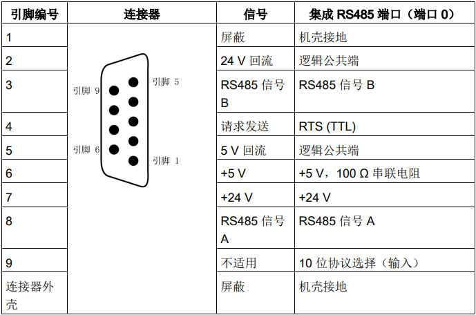
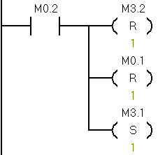
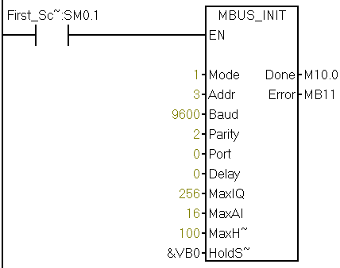
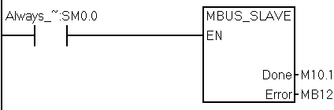
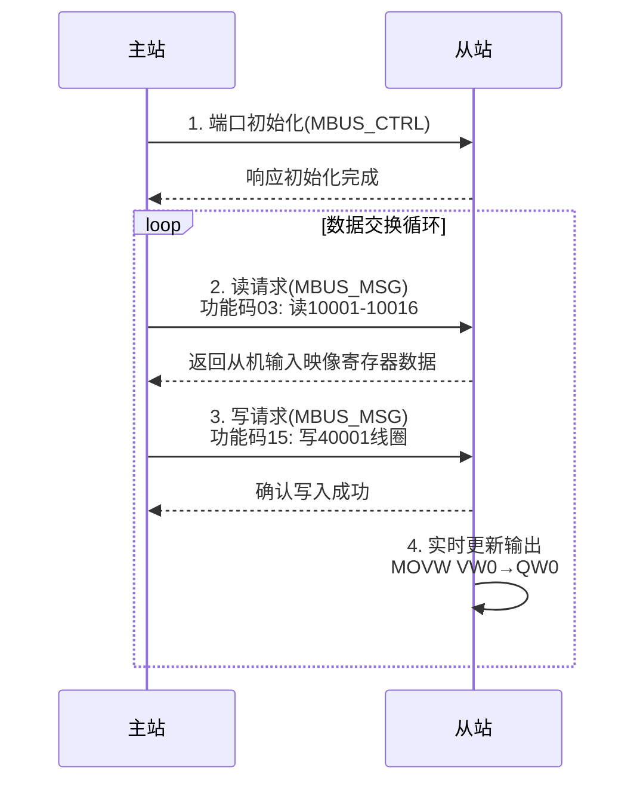

# PLC-S7-200 SMART ModbusRTU

---

S7-200 SMART PLC 支持 **Modbus RTU 通信协议**，可通过其集成的 **RS485 串口（端口 0）** 实现与变频器、仪表、HMI、其他 PLC 等支持 Modbus RTU 的设备进行主从站通信。

在 Modbus RTU 应用中，S7-200 SMART 通常作为 **Modbus 主站（Master）**，主动轮询从站设备（如温控表、电能表等）；也可配置为 **Modbus 从站（Slave）**，响应上位主站（如 HMI 或 SCADA 系统）的读写请求。

西门子提供了 **Modbus RTU 指令库（MBUS_CTRL、MBUS_MSG 用于主站；MBUS_INIT、MBUS_SLAVE 用于从站）**，用户可在 **STEP 7-Micro/WIN SMART** 编程软件中直接调用，无需自行编写通信协议，大幅简化开发流程。

典型参数包括：波特率（如 9600、19200 bps）、数据位（8 位）、停止位（1 或 2 位）、校验方式（无校验、偶校验、奇校验），需与从站设备严格一致。通信距离可达 1200 米（视波特率和电缆质量而定）。

本文是本科期间笔者的PLC原理及应用课程的实验报告，介绍研究了这个话题。

## 实验目的

1. 掌握Modbus RTU协议应用：
   - 实现S7-200 SMART作为主站（Master）与从站（Slave）间的串行通信。
   - 验证PLC对工业设备的标准通信控制能力。
2. 熟悉西门子Modbus库指令：
   - 实践`MBUS_CTRL`、`MBUS_MSG`（主站）和`MBUS_INIT`、`MBUS_SLAVE`（从站）的配置与调用方法。
3. 构建主从数据交换逻辑：
   - 主站读取从站保持寄存器（功能码03）和写入线圈（功能码15）的操作。
   - 从站实现数据响应及I/O映射。
4. 理解状态机设计：
   - 通过位标志（`M3.0`、`M3.1`等）实现多步骤通信流程控制，避免指令冲突。

## 实验项目

PLC主从通讯实验，测试和验证两台西门子S7-200 SMART系列PLC之间的数据通信。最终实现了主站对从站的周期性读写轮询（读线圈→写寄存器→读线圈...）。

实验实现的数据交换如下：

- 主站读从站线圈（10001~10016）→ 存储到`VB0`（16位=2字节）
- 主站写5个寄存器到从站`40001` → 从站`VB0~VB9`（5字=10字节）
- 从站将`VW0`（VB0+VB1）映射到物理输出`QW0`

### 关于Modbus通信

- Modbus：由 Modicon（现为施耐德电气）在 1979 年开发的开放协议，是工业领域最常用的通信协议之一。
- RTU（Remote Terminal Unit）：Modbus 的一种传输模式，采用二进制编码，数据传输效率高，相比 ASCII 模式更节省带宽。
- RS485（EIA-485）是一种工业串行通信标准，定义了物理层的电气特性，用于实现设备间的数字通信。通过差分信号传输，抗干扰能力强。

#### 通信特点

- 物理层：通常基于 RS-485 或 RS-232 串口，支持半双工通信。

- 拓扑结构：主从式架构，一个主站（Master）与多个从站（Slave）通信，从站地址范围 1-247。

  > 由于轮询时间、信号干扰、阻抗等因素，实际应用中最多不超过32台。

- 传输介质：常用屏蔽双绞线，通信距离可达 1200 米（RS-485）。

- 波特率：常见 9600、19200、38400 等，需主从设备一致。

- 校验方式：使用 CRC（循环冗余校验）确保数据准确性。

#### 数据模型

Modbus 将数据分为 4 种基本寄存器类型：

- 0x 线圈（Coil）：布尔值（ON/OFF），可读写，对应 PLC 的输出点（Q）。
- 1x 离散输入（Discrete Input）：布尔值，只读，对应 PLC 的输入点（I）。
- 3x 输入寄存器（Input Register）：16 位整数，只读，通常用于传感器数据。
- 4x 保持寄存器（Holding Register）：16 位整数，可读写，用于配置参数或控制值。

#### 功能码

Modbus 通过功能码指示要执行的操作，常见功能码包括：

- **01**：读线圈状态（0x）
- **02**：读离散输入（1x）
- **03**：读保持寄存器（4x）
- **04**：读输入寄存器（3x）
- **05**：写单个线圈
- **06**：写单个保持寄存器
- **15**：写多个线圈
- **16**：写多个保持寄存器

#### 报文格式

RTU 模式的报文以二进制形式传输，每个字节包含 8 位数据，格式如下：

- 从站地址（1 字节）：标识接收设备。
- 功能码（1 字节）：指示操作类型。
- 数据域（N 字节）：包含寄存器地址、数量或要写入的数据。
- CRC 校验（2 字节）：用于错误检测。

**示例报文**：
主站请求读取从站 1 的 40001-40003 保持寄存器：
`01 03 00 00 00 03 C5 CD`

- `01`：从站地址
- `03`：功能码（读保持寄存器）
- `00 00`：起始地址（40001 对应地址 0x0000）
- `00 03`：读取 3 个寄存器
- `C5 CD`：CRC 校验值

#### S7-200 SMART中的MODBUS

根据西门子官方提供的`s7-200_SMART_system_manual_zh-CHS`技术手册。

对于通过 CPU 串口进行的 Modbus RTU 通信，STEP 7-Micro/WIN SMART 和 S7-200  SMART CPU 通过包含预组态的子例程和中断例程，使得与 Modbus  设备的通信更为便捷。 

- Modbus寻址：Modbus 地址为五到六位数，包含了数据类型和地址值。所有 Modbus 地址均从 1 开始。

Modbus RTU 主站指令使用如下所示的 Modbus 功能读取或写入特定的 Modbus  地址。Modbus RTU 从站设备必须支持相应的 Modbus 功能，从而读取或写入特定  Modbus 地址。

S7-200 SMART CPU 支持的 Modbus 消息为每条最多 240 个字节（1920 位或 120  个寄存器）的数据。有些从站设备支持的数据可能小于 240 个字节。

**Modbus RTU库**

`MBUS_CTRL/MB_CTRL2` 指令用于初始化、监视或禁用 Modbus 通信。

> 在执行 MBUS_MSG/MB_MSG2  指令前，程序必须先执行  MBUS_CTRL/MB_CTRL2  且不出现错误。该指令完成后，将“完成”(Done)  位置为 ON，然后再继续执行下一条指令。  EN 输入接通时，在每次扫描时均执行该指令。

`MBUS_MSG/MB_MSG2` 指令，用于启动对  Modbus 从站的请求并处理响应。

> EN 输入和 First 输入同时接通时，MBUS_MSG/MB_MSG2 指令会向 Modbus  从站发起主站请求。发送请求、等待响应和处理响应通常需要多个 PLC 扫描时间。EN  输入必须接通才能启用发送请求，并且必须保持接通状态，直到指令为 Done  位返回接通。
>
> 某一时间只能有一条 MBUS_MSG 或 MB_MSG2 指令处于激活状态。如果程序启用多条  MBUS_MSG 指令或多条 MB_MSG2 指令，则 CPU 将处理第一条 MBUS_MSG 指令或  MB_MSG2 指令，所有后续 MBUS_MSG 或 MB_MSG2 指令将中止并生成错误代码 6。

`MBUS_INIT` 指令用于启用，初始化或禁用 Modbus  通信。

> 在使用 MBUS_SLAVE  指令之前，必须先无错误地执行  MBUS_INIT。该指令完成后，立即置位“ 完成”(Done)  位，然后继续执行下一条指令。  EN  输入接通时，会在每次扫描时执行该指令 。

`MBUS_SLAVE` 指令用于处理来自  Modbus  主站的请求，并且必须在每次扫描时执行 ，以便检查和响应 Modbus 请求。

### 电气原理图

- 使用RS485 通信端子线对两台PLC进行串口连接，实验中所使用的是引脚3和引脚8。

S7-200 SMART CPU 上的 RS485 通信端口是 RS485 兼容的九针超小 D  型连接器，符合欧洲标准 EN 50170 中定义的 PROFIBUS  标准。下表列出了为通信端口提供物理连接的连接器，并介绍了通信端口的引脚分配。

### Modbus主站程序

| LAD                                                          | STL                                                          | 说明                                                         |
| ------------------------------------------------------------ | ------------------------------------------------------------ | ------------------------------------------------------------ |
|  | LD     Always_On:SM0.0 =      L60.0 LD     Always_On:SM0.0 =      L63.7 LD     L60.0 CALL   MBUS_CTRL:SBR1, L63.7, 9600, 2, 0, 1000, M0.0, MB1 | 初始化Modbus主站通信参数   `M0.0`：初始化完成标志（1=成功）  `MB1`：错误代码（0=无错误） 参数：`Baud=9600`，`Parity=2`（偶校验），`Timeout=1000ms` |
|  | LD     First_Scan_On:SM0.1 S      M3.0, 1 R      M3.1, 2 | 程序启动时初始化状态机 `M3.0=1`：触发读操作 `M3.1/M3.2=0`：复位其他状态 |
|  | LD     M3.0 O      M3.1 =      L60.0 LD     M3.0 EU LD     M3.1 EU OLD =      L63.7 LD     L60.0 CALL   MBUS_MSG:SBR2, L63.7, 3, 0, 10001, 16, &VB0, M0.1, MB2 | 读取从站数据  `Slave=3`（从站地址）  `RW=0`（读操作）  `Addr=10001`（Modbus线圈起始地址）  `Count=16`（读取16个线圈状态）  `DataPtr=&VB0`（数据存储到VB0开始的区域）  `M0.1`：操作完成标志 `MB2`：错误代码 状态机：`M3.0`触发读请求，完成后通过后续逻辑切换到写操作。 |
|  | LD     M0.1 R      M3.0, 1 R      M3.1, 1 R      M0.2, 1 S      M3.2, 1 | 读写状态切换 读取操作完成后： 清除读状态（`M3.0=0`）  激活写状态（`M3.2=1`） |
|  | LD     M3.2 =      L60.0 LD     M3.2 EU =      L63.7 LD     L60.0 CALL   MBUS_MSG:SBR2, L63.7, 3, 1, 40001, 5, &VB10, M0.2, MB3 | 向从站写入数据  `RW=1`（写操作）  `Addr=40001`（保持寄存器起始地址）  `Count=5`（写入5个寄存器）  `DataPtr=&VB10`（数据来源为VB10~VB19）  `M0.2`：写操作完成标志  `MB3`：错误代码 |
|  | LD     M0.2 R      M3.2, 1 R      M0.1, 1 S      M3.1, 1 | 写操作完成后重新激活读状态（`M3.1=1`），形成持续轮询         |

### Modbus从站程序

| LAD                                                          | STL                                                          | 说明                                                         |
| ------------------------------------------------------------ | ------------------------------------------------------------ | ------------------------------------------------------------ |
|  | LD     First_Scan_On:SM0.1 CALL   MBUS_INIT:SBR1, 1, 3, 9600, 2, 0, 0, 256, 16, 100, &VB0, M10.0, MB11 | 初始化为从站（地址=3）  `Mode=1`（从站模式）  `Addr=3`（从站地址）  `Baud=9600`，`Parity=2`（偶校验）  `Delay=0`，`Timeout=100ms`   `&VB0`：保持寄存器起始地址（对应主站40001）  `M10.0`：初始化状态   `MB11`：错误代码 |
|  | LD     Always_On:SM0.0 CALL   MBUS_SLAVE:SBR2, M10.1, MB12 | 持续处理Modbus请求 `M10.1`：请求处理状态  `MB12`：错误代码 |
|  | LD     Always_On:SM0.0 MOVW   VW0, QW0                   | 将保持寄存器`VW0`（VB0+VB1）映射到物理输出端子 主站写入`40001`会影响`VW0`，进而控制PLC的实际输出。 |

- 主从站波特率（9600）、校验（偶校验）、从站地址（3）需要保持一致。
- 主站读地址`10001`对应从站线圈，写地址`40001`对应从站`VB0`开始的保持寄存器。

### 主从通信交互流程图

## 心得体会

本次基于西门子S7-200 SMART PLC的ModbusRTU通信实验，使我深入理解了工业现场总线协议的实际应用与PLC主从站协同工作机制。通过PLC课程实验，使我入门了解了基础的PLC程序设计与编写的过程。

这里，笔者就PLC与单片机开发的差异谈谈一些自己的理解与观点。

在PLC程序设计中，LAD是工业控制领域专用语言，将物理继电器符号数字化（如`| |`表示常开触点），让电气工程师无需编程基础即可设计逻辑，其设计思想是图形化继电器逻辑。梯形图的这种特性，让电气工程师无需编程基础即可设计逻辑，降低工业控制逻辑的实现门槛。但对于软件工程师来说，这种逻辑思维转变是较为抽象且具有一定门槛的。

单片机的开发更加接近传统软件开发的思维，如果学习者学过Python或者其他编程语言，上手单片机C/C++开发十分迅速，并且单片机开发生态目前也在拓展支持Rust、Micro python等开发方式。

以一个定时闪烁点灯任务为例，使用单片机开发（这里指通过硬件抽象层HAL库进行开发，非寄存器开发），逻辑代码在10行以内，且有编程经验的开发者，即使从未接触过单片机开发，也能通过代码注释，完全理解函数含义，理解代码实现的状态逻辑切换。在这种开发模式中，循环判断等基本概念与普通的软件开发并无差别。通过HAL库对单片机进行硬件操作，其体验是与桌面软件开发中调用系统API十分相近的。

而在同样的任务中，PLC编程需要搭建数段梯形图逻辑网络，这种电气工程师思维需要一定时间的学习。对于没有任何电气基础的学习者而言，初次上手仅靠注释读懂逻辑是十分困难的，这种电流流动 → 逻辑结果的开发思维并不比状态迁移 → 硬件动作的开发思维转换更容易。在梯形图学习中，笔者走进过把常开触点当做是逻辑判断的误区，使用梯形图进行复杂的逻辑开发重新学习成本相对更高。且笔者认为在可读性方面，梯形图是没有带来提升的。

网上经常有的一种论调是，PLC开发比单片机开发更容易上手。可能在几年前确实是这样的，单片机开发往往面临硬件碎片化的特点，想要实现简单的功能，都需要编写冗余的寄存器控制程序。但是近年来HAL库（抽象硬件层开发）正在逐步推开，STM32的最新系列都不再支持传统的寄存器和基础库开发。以ST、TI、海思在内MCU厂商都提供了图形化开发界面的支持，国内也有很多厂家在做有关的技术跟进。单片机开发的门槛是在不断降低的，图形化+HAL库使得开发者仅需要鼠标点点确定，就能完成底层硬件的系统配置，从而使得开发者能够专注于逻辑功能的开发实现。在现今的技术背景下，PLC编程并不见得会比单片机更加快速和便捷。

但是话说回来了，在嵌入式开发中，软件开发仅仅只是一部分，单片机开发想要实现具体的功能，离不开对应的硬件电路，缺一不可。PLC是工业场景优化后的单片机系统，专为工业而生，其软硬件架构为可靠性牺牲了部分灵活性，却大幅提升了稳定性。软件上，PLC循环扫描的工作模式，无需考虑时序竞争。硬件上，PLC提供了各种工业级的保护条件（信号隔离/电源冗余设计）。

综上所述，PLC开发与单片机开发其实没有任何可比性（虽然对于在校学生做的实验来说，看起来PLC在做与单片机相同的逻辑开发）。笔者认为PLC的诞生就是工业标准化规范化的产物，提供了一套现场开发的逻辑范式，故PLC与开关电源、各种接线电缆、低压电器等彼此适配，现场维护简单。而单片机开发则更加定制化，需要根据功能是进行硬件设计，单片机开发能裁剪出任何形态，但使用效果取决于持刀者功力。

PLC 与单片机的差异本质上是 “工业标准化” 与 “通用灵活性” 的区别，一个主打工业自动化控制、一个主打消费电子场景。因而在大多数场景下，两者没有对比的必要性。这完全是两种不一样的市场，学习PLC亦或是选择单片机，需要取决于个人的就业选择​。​