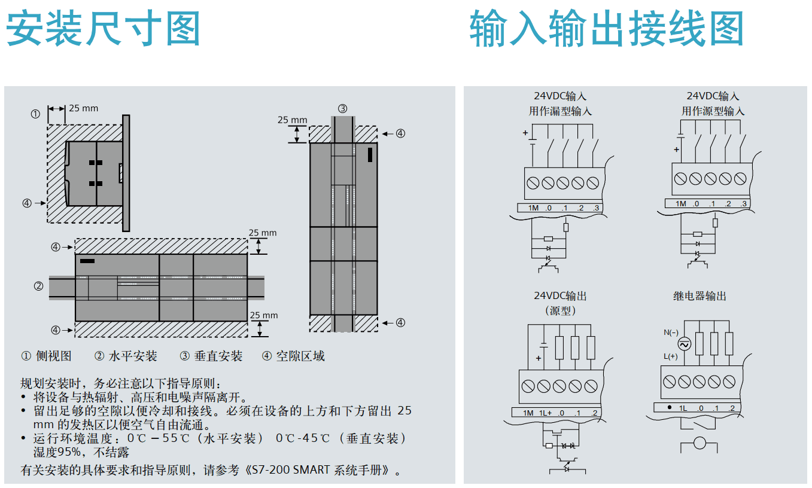
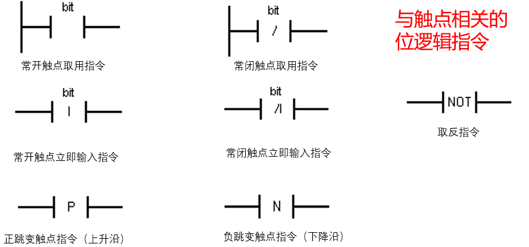

# PLC S7-200 SMART学习笔记

S7-200 SMART 是西门子（Siemens）推出的一款高性价比、小型模块化可编程逻辑控制器（PLC），专为中小型自动化控制任务设计，广泛应用于机床、包装、纺织、暖通空调（HVAC）、楼宇控制及简单过程控制等领域。作为 S7-200 系列的升级产品，S7-200 SMART 在性能、通信能力和编程体验上均有显著提升。

## 电气控制基础

### 低压电器分类

- 配电电器：用于电能的分配和输送如断路器、刀开关等保障电力系统的稳定供电
- 保护电器：对电路和设备进行保护如熔断器、热继电器等防止电路故障造成设备损坏
- 主令电器：用于发布控制命令如按钮、开关等实现对电路的手动控制
- 控制电器：用于控制电路的通断和状态如接触器、继电器等实现电路的自动化控制
- 执行电器：根据控制信号执行相应动作如电磁阀、电磁铁等将电信号转化为机械动作

### 低压电器的重要性

- 保障安全：防止电路过载、短路等故障保护人员和设备的安全减少电气事故的发生
- 提高效率：实现电路的自动化控制减少人工操作的工作量提高生产效率和质量
- 优化性能：改善电路的运行性能提高电能的利用效率降低能源消耗
- 促进发展：推动电气技术的不断进步为工业自动化提供支持促进经济的发展

### 继电器

- 基本定义：是一类通过检测各种电量or非电量的信号变化，使触电动作，来接通or断开小电流控制电路的电器

- 与接触器的区别 - 应用电路 

  继电器用于控制电路；接触器用于主电路。应用场景不同，决定其性能要求不同

- 与接触器的区别 - 电流大小 

  继电器电流小；接触器电流大

- 与接触器的区别 - 灭弧装置 

  继电器没有灭弧装置；接触器有灭弧装置

- 与接触器的区别 - 触点类型 

  继电器不分主、辅触点；接触器有主、辅触点之分 

两者常用于自动化控制系统中的信号转换和逻辑控制，如PLC控制系统提高系统的智能化程度

> 接触器主触点电流大，用于主电路；继电器触点电流小，主要用于控制电路（如信号放大、逻辑运算）。
>
> 接触器用于频繁操作，无过载保护功能；断路器用于分断电路，具备过载、短路保护功能。
>
> 接触器是一种用于频繁接通和分断交、直流主电路及大容量控制电路的自动切换电器，具有控制容量大、工作可靠、操作频率高、使用寿命长等特点。

| 继电器类型 | 符号 | 特点                                                         |
| ---------- | ---- | ------------------------------------------------------------ |
| 中间继电器 | KA   | 触点数量多，可扩展触点数量。                                 |
| 时间继电器 | KT   | 延时再动作，分为通电延时和断电延时                           |
| 热继电器   | FR   | 专门用于对电动机进行过载保护和断相保护，以防止电动机过热损坏。 |

## 	PLC基础概念

PLC：可编程逻辑控制器的英文为“programmable logic controller”

### PLC组成与工作方式

**设计理念**：易编程、易维护、模块化

**PLC的硬件组成**：电源、存储器、输入/输出接口电路CPU、外部设备通信接口、输入/输出扩展接口、编程器。

**PS电源模块**：将AC 220V转换为DC 24V。

**CPU**：模式选择开关包括

​	RUN - P（可编程运行模式，执行 + 修改）

​	RUN（运行模式，执行）、 

​	STOP（停机模式）、

​	MRES（存储器复位模式）。

**输入/输出接口电路**  

​    -SM：包含数字量输入模块、模拟量输入模块

​    -IM：连接中央机架与扩展机架

**PLC的工作过程：**

将PLC接通供电电源后，PLC开始初始化硬件、I/O模块、存储器、数据块、中断队列、输出端子等。

接下来进入用户程序执行阶段：扫描执行阶段。

处理器从0号存储地址所存放的第一条用户程序开始，在无中断或跳转的情况下，按存储地址号递增的方向顺序逐条执行用户程序，直到END指令结束。

然后再从头开始执行，并周而复始地重复，直到停机或从运行（RUN）切换到停止（STOP）工作状态。

**扫描工作方式：**

每扫描完一次程序就构成一个扫描周期。

PLC扫描工作方式主要分为三个阶段：

1、输入扫描（改写输入映像寄存器）、

2、程序执行（根据程序改写输出映像寄存器）、

3、输出刷新（输出映像寄存器送到输出锁存器输出）。

### PLC软件组成

#### 编程语言

- 梯形逻辑图 LAD 

​	梯形图实际中是没有电流流过的，只是把梯形图中左母线假想为电源相线，把右母线假想为电源地线，假想电流只能从左至右，从上向下。

- 语句表 STL

- 功能图 FBD
- 顺序功能图（SFC）

#### PLC工作原理和计算机的工作原理有什么区别?

**计算机:**

一般采用等待命今的工作方式，如常见的键盘扫描方式或I/O扫描方式，只有键盘有键按下或I/O口有信号输入时才中断，并转入相应的子程序。

**PLC控制器:**

一种专用的工业控制计算机，采用循环扫描工作方式。

系统工作任务管理(内部处理、通信操作等)及用户程序执行都是按循环扫描方式进行的。

#### 区别 PLC系统正常工作所要完成的任务包括什么?

(1)PLC内部各工作单元的调度、监控

(2)PLC与外围设备间的通信

(3)用户程序的执行

#### 区别PLC控制相较于继电器控制存在的特殊性体现在哪两个方面?

(1)输入/输出滞后现象

(2)多重输出不允许

解决多重输出的办法:将同一个继电器的驱动条件合并，

即:同一个继电器只能执行一次输出驱动。

在PLC顺序控制步进梯形指令中，允许线圈多重输出的情况，不会出现相互矛盾的指令执行结果。

## PLC接线

## PLC选型

S7-200输出点最大功率不超过3W，超过外接中转继电器。

ST30 I+Q=30点；ST40 I+Q=40点；ST60 I+Q=60点

## PLC编程基础

### 数据类型

S7-200 SMART PLC指令系统可以使用的数据类型主要有布尔型、字节型、字型、双字型、字符、字符串、整型、长整型、实型等类型。

### PLC内部数据单元

1、输入过程映象寄存器（I）

2、输出过程映象寄存器（Q） 

3、通用辅助存储器（M） 

4、特殊存储器（SM） 

5、变量存储器（V） 

6、定时器（T） 

7、计数器（C） 

8、高速计数器（HSC） 

9、模拟量输入（AI） 

10、模拟量输出（AQ） 

11、累加器寄存器（AC） 

12、局部变量存储器（L） 

13、顺序控制继电器SCR（S）

### 程序结构

1、主程序

 主程序（OB1）是程序的主体，每一个工程都必须并且只能有一个主程序。在主程序中可以调用子程序。在每个扫描周期都要执行一次主程序。

2、子程序

 在结构化程序设计中子程序是一种方便有效的工具，特别是在重复执行某项功能的时候非常有用。

3、中断程序

 中断是由设备或其他非预期的急需处理的事件引起的，当发生中断时，系统暂时中断现在正在执行的程序，而转到中断服务程序中去，处理完毕后再返回原程序执行

### 符号说明

| 符号 | 说明       | 符号 | 说明       |
| ---- | ---------- | ---- | ---------- |
| I    | 输入点     | M    | 辅助寄存器 |
| Q    | 输出点     | V    | 寄存器     |
| T    | 时间寄存器 | C    | 计数器     |

输入点：I0.0 I0.1 I0.2 I0.3 - I0.7 I1.0-I1.7

输出点：Q0.0 Q0.1 Q0.2 Q0.3-Q0.7 Q1.0-Q1.7

辅助寄存器：M0.0 M0.1 M0.2（PLC内部变量，不用接线）

寄存器：V0.0 V0.1 V0.2  `位0/1`

### 寻址方式

**直接寻址**：直接访问指定地址

**符号寻址**：使用字母数字等字符组合来标识一个地址，通过引用字符组合来寻址的方式。

例如：用Pump1表示地址I0.0，然后使用Pump1 字符串来参与运算，那么引用Pump1 来寻址I0.0的方式就是符号寻址。

**间接寻址**：使用指针来访问存储器中的数据。

指针是包含另一个存储位置地址的双字存储数据。只能将 V 存储位置、L 存储位置或累加器寄存器（AC1、AC2、AC3）用作指针。

S7-200 SMART 允许指针访问下列存储区： I、Q、V、M、S、T（仅限当前值）、C（仅限当前值）、SM、AI 和 AQ。 不能使用间接寻址访问单个位或访问 HC、L 或 AC 存储区。

### IMQV 寻址方式

#### VB存储数值

### 基本指令

#### 位逻辑指令

主要是指对PLC存储器中的某一位进行操作的指令，他是编程时使用的最频繁的指令，他的操作数是位，指令逻辑上是0或1，0表示触点或者线圈处于断电状态，1则表示触点和线圈处于断电状态。

#### 定时器指令

S7-200 SMART定时器三种不同类型的定时器：

1、接通延时定时器（TON）

2、保持型接通延时定时器（TONR）

3、断开延时定时器（TOF）

#### 计数器指令

S7-200 SMART计数器指令可以分成计数器指令和高速计数器指令。

1、计数器指令包括加计数器指令、减计数器指令和加减计数器指令。S7-200 SMART的计数器有256个，从C0到C255。

2、高速计数器指令包括高速计数器定义指令和高速计数器指令。高速计数器有6个，编号常数从1到5。

分类：

加计数器（S_CU）           

减计数器（S_CD）

加减计数器（S_CUD）

#### MOVE指令

MOVE指令是当EN条件满足时，实现相同数据类型（不包括位、字符串、Variant类型）的变量间的传送。

### 程序编写说明

#### 置位与复位

SM0.0：特殊寄存器，始终接通

S置位，R复位。2表示将从Q0.0开始的两位Q0.0和Q0.1进行置位。

#### 插入子程序

#### 查找PLC

点击左侧栏通信以连接PLC

