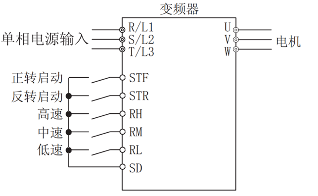
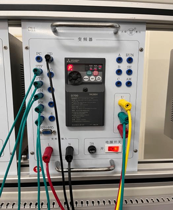
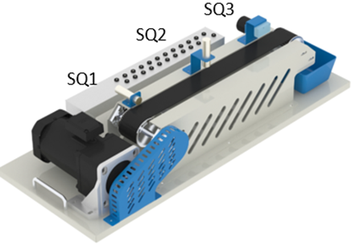
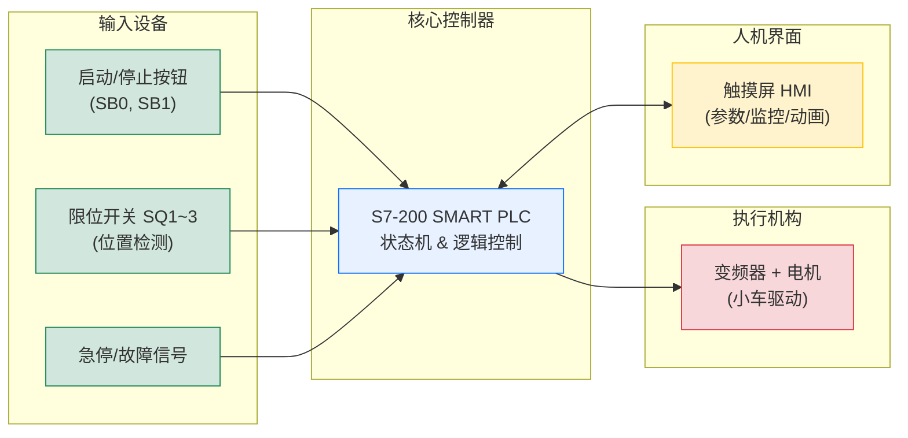
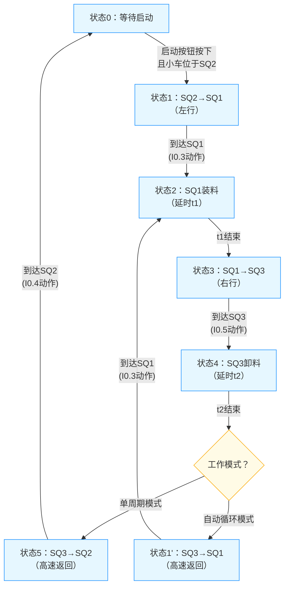

# PLC综合实训课程设计

## 基本实验项目

### 项目一：音乐喷泉的控制

#### 实验目的

1、掌握基本逻辑指令的编程；

2、掌握基本的编程方法。

#### 控制要求

1） 当打开启动开关SD后，音乐喷泉的8组灯，每组灯依次按照以下顺序点亮：L1亮0.5秒后灭，接着L2亮0.5秒后灭，接着L3亮0.5秒后灭，接着L4亮0.5秒后灭，接着L5亮0.5秒后灭，接着L6亮0.5秒后灭，接着L7亮0.5秒后灭，接着L8亮0.5秒后灭，L1亮0.5秒后灭，如此循环，当循环5次后8组灯全亮。

2） 当关闭开关SD后，所有的灯熄灭。

#### 实验设备

所用主要设备如表所示。

表 主要设备

| 序号 | 名    称  | 型号与规格 | 数量 | 备注              |
| ---- | --------- | ---------- | ---- | ----------------- |
| 1    | PLC实验台 | HHSMS-C1   | 1    |                   |
| 2    | 实训挂箱  | A10        | 1    | 挂件中+5V不需接线 |
| 3    | 导线      | 控制线     | 若干 |                   |
| 4    | 网线      |            | 1    |                   |
| 5    | 计算机    |            | 1    | 自备              |

#### PLC的I/O分配表

PLC的I/O分配表如表所示。

表 PLC的I/O分配表

| I（输入）                    |                                  | O（输出）      |      |
| ---------------------------- | -------------------------------- | -------------- | ---- |
| 名称及文字代号               | 地址                             | 名称及文字代号 | 地址 |
| 启动开关SD（扳手开关非按钮） | I0.1                             | 彩灯PG1        | Q1.0 |
|                              |                                  | 彩灯PG2        | Q1.1 |
|                              |                                  | 彩灯PG3        | Q1.2 |
|                              |                                  | 彩灯PG4        | Q1.3 |
|                              |                                  | 彩灯PG5        | Q1.4 |
|                              |                                  | 彩灯PG6        | Q1.5 |
|                              |                                  | 彩灯PG7        | Q1.6 |
|                              |                                  | 彩灯PG8        | Q1.7 |
| 电源正端                     | 主机1M、L、2L+、面板V+接电源+24V |                |      |
| 电源地端                     | 主机2M、M、面板COM接电源GND      |                |      |

#### 画出PLC的I/O接线图

#### 程序设计

1. 时序图

   

   本音乐喷泉PLC课程实验的时序图如上。第一个子图中的蓝色线表示开关通断，余下8个子图为灯组的通断时序。

2. 梯形图程序
   
   

#### PLC控制过程简述

程序实现了一个典型的循环移位灯控制功能，并且带有一个循环次数计数器。它利用定时器 (TON) 和输出位 (Q) 的置位 (S) 和复位 (R) 指令来实现步进控制。

1. **启动：** I0.1 的上升沿 (EU) 置位 M0.0，触发第一步 (Network 2)。
2. **步进运行：** 第一步 (Q1.0) 点亮 5 个单位时间 (T37)。 T37 到时触发第二步 (Q1.1) 点亮，同时关闭第一步 (Q1.0)。 第二步点亮 5 个单位时间 (T38)。 如此类推，每一步点亮 5 个单位时间，并关闭前一步。 信号从 Q1.0 依次移位到 Q1.7。
3. **循环：** 当最后一步 (Q1.7) 点亮 5 个单位时间 (T44) 后： T44 的上升沿使计数器 C0 加 1 (Network 10)。 同时，T44 作为条件反馈回 Network 2 (O T44)，触发第一步 (Q1.0) 重新点亮（此时 Network 2 的 R Q1.7, 1 会关闭 Q1.7），开始**下一次循环**。
4. **计数与结束动作：** 每次循环完成 (T44 上升沿)，计数器 C0 加 1。 当完成 5 次循环 (C0 = 1) 时，Network 11 执行，**同时点亮所有输出** **Q1.0** **到** **Q1.7**。 注意：C0 = 1 后，由于循环逻辑仍在运行（Network 2 的 O T44 条件满足），Q1.0 会立刻再次被点亮（S Q1.0, 1），同时 Network 11 的 S Q1.0, 8 也在置位它。但由于 Network 3 的 R Q1.0, 1 会在下一步将其复位，实际效果可能是所有灯亮一下之后，移位逻辑又开始了新一轮循环（Q1.0 亮 -> Q1.1 亮 Q1.0 灭 -> ...）。C0 会保持为 1 直到被复位。
5. **停止**/**复位：** I0.1 的下降沿 (ED) 会复位所有定时器 (T37-T44)、所有输出 (Q1.0-Q1.7) 和计数器 C0 (LDN I0.1 条件满足)。

一个 8 位的流水灯控制：8 个灯 (Q1.0到 Q1.7) 依次点亮，每个亮 0.5 秒，循环 5 次后所有灯一起保持常亮，通过控制开关进行启动和复位。

#### 个人心得

本次实验旨在通过西门子S7-200 SMART PLC实现一个8位流水灯的复杂控制功能。它不仅要求灯光能依次顺序点亮，还增加了循环次数计数和最终全亮效果的功能。通过程序编写、硬件接线、系统调试等一系列过程，我深刻体会到理论知识与工程实践相结合的重要性，并对PLC的工作原理和应用有了更深入的理解。

通过这次流水灯实验，我不仅成功实现了一个有趣的视觉效果，更重要的是，我深入理解了定时器（TON） 和计数器（CTU）在顺序控制中的核心作用，以及如何将它们组合起来构建复杂功能。我的工程实践能力，包括程序设计、硬件接线、系统调试和故障排查，都得到了全面的锻炼。

此次实验让我明白，PLC编程不仅仅是代码的堆砌，更是对工业流程的抽象和逻辑思维的体现。未来，我希望能将此次学到的顺序控制思想和编程技巧应用到更复杂的项目中，例如机械手控制、自动化生产线等，真正做到学以致用。

### 项目二：三台电机顺序启动逆序停止

#### 实验目的

1、 掌握用顺序功能图（SFC）表达控制过程的方法；

2、掌握SCR指令的编程与程序调试的方法。

#### 控制要求

3台电机顺序启动逆序停止控制流程如图所示。按启动按钮SF1后，3台电机MA1、MA2、MA3间隔3秒依次正序启动；按停止按钮SF2后，3台电机MA1、MA2、MA3间隔2秒依次逆序停止；如果在6秒之内只启动了2台或1台电机，当按下停止按钮SF2后，电机仍然按要求逆序停止。请用SCR指令写出控制程序。

图  三台电机顺序启动逆序停止流程示意图

#### PLC的I/O分配

把PLC输入输出地址分配填入表中。

表 PLC I/O 分配表

| I（输入）   | O（输出）                        |            |          |
| ----------- | -------------------------------- | ---------- | -------- |
| **名 称**   | **地址**                         | **名  称** | **地址** |
| 启动按钮SF1 | I0.1                             | 电机MA1    | Q0.6     |
| 停止按钮SF2 | I0.2                             | 电机MA2    | Q0.7     |
|             |                                  | 电机MA3    | Q1.0     |
| 电源正端    | 主机1M、L、2L+、面板V+接电源+24V |            |          |
| 电源地端    | 主机2M、M、面板COM接电源GND      |            |          |

#### 画出PLC的I/O接线及图

#### 梯形图程序设计

一. 画出描述控制过程的SFC

   

二. 梯形图程序设计

   

三. 梯形图总体流程总结

   启动： PLC 上电或从 STOP 切 RUN 时，进入初始状态 S0.0。

   运行： 当 I0.1有效时，进入 S0.1。

   主流程 (无中断)： S0.1 (Q0.6 ON, 3s) -> S0.2 (Q0.7 ON, 3s) -> S0.3 (Q1.0 ON, 等待 I0.2) -> S0.4 (Q1.0 OFF, 2s) -> S0.5 (Q0.7 OFF, 2s) -> S0.6 (Q0.6 OFF) -> 回到 S0.0。

   中断/急停路径：

   在 S0.1 时按 I0.2： S0.1 -> S0.6 (Q0.6 OFF) -> 回到 S0.0。(立即停止 Q0.6，跳过 S0.2-S0.5)

   在 S0.2 时按 I0.2： S0.2 -> S0.5 (Q0.7 OFF, 2s) -> S0.6 (Q0.6 OFF) -> 回到 S0.0。(停止 Q0.7，跳过 S0.3-S0.4，按顺序关闭 Q0.7 和 Q0.6)

   在 S0.3 时按 I0.2： S0.3 -> S0.4 (Q1.0 OFF, 2s) -> S0.5 (Q0.7 OFF, 2s) -> S0.6 (Q0.6 OFF) -> 回到 S0.0。(按顺序关闭 Q1.0, Q0.7, Q0.6)

#### 实验调试情况及个人心得

一. 实验调试情况

   **调试目的**

   验证基于顺序控制继电器（SCR）指令编写的程序，能否正确实现三台电机MA1、MA2、MA3的顺序启动与逆序停止功能，并测试在启动过程中任意时刻按下停止按钮的逆序停止逻辑。

   **调试设备与接线**

   - PLC: 西门子S7-200 SMART (CPU     SR20/ST20)
   - 编程软件: STEP 7-Micro/WIN SMART
   - 输入设备: 按钮SF1（常开，接I0.1），按钮SF2（常开，接I0.2）
   - 输出设备: 三盏指示灯（分别模拟电机MA1/Q0.6,     MA2/Q0.7, MA3/Q1.0）
   - 接线: 严格按照IO分配表将按钮和指示灯连接到PLC相应的I/O端子。

   **调试步骤及现象记录**

   | 步骤 | 操作                                                         | 观察现象（指示灯亮灭顺序）                                   | 结果分析                                                     |
   | ---- | ------------------------------------------------------------ | ------------------------------------------------------------ | ------------------------------------------------------------ |
   | 1    | 将PLC模式开关拨至RUN，程序开始运行。                         | S0.0状态激活，所有电机指示灯（Q0.6, Q0.7, Q1.0）均不亮。     | 系统成功进入初始状态，等待启动信号，符合预期。               |
   | 2    | 正常启动流程： 按下启动按钮SF1 (I0.1)。                      | Q0.6 (MA1) 立即点亮。   等待约3秒后 -> Q0.7 (MA2) 点亮。   再等待约3秒后 -> Q1.0 (MA3) 点亮。 | 三台电机严格按MA1->MA2->MA3的顺序，间隔3秒依次启动，顺序启动功能实现成功。 |
   | 3    | 正常停止流程： 在三台电机全部运行（Q0.6,  Q0.7, Q1.0全亮）时，按下停止按钮SF2 (I0.2)。 | Q1.0 (MA3) 立即熄灭。   等待约2秒后 -> Q0.7 (MA2) 熄灭。   再等待约2秒后 -> Q0.6 (MA1) 熄灭。   最后，所有灯灭，系统返回初始状态S0.0。 | 三台电机严格按MA3->MA2->MA1的顺序，间隔2秒依次停止，逆序停止功能实现成功。 |
   | 4    | 中断测试1（启动1台后停止）： 按下SF1启动MA1 (Q0.6亮)后，立即（3秒内） 按下SF2 (I0.2)。 | Q0.6 (MA1) 立即熄灭。   系统迅速返回初始状态S0.0。           | 程序从S0.1状态直接跳转至S0.6状态，复位Q0.6后返回初始状态。实现了“只启动了1台时，立即停止该电机”的逆序停止要求。 |
   | 5    | 中断测试2（启动2台后停止）： 按下SF1，待MA1和MA2均亮（Q0.6, Q0.7亮，Q1.0未亮）时，按下SF2 (I0.2)。 | Q0.7 (MA2) 立即熄灭。   等待约2秒后 -> Q0.6 (MA1) 熄灭。   系统返回初始状态S0.0。 | 程序从S0.2状态直接跳转至S0.5状态，开始执行逆序停止流程（先停MA2，再停MA1）。完美实现了“只启动了2台时，按MA2->MA1的顺序逆序停止”的复杂逻辑要求。 |
   | 6    | 边界测试： 在状态S0.3（仅Q1.0未启动）时按下SF2。             | Q1.0 (MA3) 被置位但立刻在S0.4状态被复位熄灭。   后续流程同步骤5，Q0.7和Q0.6依次延时2秒熄灭。 | 此操作触发了从S0.3到S0.4的转移，程序依然严格按照逆序停止的逻辑执行，证明了程序逻辑的严谨性和鲁棒性。 |

   **调试结论**

   本次调试完全成功。所编写的SCR程序完全满足了实验要求的全部功能：

   1. 顺序启动：按下SF1，三台电机按MA1->MA2->MA3顺序，间隔3秒依次启动。
   2. 逆序停止：按下SF2，三台电机按MA3->MA2->MA1顺序，间隔2秒依次停止。
   3. 中断逆停：在启动过程中任意时刻按下SF2，系统能智能地判断当前已启动的电机，并严格按照从后向前的顺序（逆序）延时停止它们，最终安全返回初始状态。

   程序结构清晰，逻辑严谨，对输入信号的处理准确无误，达到了预期的控制目标。

二. 个人心得

   通过本次西门子S7-200 SMART PLC的实验，我获得了丰富的理论知识和实践经验，心得体会如下，本次实验是学习顺序功能图（SFC） 和 SCR指令 的绝佳案例。我深刻体会到，对于复杂的顺序控制流程，使用SCR编程比传统的“起保停”电路更加直观、清晰、易于维护。每个状态（S0.x）都是一个独立的模块，状态内的操作和向其他状态的转移条件一目了然，极大地减少了程序间的互锁纠缠，降低了编程和调试的难度。我认识到PLC程序并不只是一堆简单的逻辑组合，而可以是一个完整的“状态机”。系统在任何时刻都处于一个确定的状态，并根据外部事件（如按钮信号）或内部条件（如定时器信号）切换到另一个状态。这种编程思想对于处理复杂的工艺流程至关重要。

   本次程序的精妙之处在于对停止按钮I0.2的复用。它在不同状态下扮演了不同的角色（S0.1/S0.2下的“急停跳转”和S0.3下的“正常停止触发”）。这让我意识到，一个好的控制程序必须考虑到所有可能的情况，并对同一信号在不同上下文中的含义做出精准的定义和响应。将书本上的指令和概念（如TON, S, R, SCRT）应用于一个完整的、有实际意义的工程案例中，极大地加深了我的理解。我不仅记住了指令的用法，更明白了它们为何要这样用，以及如何组合起来解决实际问题。

   总而言之，本次实验不仅成功实现了三台电机的顺序控制，更让我对PLC的结构化编程方法有了更深刻的认识，提升了我的逻辑思维能力和工程实践能力，为今后学习和设计更复杂的控制系统打下了坚实的基础。

### 项目三：变频器的手动控制

#### 实验目的

1、 掌握三菱变频器的基本参数，实验模块各端口的对应功能。

2、 通过控制面板设置变频器最小、最大运行频率，并启动电机，验证频率设置。

3、 通过外围接线，控制电动机的正反转。

4、 设置变频器低速、中速、高速频率，通过外接端子实现电机多段速度控制。

#### 控制要求

设置变频器最低转速为10Hz，最高转速70Hz，低速RL为15Hz，中速RM为35Hz，高速RH55Hz，通过端子实现电机三速运转。

#### 三菱变频器参数记录

把三菱变频器参数填入表3-1中。

表 三菱变频器参数记录

| **三菱变频器型号** | **FR - D720S - 0.4K - CHT** |
| ------------------ | --------------------------- |
| **输入电压类型**   | **单相200V**                |
| **适用电机容量**   | **0.4kW**                   |
| **额定电流**       | **2.5A**                    |

#### 实验内容

1、阅读三菱变频器说明书，熟悉变频器面板各按键功能，设置最小、最大运行频率，并启动电机，验证频率设置是否正确。

（将参数79设置为1，运行方式：启动指令：RUN，频率指令：面板转盘）

2、通过外围接线，控制电动机的正反转。

!!! note ""

    STF信号ON时为正转、OFF时为停止指令。

    STR信号ON时为反转、OFF时为停止指令。

    STF、STR信号同时ON时变成停止指令。

3、设置变频器低速、中速、高速频率，通过外接端子实现电机多段速度控制。

#### 实验调试情况及个人心得

一. 实验调试情况

   

   本次实验通过手动操作变频器面板，对三相异步电机进行转向控制与无级调速测试，旨在掌握变频器基本操作方法、参数设置流程及电机响应特性。通过不同的端子接口，成功测试了正反转功能，多段速调节功能。在调试中，变频器参数设置正确，电机转向可控，转速可调，保护功能完善，满足手动操作控制的基本要求。

二. 个人心得

   通过本次“手动操作变频器控制电机转向与转速”实验，我对变频调速系统的底层控制逻辑与工程实现方式有了更加直观和深入的理解，收获颇丰。我不仅扎实掌握了变频器的参数设置、正反转及多段速编程等硬技能，更显著提升了解决复杂工程问题的软实力。

   虽然现代产线多采用PLC+触摸屏自动控制，但本次手动实验让我明白：只有先掌握“手动怎么控”，才能理解“自动为何这样编”。比如，PLC程序中“正转中速”指令，本质上就是通过DO点触发变频器对应端子+频率设定——手动调试的经验，为后续学习PLC联动控制打下了坚实基础。

   本次实验不仅让我掌握了变频器手动操作的核心技能，更培养了我严谨细致的工程态度、系统化的调试思维与强烈的安全意识。这些收获，远比学会几个参数代码更为珍贵。未来在学习PLC自动控制、组态监控、甚至智能制造系统时，这段“亲手调频、亲耳听机、亲眼见证”的经历，将成为我理解自动化世界的重要基石。

### 项目四：基于PLC和变频器对传动带的运行控制

#### 实验目的

1、 进一步熟悉三菱变频器的参数设置方法；

2、 进一步熟悉西门子PLC和变频器的接线方式；

3、 进一步练习PLC顺序功能图（SFC）的设计和使用；

4、 掌握使用PLC来控制变频器的程序设计方法。

#### 控制要求

传动带运送系统如图4-1所示。当按下启动按钮SF1后，先将传送带上的工件以中速方式移动到初始位置（传感器SQ3处）后停止2秒。然后，传动带以低速方式带动工件向左运行至SQ2停止2秒后，再以中速运行至SQ1停止3秒后，高速返回至SQ3停止2秒。循环重复上述的动作直到按下停止按钮SF2后，传送带将工件运送到SQ1位置后停止工作。请设计控制程序并投入运行。

其中：低速设置：15Hz，中速设置：35Hz，高速设置：55Hz

#### PLC的I/O分配

表4-1 PLC I/O分配表

| I（输入）   | O（输出）                        |          |          |
| ----------- | -------------------------------- | -------- | -------- |
| **名称**    | **地址**                         | **名称** | **地址** |
| 启动按钮SF1 | I0.1                             | STF正转  | Q1.0     |
| 停止按钮SF2 | I0.2                             | STR反转  | Q1.1     |
| 传感器1SQ1  | I0.3                             | RH高速   | Q1.2     |
| 传感器2SQ2  | I0.4                             | RM中速   | Q1.3     |
| 传感器3SQ3  | I0.5                             | RL低速   | Q1.4     |
| 电源正端    | 主机1M、L、2L+、面板V+接电源+24V |          |          |
| 电源地端    | 主机2M、M、面板COM接电源GND      |          |          |

#### 电气原理控制图

#### 控制过程循环一个周期的顺序功能图（SFC）

#### 梯形图程序设计

#### 实验调试情况及个人心得

一、实验调试情况

在完成PLC程序编写并下载至S7-200 SMART控制器后，我对系统进行了分步调试与功能验证，确保各环节逻辑正确、动作可靠。调试过程如下：

1. 初始化调试
        上电后，利用SM0.1（首次扫描脉冲）自动置位S0.0，确保系统从初始状态启动。通过状态表监控，确认S0.0在PLC首次运行时被正确置位，程序进入待命状态。

1. 启动与停止功能测试
        按下启动按钮I0.1，系统置位S0.1（启动运行状态），同时复位S0.5（停止状态），传送带开始运行。按下停止按钮I0.2，系统进入S0.5状态，执行“运送至SQ1后停止”流程。测试中，启停响应灵敏，状态切换无误。
2. 顺序控制流程验证
        系统采用SCR（顺序控制继电器）指令实现多步流程控制：
    - S0.1阶段：中速正转（Q1.0=1，Q1.3=1）移动至SQ3（I0.5），到位后T37延时2秒，转入S0.2。
    - S0.2阶段：低速正转（Q1.0=1，Q1.4=1）至SQ2（I0.4），延时2秒后转入S0.3。
    - S0.3阶段：中速正转至SQ1（I0.3），延时3秒后转入S0.4。
    - S0.4阶段：高速反转（Q1.1=1，Q1.2=1）返回SQ3，延时2秒后跳回S0.2，形成循环。
    - 各阶段输出点（Q1.0~Q1.4）与传感器输入（I0.3~I0.5）联动正常，定时器T37~T40计时准确，状态转移顺畅。
3. 停止流程测试
        在任意运行阶段按下I0.2，系统跳转至S0.5状态，强制正转（Q1.0=1，Q1.3=1）至SQ1（I0.3），到位后停止所有输出，系统安全停机。经多次测试，该流程稳定可靠，符合“运送至SQ1后停止”的设计要求。
4. 异常与边界情况处理
    - 传感器未触发时，系统保持当前状态，避免误动作。
    - 在定时器计时期间再次触发传感器，程序仍按原逻辑执行，未出现状态冲突。
    - 多次启停切换无状态残留或输出紊乱现象。

二、个人心得

通过本次基于S7-200 SMART PLC的传送带控制系统设计与调试实验，我深刻体会到PLC在工业自动化控制中的强大功能与灵活应用。课堂上学习的顺序控制、定时器、置位/复位指令等知识，在本次实验中得到了充分应用。特别是SCR步进控制结构，使复杂流程变得条理清晰，易于调试和维护，让我认识到结构化编程的重要性。

在调试过程中，我学会了使用STEP 7-Micro/WIN SMART软件的状态表、强制表、程序状态监控等功能，快速定位逻辑错误。例如，最初T37未正常触发状态转移，通过监控发现是传感器信号未正确接入，及时修正硬件接线后问题解决。

本系统不仅要求动作准确，还需考虑安全性和异常处理。例如，停止按钮按下后不是立即停机，而是“运送至指定位置再停”，这体现了工业控制中“柔性停止”和“安全归位”的工程思维，让我对实际产线控制逻辑有了更深理解。

在实验过程中，与同学协作排查传感器信号干扰、输出点接线错误等问题，锻炼了沟通能力和团队协作精神。同时，在面对程序逻辑冲突时，学会了分步隔离、逐段验证的调试方法，提升了独立解决问题的能力。

### 项目五：基于PLC、INV及HMI对三项异步电动机正反转的控制

#### 实验目的

1、 熟悉三菱触摸屏设计软件的使用，掌握画面设计等相关技术；

2、 掌握PLC、变频器、触摸屏项目监控等技术。

#### 控制要求

1) 当按下启动按钮SF1后，电机以中速反向运行，传送带上的工件向右运行，当工件到达SQ3位置时停止2秒，电机以高速正向运行，传送带上的工件向左运行，当工件到达SQ1位置时停止2秒，重复刚才的动作。当按下停止按钮SF2后，传送带带动工件停留在SQ1位置。

2) 设计由触摸屏监视的控制系统。

   

#### PLC编程元件的分配

| **名 称**   | **编程元件** | **名  称** | **编程元件** |
| ----------- | ------------ | ---------- | ------------ |
| 启动按钮SF1 | M0.3         | STF正转    | Q1.0         |
| 停止按钮SF2 | M0.1         | STR反转    | Q1.1         |
| 传感器1 SQ1 | I0.3         | RH高速     | Q1.2         |
| 传感器2 SQ2 | I0.4         | RM中速     | Q1.3         |
| 传感器3 SQ3 | I0.5         | RL低速     | Q1.4         |

#### 监控系统电气原理图

#### 梯形图程序设计

#### HMI的主要界面

#### 触摸屏和PLC监控过程简述

1. I/O信号测试
        首先对输入信号（SF1、SF2、SQ1~SQ3）进行手动触发测试，确认PLC能正确读取按钮与传感器状态。测试中发现SQ3（I0.5）初始安装位置略偏，导致工件未完全到位即触发，经微调传感器位置后问题解决。输出方面，通过强制输出测试Q1.0（正转）、Q1.1（反转）、Q1.2（高速）、Q1.3（中速），确认变频器能正确接收指令并驱动电机按预期运行。

2. 顺序控制逻辑调试
        程序采用SCR顺序控制结构，分为S0.1（中速反转→SQ3）、S0.2（高速正转→SQ1）、S0.5（停止归位）三个主要状态。

      - 启动后，S0.1激活，电机中速反转（Q1.1 + Q1.3），工件右移，到达SQ3后触发T37延时2秒，随后跳转至S0.2；
      - S0.2激活，电机高速正转（Q1.0 + Q1.2），工件左移，到达SQ1后触发T38延时2秒，跳回S0.1，形成循环；
      - 按下SF2后，S0.5激活，电机中速正转（Q1.0 + Q1.3）将工件送回SQ1后停止。

3. HMI联动调试
        在GT Designer3中设计了启动/停止按钮、运行状态指示灯（正转、反转、高速）画面。通过HMI操作SF1/SF2，系统响应灵敏；状态变量（如M0.5高速指示）能实时反馈运行模式，增强了监控直观性。调试中优化了画面布局与颜色标识，使操作界面更符合工业人机交互习惯。

#### 实验调试情况及个人心得

一. 实验调试情况

   

二. 个人心得

   本次实验让我深刻体会到PLC顺序控制在工业自动化中的强大实用性。课本上的状态转移图（SFC）在本次实验中得到了真实应用，通过SCR指令实现多步骤循环控制，逻辑清晰、易于维护。同时，传感器触发与定时器配合，实现了精确的位置-时间控制，这在传送带、装配线等场景中极为常见。

   实验不仅涉及PLC编程，还整合了变频器参数设置（如多段速控制）、HMI画面组态与通信配置（如PLC与触摸屏的地址映射）。这让我认识到现代工业控制是“PLC+驱动器+人机界面”的协同系统，任何一环出错都会导致整体失效。调试中的一次通信延迟问题，最终通过检查波特率与站号设置解决，让我对系统集成细节有了更深理解。

   本实验不仅巩固了PLC顺序控制、变频器调速、HMI组态等核心技术，更让我体验了从方案设计→程序编写→硬件接线→系统调试→优化改进的完整工程流程。未来我将继续深入学习工业通信（如Modbus）、故障诊断、上位机监控等进阶内容，为成为合格的自动化工程师打下坚实基础。

### 项目六：基于PLC、INV和HMI对货物运输带的控制

#### 实验目的

1、 掌握触摸屏多画面和动画设计等技术；

2、 掌握PLC、INV和HMI简单监控系统的设计。

#### 控制要求

传动带运送系统如图6-1所示。当按下启动按钮SF1后，先将传送带上的工件以低速方式移动到初始位置（传感器SQ1处）后停止t1秒。然后，传动带以中速方式带动工件向右运行至SQ2停止t2秒后，再以高速运行至SQ3停止t3秒后，低速返回至SQ1停止t1秒。循环重复上述的动作直到按下停止按钮SF2后，传送带中速将工件运送到SQ1位置后停止工作。其中：低速设置：5Hz，中速设置：30Hz，高速设置：60Hz.

1） 触摸屏设计：1）主画面。包含项目名称，画面切换按钮等 2）参数设计画面。包含输入t1、t2和t3可改变的时间；高、中、低速度显示等。3）货物运输带运行控制与运行状态画面。包括运输带状态动画，控制按钮和状态指示灯等。

2） 按要求设计PLC控制程序。

图 货物运输传动带示意图

#### PLC软元件分配

PLC编程元件的分配

| **名 称**   | **编程元件** | **名  称**  | **编程元件** |
| ----------- | ------------ | ----------- | ------------ |
| 启动按钮SF1 | M0.0         | STF正转左移 | Q1.0         |
| 停止按钮SF2 | M0.1         | STR反转右移 | Q1.1         |
| 传感器1SQ1  | I0.3         | RH高速      | Q1.2         |
| 传感器2SQ2  | I0.4         | RM中速      | Q1.3         |
| 传感器3SQ3  | I0.5         | RL低速      | Q1.4         |

PLC软元件的分配

| **名 称**     | **编程元件** | **名  称** | **编程元件** |
| ------------- | ------------ | ---------- | ------------ |
| 启动按钮      | M0.0         | 正转指示   | Q1.0         |
| 停止按钮      | M0.1         | 反转指示   | Q1.1         |
| 传感器SQ1指示 | I0.3         | 高速指示   | Q1.2         |
| 传感器SQ2指示 | I0.4         | 中速指示   | Q1.3         |
| 传感器SQ3指示 | I0.5         | 低速指示   | Q1.4         |
| 工件位置变量  | VW500        | 时间t1     | VW200        |
| 时间t2        | VW300        | 时间t3     | VW400        |

#### 电气控制系统原理图

#### 触控屏设计的主要画面

#### 梯形图程序设计

#### 实验调试情况及心得

一、实验调试情况

在完成PLC程序编写与HMI画面组态后，对整个货物运输带控制系统进行了系统性调试，调试过程分为硬件接线检查、PLC程序仿真验证、HMI联动测试及整体运行稳定性测试四个阶段。

首先确认PLC（S7-200系列）、变频器（INV）与触摸屏（HMI）之间的通信连接正常。检查传感器`SQ1~SQ3`的安装位置与信号反馈是否准确，启动/停止按钮SF1/SF2触发灵敏，无粘连或误触发现象。变频器参数已按实验要求设置：低速5Hz、中速30Hz、高速60Hz，并通过PLC输出点`Q1.2~Q1.4`正确控制变频器多段速端子。

使用STEP 7-Micro/WIN软件对STL程序进行逐段仿真与监控。重点调试顺序控制（S0.0~S0.5）的跳转逻辑：

- 启动阶段（S0.1）：按下SF1后，传送带左移（Q1.0）并低速运行（Q1.4），到达SQ1后定时T37（t1）准确停止；

- 中速右移（S0.2）：T37计时结束自动跳转S0.2，传送带右移（Q1.1）+中速（Q1.3），至SQ2后T38（t2）停止；

- 高速右移（S0.3）：T38结束跳转S0.3，右移+高速（Q1.2），至SQ3后T39（t3）停止；

- 返回阶段（S0.4）：T39结束跳转S0.4，左移+低速返回SQ1，T40（t1）后循环至S0.2；

- 停止阶段（S0.5）：按下SF2后跳转S0.5，中速左移至SQ1后完全停止，符合“运回原点”要求。

 

HMI三画面功能均正常实现：

-  主画面：项目名称醒目，画面切换按钮响应迅速；

-  参数设置画面：可自由输入t1、t2、t3（VW200/VW300/VW400），数值实时写入PLC并生效，高低中速状态（Q1.2~Q1.4）同步显示；

-  运行控制画面：动画传送带根据Q1.0/Q1.1方向移动，传感器状态（I0.3~I0.5）与速度指示灯实时反馈，启动/停止按钮（M0.0/M0.1）控制可靠；

在整体运行测试中，系统连续运行5个完整循环，各阶段时间控制精确，速度切换平滑，无卡顿或误动作。按下SF2后，系统能稳定执行“中速返回SQ1”动作后停机，符合工艺要求。HMI数据显示与PLC内部状态完全同步，人机交互体验良好。

二、个人心得

通过本次“基于PLC、INV与HMI的货物运输带控制系统”实验，我深刻体会到现代工业自动化系统中“控制层-驱动层-人机层”协同设计的重要性。

本实验采用SCR顺序控制指令实现多阶段循环运行，每一个状态的跳转条件、输出控制与定时器复位都必须精确设计。稍有疏漏（如未及时复位输出或定时器），就会导致流程错乱或设备异常。这让我认识到在工业控制程序中，“防御性编程”与“状态闭环管理”是保障系统稳定运行的基础。

触摸屏不仅用于美观展示，更是操作员与设备交互的核心媒介。通过设置参数变量（VW200~VW400）与状态反馈（I/Q点），实现了“所见即所控”。尤其是工件位置变量VW500的设计，巧妙利用传感器信号进行位置校准，有效避免了因脉冲累计导致的定位漂移，体现了软件补偿在自动化系统中的实用价值。

初次仿真时，程序看似逻辑完整，但实际运行中暴露出跳转不稳定、输出未复位等问题。通过在线监控、变量跟踪与分段测试，逐步定位并修复BUG，这个过程极大提升了我的工程调试能力与问题分析思维。

实验中与组员分工协作（一人负责PLC编程，一人负责HMI组态，一人负责接线与测试），并通过统一IO表与变量命名规范确保系统集成顺畅。这让我意识到，在真实工程项目中，良好的沟通是项目成功的关键。

从按下启动按钮到工件按预设路径精准运行，整个系统如同一个精密的“机械舞蹈”。这种将逻辑思维转化为物理动作的过程，让我感受到自动化控制的魅力，也坚定了我深入学习PLC与工业组态技术的决心。

## 课程设计综合项目

**课程设计综合项目——一处卸料运料小车的控制**

### 设计项目及控制要求

运料小车如图所示。该车由电动机拖动，可用变频器控制的三相异步电机传动装置模拟。其**控制要求**为：

1）单周期工作方式：

小车处于中间位置SQ2处，按动启动按钮SB0，小车MA1向左运行，运行至左端压下限位开关SQ1，料斗门打开装料，t1秒后料斗门关闭小车向右运行；运行至右端压下限位开关SQ3，小车底门打开卸料，t2秒后底门关闭，车子自动返回到SQ2,完成单周期工作。返回的速度是前进速度的两倍。

2）自动循环方式：

按动启动按钮SB0，小车运行至装料处SQ1，料斗门打开装料，t1秒后料斗门关闭，装满料后就自动前进送料，到达SQ3料斗门打开装料，t2秒后底门关闭，小车自动返回到SQ1装料，然后再送料，实现运料小车的自动循环工作。

3）无论是单周期工作方式，还是自动循环方式，当按下停止按钮SB1时，小车要求停在SQ2处。小车如果出现故障时，要立即停止。

**项目设计要求**：

1．根据控制要求分配合适的编程元件；

2．设计能完成控制要求，且相对简单可靠的梯形图程序；

3．可通过人机界面（触摸屏）对运动小车进行监控。触摸屏设计的主要要求为：

1）主界面、参数设置页面、控制及运行状态显示界面的设计要合理美观；

2）能实时显示运行的状态（如左右、定点位置、高速、低速等）；

3）可以对运行速度、运行时间等参数进行设置；

4）设计小车的动画，显示小车运动状态。

### 一处卸料运料小车的电气控制系统概述

#### 系统组成

本系统以西门子S7-200 SMART PLC为核心控制器，配合变频器驱动三相异步电动机模拟运料小车的运行。系统主要由以下部分组成：

- **PLC控制器**：S7-200 SMART CPU ST40，负责逻辑控制、状态判断与流程管理；
- **执行机构**：三相异步电动机 + 变频器（三菱D700系列），以模拟小车行走；
- **位置检测元件**：三个限位开关（SQ1、SQ2、SQ3），分别对应左端装料位、中间初始位、右端卸料位；
- **控制按钮**：启动按钮SB0（I0.0）、停止按钮SB1（I0.1）；
- **人机界面（HMI）**：三菱触控屏（GS2110-WTBD），用于参数设置、状态监控与动画显示；
- **故障保护**：通过M0.4实现急停功能，确保系统安全。

系统通过PLC内部状态机（VW100）实现单周期与自动循环两种工作模式，并支持在任意时刻按下停止按钮后返回中间位置SQ2。

#### 工作过程

系统支持两种工作模式：

1. **单周期工作方式**

    - 初始状态：小车位于中间位置SQ2（I0.4动作）；
    - 按下启动按钮SB0，小车以设定速度向左运行至SQ1（I0.3动作）；
    - 到达SQ1后，料斗门打开，装料t1秒（由VW102设定）；
    - 装料完成后，小车向右运行至SQ3（I0.5动作）；
    - 到达SQ3后，底门打开卸料t2秒（由VW104设定）；
    - 卸料完成后，小车以**两倍于前进速度**返回SQ2，完成一个周期；
    - 返回SQ2后自动停止。

2. **自动循环工作方式**

    - 启动后，小车从SQ2出发至SQ1装料t1秒；
    - 装料完成后前往SQ3卸料t2秒；
    - 卸料完成后**不返回SQ2**，而是立即返回SQ1继续装料，形成“SQ1→SQ3→SQ1→SQ3…”的循环；
    - 循环过程中，返回段（SQ3→SQ1）速度仍为前进速度的两倍；
    - 按下停止按钮SB1后，无论处于何种状态，小车均运行至SQ2后停止。

### 控制系统原理设计

#### 控制系统结构框图及概述

系统采用“PLC+HMI+变频器”三层架构，PLC负责核心逻辑控制，HMI提供人机交互，变频器实现多段速及正反转控制。

#### 电气控制原理设计

系统采用**状态机**设计思想，以VW100作为状态寄存器，划分6个状态（0~5），分别对应等待、左行、装料、右行、卸料、返回。通过限位开关信号触发状态转移，配合定时器实现延时控制。

速度控制通过Q1.2\~Q1.4输出组合，选择变频器的多段速端子（RH、RM、RL），实现低、中、高三档速度。其中：

- 前进段（SQ2→SQ1、SQ1→SQ3）使用VW106/VW108设定的速度；
- 返回段（SQ3→SQ2 或 SQ3→SQ1）使用VW110设定的速度，通常设为高速（如3），以实现“返回速度为前进两倍”的要求。

方向控制由Q1.0（正转/右行）和Q1.1（反转/左行）实现，VW106/108/110寄存器值设置为1时，输出低速；设置为2时，输出中速；设置为3时，输出高速。高速速度约为低速的两倍。

#### 电气控制系统原理图及概述

**输入回路**：SB0（I0.0）、SB1（I0.1）、SQ1（I0.3）、SQ2（I0.4）、SQ3（I0.5）均接入PLC输入端子，

**输出回路**：

- Q1.0/Q1.1 接变频器正/反转控制端（STR/STF）；
- Q1.2~Q1.4 接变频器多段速选择端（RH、RM、RL）；

**通信**：PLC与三菱触控屏（GS系列）通过以太网连接。

#### 主要电器和传感器型号及性能概述

在本课程设计中，SQ1选用光电式传感器，SQ2选用电感式传感器，SQ3采用色标传感器，采用的PLC型号为西门子S7-200 SMART（ST40），采用三菱触控屏 GS系列（GS2110-WTBD）和三菱D700系列变频器，通过三相电机带动传送带上的工件以模拟小车的运动。

光电式传感器是通过把光强度的变化转换成电信号的变化来实现检测物体有无的接近开关: 其集发射器和接收器于一体, 当有被检测物体经过时, 将光电开关发射器发射的足够量的光线反射到接收器,于是光电开关就产生了开关信号。

电感式传感器由三大部分组成：LC 高频振荡器、开关电路及放大输出电路。振荡器产生一个交变磁场，当金属目标物体接近这一磁场，并达到感应距离时，在金属目标内产生涡流，从而导致电感式传感器振荡衰减，以至停振。振荡器振荡及停振的参数变化被后级放大电路处理并转换成开关信号，触发驱动控制器件，进而控制开关的通或断。这种传感器所能检测的物体必须是金属物体。

色标传感器是通过对比度与设定值进行比较，当有被检测物体经过时，对比度达到设定值，于是色标传感器就产生了开关信号。

| 元件              | 型号              | 类型           | 性能说明                                                     |
| ----------------- | ----------------- | -------------- | ------------------------------------------------------------ |
| **PLC**           | S7-200 SMART ST40 | 西门子         | 24VDC供电，24点数字量输入/16点输出，支持以太网通信           |
| **触摸屏**        | SMART 700 IE      | 西门子         | 7英寸彩色屏，支持与S7-200 SMART直接组态通信                  |
| **SQ1（左限位）** | GRTE18S-N1317     | 光电式传感器   | 检测距离 3~115mm可调，NPN常开，用于精确检测小车左端位置      |
| **SQ2（中限位）** | IME18-08BNSZW2S   | 电感式接近开关 | 检测金属物体，触发感应距离 8mm, 安全接通距离 6.48mm，稳定性高，用于初始定位 |
| **SQ3（右限位）** | KTM-WN11182P      | 色标传感器     | 检测距离≥10mm，通过识别色带标记定位，适用于卸料点精确定位    |

### PLC程序设计

#### PLC的IO分配及软元件分配

| 软元件           | 功能说明                                   |
| ---------------- | ------------------------------------------ |
| **I0.0**         | 启动按钮 SB0（实体）                       |
| **I0.1**         | 停止按钮 SB1（实体）                       |
| **I0.3**         | 左限位 SQ1                                 |
| **I0.4**         | 中限位 SQ2                                 |
| **I0.5**         | 右限位 SQ3                                 |
| **Q1.0**         | 电机正转（右行）                           |
| **Q1.1**         | 电机反转（左行）                           |
| **Q1.2**         | 高速选择                                   |
| **Q1.3**         | 中速选择                                   |
| **Q1.4**         | 低速选择                                   |
| **M0.2**         | 工作模式：0=单周期，1=自动循环             |
| **M0.4**         | 故障急停信号                               |
| **M0.5**         | 停止标志（返回SQ2）                        |
| **M0.6**         | HMI停止按钮                                |
| **M0.7**         | HMI启动按钮                                |
| **VW100**        | 状态机寄存器（0~5）                        |
| **VW102**        | SQ1装料时间（单位：100ms，如30=3s）        |
| **VW104**        | SQ3卸料时间（单位：100ms，如50=5s）        |
| **VW106**        | SQ2→SQ1段速度，返回段（1=低，2=中，3=高）  |
| **VW108**        | SQ1→SQ3段速度，前进段                      |
| **VW110**        | SQ3→SQ2返回段速度（应设为前进段的2倍效果） |
| **VW112**        | 小车位置坐标（-40~40，用于HMI动画）        |
| **T55/T56**      | 装料/卸料定时器                            |
| **T97/T32/T100** | 低/中/高速位置刷新脉冲                     |

#### 控制过程的描述（流程图）

#### PLC梯形图程序简介

程序采用**结构化设计**，逻辑清晰，易于维护与扩展。

- **Network 1**：系统初始化，设定默认参数（t1=3s, t2=5s，速度默认值等）；

  

- **Network 2~7**：状态机主逻辑，实现6个状态的转移与控制；

  

- **Network 8**：故障处理，强制回到状态0；

  

- **Network 9~11**：速度与方向输出控制，根据当前状态和速度设定值激活对应Q点；

  

- **Network 12**：停止逻辑，置位M0.5，确保最终停在SQ2；

  

- **Network 13~15**：位置坐标初始化（VW112），用于HMI动画；

  

- **Network 16~19**：基于不同速度档位生成位置刷新脉冲，并更新VW112（-40=SQ1, 0=SQ2, 40=SQ3），实现平滑动画。

### 变频器参数设置

本次课程设计中的变频器采用三菱D700系列。

| 参数编号 | 名 称             | 单位                 | 初始值                              | 范围                       | 用 途                                                        |
| -------- | ----------------- | -------------------- | ----------------------------------- | -------------------------- | ------------------------------------------------------------ |
| 0        | 转矩提升          | $0.1 \%$             | $6 \%/ 4 \% / 3 \% *$               | $0 \sim 30 \%$             | $\mathrm{V} / \mathrm{F}$ 控制时，在需要进一步提高启动时的转矩，以及负载后电机不转动、输出报警(OL)且(0C1)发生跳闸的情况下使用。  * 初始值根据变频器容量不同而不同。（0:75K以下/1:5K 3.7K/5.5K、7.5K） |
| 1        | 上限频率          | $0.01 \mathrm{~Hz} $ | $120 \mathrm{~Hz} $                 | $0 \sim 120 \mathrm{~Hz} $ | 想设置输出频率的上限时使用。                                 |
| 2        | 下限频率          | $0.01 \mathrm{~Hz} $ | $0 \mathrm{~Hz} $                   | $0 \sim 120 \mathrm{~Hz} $ | 想设置输出频率的下限时使用。                                 |
| 3        | 基准频率          | $0.01 \mathrm{~Hz} $ | $50 \mathrm{~Hz} $                  | $0 \sim 400 \mathrm{~Hz} $ | 请确认电机的额定铭牌。                                       |
| 4        | 3速设定（高速）   | $0.01 \mathrm{~Hz} $ | $50 \mathrm{~Hz} $                  | $0 \sim 400 \mathrm{~Hz} $ | 想用参数预先设定运转速度，用端子切换速度时使用。             |
| 5        | 3速设定（中速）   | $0.01 \mathrm{~Hz} $ | $30 \mathrm{~Hz} $                  | $0 \sim 400 \mathrm{~Hz} $ | 想用参数预先设定运转速度，用端子切换速度时使用。             |
| 6        | 3速设定（低速）   | $0.01 \mathrm{~Hz} $ | $10 \mathrm{~Hz} $                  | $0 \sim 400 \mathrm{~Hz} $ | 想用参数预先设定运转速度，用端子切换速度时使用。             |
| 7        | 加速时间          | $0.1 \mathrm{~s} $   | $5 \mathrm{~s} / 10 \mathrm{~s} * $ | $0 \sim 3600 \mathrm{~s} $ | 可以设定加减速时间。 *初始值根据变频器容量不同而不同。 （3.7K以下/5.5K、7.5K） |
| 8        | 减速时间          | $0.1 \mathrm{~s} $   | $5 \mathrm{~s} / 10 \mathrm{~s} * $ | $0 \sim 3600 \mathrm{~s} $ | 可以设定加减速时间。 *初始值根据变频器容量不同而不同。 （3.7K以下/5.5K、7.5K） |
| 9        | 电子过电流保护    | $0.01 \mathrm{~A} $  | 变频器 额定电流                  | $0 \sim 500 \mathrm{~A} $  | 用变频器对电机进行热保护。 设定电机的额定电流。           |
| 79       | 操作模式选择      | 1                    | 0                                   | $0、1、2、3、4、6、7 $     | 选择启动指令场所和频率设定场所。                             |
| 125      | 端子2频率设定增益 | $0.01 \mathrm{~Hz} $ | $50 \mathrm{~Hz} $                  | $0 \sim 400 \mathrm{~Hz} $ | 改变电位器最大值（5V初始值）的频率。                         |
| 126      | 端子4频率设定增益 | $0.01 \mathrm{~Hz} $ | $50 \mathrm{~Hz} $                  | $0 \sim 400 \mathrm{~Hz} $ | 可变更电流最大输入（20mA初始值）时的频率。                   |
| 160      | 扩展功能显示选择  | 1                    | 9999                                | 0、9999                    | 可以限制通过操作面板或参数单元读取的参数。                   |

3速设定中，RH端口代表高速，设置为50Hz；RM端口代表中速，设置为35Hz；RL端口代表低速，设置为15Hz。其余参数尽量使用默认设置。

### 人机界面（触摸屏）组态设计

#### 触摸屏工程参数设置及通信连接

- **HMI型号**：三菱触控屏 GS系列（GS2110-WTBD）；
- **通信方式**：以太网（RJ45，TCP）；
- **PLC连接**：在GT3 Designer中新建项目，选择“SIEMENS”驱动；
- **IP设置**：PLC（192.168.0.10），HMI（192.168.0.18），子网掩码255.255.255.0；
- **变量连接**：将VW100、VW102、VW104、M0.2、M0.7、M0.6、VW112等变量绑定至HMI。

#### 人机界面（触摸屏）的设计

##### 触摸屏主画面设计

主界面拥有启动、停止、参数页面、状态页面四个功能按钮。

##### 参数设计画面

参数设计页面可设置：

- 装料时间（VW102，单位0.1s，根据课程设计要求，SQ1装料时间为3s，触控屏填入30）；
- 卸料时间（VW104，单位0.1s，根据课程设计要求，SQ3装料时间为5s，触控屏填入50）；
- 各段速度（VW106/VW108/VW110，数值选择：1-低，2-中，3-高）；

- 状态页面按钮：跳转运行控制与运行状态画面。

##### 运行控制与运行状态画面

运行控制与运行状态画面的内容包括：

- 顶部：标题“小车运行状态指示动画”；
- 中部：动态小车动画（基于VW112坐标，-40~40线性映射到画面位置）；
- 底部：状态指示（运行模式、运行方向、速度等级）；
- 按钮：【启动】、【停止】、【参数页面】、【模式切换】、【故障】（急停）、【返回】。

实时显示：

- 当前状态（小车装卸料时间、装卸料动画、SQ1~3传感器触发指示）；
- 小车位置（运行动画进度条）；
- 速度等级（移速指示灯）；
- 模式指示（单周期 / 自动循环）；

### 项目调试效果及总结

#### 项目调试效果展示

- 单周期模式：小车从SQ2出发→左行至SQ1→装料3s→右行至SQ3→卸料5s→高速返回SQ2，动作准确；
- 自动循环模式：小车在SQ1与SQ3之间循环运料，返回段速度明显快于前进段；
- 停止功能：任意时刻按停止，小车均能安全返回SQ2，急停功能能使小车立即停止运动；
- HMI动画：小车位置随VW112实时移动，状态显示同步准确；
- 参数修改：通过触摸屏修改时间或速度，系统立即生效。

#### 心得体会与总结

通过本次“一处卸料运料小车的电气控制系统”实验，我不仅巩固了PLC编程的基础知识，更在系统设计、逻辑构建与人机协同控制等方面获得了宝贵的实践经验，深刻体会到自动化控制系统在现代工业中的核心价值。

首先，在程序设计层面，我首次完整实践了基于状态机的控制逻辑构建方法。通过使用VW100作为状态寄存器，将复杂的运料流程分解为六个清晰的状态步骤（等待、左行、装料、右行、卸料、返回），使程序结构层次分明、逻辑严谨、易于调试与维护。这种“分而治之”的设计思想，极大提升了程序的可读性和可靠性，也让我认识到在工业控制中，良好的软件架构与清晰的状态管理往往比复杂的算法更为重要。

其次，在硬件协同与参数整定方面，我深入理解了PLC、变频器与电机之间的配合机制。通过合理设置变频器的多段速参数，并利用PLC输出点（Q1.2~Q1.4）组合控制不同运行阶段的速度，成功实现了“返回速度为前进速度两倍”的控制要求。这一过程让我意识到，自动化系统不仅是软件逻辑的实现，更是软硬件深度融合的工程实践。任何一个环节（如传感器响应延迟、变频器加速时间）的疏忽，都可能导致系统运行不稳或定位不准。

第三，在人机界面（HMI）设计中，我体会到“以用户为中心”的设计理念的重要性。通过GT3 Designer软件，我不仅实现了参数设置、状态监控等基本功能，还创新性地引入了基于VW112坐标的小车位置动画，使操作人员能够直观地掌握设备运行状态。这种可视化反馈不仅提升了系统的可操作性，也增强了故障排查的效率。我认识到，优秀的自动化系统不仅要“能用”，更要“好用”、“易用”。

此外，实验中对安全逻辑的实现也让我印象深刻。无论是按下停止按钮后强制返回SQ2，还是故障急停时立即复位状态机，都体现了“安全第一”的工程原则。这让我明白，在工业现场，控制系统的鲁棒性与安全性往往比效率更为关键。

本次实验极大提升了我的系统集成能力与工程思维。从I/O分配、电气接线，到PLC编程、HMI组态，再到变频器参数整定与联合调试，整个过程模拟了真实工程项目的工作流程。我学会了如何将理论知识转化为可运行的系统，如何在调试中分析问题（如状态跳变异常、动画卡顿等），并逐步优化解决方案。

总之，本次实验不仅是一次技术训练，更是一次工程素养的全面提升。它让我更加坚定了投身自动化领域的信心，也让我深刻理解到：真正的自动化，不仅是机器的自动运行，更是人、机、信息的高效协同。