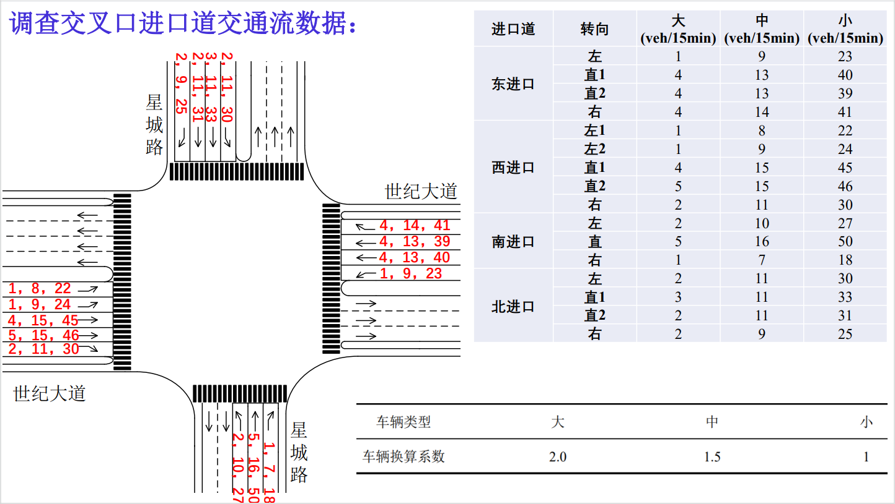
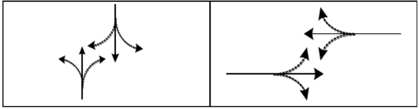
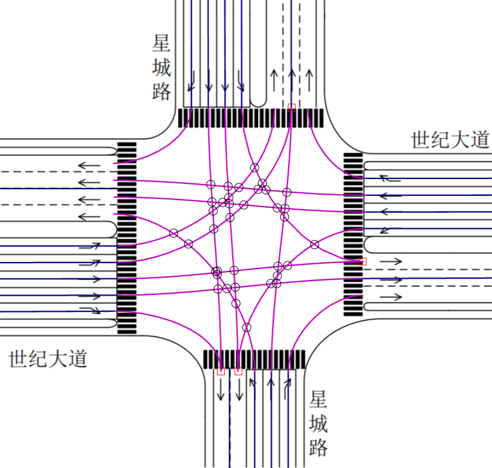
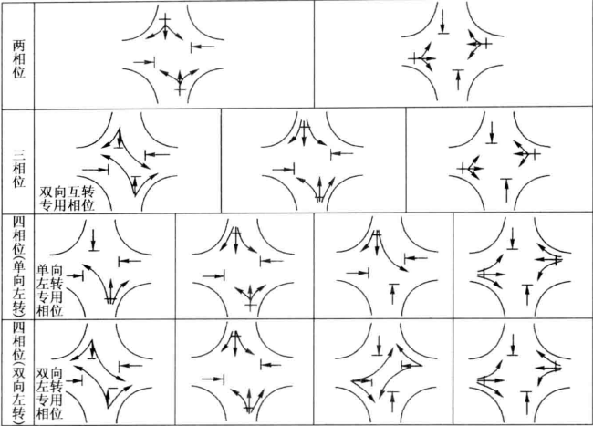
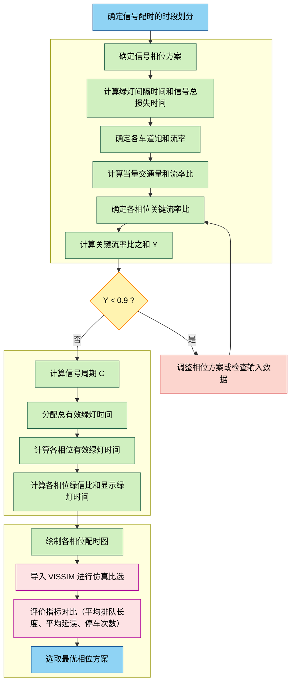

# 交叉口信号配时优化VISSIM仿真课程设计

本文是笔者本科期间轨道交通信号综合系统实验的课程设计报告。

## 摘要

本课程设计围绕城市道路交叉口的信号配时优化问题展开，基于VISSIM微观交通仿真平台，结合实际交通调查数据，对某典型十字交叉口进行了多相位信号配时方案的设计与比选。通过分析交叉口几何条件、交通流量特征及原信号配时方案的不足，分别设计了两相位、三相位和四相位（双向左转专用相位）三种优化方案，并依据信号配时基本原理计算各相位关键参数（如周期时长、绿信比、有效绿灯时间等）。利用VISSIM软件构建仿真模型，以平均延误、排队长度、停车次数等作为评价指标，对各方案进行仿真对比与分析。结果表明，优化后的二相位方案在整体通行效率方面表现最优，但四相位方案在安全性方面更具优势。本设计体现了信号配时理论在实际工程中的应用，为交叉口信号控制优化提供了科学依据和方法支持。

**关键词：**VISSIM交通仿真；交叉口信号配时

## 课程设计目的

1. **掌握交叉口信号配时优化的基本理论与方法**：通过本设计，深入理解交通信号配时的基本原理、核心参数（如信号相位、周期、饱和流率、流率比等）的计算方法，理解信号配时在解决交叉口交通冲突、提升通行效率中的作用。学会基于交通调查数据（几何条件、交通流量等）进行信号相位方案设计，能够针对不同相位组合（两相位、三相位、四相位）开展参数计算与方案优化。

2. **熟悉VISSIM仿真软件的基本操作与应用**：学习 VISSIM 仿真软件进行交叉口建模、交通流输入、信号控制设置及仿真结果分析。掌握通过仿真数据（平均延误、排队长度等）评价信号配时方案优劣的方法，培养从仿真结果反推方案改进方向的能力。
3. **培养分析与解决实际交通问题的能力**：通过数据收集、方案设计、仿真验证与结果分析的全过程训练，提升对交叉口运行状态的诊断与优化能力。
4. **理解不同信号相位方案的适用性与优劣**：结合实际案例理解原信号配时方案的局限性，通过对比不同优化方案的效果，建立 “问题分析 - 方案设计 - 仿真验证 - 优化迭代” 的解决思路，提升交通工程实践能力。
5. **为今后从事交通规划、设计与管理实践打下基础**：深化对交叉口交通流特性的认识，明确信号配时与交通需求、道路几何条件的匹配关系，为今后从事交通规划与信号控制相关工作奠定理论与实践基础。

## 交通调查

### 交叉口几何条件

本交叉口信号配时优化VISSIM仿真课程设计使用如下样式的交叉口进行设计。

交叉口的进口道设置和车道宽度如下所示：

| 进口道 | 转向 | 车道宽度(m) |
| ------ | ---- | ----------- |
| 东进口 | 左   | $3.5$       |
|        | 直1  | $3.5$       |
|        | 直2  | $3.5$       |
|        | 右   | $3.5$       |
| 西进口 | 左1  | $3.5$       |
|        | 左2  | $3.5$       |
|        | 直1  | $3.5$       |
|        | 直2  | $3.5$       |
|        | 右   | $3.5$       |
| 南进口 | 左   | $3.5$       |
|        | 直   | $3.5$       |
|        | 右   | $3.5$       |
| 北进口 | 左   | $3.5$       |
|        | 直1  | $3.5$       |
|        | 直2  | $3.5$       |
|        | 右   | $3.5$       |

### 交叉口交通流量

在交通工程中，交叉口交通流量是描述单位时间内通过交叉口特定位置（如进口道、出口道、冲突点等）的车辆、行人或非机动车数量的核心指标，是交叉口规划设计、信号配时优化、拥堵治理及通行效率评估的基础数据。

交叉口交通流量通常由实际调研得到，这里采用给定的数据源。

交叉口交通流量是交通工程实践的 “数据基石”，是信号配时优化的重要基础，通过分流向流量数据，确定信号相位（如左转流量大则设单独左转相位）、绿灯时长（流量比高的方向绿灯更长）、信号周期（高峰流量大则周期更长，减少启停损失）。

### 原信号配时方案

需要进行优化的原信号配时方案为二相位。

原方案的相位时间（需要优化）如下：

| 方向          | 南北直、左 | 东西直、左 |
| ------------- | ---------- | ---------- |
| 绿灯时长（s） | 17         | 21         |
| 黄灯时长（s） | 3          | 3          |
| 全红时长（s） | 3          | 3          |

原方案信号相位配时图如下：

## 信号配时优化设计

### 交叉口复杂性分析

交通信号是一种从时间上分离交通流的交通管控措施，通过从时间上给不同方向的交通流分配通行权，从而实现不同方向的交通流分离，以达到减少交通流冲突的目的。

交叉口的复杂性 $A$ 可以用以下式子表达：

$ A = n_{B} + 3n_{M} + 5n_{C} $

式中：$n_{B}$、$n_{M}$、$n_{C}$——分别为交通流在交叉口内的分流冲突点数、合流冲突点数和交叉冲突点数。

对于对称布局的交叉口，随着交叉口进口道车道条数的增加，机动车冲突点数可由下式计算：

$n_{c} = n_{lc} + n_{nc} = (8n + 4) + 4n^{2}$
$n_{lc}$ — 交叉口左转机动车交叉冲突点数；包含: 左转与直行的冲突 8n；左转与左转的冲突 4
$n_{nc}$ — 交叉口非左转机动车交叉冲突点数；包含: 直行与直行的冲突 4n；直行与左转的冲突 4n
$n$ — 交叉口进口道机动车车道条数。

由于本课程设计所分析的交叉口为非对称布局，交叉口复杂度计算使用公式 $ A = n_{B} + 3n_{M} + 5n_{C} $

通过绘图，数得交叉口内的合流冲突点数 $n_{M}$为 4，,交叉冲突点数 $n_{C}$为 36，没有分流冲突点数 $n_{B}$。

计算得到的交叉口复杂度为 192。

### 信号配时原理及流程

交通信号配时的核心目标是通过合理安排信号灯的切换时序和时长，在安全的前提下提高路口通行效率，减少车辆延误和排队长度。基本原则包括：

1. 安全性：避免冲突，预留安全清空时间。
2. 高效性：提高道路通行能力，减少平均延误。
3. 公平性：兼顾各方向交通需求，避免长期不均衡。
4. 适应性：根据流量变化灵活调整信号配时（定时控制或自适应控制）。

**信号配时的基本流程**：

1. 交通调查与数据收集
   - 路口交通量、车流组成、车速、车道数、转向比例等。
2. 确定信号相位方案
   - 根据交通流冲突关系，确定直行、左转、右转的相位组合。
3. 计算关键流率比总和
   - 分析各相位的流量，确定关键流率比，计算总和。
4. 确定信号周期
   - 根据关键流率比总和及经验公式（如Webster公式）计算推荐周期。
5. 分配有效绿灯时长
   - 按各相位流率比占比，合理分配有效绿灯时间。
6. 计算损失时间与过渡时间
   - 设置黄灯、全红时间，确保安全。
7. 形成完整配时方案
   - 包括周期长度、各相位绿信比和绿灯时长。
8. 效果评价
   - 分析延误、排队长度、通行能力。
   - 必要时进行优化调整。

### 信号配时基本参数

#### 信号相位

**定义**： 一个信号相位是指同时获得通行权的一股或几股交通流（如直行、左转）所对应的信号灯状态序列（绿->黄->红->绿）。

**理解**： 相位是信号配时的基本单元，它将复杂的交通流冲突在时间上进行分离。一个标准的十字路口通常需要4个相位（东西直行、东西左转、南北直行、南北左转），有时会采用更复杂的多相位设计。

**示例**： “相位A” 可能专用于东西方向的直行和右转车辆，此时东西左转和南北方向所有车辆均为红灯。

常用的信号相位选择如下：

#### 信号周期

**定义**：信号灯从一个状态开始至再次回到相同状态所经历的总时间（所有相位的绿灯时间、黄灯时间、全红时间以及损失时间的总和）。

**公式**：信号周期 = 各相位有效绿灯时间 + 损失时间

**意义**：周期过长会增加次要道路车辆的等待时间导致延误增加，周期过短则难以协调相邻路口，绿灯利用率低（损失时间占比高），且可能无法清空排队车辆。常用范围一般在40秒至180秒之间。

目前，应用最广泛的单点交叉口信号周期有三种，分别是最短信号周期、实用信号周期以Webster信号周期。

#####  最短信号周期

既然较长的信号周期有利于交叉口的通行能力，那么就一定存在一个信号周期，使其刚好能够满足交叉口的通行需求，任何小于该信号周期时长的周期都会导致通行能力不足。在理想条件下，当信号周期时长为最短信号周期时，一个信号周期内到达交叉口的车流量恰好能够全部通过交叉口，即无滞留车辆，又无富余绿灯时间。因此，最短信号周期应当恰好等于一个周期内各相位的关键车流通过交叉口所需的有效绿灯时间与总的信号损失时间之和。

计算公式如下：

$C_{m}=L+C_{m} \frac{q_{1}}{S_{1}}+C_{m} \frac{q_{2}}{S_{2}}+\cdots+C_{m} \frac{q_{n}}{S_{n}}$

式中: 
  $L$——信号总损失时间, 按下式计算:
  $L=\sum_{i=1}^{n}\left(l+I_{i}-A_{i}\right)$

式中: 
  $l$——启动损失时间, 实测获得, 无实测数据时可取 $3s$;
  $I_{i}$——第 $i$ 相位末的绿灯间隔时间，$s$;
  $A_{i}$——第 $i$ 相位末的黄灯时间，$s$。

整理可得:

$C_{m}=\frac{L}{1-\sum_{i=1}^{n} \frac{q_{i}}{S_{i}}}=\frac{L}{1-\sum_{i=1}^{n} \gamma_{i}}=\frac{L}{1-Y}$

式中: 
  $q_{i}$——第 $i$ 相位的关键车流量, $\mathrm{pcu} / \mathrm{h}$;
  $S_{i}$——第 $i$ 相位的关键车道组饱和流率, $\mathrm{pcu} / \mathrm{h}$;
  $\gamma_{i}$——第 $i$ 相位的关键车道组流率比;
  $Y$——周期内所有相位的关键车道组的流率比之和。

以上最短信号周期公式要求关键流率比之和 $Y$ 必须小于 1。关键流率比之和 $Y$ 在一定程度上反映了交叉口的整体交通负荷水平, $Y$ 值越接近于 1 则意味着该交叉口的交通负荷水平越接近饱和状态。在实际应用时, 通常要求 $Y \leqslant 0.9$。当 $Y$ 值不满足要求时, 应当重新考虑交叉口的渠化方案以及相位设计方案, 以降低 $Y$ 值。

##### 实用信号周期

采用最短信号周期控制的交叉口刚好能够满足高峰小时设计交通量的通行需求，周期内没有任何富余的绿灯时间，缺少通行能力储备。为克服这一问题，人们提出按照高峰小时交叉口饱和度控制目标进行信号周期设计的方法。

$$\begin{aligned}& C_{\mathrm{p}}=\frac{L}{1-\frac{Y}{(v / c)}}\end{aligned}$$

式中: 
  $C_{\mathrm{p}}$ 一实用信号周期;
  $v / c$ 一一交叉口设计饱和度。

当设计关键车流量考虑高峰小时流量系数时，实用信号周期公式有以下表达形式:

$\mathrm{C}_{\mathrm{p}}=\frac{\mathrm{I}}{1-\frac{\mathrm{Y}}{\overline{\mathrm{P}} \mathrm{H} \overline{\mathrm{F}} \cdot(\bar{v} / \mathrm{c})}}$

式中: 
  PHF—高峰小时流量系数。

上述公式中 $v / c$ 一般小于 1 ,因此实用信号周期通常应大于最短信号周期。当交叉口设计饱和度为 1 时，实用信号周期即为最短信号周期。这说明最短信号周期本质上是实用信号周期的一个特例，或者说在最短信号周期控制下，高峰小时交叉口处于或接近完全饱和状态。

##### Webster信号周期

Webster 提出的信号控制交叉口延误计算模型包含了均衡相位平均延误和随机平均延误两部分。注意到，Webster 延误模型是一个关于信号周期时长的函数。将 Webster 延误公式对信号周期时长 \(C\) 求导，并令一阶导数为 0，即可解出使延误值最小的信号周期时长，这里称该信号周期为最佳信号周期，整理后的最佳信号周期表达式如下:

$$C_{\mathrm{o}}=\frac{1.5 L+5}{1-Y}$$

式中: 
  \(C_{\mathrm{o}}\) ——最佳信号周期，\(s\);
  \(L\) ——信号总损失时间，\(s\);
  \(Y\) ——周期内所有相位的关键车道组的流率比之和。

#### 信号总损失时间

**定义**： 在每个信号周期内，由于相位切换（绿灯间隔时间）和车辆启动反应，所有相位中无法被有效利用的时间总和，记为 $L$。

**公式**：一个周期的信号损失时间由所有相位的启动损失及全红时间组成。在没有实测数据的情况下，一般启动损失取3s

$L=\sum_{i=1}^{n}\left(l+I_{i}-A_{i}\right)$

式中: 
  $l$ ——启动损失时间, 实测获得, 无实测数据时可取 3 $s$;
  $I_{i}$——第$i$ 相位末的绿灯间隔时间，$s$;
  $A_{i}$——第$i$ 相位末的黄灯时间，$s$。

#### 黄灯时间

**定义**： 绿灯结束后、红灯亮起前，显示黄色信号灯的时间，记为 $Y$。

**意义**： 警告驾驶员信号即将变为红灯，为已进入交叉口的车辆提供安全驶离的时间。
通常根据交叉口的接近速度、驾驶员反应时间、道路坡度等因素确定。一般取值范围为 3~5 秒。鉴于黄灯期间仍允许距离交叉口很近却又无法安全制动的车辆驶过停车线进入交叉口，因此黄灯时长的确定应当满足如下最不利情况，即当绿灯信号结束、黄灯开启时刻，驾驶员处于最小制动距离处时，恰好能够在黄灯结束时驶离停车线。

**公式**：安全起见，实际应用中通常使用第 $85$ 百分位车速 $v_{85}$，黄灯时长的表达式如下：

$A = t + \frac{v_{85}}{2a + 19.6g}$

式中：
  $A$——黄灯信号时长，$s$;
  $t$——驾驶员反应时间，s，一般取值为 $1s$；
  $v_{85}$——$85\%$ 车速，或合理的速度限制值，$m/s$；
  $a$——汽车减速度，$m/s^2$；
  $g$——坡度，用小数表示；

#### 全红时间

**定义**： 一个相位红灯亮起后，下一个相位绿灯亮起前，所有方向均显示红灯的短暂清空时间，记为 $AR$。

**意义**： 为黄灯期间进入交叉口却又无法完全驶离交叉口的车辆提供时间补偿, 以便在下一信号相位开启前清空交叉口，确保在上一相位黄灯期间进入交叉口的车辆能够完全清空，避免与下一相位首车发生冲突。

**公式**：为安全起见, 实际应用中通常采用第 15 百分位车速 $v_{15}$ 替换式中的车速 $v_{0}$, 全红时长的表达式为:

$r=\frac{w+L}{v_{15}} \quad$

式中:
  $r$——全红信号时长, $s$;
  $w$——从停车线到远端对向冲突车道的距离, $m$;
  $  L  $——汽车标准长度, 通常取 5 ~ 6m;
  $v_{15}$——15% 车速, $m/s$。

当存在明显的行人过街交通流，或者存在行人过街保护相位时，全红时长宜采用下式计算：

$\quad r=\frac{P+L}{v_{15}}$

式中: $P$ ——从停车线到远端冲突行人过街横道的距离，$m$。

当有行人过街横道，行人过街交通流量中等时，全红时长采用下式计算:

$\quad r=\max \left(\frac{w+L}{v_{15}}, \frac{P}{v_{15}}\right)$

#### 绿灯间隔时间

**定义**： 一个相位绿灯结束到下一个相位绿灯开始之间的总时间，即黄灯时间 + 全红时间。

**意义**： 实现相位间的安全过渡，保证行车安全与流向切换的平稳性。

**公式**：绿灯间隔时间表达式为： $I = A + AR$ 

式中：
  $I$——绿灯间隔时间，$s$;
  $A$——黄灯时间，$s$;
  $AR$——全红时间，$s$。

#### 交通量

确定设计交通量时，应按交叉口每天交通量的时变规律，分为早高峰时段、下午高峰时段、晚高峰时段、早晚低峰时段、中午低峰时段及一般平峰时段等各时段，然后确定相应的设计交通量。

已选定时段的设计交通量，须按该时段内交叉口各进口道不同流向分别确定，其计算公式如下：

\[ q_{dmn} = 4 \times Q_{15mn} \]

式中: \( q_{dmn} \) ——配时时段中，进口道 \(m\) 、流向 \(n\) 的设计交通量，pcu/h；

$Q_{15 m n}$ 一配时时段中, 进口道 $m$ 、流向 $n$ 的高峰小时中最高 $15 \mathrm{~min}$ 的流率, $\mathrm{pcu} / 15 \mathrm{~min}$ 。无最高 $15 \mathrm{~min}$ 流率的实测数据时, 可按下式估算:

$q_{d m n}=\frac{Q_{m n}}{(\mathrm{PHF})_{m n}}$

式中: 
  $Q_{m n}$ ——配时时段中, 进口道 $m$ 、流向 $n$ 的高峰小时交通量, $\mathrm{pcu} / \mathrm{h}$;
  $(\mathrm{PHF})_{m n}$ ——配时时段中, 进口道 $m$ 、流向 $n$ 的高峰小时系数; 主要进口道可取 0.75 , 次要进口道可取 0.8 。

#### 饱和流率、流率比、关键流率比、关键流率比总和

##### 饱和流率

**定义**： 在连续绿灯条件下，单一车道上一小时内能够通过停车线的最大车辆数（pcu/h，标准小客车单位/小时）。

**理解**： 衡量一条车道通行能力的指标。通常是一个相对固定的值，受车道宽度、车型、坡度等因素影响。

饱和流量随交叉口几何因素、渠化方式及各流向交通冲突等情况而异，比较复杂。因此，应尽量采用实测数据，实在无法取得实测数据时，如新建交叉口设计时，才考虑用以下估算方法。

交叉口进口道经划分车道并加渠化以后，进口道饱和流量随进口道车道数及渠化方案而异，所以必须分别计算各条进口车道的饱和流量，然后再把各条车道的饱和流量累计成进口道的饱和流量。

饱和流量用实测平均基本饱和流量乘以各影响因素校正系数的方法估算，即进口车道的设计饱和流量：

$\mathrm{~S~}_{\mathrm{~f~}}=\mathrm{~S~}_{\mathrm{~b~i~}}\times f(\mathrm{~F~}_{\mathrm{~i~}})$

式中: 
  $S_{\mathrm{~f~}}$——进口车道的设计饱和流量，$pcu/h$； 
  $S_{\mathrm{~b~i~}}$——第$\mathrm{i}$条进口车道基本饱和流量，$pcu/h$,$\mathrm{i}$取$\mathrm{T}$、$\mathrm{L}$或$\mathrm{R}$，分别表示相应的直行、左转或右转；
  $f(\mathrm{~F~}_{\mathrm{~i~}})$——各类进口车道各类校正系数。

各类进口车道各有其专用相位时的基本饱和流量 $S_{bi}$，可采用下表数值。

| 车道     | $S_{bi}$         | 车道     | $S_{bi}$         |
| -------- | ---------------- | -------- | ---------------- |
| 直行车道 | $1550 \sim 1750$ | 右转车道 | $1350 \sim 1550$ |
|          | 平均 $1650$      |          | 平均 $1450$      |
| 左转车道 | $1450 \sim 1650$ |          |                  |
|          | 平均 $1550$      |          |                  |

注：进口车道宽度为 $3.0 \sim 3.5 \mathrm{~m}$。

##### 流率比

**定义**： 某一车道组（或相位）的实际交通流量（$q$）与其饱和流率（$s$）的比值， $y = q / s$。

**理解**： 表示该车道组对绿灯时间的需求程度。y值越大，说明该方向交通压力越大，需要的绿灯时间越长。

简单来说，它衡量的是 “交通需求” 与 “通行能力” 之间的关系。

- 交通需求：实际有多少车想要通过（流率）。
- 通行能力上限：在理想情况下，一条车道一小时最多能通过多少辆车（饱和流率）。

##### 关键流率比、关键流率比总和

**关键流率比**

关键流率比是指在一个信号相位中，所有受控车道组（或交通流）的流率比（$y$）中的最大值。

一个相位通常服务于多个车道（如直行+左转），但通行能力受限于其中最拥挤、需求最大的那个车道组。这个最大需求就是该相位的“瓶颈”，即关键流率比。

**关键流率比总和**

一个信号周期内，所有相位的关键流率比（$y_{crit}$）之和，$ Y = Σ (y_{crit}) $。Y值反映了整个交叉口的总交通负荷。它是计算最小周期和分配绿灯时间的关键输入。

#### 有效绿灯时间与显示绿灯时间

##### 有效绿灯时间

**定义**：有效绿灯时间是指在一个信号周期内，某一相位中车辆能够有效利用的绿灯时长。
 换句话说，就是真正能用于车辆通行的时间，扣除了起步延迟、清空损失等无效时间。

**意义**：有效绿灯时间是交通能力计算的基础参数。决定了该相位在一个信号周期内能通过多少车辆。在信号配时时，常通过关键流率比分配有效绿灯时间，使绿灯分配与交通需求相匹配。与饱和流率配合使用，可以计算该相位的最大通行能力：$Q=s \cdot \frac{g_{e}}{C}$（其中 $s$ 为饱和流率， $C$ 为信号周期）。

相位的有效绿灯时间与该相位的关键车道组流率比成正比，各相位的有效绿灯时间按照关键车道组流率比的比例在周期内共享。于是, 第 $j$ 相位的有效绿灯时间为：

$g_{ej}=(C-L) \frac{y_{j}}{Y}$

式中:
  $g_{ej}$——第 $j$ 个相位的有效绿灯时间，$s$;
  $C$——信号周期，$s$;
  $L$——信号总损失时间，$s$;
  $y_j$——第 \(j\) 相位的关键车道组流率比;
  $Y$——关键流率比之和（即所有相位的关键流率比之和）

式中，$y_j$、$Y$的计算公式如下：

$$y_j = \frac{q_j}{s_j}$$

其中，\(q_j\) 为第 \(j\) 相位关键车道组的交通流量（veh/h），\(s_j\) 为该车道组的饱和流率（veh/h）。  
表示该相位的交通需求与能力的比值。

$$Y = \sum_j y_j$$

##### 显示绿灯时间

**定义**：现实绿灯时间是指信号灯实际显示为绿色的时长，也就是驾驶员在路口看到的绿灯时间。

**意义**：显示绿灯时间是信号机设置的直接参数，用于控制灯色显示。包含了有效绿灯时间，但还需要修正损失时间与过渡时间，才能形成最终显示时间。不同于有效绿灯，现实绿灯对驾驶人而言是“直观的放行时间”。

**公式**：各相位的有效绿灯时间分配完成后, 即可根据下式确定各相位的绿灯显示时间。以第 $j$ 相位为例, 绿灯显示时间:

$g_{j}=g_{ej}+l_{j}-A_{j}$

式中：
  $g_j$——第 $j$ 相位的绿灯显示时间，$s$;
  $g_{ej}$——第 $j$ 相位的有效绿灯时间，$s$;
  $l_j$——第 $j$ 相位的损失时间，包括该相位的启动损失、清空时间等，$s$;
  $A_j$——第 $j$ 相位的调整因子。主要用于修正实际情况与理论计算之间的差异，例如考虑到相位末尾仍可能有部分车辆通过，或考虑黄灯与全红分配的修正。

#### 绿信比

**定义**：一个相位的有效绿灯时长在整个信号周期中的比例。

**意义**：衡量各方向获得的通行权分配程度。绿信比表示了一个相位在单个周期中所分配到的通行时间比例。绿灯时间的分配本质上就是确定各相位的绿信比。

**公式**：绿信比 = 有效绿灯时长 / 信号周期。

$\lambda=\frac{g_{e j}}{C}$ 

式中：
  $\lambda$——绿信比;
  $g_{e j}$ ——有效绿灯时长，单位 $s$;
  $C$ ——信号周期，单位 $s$。

### 信号配时评价指标

#### 车辆平均延误时间

**定义**： 所有车辆在交叉口受信号灯影响而产生的平均等待时间（秒/辆）。

**意义**： 是评价信号配时方案优劣的最核心指标，直接反映了出行者的体验和通行效率，延误越小，配时越合理。

**影响因素**：车辆平均延误时间由均匀延误（在均匀到达的理想情况下，车辆因周期性红灯而产生的固定延误）随机延误（由于车辆到达的随机性（有时多有时少）而引发的额外排队延误）过饱和延误（当交通需求超过交叉口通行能力时，排队持续增长带来的严重延误）组成。

#### 车辆排队长度

**定义**： 在红灯期间或绿灯开始时，在停车线后等待通行的车辆形成的队列长度（米或车辆数）。

**意义**：反映路口通行能力和饱和情况。过长的排队会导致溢流，排队清空需要时间，影响本相位绿灯时间的有效利用率。用于确定进口道左转、直行待行区的长度。

**类型**：车辆排队长度可以分为最大排队长度（一个周期内出现的排队最大值）平均排队长度（一个周期内排队长度的平均值）二次排队（在过饱和状态下，上一个周期未清空的排队会延续到下一个周期，导致排队持续增长）等类型。

### 信号配时基本流程

改建、治理交叉口时信号配时设计流程如下：

需要指出的是，信号相位必须同交叉口进口道车道渠化(即车道功能划分)方案同时设定。有专用转弯相位时必须相应地设置专用车道。有左转专用车道时，根据左转流向设计交通量计算的左转车每周期平均到达 3 辆时，宜用左转专用相位。同一相位各相关进口道左转车每周期平均到达量相近时，宜用双向左转专用相位，否则宜用单向左转专用相位。

在本课程设计过程中，采用给定的交叉口进口道车道渠化方案（详见交叉口几何条件节），不做另行设计，并对部分设计流程进行简化处理。

本次交叉口信号配时优化VISSIM仿真课程设计的流程图如下所示：

### 信号配时相位方案设计及参数计算

#### 确定信号相位方案

在本课程设计中，设计使用两相位、三相位、四相位（双向左转）进行信号配时设计。

> 在本课程设计中，由于不考虑行人道的影响，并根据交叉口几何条件确定右转车道不存在与直行和左转车道的冲突，故在相位设计中，确定**右转车道不设信号灯进行控制，始终拥有通行权**。
>
> 故下文计算相位有效绿灯时间等参数时，忽略右转车道的流率比数据。

两相位设计描述如下：

- 相位1：东西方向直行、左转同时放行（绿灯）。
- 相位2：南北方向直行、左转同时放行（绿灯）。

三相位设计描述如下：

- 相位1：南北方向左转放行（绿灯）。
- 相位2：南北方向直行、左转同时放行（绿灯）。
- 相位3：东西方向直行、左转同时放行（绿灯）。

四相位设计（双向左转）描述如下：

- 相位1：南北方向左转放行（绿灯）。
- 相位2：南北方向直行、左转同时放行（绿灯）。
- 相位3：东西方向左转放行（绿灯）。
- 相位4：东西方向直行、左转同时放行（绿灯）。

#### 计算绿灯间隔时间和信号总损失时间

**绿灯间隔时间**是指一个方向的绿灯结束后，到下一个交叉方向绿灯开始前，中间设置的一段安全过渡时间，主要包括黄灯时间和全红灯时间。

绿灯间隔时间 $I = A + AR$ ，$A$ 指黄灯时间，本课程设计取 3$s$，$AR$ 指全红灯间隔，这里取 3$s$。

在本课程设计中，绿灯间隔时间取 6$s$。

**信号总损失时间**，按下式计算

$L = \sum_{k}(L_s + I - A)_k$

式中：
  $L_s$ - - 起动损失时间，应实测，无实测数据时可取 $3s$;
  $A$ - - 黄灯时长, s, 常取为 3s, 或根据实际情况按式计算;
  $I$ - - 绿灯间隔时间，如上计算得 6$s$。
  $k$ - - 一个周期内的绿灯间隔数。

在本课程设计中，仅考虑前损失时间和全红时间，一个周期内的绿灯间隔数与相位数相同。

计算可得信号总损失时间为 $6 s * \text{相位数}$。

| 方案                | 两相位 | 三相位 | 四相位（双向左转） |
| ------------------- | ------ | ------ | ------------------ |
| 信号总损失时间（s） | 12     | 18     | 24                 |

#### 确定各车道饱和流率

在本课程设计中，饱和流率采用基本值，不修正。

直行车道取 $1650 \, \text{pcu/h}$ ，左转车道取 $1550 \, \text{pcu/h}$ ，右转车道取 $1450 \, \text{pcu/h}$ 。

合用车道则取两者的均值，例如直行左转合用车道取 $0.5 \times (1650 + 1550) = 1600 \, \text{pcu/h}$ 。

#### 计算当量交通量和流率比

**当量交通量（ETV）** 是交通工程领域中，为统一衡量不同类型车辆（如小汽车、公交车、货车等）对道路通行能力、交通流特性及交通负荷的影响，将各类车辆换算成某一标准车型（通常为小客车）的交通量数值。

当量交通量的计算公式非常明确，即通过 “各车型的实际数量 × 对应 PCE 值”，再将所有结果求和，得到标准化的 “小客车当量交通量”。

**计算公式**： \(ETV = \sum_{i=1}^{n} (Q_i \times PCE_i)\) 其中：

- ETV：当量交通量（单位：pcu/h，即 “辆小客车 / 小时”）；
- \(Q_i\)：第i种车型的实际交通量（单位：辆 /h）；
- \(PCE_i\)：第i种车型对应的小客车当量系数；
- n：统计的车辆类型总数（如小客车、公交车、货车等）。

**流率比**指的是：在信号周期内，某一信号相位所对应的车道的实际交通流率与该车道的饱和流率的比值。

**计算公式为：**流率比 (y) = 交通流率 (q) / 饱和流率 (s)

其中：

- $y$： 流率比（无量纲，是一个比值）
- $q$： 交通流率（单位：辆/小时，或 pcu/h - 标准小客车当量/小时）
- $s$： 饱和流率（单位：辆/小时/车道，或 pcu/h/ln）

这里给出本课程设计采用的数据：

| 进口道 | 转向 | 大 (veh/15min) | 中 (veh/15min) | 小 (veh/15min) |
| ------ | ---- | -------------- | -------------- | -------------- |
| 东进口 | 左   | 1              | 9              | 23             |
|        | 直1  | 4              | 13             | 40             |
|        | 直2  | 4              | 13             | 39             |
|        | 右   | 4              | 14             | 41             |
| 西进口 | 左1  | 1              | 8              | 22             |
|        | 左2  | 1              | 9              | 24             |
|        | 直1  | 4              | 15             | 45             |
|        | 直2  | 5              | 15             | 46             |
|        | 右   | 2              | 11             | 30             |
| 南进口 | 左   | 2              | 10             | 27             |
|        | 直   | 5              | 16             | 50             |
|        | 右   | 1              | 7              | 18             |
| 北进口 | 左   | 2              | 11             | 30             |
|        | 直1  | 3              | 11             | 33             |
|        | 直2  | 2              | 11             | 31             |
|        | 右   | 2              | 9              | 25             |

| 车辆类型 | 大 | 中 | 小 |
| --- | --- | --- | --- |
| 车辆换算系数 | 2.0 | 1.5 | 1 |

计算所得当量交通量和流率比如下：

| 进口道 | 转向 | 小时当量交通量 | 车道流率比 |
| ------ | ---- | -------------- | ---------- |
| 东进口 | 左   | 154            | 0.099355   |
|        | 直1  | 270            | 0.163636   |
|        | 直2  | 266            | 0.161212   |
|        | 右   | 280            | 0.193103   |
| 西进口 | 左1  | 144            | 0.092903   |
|        | 左2  | 158            | 0.101935   |
|        | 直1  | 302            | 0.18303    |
|        | 直2  | 314            | 0.190303   |
|        | 右   | 202            | 0.13931    |
| 南进口 | 左   | 184            | 0.11871    |
|        | 直   | 336            | 0.203636   |
|        | 右   | 122            | 0.084138   |
| 北进口 | 左   | 202            | 0.130323   |
|        | 直1  | 222            | 0.134545   |
|        | 直2  | 206            | 0.124848   |
|        | 右   | 170            | 0.117241   |

#### 确定各相位关键流率比并计算关键流率比之和

**关键流率比**是指在交叉口信号控制中，某一相位中流率比最大的车道组的流率比。它是确定信号周期和各相位绿灯时长的关键参数。

**关键流率比总和** (关键流量比总和) 是指组成周期的全部信号相位的关键流率比之和。 $Y=\sum_{j=1}^{j} \max \left(y_{j}, y_{j}^{\prime}, \ldots\right)=\sum_{j=1}^{j} \max \left[\left(\frac{q_{d}}{S_{d}}\right)_{i},\left(\frac{q_{d}}{S_{d}}\right)_{j}^{\prime}, \cdots(Y>0.9)\right]$

$q_{d}$ ——设计交通量 , $\mathrm{pcu} / \mathrm{h} ; \quad S_{\mathrm{d}}$ 一设计饱和流量 , $\mathrm{pcu} / \mathrm{h}$ 。

式中：
  $Y$ ——组成周期的全部信号相位的各个最大流量比 $y_{j}$ 或 $y_{j}^{\prime}$ 值之和; 
  $j$ ——一个周期内的相位数；$y_{j} 、 y_{j}^{\prime}$ 一第 $j$ 相的流量比。

计算 $Y$ 值大于 0.9 时, 须改进进口道设计或/和信号相位方案, 重新设计。

简单来说，假设某相位的关键流率比为$yi$，交叉口所有相位的关键流率比之和用Y表示，即\(Y = \sum_{i} y_i\)。

根据上表可得各相位关键流率比并计算关键流率比之和如下：

| 相位       | 东西左转   | 东西右转   | 东西直行   | 南北左转   | 南北右转   | 南北直行   |
| ---------- | ---------- | ---------- | ---------- | ---------- | ---------- | ---------- |
| 关键流率比 | $0.101935$ | $0.193103$ | $0.190303$ | $0.130323$ | $0.117241$ | $0.203636$ |

**各信号相位方案的关键流率比**计算如下：

- 两相位设计方案

  | 相位       | 南北直、左  | 东西直、左 |
  | ---------- | ----------- | ---------- |
  | 关键流率比 | 0.203636364 | 0.19030303 |

- 三相位设计方案

  | 相位       | 南北左      | 南北直、左  | 东西直、左 |
  | ---------- | ----------- | ----------- | ---------- |
  | 关键流率比 | 0.130322581 | 0.203636364 | 0.19030303 |

- 四相位设计方案（双向左转）

  | 相位       | 南北左      | 南北直、左  | 东西左      | 东西直、左 |
  | ---------- | ----------- | ----------- | ----------- | ---------- |
  | 关键流率比 | 0.130322581 | 0.203636364 | 0.101935484 | 0.19030303 |

**各信号方案的关键流率比之和 Y**：

| 方案            | 两相位      | 三相位      | 四相位（双向左转） |
| --------------- | ----------- | ----------- | ------------------ |
| 关键流率比之和Y | 0.393939394 | 0.524261975 | 0.626197458        |

#### 计算信号周期

本课程设计中，考虑高峰小时系数和交叉口设计饱和度的周期计算公式:

$C=\frac{L}{1-\frac{Y}{P H F(v / c)}}$

$P H F=\frac{\text { 高峰小 } L v z \text { 交通量 }}{4 \times \text { 最大 } 15 \text { 分钟交通量 }} \quad \mathrm{PHF}-$ 高峰小时系数; $v / c$ 一交叉口设计饱和度。

本课程设计中 $\mathrm{PHF}$ 取 0.9 , $v / c$ 取 $0.9$

> 理想的信号周期时间在 40-180 s 之间，根据公式计算得到的信号周期不足 40 s 的，取 40 s 作为该信号方案的信号周期。

**各信号方案的信号周期C计算如下**

| 方案          | 两相位 | 三相位      | 四相位（双向左转） |
| ------------- | ------ | ----------- | ------------------ |
| 信号周期时长C | 40     | 51.02576032 | 105.7656757        |

#### 计算总有效绿灯时间和各相位有效绿灯时间

总有效绿灯时间 $Ge$，每周期的总有效绿灯时间按下式计算：

$G_{e}=C-L$

各相位有效绿灯时间，按下式计算：

$g_{ej}={G_{e}}\frac{\max(y_{j},y'_{j},\cdots)}{Y}$

**各方案的总有效绿灯时间 Ge**

| 方案             | 两相位 | 三相位      | 四相位（双向左转） |
| ---------------- | ------ | ----------- | ------------------ |
| 总有效绿灯时间Ge | 28     | 33.02576032 | 81.76567569        |

**各方案不同相位的有效绿灯时间 $g_{ej}$**

- 两相位

  | 相位         | 南北直、左  | 东西直、左  |
  | ------------ | ----------- | ----------- |
  | 有效绿灯时间 | 14.47384615 | 13.52615385 |

- 三相位

  | 相位         | 南北左     | 南北直、左  | 东西直、左  |
  | ------------ | ---------- | ----------- | ----------- |
  | 有效绿灯时间 | 8.20964045 | 12.82802504 | 11.98809483 |

- 四相位（双向左转）

  | 相位         | 南北左      | 南北直、左 | 东西左      | 东西直、左  |
  | ------------ | ----------- | ---------- | ----------- | ----------- |
  | 有效绿灯时间 | 17.01685901 | 26.5897995 | 13.31021645 | 24.84880072 |

#### 计算各相位绿信比和显示绿灯时间

**绿信比 $\lambda$** 指的是一个相位的有效绿灯时长在整个信号周期中的比例。

$\lambda=\frac{g_{e j}}{C}$ 

式中： $g_{e j}$ ——有效绿灯时长，单位 $s$;
	     $C$ ——信号周期，单位 $s$。

**各方案不同相位的绿信比 $\lambda$**

- 两相位

  | 相位   | 南北直、左  | 东西直、左  |
  | ------ | ----------- | ----------- |
  | 绿信比 | 0.361846154 | 0.338153846 |

- 三相位

  | 相位   | 南北左      | 南北直、左  | 东西直、左  |
  | ------ | ----------- | ----------- | ----------- |
  | 绿信比 | 0.160892075 | 0.251402918 | 0.234942013 |

- 四相位（双向左转）

  | 相位   | 南北左      | 南北直、左  | 东西左      | 东西直、左  |
  | ------ | ----------- | ----------- | ----------- | ----------- |
  | 绿信比 | 0.160892075 | 0.251402918 | 0.125846276 | 0.234942013 |

**显示绿灯时间 $g_j$** 指信号灯实际显示为绿色的时长。

$g_{j} = g_{e j} - A_{j} + l_{j}$ 

$l_{j}$ ——第 $j$ 相位起动损失时间，各相位起动损失均取 $3 s$;
$A_j$ ——第 $j$ 相位的调整因子，这里各相位均取 $3s$。

**各方案不同相位的显示绿灯时间 $g_j$**

- 两相位

  | 相位         | 南北直、左  | 东西直、左  |
  | ------------ | ----------- | ----------- |
  | 显示绿灯时间 | 14.47384615 | 13.52615385 |

- 三相位

  | 相位         | 南北左     | 南北直、左  | 东西直、左  |
  | ------------ | ---------- | ----------- | ----------- |
  | 显示绿灯时间 | 8.20964045 | 12.82802504 | 11.98809483 |

- 四相位（双向左转）

  | 相位         | 南北左      | 南北直、左 | 东西左      | 东西直、左  |
  | ------------ | ----------- | ---------- | ----------- | ----------- |
  | 显示绿灯时间 | 17.01685901 | 26.5897995 | 13.31021645 | 24.84880072 |

#### 各信号相位配时图

取前损失3s，忽略后损失，取黄灯时间3s，全红时间3s。

根据计算所得的显示绿灯时间，进行取整，最终绘制的信号相位配时图如下：

- 两相位配时图

  	相位1——南北直行、左转		相位2——东西直行、左转

- 三相位配时图

  	相位1——南北左转	相位2——南北直行、左转	相位3——东西直行、左转

- 四相位配时图

  	相位1——南北左转					相位2——南北直行、左转
  	相位3——东西左转					相位4——东西直行、左转

## 基于VISSIM仿真的配时方案比选

### VISSIM仿真软件概述

VISSIM是由德国PTV集团开发的一款先进的交通微观仿真软件，最初应用于城市交通网络的详细仿真分析。多年来，VISSIM不断更新迭代，逐步发展为一款集交通流仿真、交通信号控制、公共交通和行人流动分析于一体的多功能工具。在国内外众多交通工程项目和研究中，VISSIM凭借其高精度和灵活性赢得了广泛的认可。

VISSIM采用微观仿真方法，对每辆车、每位行人进行逐一建模和行为模拟。该软件利用连续时间仿真技术，结合随机因素的引入，实现交通流中个体行为与整体流特征的真实描述，使得整个交通系统的运行情况能够细致展现。除了车辆仿真，VISSIM还可以对行人、公共交通以及非机动交通等多种交通参与者的动态行为进行建模。不同交通方式之间的交互作用、冲突与协调调控可以通过软件中的详细规则进行预设和调节，从而为交叉口信号配时及道路规划提供科学依据。

VISSIM仿真软件拥有灵活的场景构建与参数调整能力。用户可以根据实际需求建立从单一交叉口到整个城市交通网络的仿真模型。软件界面友好，支持参数灵活调节，能够深入设定车辆行驶行为、加速减速特性、车道变换等多种因素。同时，借助预处理数据与实时分析，研究人员能够通过多次仿真来评估不同信号配时方案和交通管理措施的效果。

VISSIM在城市交通管理、信号配时优化、交通事故分析、环境影响评估、公共交通运行优化以及智能交通系统（ITS）试验等多个领域发挥了重要作用。对于交叉口信号配时优化研究来说，VISSIM不仅能够精确模拟车辆在交叉口处的动态行驶状态，还能够量化不同信号方案下的延误、排队长度及通行能力，从而帮助设计者找到最佳调控策略。

作为一款功能强大、应用广泛的交通仿真工具，VISSIM在交叉口信号配时优化研究中发挥着不可替代的作用。通过对其模型原理、应用特点和优势的全面了解，我们可以更好地利用该软件对复杂交通环境下的信号控制策略进行仿真验证与优化分析，为城市交通管理提供科学依据和决策支持。

### 仿真模拟

首先根据调查所得的道路基本数据比如车道宽度和车道数量等，绘制交叉口，并用连接器将交叉口各路段连接起来，最后为交叉口创建信号控制机，设置信号灯，得到的交叉口仿真图如图所示。

建立完交叉口后，输入交通量数据、交叉口信号配时方案、设置冲突区让行规则，对交叉口的交通运行状况进行仿真模拟。

各车道路段交通量输入数据如下：

**原方案**的交叉口信号配时方案：

经过**优化设计**的交叉口信号配时方案：

设置的二相位配时图如下：

设置的三相位配时图如下：

设置的四相位配时图如下：

### 仿真数据及分析

运用VISSIM软件的评估功能对各方案进行节点评估，选取平均排队长度、车辆平均延误以及停车次数作为评价指标，并输出节点结果。

#### 原方案的仿真数据

仿真模拟获得的数据如下：

#### 二相位仿真数据

此处的二相位仿真数据为优化后的数据，非原始方案。

仿真模拟获得的数据如下：

#### 三相位仿真数据

仿真模拟获得的数据如下：

#### 四相位仿真数据

仿真模拟获得的数据如下：

#### 仿真数据分析

##### 不同行进方向的平均车辆延误

设计确定的三种信号相位数据列表如下：

| 不同行进方向的平均车辆延误 | 二信号相位  | 三信号相位  | 四信号相位  |
| -------------------------- | ----------- | ----------- | ----------- |
| 东西进口左转               | 20.65191233 | 44.1814745  | 21.8519165  |
| 南北进口左转               | 39.40930175 | 13.24281675 | 17.730289   |
| 东西方向直行               | 8.61948575  | 17.20090838 | 30.93528925 |
| 南北方向直行               | 8.03023     | 15.78263017 | 26.18790867 |

##### 仿真评估平均指标

设计确定的三种信号相位数据列表如下：

| 仿真平均数据 | 平均排队长度 | 平均车辆延误 | 平均停车次数 | 最大排队长度 |
| ------------ | ------------ | ------------ | ------------ | ------------ |
| 二信号相位   | 3.203145     | 11.2844395   | 0.6262695    | 42.357986    |
| 三信号相位   | 5.2749665    | 16.4712445   | 0.683885     | 58.0842455   |
| 四信号相位   | 7.0602625    | 20.713212    | 0.4993005    | 57.9602805   |

##### 三种设计方案与原方案的仿真评估数据对比

各方案不同进口方向的平均排队长度与车辆平均延误数据列表如下：

|          | 二相位（原方案） |              | 二相位（优化后） |              | 三相位       |              | 四相位       |              |
| -------- | ---------------- | ------------ | ---------------- | ------------ | ------------ | ------------ | ------------ | ------------ |
| 进口方向 | 平均排队长度     | 车辆平均延误 | 平均排队长度     | 车辆平均延误 | 平均排队长度 | 车辆平均延误 | 平均排队长度 | 车辆平均延误 |
| 东进口   | 3.55045375       | 12.78111875  | 2.56012275       | 11.5246535   | 7.50635863   | 23.0166815   | 6.401585125  | 19.27317825  |
| 西进口   | 2.2309106        | 8.8548747    | 2.294747667      | 10.31540944  | 6.6318499    | 22.0425165   | 8.495688     | 21.54171878  |
| 南进口   | 6.3249465        | 18.48380717  | 7.841983833      | 22.5226195   | 4.4657415    | 11.153486    | 7.275771833  | 14.88574233  |
| 北进口   | 2.760540875      | 12.65482288  | 1.453848375      | 8.8411345    | 1.95438888   | 10.09904225  | 4.8811115    | 17.347545    |

#### 方案评价和比选

在VISSIM模拟仿真中，所有的冲突区域均设置左转车辆需让行直行车辆，这是下文分析中左转延迟偏高的主要原因，左转车辆需要避让直行车流，导致通行效率偏低。

根据上述图表和数据，分析不同信号相位方案的优劣。

##### 二信号相位方案

优化过的二信号相位综合延误最低，平均车辆延误（11.28秒）远低于其他两个方案，通行效率最高。排队长度最短，平均排队长度（3.20米）和最大排队长度（42.36米）都是最小的，说明路口车辆积压情况最轻。相位少，相位周期长度短，车辆等待红灯的时间相对较短。

二信号相位的问题在于道路通行存在冲突点，左转车流与对向直行车流存在严重冲突，南北向左转延误极高（39.41秒），安全性是最大问题，在车流量大时容易引发事故。通行权不明确，左转车需要自行寻找间隙通过，驾驶体验差。

##### 三信号相位方案

相较于二信号相位，三信号相位方案设置了独立的南北左转相位，消除了对向车流冲突，使得南北左转延误大幅降低至13.24秒，安全性高。

但是由于独立相位增加了周期长度，导致东西向左转延误异常高（44.18秒），东西向车流需要等待一个完整的南北向周期才能通行，效率低下。

分析可得三信号相位的整体性能差，平均延误、平均排队长度和最大排队长度均比二相位差，整体通行效率不高。

##### 四信号相位方案

在本课程设计所设计的各种信号相位方案中，四信号相位安全性最高，其为两个方向的左转车都设置了专用相位，完全消除了左转车与对向直行车的冲突。两个左转方向的延误都处于中等且均衡的水平（东西21.85秒，南北17.73秒）。

四信号相位规则清晰，通行权分配明确，驾驶体验好。

四信号相位的缺点在于其相位最多，周期最长，导致两个直行方向的延误显著增加（东西31秒，南北26秒），成为所有方案中直行延误最高的。平均排队长度和最大排队长度都很大，路口容易产生长排队。

##### 原始方案与优化后的二相位方案对比

在保证各方向交通流畅的前提下，选择使车辆总延误最小、整体排队长度最短的方案。通常，“车辆平均延误”是衡量信号配时方案优劣的最核心指标。

优化后的二相位方案，平均排队长度与平均延误原方案相差不大。但由数据分析可得，二相位优化后，以牺牲部分南进口的通行效率（主要是南进口左转）换来东进口和北进口的排队和延误的显著下降，并保障了主干道（东西向）的通行能力。

因此，优化后的二相位方案更优。

##### 方案评估与选择

在平均车辆延误、平均排队长度和最大排队长度这三个衡量交叉口效率的最关键指标上，二相位方案均显著优于其他两者。这意味着在仿真环境下，该方案的整体通行能力最强，车辆积压最少。

信号配时设计是在 “效率” 和 “安全” 之间做权衡。四相位方案用“效率”换取了绝对的“安全”（该方案拥有最低的平均停车次数）。三相位方案则设计不平衡，牺牲了一部分车的效率来保护另一部分，异常高的东西向左转延误（44.18秒）在现实中无法接受，因而舍弃了该方案。而二相位方案在仿真中展现了最高的效率，但在现实实践中存在安全问题（左转车流与对向直行车流存在严重冲突）。

由于本次课程设计更侧重于车辆通行效率的仿真优化。在这种情况下，二信号相位方案因其卓越的通行效率（延误最低、排队最短）而成为最合理的选择。如果考虑通行安全因素和左转向车道车辆的驾驶体验，应选择更安全但效率稍低的四相位方案。

## 总结

本次交叉口信号配时优化 VISSIM 仿真课程设计以特定几何布局的交叉口为研究载体，围绕信号配时优化的核心目标，完成了从交通数据收集到方案设计、参数计算、仿真验证的全流程实践。通过对交叉口几何条件、交通流量的系统分析，明确了原二相位配时方案的局限性，并针对二相位、三相位、四相位（双向左转）三种相位组合，系统计算了饱和流率、流率比、信号周期、有效绿灯时间等关键参数，形成了多套优化方案。最终借助 VISSIM 仿真工具，通过平均延误、排队长度等指标对比，验证了优化方案对提升交叉口通行效率的实际效果，达成了课程设计的预期目标。

仿真实验结果表明，不同相位方案在效率与安全性方面各有优劣：优化后的二相位方案在平均延误、排队长度等效率指标上表现最佳；四相位方案虽周期较长，但在消除左转冲突、提升通行安全性方面具有明显优势；三相位方案则因相位结构不均衡，未能较好地兼顾各流向交通需求。最终方案的选择需结合实际路口条件、交通组成与管理目标，在效率与安全之间寻求平衡。

通过本次实践，不仅深化了对交通信号配时原理的理解，掌握了关键参数的计算方法与相位方案设计逻辑，更通过仿真软件的应用实现多方案比选，认识不同相位结构对交叉口通行效率、安全性、公平性的影响，形成系统的交通控制设计思维。同时，设计中存在的不足，如交通量数据的简化处理、行人与非机动车流的忽略等，也为后续进一步研究与优化提供了方向。总体而言，本次课程设计增强了我们将理论知识应用于工程实践的能力，为今后应对复杂交通场景下的信号控制问题积累了宝贵经验。
