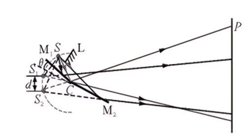
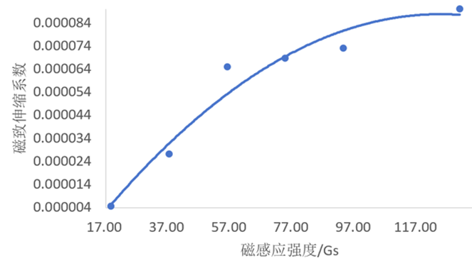

<style>
.md-typeset__scrollwrap {
  display: flex;
  justify-content: center;
}
</style>

# 菲涅尔双面镜测磁致伸缩系数实验

## 1.实验背景

磁致伸缩材料作为21世纪战略性智能材料，已经广泛应用在电声换能器技术、海洋探测与开发技术、微位移驱动等高精密技术上，与巨磁电阻、自旋阀等科学前沿热点研究联系紧密。磁致伸缩系数是磁致伸缩材料的重要性能参数之一，磁致伸缩系数越大则材料的磁致伸缩效应越强，因此，磁致伸缩系数已经成为磁致伸缩材料在实际工程应用中的重要衡量参数。

坡莫合金是一种镍铁磁性合金，镍含量约为80%，铁含量约为20%。它是贝尔电话实验室的物理学家GustavElmen在1914年发明的，以其非常高的磁导率而著称，这使得它可用作电气和电子设备的磁芯材料，也可用于屏蔽磁场的磁屏蔽。商业坡莫合金的相对磁导率通常约为100,000，而普通钢的相对磁导率为数千。除了高磁导率外，它的其他磁特性是低矫顽力、接近零磁致伸缩和显着的各向异性磁阻。低磁致伸缩对工业应用至关重要，使其可用于薄膜中，否则可变应力会导致磁性发生毁灭性的大变化。坡莫合金的电阻率可以变化多达5%，具体取决于所施加磁场的强度和方向。坡莫合金通常具有面心立方在镍浓度为80%附近，晶格常数约为0.355nm的晶体结构。坡莫合金的一个缺点是它的延展性或可加工性不强，因此需要精细形状的应用（例如磁屏蔽）由其他高磁导率合金（例如mu金属）制成。此外，它在电声换能器技术、海洋探测与开发技术、微位移驱动、减振与防振、减噪与防噪系统、智能机翼、机器人、自动化技术、燃油喷射技术、阀门、泵、波动采油等高技术领域有着广泛的应用前景。

常见微小变化量测量方法有电学和光学。其中，电学中电路设计较为复杂且元器件寿命有限,输出信号易受环境影响；传统的光杠杆法体积庞大、不易操作、测量精度只能达到0.1毫米，而利用菲涅尔双面镜干涉原理来测量，精度可达0.1微米，并结合 matlab图像处理，还可以减少手动测量误差。于是我们设计了一项利用菲涅尔双面镜测量磁致伸缩系数的实验。

## 2.实验目的

1) 理解铁磁性金属磁致伸缩系数的物理意义；
2) 了解菲涅尔双面镜干涉的形成条件及其应用；
3) 学会使用MATLAB软件进行图像处理；
4) 运用光学知识实现微小变化量测量。

## 3.实验原理

### 3.1磁致伸缩现象

磁致伸缩是一种只能在诸如铁、钴、镍及其合金等磁性材料中呈现的现象，是磁性材料的磁性与机械参数的一种相互作用，在工艺上可以通过对特殊金属合金进行适当的选择和处理，来优化该效应，并且通过建立外部感应磁场来精确的控制置于磁场中的磁性材料的磁化。磁化和铁磁体内的磁畴有关，磁畴是在磁性材料中由一组并列的磁性原子或磁性离子组成的小区域。磁畴内的磁性原子或磁性离子的磁矩方向基本上是一致的，但不同磁畴之间的磁矩方向可能不同。

当不加磁场时，磁畴内原子的磁矩方向是随机排列的。当外加磁场作用在磁性材料上时，磁场会对磁畴的排列产生影响。如果外加磁场方向与磁畴的自发磁化方向一致，磁畴会逐渐增长，合并成大的磁畴，材料的形状会发生收缩。与之相反，如果外加磁场方向与磁畴的方向相对，磁畴会逐渐缩小，分裂成小的磁畴，材料的形状会发生伸长。

磁致伸缩效应是由于磁畴排列的改变导致的材料形状的改变。通过控制外加磁场的方向和大小，可以实现对材料形状的精确控制和调节。

当不加磁场时，磁畴自发磁化方向杂乱分布，铁氧体整体磁矩为零，如图1所示。


/// caption
图1 无磁场磁畴分布图
///

加磁场后，磁畴间产生畴壁位移与转动，磁畴自发磁化方向趋于一致。如图2所示。


/// caption
图2 磁化示意图
///

达到饱和后，磁畴自发磁化方向基本一致，宏观上观察，产生了磁致伸缩，如图3所示。


/// caption
图3 饱和状态磁畴分布图
///

### 3.2菲涅尔双面镜干涉变化测磁致伸缩系数

光学原理如图4,两平面镜 M1和 M2的交角接近180°,θ角很小,S为细缝,用强烈的单色光照射,使S成为的单色光源。


/// caption
图4 菲涅尔双面镜原理图
///

当一束光分别照射到菲涅尔双面镜的两个镜面上发生反射，反射的两束光由于振动方向相同，频率相同，相位差恒定，即为相干光，这两束相干光在空间中相遇就会产生干涉现象。

已知菲涅尔双面镜干涉条纹的间距为：

$$
\Delta x = \frac {D}{d} \lambda \tag {3.2.1}
$$
其中， $D$  为虚像到光屏距离， $d$  为两虚像间距离， $\lambda$  为光源波长。因为$S_{1} C = S_{2} C = S C$ , 所以  $S_{1}, S_{2}, S$  三点在同一圆上, 圆的半径为  $r$  。令镜面与平面夹角为$\theta$ , 经相似三角形原理推断  $S_{1}, S_{2}$  对  $S$  所张的圆周角为  $\theta$ , 所以对圆心  $C$  点所张的圆心角为  $2 \theta$ , 即可得到

$$
d = 2 r \sin \theta
$$

$$
D = r \cos \theta + l \tag {3.2.2}
$$

其中， $l$  为圆心到光屏的距离。

将式（3.2.2）带入式（3.2.1）可得

$$
\Delta x = \frac {r \cos \theta + l}{2 r \sin \theta} \lambda = \left(\frac {1}{2 \tan \theta} + \frac {l}{2 r \sin \theta}\right) \lambda \tag {3.2.3}
$$

其中

$$
\sin \theta = \frac {h}{L}
$$

$$
\tan \theta = \frac {h}{y} \tag {3.2.4}
$$

$L$  为金属棒顶端到圆心的距离,  $h$  为超出平台高度,  $y$  为一个镜面的长度。

固定  $L$  与  $y$  值, 随着金属伸长,  $\theta$  逐渐增大, 干涉条纹由宽变窄, 由疏变密,条纹间距变小。可得

$$
\frac {\Delta x _ {1}}{\Delta x _ {2}} = \frac {d _ {2}}{d _ {1}} = \frac {\sin \theta_ {2}}{\sin \theta_ {1}} = \frac {h _ {2}}{h _ {1}} \tag {3.2.5}
$$

由式（3.2.5）可知

$$
\Delta h = h _ {2} - h _ {1} = h _ {1} \left(\frac {\Delta x _ {1}}{\Delta x _ {2}} - 1\right) \tag {3.2.6}
$$

对于磁致伸缩系数  $\alpha = \frac{\Delta h}{H}$  来说，由式（3.2.6）可知

$$
\alpha = \frac{h_1}{H} \left( \frac{\Delta x_1}{\Delta x_2} - 1 \right) \tag {3.2.7}
$$

$H$  为金属棒高度。由式（3.2.7）可知在固定初始高度  $h_1$  后，只需测出前后两次条纹的间距，即可得到磁致伸缩系数。

### 3.3磁感应强度的计算

假设有一个载流螺线管，导线中电流为 $I$ ，沿轴线方向单位长度的线圈匝数为  $n$  ，如图5所示。


/// caption
图5 有限长直螺线管示意图
///

其轴线上任意点形成的磁场的磁感应强度为：

$$
B = \frac {n \mu_ {0} I}{2} \left(\cos \beta_ {2} - \cos \beta_ {1}\right) \tag {3.3.1}
$$

式（3.3.1）中：

$$
\cos \beta_ {2} = \frac {(L - x)}{\sqrt {\overline {{R}} ^ {2}} + (L - x) ^ {2}} \cos \beta_ {1} = \frac {- (L - x)}{\sqrt {\overline {{R}} ^ {2}} + (L + x) ^ {2}} \tag {3.3.2}
$$

则

$$
B = \frac {n \mu_ {0} I}{2} \left(\frac {(L - x)}{\sqrt {\overline {{R}} ^ {2}} + (L - x) ^ {2}} - \frac {- (L - x)}{\sqrt {\overline {{R}} ^ {2}} + (L + x) ^ {2}}\right) \tag {3.3.3}
$$

其中， $n = 2 \times 10^{4}$ ， $\mu_{0}$  为真空磁导率（ $4\pi \times 10^{-7} \mathrm{~N} \cdot \mathrm{A}^{-2}$ ），I 为直流电，2L 为线管长度（109.5mm）， $R$  为螺线管内径（18mm）。

代入式（3.3.3），可得：

$$
B = \frac {1}{0 . 1 1 8} \int_ {- 0. 0 5 4} ^ {0. 0 5 4} \frac {\dot {\iota} \mu_ {0}}{2} \left[ \frac {(L - x)}{\sqrt {R ^ {2} + (L - x) ^ {2}}} - \frac {- (L + x)}{\sqrt {R ^ {2} + (L + x) ^ {2}}} \right] d x = 6 7. 9 4 5 \pi I (G s) \tag {3.3.4}
$$

## 4.装置设计

### 4.1方案设计


///caption
图6 实验装置实物图
///

图7为本实验的装置实物图，其中各个部件的名称如表4.1所示。

| 序号 | 1        | 2           | 3          | 4           | 5          |
| ---- | -------- | ----------- | ---------- | ----------- | ---------- |
| 名称 | 直流电源 | 支架+双面镜 | 笔记本电脑 | 激光光源    | 数码显微镜 |
| 序号 | 6        | 7           | 8          | 9           | 10         |
| 名称 | 光屏     | 支架        | 消磁器     | 螺线管+合金 | 铁架台     |

<center>表 4.1 实验装置中的各个部件</center>

实验装置包含有消磁器、激光束、自制螺线管、直流稳压电源、待测金属、定制双面镜、数码显微镜、光学平台，待测金属坡莫合金，含镍量为  $78.5\%$  — 80.5%，长度为177.74mm；螺线管铜丝直径0.5mm，螺线管单位长度匝数为$$ 2 \times 1 0 ^ 4 $$ 匝/m。

### 4.2实验器材


///caption
图6 实验器材
///

双面镜我们定制长  $10 \mathrm{~cm}$ , 宽  $8 \mathrm{~cm}$ , 厚度  $2 \mathrm{~mm}$ , 镜面光洁度  $60 / 40$  (镜面光洁度满足国家标准GB/T11646-2001）两块相同规格的前表面镀膜反射镜。其中，前表面镀膜反射镜其优点为避免产生双象，便于实验现象观察，而且60/40的光洁度既节省成本又保证干涉图像规则与清晰度。

消磁器用来对待测金属进行消磁；自制螺线管产生磁场；使用支架将光源、光屏以及数码显微镜固定；通过数码显微镜观察菲涅尔双面镜上明暗条纹的变化。

## 5.实验过程及数据处理

### 5.1实验过程

首先，将光学平台调至水平，用消磁器对待测金属进行消磁；然后，将坡莫合金放置在螺线管内并固定在光学平台上；之后，调节自制水平平台使得装置水平，将菲涅尔双面镜擦净后放置在自制水平平台上；将数码显微镜与电脑相连打开激光光源；调整激光光源和光屏高度，直至光屏中心出现明暗相间的干涉条纹；调节显微镜位置和放大倍率，直到SmartCramer上出现清晰的干涉条纹；连接直流稳压电源与螺线管，打开电源，截取0A时的干涉条纹图样；调节电源旋钮，通入0到1A的直流电，每隔0.1A截取一次干涉条纹；将得到的图片导入 MATLAB 软件中，对图形进行处理，获得金属线磁致伸缩系数等参数。重复5次实验，将数据记录到下表中；实验结束，关闭电源，整理实验器材。

### 5.2数据处理与结论

通过计算，得到了不同电流下，螺线管中的磁感应强度，如下表所示。

| 电流强度（A） | 磁感应强度（Gs） |
| ------------- | ---------------- |
| 0.1           | 18.67            |
| 0.2           | 37.34            |
| 0.3           | 56.01            |
| 0.4           | 74.68            |
| 0.5           | 93.35            |
| 0.7           | 130.69           |

<center>表5.1 不同电流下，螺线管中的磁感应强度</center>

通过测量，得到了不同电流下，坡莫合金的伸长量，并计算出了其磁致伸缩系数及平均值，如表5.2、5.3所示。得到磁感应强度与磁致伸缩系数的关系如表5.4所示。

| 电流强度(A) | 伸长量(m) |
| ----------- | --------- |
| 0.1         | 0.67×10-6 |
| 0.2         | 4.05×10-6 |
| 0.3         | 9.66×10-6 |
| 0.4         | 1.02×10-5 |
| 0.5         | 1.08×10-5 |
| 0.7         | 1.34×10-5 |

<center>表 5.2 坡莫合金伸长量实验数据</center>

| 电流强度（A） | 磁致伸缩系数（ppm） |
| ------------- | ------------------- |
| 0.1           | 4.505               |
| 0.2           | 27.186              |
| 0.3           | 64.806              |
| 0.4           | 68.684              |
| 0.5           | 72.924              |
| 0.7           | 89.974              |

<center>表 5.3 坡莫合金磁致伸缩系数实验数据</center>

| 磁感应强度 (Gs) | 磁致伸缩系数(ppm) |
| --------------- | ----------------- |
| 18.67           | 4.505             |
| 37.34           | 27.186            |
| 56.01           | 64.806            |
| 74.68           | 68.684            |
| 93.35           | 72.924            |
| 130.69          | 89.974            |

<center>表 5.4 坡莫合金磁感应强度与磁致伸缩系数的关系</center>

根据上述数据，我们绘制了坡莫合金的B-α如图7所示。



<center>图7 坡莫合金B-α曲线图</center>

通过拟合，可得坡莫合金的磁致伸缩系数 $α$ 与磁感应强度 $B$ 之间的关系式：

$$
\alpha = -7 \times 10^{-9} B^2 + 2 \times 10^{-6} B - 3 \times 10^{-5} \tag{5.2.1}
$$

结果表明：坡莫合金的磁致伸缩系数 $α$ 与磁感应强度 $B$ 呈非线性。

## 6.误差分析

### 6.1误差计算

以坡莫合金为例，当螺线管通入0.3A电流时：

A类不确定公式为：

$$
u _ {a} = \sqrt {\frac {\sum_ {i = 1} ^ {n} \left(x _ {i} - \bar {x}\right) ^ {2}}{n (n - 1)}} \tag {6.1.1}
$$

由（6.1.1）得，初始高度 $h_1$ 为 $(0.58 \pm 0.01)\,\text{mm}$，坡莫合金高度 $H$ 为 $(149.02 \pm 0.01)\,\text{mm}$，测得初条纹宽度 $\Delta x_1 = (86.5000 \pm 0.0006)\,\text{mm}$，末条纹宽度 $\Delta x_2 = (85.0833 \pm 0.0006)\,\text{mm}$。

通过计算，可得条纹变化量为：

$$
\Delta x_1 - \Delta x_2 = (1.4167 \pm 0.0006)\,\text{mm} \tag{6.1.2}
$$

对于不确定度：

$$
\alpha = \frac {\Delta h}{H} = \frac {h _ {1}}{H} \left(\frac {\Delta X _ {1}}{\Delta X _ {2}} - 1\right) \tag {6.1.3}
$$

两边取对数可得：

$$
\ln \alpha=\ln \left(\Delta x_{1}-\Delta x_{2}\right)+\ln h_{1}-\ln H-\ln \Delta x_{2} \tag {6.1.4}
$$

$$
\begin{aligned} \frac{\Delta \alpha}{\alpha} & =\sqrt{\left(\frac{\partial \alpha}{\partial\left(\Delta x_{1}-\Delta x_{2}\right)}\right)^{2}+\left(\frac{\partial \alpha}{\partial h_{1}}\right)^{2}+\left(-\frac{\partial \alpha}{\partial H}\right)^{2}+\left(-\frac{\partial \alpha}{\partial \Delta x_{2}}\right)^{2}} \\ & =\sqrt{\left(\frac{\Delta\left(\Delta x_{1}-\Delta x_{2}\right)}{\Delta x_{1}-\Delta x_{2}}\right)^{2}+\left(\frac{\Delta h_{1}}{h_{1}}\right)^{2}+\left(\frac{\Delta H}{H}\right)^{2}+\left(\frac{\Delta x_{2}}{\Delta x_{2}}\right)^{2}} \\ & =\sqrt{\left(\frac{0.0006}{0.36}\right)^{2}+\left(\frac{0.006}{0.58}\right)^{2}+\left(\frac{0.0006}{149.06}\right)^{2}+\left(\frac{0.0006}{79.14}\right)^{2}} \\ & =1.7 \% \end{aligned} \tag {6.1.5}
$$

下面两个表格分别是坡莫合金和碳素钢在不同电流下的相对不确定度。

| 电流强度 (A) | 磁致伸缩系数平均值 (ppm) | 相对不确定度 |
| ------------ | ------------------------ | ------------ |
| 18.67        | 4.505                    | 1.8%         |
| 37.34        | 27.186                   | 1.7%         |
| 56.01        | 64.806                   | 1.7%         |
| 74.68        | 68.684                   | 1.7%         |
| 93.35        | 72.924                   | 1.7%         |
| 130.69       | 89.974                   | 1.7%         |

<center>表 6.2 坡莫合金的相对不确定度</center>

### 6.2误差来源

#### 6.2.1温度

在实验过程中需要向自制螺线管通入直流电，产生磁场，同时螺线管也产生热量，由于待测金属的热胀冷缩，会影响待测金属圆柱体的伸缩量。

#### 6.2.2图像识别

菲涅尔双面镜条纹微小的不平行导致MATLAB对图像进行灰度处理时，影响条纹宽度。

## 7.实验总结与意义

### 7.1实验创新点

（1）通过合理利用光学干涉原理，我们设计并制作了一种结构简单，高精度的磁致伸缩系数测量装置；自制机械结构，可以测量不同长度，不同材料的磁致伸缩系数。

（2）我们对传统微小测量方法的进行了改进，采用菲涅尔双面镜干涉原理进行测量，并使用MATLAB处理图像，进而得到更加精确的铁磁性金属的磁致伸缩系数。

### 7.2实验总结

（1）通过实验发现，磁致伸缩系数不是常数，而是会随磁场的变化而变化；坡莫合金、碳素钢等铁磁材料的磁致伸缩系数在相同条件下，会随磁场的变化趋于不同。

（2）用机械固定的方法得到干涉条纹再进行图像处理的方式能减少人工测量的手动误差，不易受到外界环境的影响，从而使得测量过程更稳定，测量结果更可靠。

（3）该实验装置结构简单、精度高、操作方便，可迅速测出样品的磁致伸缩系数。

### 7.3实验意义

（1）在教育教学上

- 帮助学生进一步理解菲涅尔干涉及金属伸缩系数物理意义对于现有教学实验装置的有益补充。

（2）在科研研究上

- 运用充实的物理原理和专业化的科研软件，提高学生的科研能力。

（3）在工厂生产上

- 实验设备高精度且低成本操作简单的特性非常适合工程生产上的使用。

## 附录

### 1.仪器说明

#### (1) 重量

<center>表 1: 实验作品所使用器材的重量</center>

| 器材名称             | 重量(kg) |
| -------------------- | -------- |
| 万向支架             | 0.460    |
| 光屏                 | 0.205    |
| 数码显微镜（含支架） | 0.075    |
| 铁架台               | 0.885    |
| 亚克力支撑壳         | 0.370    |
| 直流稳压电源         | 8.000    |
| 消磁器               | 1.060    |
| 激光笔               | 0.055    |
| 坡莫合金             | 0.150    |
| 菲涅尔双面镜（两个） | 0.180    |
| 作品总重量           | 11.545   |

#### （2）尺寸

<center>表 2: 实验作品所使用器材的尺寸</center>

| 器材名称           | 尺寸（cm）                 |
| ------------------ | -------------------------- |
| 亚克力支撑壳       | 长：16 宽：10 高：15.6     |
| 铁架台             | 长：21 宽：13.5 高：40     |
| 菲涅尔双面镜       | 长：10 宽：8               |
| 金属棒（坡莫合金） | 长：14.5 外径：1.2         |
| 激光笔             | 高：10.5                   |
| 支架               | 高：72                     |
| 数码显微镜         | 高：13                     |
| 直流稳压电源       | 长:40.0 宽:14.2 高:15.0    |
| 消磁器             | 长:16.2 宽:8.6 高:9.2      |
| 螺线管             | 高:14.8 内径:1.25 外径:2.3 |
| 作品总高度         | 79                         |

#### （3）成本

<center>表 3: 实验作品所使用器材的成本</center>

| 器材名称         | 成本价格（元） |
| ---------------- | -------------- |
| 定制菲涅尔双面镜 | 180            |
| 激光笔           | 25             |
| 数码显微镜       | 179            |
| 亚克力支撑壳     | 34             |
| 支架             | 58             |
| 合计             | 476            |

### 2.MATLAB处理主要程序

```matlab
%定义h1为超出平台高度
%定义L为合金长度
h1=7.72e-3;
L=0.14901;
%弹出窗口并导入图片
[filename,pathname]=uigetfile('*.jpg','导入data','MultiSelect','on');
% %保存文件的主名
% [path,name,ext]=fileparts(filename);
% A_array = str2double(name);%电流大小
% A_array = flip(A_array);%倒序处理
% %定义导入图片数量
N=size(filename,2);
% 初始化数组来保存计算结果
x_array = []; %x为电流下的条纹间距
x_array1 = [];
% 循环计算并保存结果到数组中
for n = 1:N    %条纹间距的循环
    %导入图片数据
    data = imread(fullfile(pathname,filename{n}));
    % 将图像转换为灰度图
    G1= rgb2gray(data);
    % 使用高斯滤波去噪
    filtered_img = imgaussfilt(G1, 2);
    filtered_img1 = mean(filtered_img,2);
    Fy = gradient(filtered_img1);
    threshold = mean(filtered_img1); %中心值
    % figure,plot(1:length(filtered_img1),filtered_img1); %图像的亮度分布区间
    bright = [];
    dark = [];
    bright_locs = [];
    dark_locs = [];
    for i = 1:length(filtered_img1)
         %删除峰值在下方的
        if filtered_img1(i) >= threshold
            bright(i) = filtered_img1(i);
             bright_locs(i) = i;
        end
    %删除峰谷在上方的
        if filtered_img1(i) <= threshold
            dark(i) = filtered_img1(i);
            dark_locs(i) = i;
        end
    end
    bright(bright == 0) = [];
    dark(dark == 0) = [];

    point_bright = [];
    point_dark = [];
    for i = 1:length(bright_locs)-1
        a1 = abs(bright_locs(i)-bright_locs(i+1));
        if a1>1
            point_bright(i) = bright_locs(i)+bright_locs(i+1);
        end
    end
    for i = 1:length(dark_locs)-1
        a2 = abs(dark_locs(i)-dark_locs(i+1));
        if a2>1
            point_dark(i) = dark_locs(i)+dark_locs(i+1);
        end
    end

    point_bright(point_bright==0)=[];
    b1=point_bright(1);
    %判定第一个点处于上升还是下降
    if Fy(b1) <= 0
        point_bright(1) = [];
    end

    point_dark(point_dark==0)=[];
    b2=point_dark(1);
    if Fy(b2) >= 0 
        point_dark(1) = [];
    end
    if mod(length(point_bright), 2) ~= 0
        % 删除最后一个元素
        point_bright(end) = [];
    end
    if mod(length(point_dark),2) ~= 0 
        point_dark(end) = [];
    end
    array_bright = [];
    array_dark = [];
    for  i = 1:2:length(point_bright)
        array_bright(i,:) = [point_bright(i),point_bright(i+1)]; 
    end
    for i = 1:2:length(point_dark)
        array_dark(i,:) = [point_dark(i),point_dark(i+1)];
    end
    % 删除值全为零的行
    array_bright(any(array_bright, 2) == 0, :) = [];
    array_dark(any(array_dark,2) == 0,:) = []; 
    % 初始化结果
    max_values = zeros(size(array_bright, 1), 1);
    max_indices = zeros(size(array_bright, 1), 1);
    min_values = zeros(size(array_dark,1),1);
    min_indices = zeros(size(array_dark,1),1);

% 在每个不规则区间内寻找最大值
for i = 1:size(array_bright, 1)
    start_point = array_bright(i, 1);
    end_point = array_bright(i, 2);
    
    % 提取区间内的数据
    y_segment = filtered_img1(start_point:end_point);
    
    % 计算区间内的最大值及其索引
    [max_values(i), max_idx] = max(y_segment);
    
    % 记录最大值的对应位置
    max_indices(i) = start_point + max_idx - 1; % 计算全局索引
    end
    
    for i = 1:size(array_dark,1)
        start_point = array_dark(i,1);
        end_point = array_dark(i,2);
        y_segment = filtered_img1(start_point:end_point);
        [min_values(i),min_idx] = min(y_segment);
        min_indices(i) = start_point + min_idx -1;
    end
    
    line_bright = [];
    line_dark = [];
    for i = 1:length(max_indices)-1
        line_bright(i) = max_indices(i+1)-max_indices(i);
    end
    for i = 1:length(min_indices)-1
        line_dark(i) = min_indices(i+1)-min_indices(i);
    end
    distances = [line_bright,line_dark];
    mean_distances = mean(distances); %平均条纹间距
    x_array(n) = mean_distances;
    CCD=1/30000;    %像元尺寸
    DeltxL=CCD*mean_distances;
    x_array1(n) = DeltxL; 
end
x = mean(x_array);
    x1 = mean(x_array1);
    % 输出平均间距
disp(['平均条纹间距: ', num2str(x), ' 像素']);
disp(['平均条纹间距: ', num2str(x1), ' 米']);
x_array = x_array';

% 依据公式计算x_array数组中不同电流下的高度差，并保存到另一个数组中
    pm_array=zeros(1, length(x_array)); % 初始化保存差异的数组

for i = 1:length(x_array)
     % 计算不同电流下的伸缩长度
    difference_h = h1*(x_array(1)/x_array(i) - 1);%h1是超出平台的高度
       %计算伸缩系数
        pm=difference_h/L; %difference_h为伸缩长度，L为合金长度
      % 将伸缩系数保存到数组中
    pm_array(i) = pm;
end
figure(1)
plot(A_array,pm_array);
title('基于菲涅尔双面镜测磁致伸缩系数');
xlabel('电流大小/A');
ylabel('磁致伸缩系数');
```

### 3. 参考文献

[1]周淑娴.光学演示实验研究——菲涅耳双面镜干涉[J].赤峰学院学报（自然科学版）, 2010(010):026.

[2] 秦德辰, 李雪薇, 刘奇等. 自组装置实现电阻应变法测量磁致伸缩系数[J]. 物理与工程, 2022, 32, 122-126.

[3] 金远伟, 赵斌, 吴庆春. 单缝衍射法测量磁致伸缩系数[J]. 大学物理实验, 2023, 36, 5-9. 

[4] 贾振元，王福吉，张菊，郭丽莎. 超磁致伸缩执行器磁滞非线性建 模与控制[J].《机械工程学报》, 2005, 41, 131-135.

[5] 吴庆春，丁鸣．劈尖干涉法测量磁致伸缩系数［Ｊ］．南 京 工 程学院学报（自然科学版），２０１５，３（１）：３２－３５．

[6] 陈白宁, 陈洁, 周卓. 超磁致伸缩材料的性能测试及应用[J]. 金属功能材料, 2014, 21, 44-47.

[7] 朱军, 余晋岳, 张宏. 薄膜磁致伸缩系数λ_s的简易测量[J]. 磁性材料及器件, 1999, 30, 24-26.

[8] Abdulkadirova N, Gamzatov A, Kamilov K, et al. Magnetostriction and magnetocaloric properties of LaFe11.1Mn0.1Co0.7Si1.1 alloy: Direct and indirect measurements[J]. Journal of Alloys and Compunds, 2022, 929, 167348.

[9] Stefan S, Chisato K, Koji F, et al. Establishment of the standard method of magnetostriction measurement of grain-oriented electrical steel strip and sheet[J]. Journal of Magnetism and Magnetic Materials, 2023, 565, 170295.