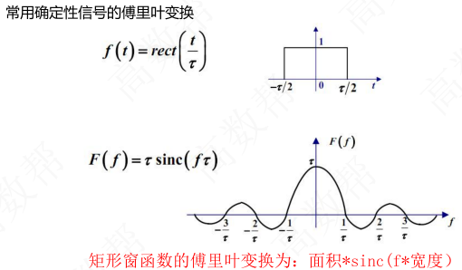
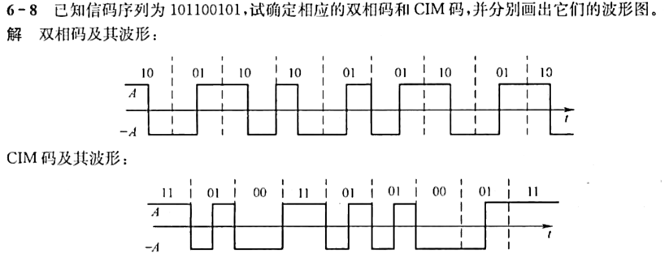
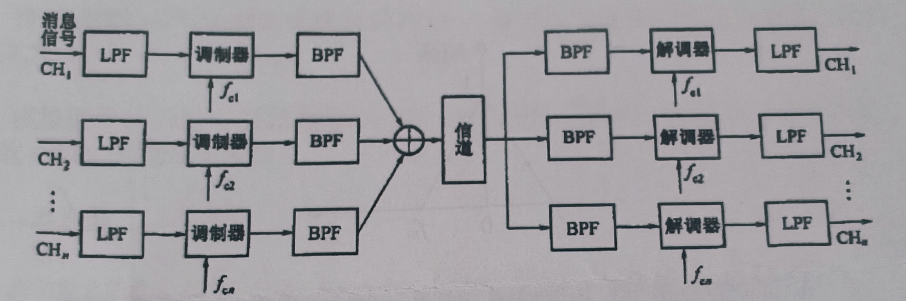
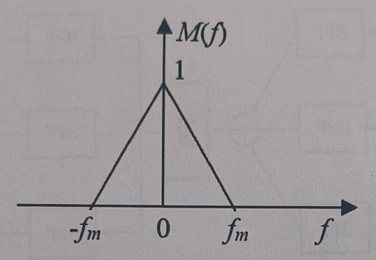
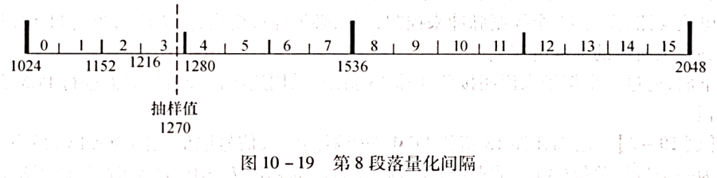
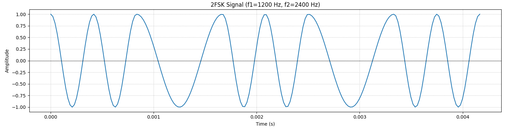
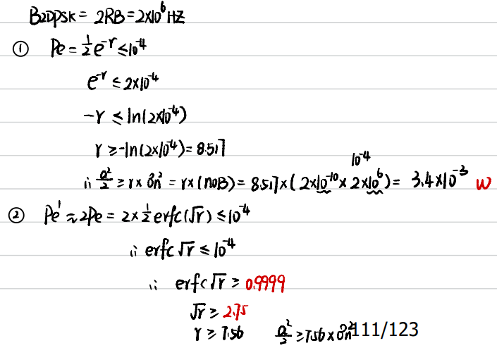
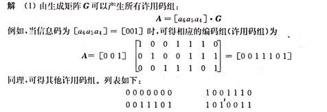
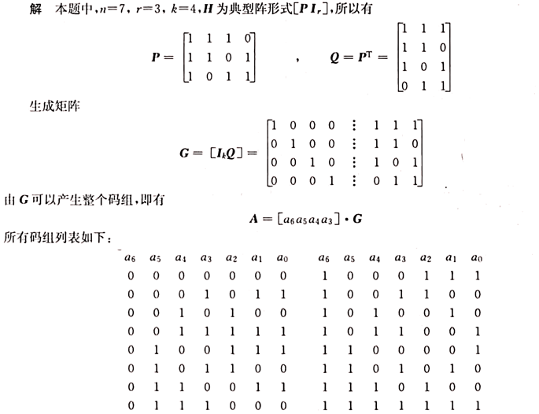

# 通信原理学习笔记

《通信原理》是通信工程、电子信息工程、自动化、轨道交通信号与控制等相关专业的一门核心专业基础课程，旨在系统介绍现代通信系统的基本理论、关键技术与分析方法。

课程主要内容包括：通信系统的基本组成与分类（模拟通信与数字通信）、信号与频谱分析、随机过程基础、信道模型与特性（如AWGN信道、衰落信道）、模拟调制技术（AM、FM、PM）、数字基带传输（码型、码间串扰、眼图、均衡）、数字频带调制（ASK、FSK、PSK、QAM）、同步技术、差错控制编码基础，以及信息论初步（如信息量、信源熵、信道容量）等。

通过本课程的学习，学生能够理解信息从发送端到接收端的完整传输过程，掌握调制解调、抗噪声、频谱效率等核心概念，具备分析和设计基本通信系统的能力，为后续学习移动通信、光纤通信、信号与系统、数字信号处理等课程奠定坚实的理论基础。

| 章节                 | 重要程度                        | 题型            | 考点                                             |
| ----------- | ----- | ---------------- | --------------------------- |
| 第一课：绪论         | $\star \star \star$      | 选择题$/$计算题 | 信息及其度量、有效性和可靠性                     |
| 第二课：确知信号      | $\star \star \star \star \star$ | 填空题$/$计算题 | 能量谱和功率谱、自相关函数、互相关函数      |
| 第三课：随机过程      | $\star \star \star$             | 选择题$/$分析题 | 狭义平稳和广义平稳、高斯随机过程一维概率密度函数 |
| 第四课：信道         | $\star \star \star \star$       | 分析题$/$计算题 | 恒参$/$随参信道对信号的影响、信道容量            |
| 第五课：模拟调制系统  | $\star \star \star \star \star$ | 填空题$/$计算题 | 幅度调制、角度调制、功率和带宽的计算             |
| 第六课 : 数字信带传输系统    |$\star \star \star \star \star$| 分析题/计算题 | 无码间干找、码型转换、最佳判决门限和误码率计算       |
| 第七课 : 数字带通传输系统 &新型数字带通调制技术 |$\star \star \star \star \star$| 填空题/计算题 | 二进制数字调制、正交振幅调制、带宽和频带利用率的计算 |
| 第八课 : 数字信号最佳接收   | $\star \star$       | 选择题/分析题 | 最佳接收结构、最佳接收原则 |
| 第九课 : 信源编码    |$\star \star \star$| 填空题/计算题 | 抽样定理、量化信噪比  |
| 第十课 : 差错控制编码   |$\star \star \star$| 填空题/计算题 | 监督矩阵、生成矩阵 |

## 离散消息的信息量

设某离散消息 $x$ 发生的概率为 $P(x)$, 则它所携带的信息量为

$\begin{gathered} I=\log _{a} \frac{1}{p(x)}=-\log _{a} P(x) \end{gathered}$

信息量的单位与对数的底 $a$ 有关: $a=\mathrm{e}$ 时, 单位为奈特 (nit); $a=10$ 时，单位为哈特莱 (Hartly); $a=2$ 时, 单位为比特(bit, 简记为 b), 此时有

$\begin{gathered} I=\log _{2} \frac{1}{p(x)}=-\log _{2} P(x)(\mathrm{bit}) \end{gathered}$

对于等概信源, 二进制的每个码元含 $1 \mathrm{bit}$ 的信息量, $M$ 进制的每个码元含有 $\log 2 M \mathrm{bit}$, 这是因为每个 $M$ 进制波形可用 $\log 2 M$ 个二进制码元表示。

**离散消息的平均信息量**

设离散信源为:
$\left(\begin{array}{ccccc}x_{1} & x_{2} & \cdots \cdots & x_{m} \\P\left(x_{1}\right) & P\left(x_{2}\right) & \cdots \cdots & P\left(x_{m}\right)\end{array}\right)=1 \text { 且 }, \sum_{i=1}^{M} P(x i)$

则该信源中每个符号所含的平均信息量(又称熵)为:

$H(x)=\sum_{i=1}^{M} P(x i) \log _{2} P(x i)(\mathrm{~b/} \text { 符号 })$

熵的意义:表示信源的不确定性。当每个符号等概率 $(P(z) = 1 / M)$ 独立出现时,不确定性最大,此时的熵有最大值。即

$H_{\text {max }}=\log _{2} M(\mathrm{~b} / \text { 符号 })$

## 信息速率与传码率的关系

### （1）信息速率与传码率的关系

- **传码率（波特率）**$R_B$：单位时间传输的码元数，单位为 **Baud**（波特）。
- **信息速率（比特率）**$R_b$：单位时间传输的信息量，单位为 **bit/s**。
- **进制数 M**：对于 M 进制系统，每个码元携带的信息量为 $\log_2 M$（bit / 码元）。
- **公式推导**： 总信息量 = 码元数 $\times$ 每个码元信息量，因此：$R_b = R_B \cdot \log_2 M$ （例如：八进制 $M=8$，每个码元含 $3\ \text{bit}$，故 $R_b = 3R_B$）二进制中，$R_b$与$R_B$相等。

### （2）误码率 $P_e$ 的定义

- **物理意义**：传输过程中错误码元数占总码元数的比例，反映系统可靠性。
- **公式**：$P_e = \frac{\text{错误码元数 } N_e}{\text{总码元数 } N}$ （若为误比特率 $P_b$，则分母为总比特数，但本题是误码率，直接统计码元错误）

## 确知信号

$\begin{aligned}& \text{能量信号：能量有限（一般为有限长信号）} E = \int s^2(t) \, dt \\& \text{能量谱密度：由（Parseval）定理得 } E = \int_{-\infty}^{\infty} s^2(t) \, dt = \int_{-\infty}^{\infty} |S(f)|^2 \, df \\& |S(f)|^2 \text{ 称为能量谱密度，可看作单位频带内的信号能量} \\& \text{能量信号的频谱密度：} S(\omega) = \int_{-\infty}^{\infty} s(t) e^{-j\omega t} \, dt\end{aligned}$

功率信号：功率有限（一般为周期信号）

$\begin{aligned} 
& P = \lim_{T \to \infty} \frac{1}{T} \int_{-T/2}^{T/2} \left| S_f(f) \right|^2 df = \int_{-\infty}^{\infty} P(f) df \\
& \text{功率谱密度：} \quad P(f) = \lim_{T \to \infty} \frac{1}{T} \left| S_T(f) \right|^2 \\
& \text{功率信号的频谱：} \quad C(jn\omega_0) = \frac{1}{T_0} \int_{-T_0/2}^{T_0/2} s(t) e^{-jn\omega_0 t} dt 
\end{aligned}$




## 平稳过程的自相关函数

### 1. 自相关函数的定义

- **公式**：$R(\tau) = E[\xi(t) \cdot \xi(t + \tau)]$
  - 其中 $\xi(t)$ 是平稳随机过程（统计特性不随时间变化），$\tau$ 是时间差，$E[\cdot]$ 表示期望（平均值）。
- **物理意义**：
  - 自相关函数衡量信号在不同时刻的“相似性”。例如：
    - 当 $\tau = 0$ 时，$R(0) = E[\xi^2(t)]$，表示信号与其自身的相关性（最强）。
    - 当 $\tau$ 很大时（如 $\tau \to \infty$），信号在 $t$ 和 $t+\tau$ 时刻的值可能不相关（$R(\tau)$ 很小）。
- **通俗理解**：
  - 想象一段音乐波形：自相关函数告诉你，如果现在有一个音符，你能多好地预测几秒后的音符。如果波形重复（如鼓点节奏），$\tau$ 为节拍间隔时 $R(\tau)$ 会很大；如果杂乱无章（如噪声），$R(\tau)$ 会快速衰减。

### 2. 自相关函数的性质与物理量解析

**(1) $R(0) = E[\xi^2(t)]$ → ξ(t) 的平均功率**

- **物理量**：
  - $E[\xi^2(t)]$：随机过程的**平均功率**（单位时间内的平均能量）。
- **为什么是平均功率？**
  - 在信号处理中，任何信号 $\xi(t)$ 的功率定义为 $\xi^2(t)$ 的长期平均值（类似电器功耗的计算）。
  - 例如：如果 $\xi(t)$ 是电压信号，则 $E[\xi^2(t)]$ 表示负载电阻上的平均功率。
- **关键点**：
  - 对平稳过程，$R(0)$ 是常数（不依赖 $t$），且直接给出总功率。

**(2) $R(\tau) = R(-\tau)$ → τ 的偶函数**

- **物理意义**：
  - 自相关函数是**偶函数**，即关于 $\tau = 0$ 对称。
- **通俗理解**：
  - 信号在“向前 $\tau$ 秒”和“向后 $\tau$ 秒”的相关性相同。例如：
    - 录音中，向前 2 秒和向后 2 秒的波形相似性一致（平稳过程的特性）。
- **应用**：简化计算，只需分析 $\tau \geq 0$ 的部分。

**(3) $|R(\tau)| \leq R(0)$ → R(τ) 的上界**

- **公式修正**：$|R(\tau)| \leq R(0)$
- **物理意义**：
  - 自相关函数在 $\tau = 0$ 处取最大值，且 $|R(\tau)|$ 不会超过 $R(0)$。
- **通俗理解**：
  - 信号与自身的相关性（$\tau=0$）总是最强；时间差越大，相关性越弱（类似“远亲不如近邻”）。
  - 例如：天气预报中，今天的温度与明天相关性高（$R(1)$ 较大），但与下个月相关性低（$R(30)$ 较小），且永远不会超过今天与自身的相关性。

**(4) $R(\infty) = [E\xi(t)]^2$ → ξ(t) 的直流功率**

- **物理量**：
  - $[E\xi(t)]^2$：随机过程的**直流功率**（恒定分量的功率）。
- **为什么？**
  - 当 $\tau \to \infty$，信号在 $t$ 和 $t+\tau$ 时刻的值不再相关（假设过程是“混合”的），因此 $R(\infty) = E[\xi(t)] \cdot E[\xi(t+\tau)] = [E\xi(t)]^2$（因平稳性，均值恒定）。
  - 直流功率对应信号中不随时间变化的“背景值”。
- **例子**：
  - 若 $\xi(t)$ 是交流电信号，直流功率是电压均值的平方（如电池的恒定输出）；若**均值** $E\xi(t) = 0$（如中心化的噪声），则直流功率为 0。

**(5) $R(0) - R(\infty) = \sigma^2$ → ξ(t) 的交流功率**

- **物理量**：
  - $\sigma^2$：方差，表示随机过程的**交流功率**（波动分量的功率）。
- **为什么？**
  - 总功率 $E[\xi^2(t)] = R(0)$。
  - 由概率论：$\text{Var}[\xi(t)] = E[\xi^2(t)] - [E\xi(t)]^2 = R(0) - R(\infty)$。
  - 因此，$\sigma^2$ 是信号波动部分（去除直流后）的平均功率。
- **通俗理解**：
  - 总功率 = 直流功率（恒定部分）+ 交流功率（波动部分）。
  - 例如：灯泡的总亮度（总功率）= 基础亮度（直流）+ 闪烁强度（交流）。方差 $\sigma^2$ 越大，信号波动越剧烈。

**(6) 当均值为 0 时，$R(0) = \sigma^2$**

- **公式**：若 $E\xi(t) = 0$，则 $R(0) = \sigma^2$。
- **物理意义**：
  - 均值 $E\xi(t) = 0$ 时，直流功率 $R(\infty) = 0$，因此总功率 $R(0)$ 完全等于交流功率 $\sigma^2$。

### 3.广义平稳随机过程的性质

$\begin{aligned}& E[X(t)]=m_{X}=\text { 常数 } \\& D[X(t)]=E\{\left.X(t)-E[X(t)\right]\}^{2}=\sigma_{X}^{2}=\text { 常数 } \\& R_{X}\left(t_{1}, t_{2}\right)=R_{X}\left(t_{1}-t_{2}\right)=R_{X}(\tau) \quad \tau=t_{1}-t_{2}\end{aligned}$

## 高斯随机变量与概率密度函数

### （1）高斯随机变量的定义

- 若随机变量 X 的概率密度函数满足：$f_X(x) = \frac{1}{\sigma \sqrt{2\pi}} \exp\left[ -\frac{(x - \mu)^2}{2\sigma^2} \right]$ 则称 X 服从均值为 $\mu$、方差为 $\sigma^2$ 的正态分布（高斯分布），记为 $X \sim \mathcal{N}(\mu, \sigma^2)$。

### （2）线性变换下正态分布的不变性

- **性质**：若 $X \sim \mathcal{N}(\mu_X, \sigma_X^2)$，则对任意常数 $a \neq 0$、b，线性变换 $Y = aX + b$ 后的 Y 仍服从正态分布，且：$Y \sim \mathcal{N}(a\mu_X + b, (a\sigma_X)^2)$

- 推导逻辑：

  可通过 “分布函数法” 或 “特征函数法” 证明：

  - 分布函数法：先求 Y 的分布函数 $F_Y(y) = P(Y \leq y) = P(aX + b \leq y)$，再对 y 求导得概率密度。
  - 特征函数法：正态分布的特征函数为 $\phi_X(\omega) = \exp\left( j\mu\omega - \frac{1}{2}\sigma^2\omega^2 \right)$，线性变换后特征函数为 $\phi_Y(\omega) = \exp\left( j(a\mu + b)\omega - \frac{1}{2}(a\sigma)^2\omega^2 \right)$，对应正态分布。

### （3）期望与方差的线性性质

- **期望的线性性**：对任意常数 $a, b$，有 $E[aX + b] = aE[X] + b$。
- **方差的性质**：对任意常数 $a, b$，有 $\text{Var}(aX + b) = a^2 \text{Var}(X)$（因常数的方差为 0，且 $\text{Var}(aX) = a^2 \text{Var}(X)$ ）。

## 随机信号的功率谱

### （1）随机信号通过线性系统的功率谱关系

- **公式**：若输入随机信号的功率谱密度为 $P_n(f)$，线性系统的频率响应幅度为 $|H(f)|$，则输出信号的功率谱密度为：$P_o(f) = P_n(f) \cdot |H(f)|^2$
- **物理意义**：线性系统对输入信号的功率谱进行 “滤波”—— 仅允许与系统频响匹配的频率分量通过，且功率按 $|H(f)|^2$ 缩放。

### （2）平均功率与功率谱密度的关系

- **公式**：随机信号的平均功率等于其功率谱密度在全频域的积分：$P = \int_{-\infty}^{\infty} P(f) \, df$
- **推导逻辑**：功率谱密度是 “单位频率的功率”，对频率积分相当于 “累加所有频率点的功率”，最终得到总平均功率。

### （3）白噪声的功率谱特性

- **定义**：白噪声是一种理想随机信号，其功率谱密度在全频域（$-\infty < f < \infty$）内为常数，即 $P_n(f) = n_0/2$（双边谱，$n_0$ 为单边谱密度）。
- 白噪声的功率谱密度 $P_n(f)$ 在全频域平坦，通过带通滤波器后，噪声功率等于 $P_n(f)$ 乘以滤波器带宽 B（即信号带宽）。
- **工程意义**：实际噪声（如热噪声）在一定带宽内可近似为白噪声，简化分析。

### （4）低通滤波器的频响特性

- **幅频特性**：如习题第1章-第3章中第9题中，滤波器在通带 $[-2\ \text{kHz}, 2\ \text{kHz}]$ 内增益为 4，阻带增益为 0，在 $f \in [-2\ \text{kHz}, 2\ \text{kHz}]$ 内，$|H(f)| = 4$；其余频率 $|H(f)| = 0$。属于理想低通滤波器（实际滤波器存在过渡带，本题简化为理想情况）。

## 频谱调制

### 1. 调制带宽的本质

调制的作用是将基带信号（调制信号）的频谱搬移到载波频率附近，带宽由**频谱搬移后的边带宽度**决定。设调制信号为 $m(t)$，载波为 $c(t) = A_c\cos(\omega_c t)$，不同调制方式的频谱特性差异导致带宽不同。

### 2. 各调制方式的带宽公式

- **AM 调制**： AM 信号表达式：$s_{\text{AM}}(t) = [A_c + m(t)]\cos(\omega_c t)$ 频谱包含载波 $A_c\delta(f \pm f_c)$ 和边带 $\frac{1}{2}M(f \pm f_c)$（$M(f)$ 是 $m(t)$ 的频谱）。 因 $m(t)$ 最高频率 $f_{\text{H}}$，边带宽度为 $f_{\text{H}}$，总带宽：$B_{\text{AM}} = 2f_{\text{H}}$
- **DSB 调制**： DSB 信号表达式：$s_{\text{DSB}}(t) = m(t)\cos(\omega_c t)$ 频谱仅包含边带 $\frac{1}{2}M(f \pm f_c)$（抑制载波），边带宽度 $f_{\text{H}}$，总带宽：$B_{\text{DSB}} = 2f_{\text{H}}$
- **SSB 调制**： SSB 信号通过滤波或相移法抑制一个边带，仅保留上边带（$f_c \sim f_c+f_{\text{H}}$）或下边带（$f_c-f_{\text{H}} \sim f_c$），带宽：$B_{\text{SSB}} = f_{\text{H}}$

  关键区别：边带数量

- AM、DSB 保留**两个边带**，带宽由两个边带的总宽度决定（$2f_{\text{H}}$ ）；
- SSB 仅保留**一个边带**，带宽等于单个边带的宽度（$f_{\text{H}}$ ）。

## 希尔伯特变换

### （1）希尔伯特变换的定义

希尔伯特变换是一种线性变换，对信号 $m(t)$ 的希尔伯特变换定义为：$\hat{m}(t) = \mathcal{H}\{m(t)\} = \frac{1}{\pi} \int_{-\infty}^{\infty} \frac{m(\tau)}{t - \tau} d\tau$ 其本质是对信号进行 $90^\circ$ 相移（所有正频率分量滞后 $\frac{\pi}{2}$，负频率分量超前 $\frac{\pi}{2}$ ，但实际工程中常简化为 “正频率分量相位滞后 $\frac{\pi}{2}$” ）。

### （2）正弦信号的希尔伯特变换特性

对于单频正弦信号 $m(t) = A\sin(\omega t + \varphi)$ 或 $m(t) = A\cos(\omega t + \varphi)$，希尔伯特变换有简洁的相位偏移规律：

- 若 $m(t) = A\sin(\omega t + \varphi)$，则 $\mathcal{H}\{m(t)\} = A\sin\left(\omega t + \varphi - \frac{\pi}{2}\right) = -A\cos\left(\omega t + \varphi\right)$
- 若 $m(t) = A\cos(\omega t + \varphi)$，则 $\mathcal{H}\{m(t)\} = A\cos\left(\omega t + \varphi - \frac{\pi}{2}\right) = A\sin\left(\omega t + \varphi\right)$

希尔伯特变换对正弦信号实现精确的 $90^\circ$ 相移，这是通信中 “单边带调制（SSB）”“解析信号” 等应用的基础。

### （3）解析信号与希尔伯特变换的关系

希尔伯特变换常用来构造**解析信号** $z(t) = m(t) + j\hat{m}(t)$，其频谱仅包含正频率分量（负频率分量被抵消），可用于简化调制、滤波等处理。

## 调频（FM）

### 1. 调频（FM）的基本原理

- FM 是角度调制的一种，瞬时频率随调制信号线性变化，表达式为：$s(t) = A \cos\left(2\pi f_c t + k_f \int m(t) \, dt\right)$ 其中，$k_f$ 为调频灵敏度（rad/(s・V)），$m(t)$ 为调制信号。瞬时相位的可变部分（不含载波相位）为：$\Delta\varphi(t) = k_f \int m(t)$
- 为得到调制信号 $m(t)$，需对 $\Delta\varphi(t)$ 求导（因积分与求导互为逆运算）：$\frac{d}{dt}[\Delta\varphi(t)] = \frac{d}{dt}\left[k_f \int m(t) \, dt\right] = k_f m(t)$

### 2. 关键参数定义与公式

- **瞬时角频率**：$\omega(t) = 2\pi f_c + k_f m(t)$，体现调制信号对频率的直接影响。
- **最大角频偏**：$\Delta\omega_{\text{max}} = k_f \cdot |m(t)|_{\text{max}}$，反映频率偏移的最大值，本题中通过相位导数间接推导。
- **调频指数**：定义为最大相位偏移或最大频率偏移与调制信号频率之比，$m_f = \frac{\Delta\omega_{\text{max}}}{\omega_m} = \frac{k_f \cdot |m(t)|_{\text{max}}}{\omega_m}$，表示最大相位偏移（$\Delta\varphi_{\text{max}} = m_f$）。

## A律13折线编码

### 1. A 律 13 折线编码的原理

A 律 13 折线是脉冲编码调制（PCM）中常用的非均匀量化方法，通过分段线性化近似对数压缩特性，将输入信号的动态范围划分为多个段落，对小信号采用细量化、大信号采用粗量化，以改善小信号的量化信噪比。

### 2. 8 位二进制编码的结构

A 律 13 折线的 8 位编码格式为：**1 位符号位 + 3 位段落码 + 4 位段内码**，具体说明如下：

| 编码位    | 含义                                                     | 取值范围                    |
| --------- | -------------------------------------------------------- | --------------------------- |
| 第 1 位   | 符号位（表示信号正负）                                   | 0（负）/ 1（正）            |
| 第 2-4 位 | 段落码（确定信号所在的段落，共 8 个段落）                | 000~111（对应 8 个段落）    |
| 第 5-8 位 | 段内码（确定段落内的量化电平，每个段落分为 16 个量化级） | 0000~1111（对应 16 个等级） |

- **段落划分逻辑**： 对正半轴信号，按对数规律划分为 7 个段落（负半轴对称），加上原点附近的第 1 段（段 0 和 1 斜率相同合并，正负半轴小信号段合并为 1 条直线，共 13 条折线）。段落码 3 位可表示 $2^3 = 8$ 个段落，覆盖正负半轴的所有分段。

  以最小量化间隔 Δ=1为单位，正半轴段落参数：

  | 段落号 | 起始点 | 结束点 | 步长 | 段内间隔数 | 段落码 |
  | ------ | ------ | ------ | ---- | ---------- | ------ |
  | 0      | 0      | 16     | 1    | 16         | 000    |
  | 1      | 16     | 32     | 1    | 16         | 001    |
  | 2      | 32     | 64     | 2    | 16         | 010    |
  | 3      | 64     | 128    | 4    | 16         | 011    |
  | 4      | 128    | 256    | 8    | 16         | 100    |
  | 5      | 256    | 512    | 16   | 16         | 101    |
  | 6      | 512    | 1024   | 32   | 16         | 110    |
  | 7      | 1024   | 2048   | 64   | 16         | 111    |

- **段内量化**： 每个段落等分为 16 个量化级，4 位段内码可表示 $2^4 = 16$ 个等级，确定具体量化电平。

- **译码电平**：取量化间隔中点，需要结合极性。

- **量化误差**：∣输入值−译码电平∣。最大误差小于步长一半（因取中点）。

### 3. 8 位编码的数学意义

- 总量化电平数：$2 \times 8 \times 16 = 256$ 级（正负半轴各 8 段落 ×16 级），对应 $2^8 = 256$，故需 8 位编码。
- 编码与量化间隔的关系：
  - 段落码决定量化间隔的倍数（大段落对应大间隔，小段落对应小间隔）；
  - 段内码在段落内均匀划分量化级，例如第 1 段（小信号区）的量化间隔最小，第 8 段（大信号区）的间隔最大，实现非均匀量化。

### 4. 与均匀量化的对比

- 均匀量化：若量化电平数为 256，需 8 位编码，但所有区间量化间隔相同；
- A 律 13 折线：8 位编码结合非均匀分段，用更少的位数实现对小信号的精细量化，等效提升小信号的量化信噪比。

## 横向滤波器

### 1. 横向滤波器（Transversal Filter）

- **定义**：一种由抽头延迟线、乘法器和加法器组成的线性滤波器，通过加权求和处理输入信号，常用于信号均衡、信道补偿等场景。
- **结构特点**：包含 $2N+1$ 个抽头，每个抽头对应一个延迟单元和系数 $C_n$。

### 2. 均衡器的基本原理

- **目的**：补偿信道失真，减少码间串扰（ISI），使输出信号更接近原始信号。
- **工作机制**：通过调整滤波器系数，对输入信号的不同延迟分量进行加权，抵消信道引起的波形展宽。

### 3. 卷积与滤波器输出的关系

横向滤波器的输出本质是输入信号与滤波器系数的**离散卷积**，即：$y(k) = x(k) * h(k) = \sum_{n=-\infty}^{\infty} x(n) \cdot h(k-n)$ 其中 $h(k) = \{C_{-1}, C_0, C_{+1}\}$ 为滤波器的单位冲激响应。如果输入信号有限长，卷积计算简化为有限项求和。每个系数 $C_n$ 对应延迟 n 个时间点的输入，计算 $y_k$ 时，输入的时间点是 $k-n$。

### 4. 码间串扰（ISI）与均衡的意义

- **码间串扰**：由于信道带宽限制，当前码元的波形会扩散到相邻码元周期，导致抽样点信号叠加干扰。
- **均衡作用**：通过滤波器设计，使目标抽样点的信号能量最大化，非目标点的干扰最小化。

## 迫零均衡器

### 1. 码间串扰 (ISI)

码间串扰是指数字通信系统中，当前码元的波形受到前后码元波形干扰的现象。它由信道的频率选择性衰落或多径传播引起，会导致接收端判决错误。

### 2. 均衡器与迫零准则

- **均衡器**：用于补偿信道失真、减小码间串扰的信号处理装置

- **迫零均衡器**：通过在特定采样点使码间串扰严格为零的均衡器设计方法，使得整体脉冲响应在指定采样时刻（除主采样点外）为零，从而消除 ISI。

- **数学模型**：设信道冲激响应为$x_n$，均衡器冲激响应为$h_n$，则均衡器输出为： $y_n = \sum_{k} x_k \cdot h_{n-k}$

- **迫零条件**：通常设置 $y[0] = 1$（归一化主采样点），并在相邻点强制 ISI 为零。
  对于 3 抽头均衡器，常设：
  $$
  y[-1] = 0,\quad y[0] = 1,\quad y[1] = 0
  $$

### 3. 峰值失真 (Peak Distortion)

- **未均衡时**： $D = \frac{1}{|x_0|} \sum_{\substack{k=-\infty \\ k\neq 0}}^{\infty} |x_k|$
- **均衡后**： $D' = \frac{1}{|y_0|} \sum_{\substack{k=-\infty \\ k\neq 0}}^{\infty} |y_k|$ 其中$y_n$为均衡器输出信号的采样值。

## 眼图

利用示波器的余辉效应，评价接收信号质量的方法。


## AMI/HDB3编码

### AMI 码（交替反转码）

#### 1. 编码规则

- **空号（0）**：直接映射为 0 电平；
- **传号（1）**：交替映射为 + 1 和 - 1 电平，即相邻 “1” 的极性相反。

**例**：二进制序列 `1 0 1 1 0 0 1`
→ AMI 码：`+1 0 -1 +1 0 0 -1`

#### 2. 特点与优势

- **直流平衡**：由于 “1” 的极性交替，信号平均功率为零，消除了直流分量，适合变压器耦合传输；
- **简单易实现**：编码规则直观，硬件实现成本低；
- **错误检测**：若极性交替规律被破坏（如连续两个同极性 “1”），可直接检测传输错误。

#### 3. 局限性

- **长连 0 问题**：当二进制序列中出现长串 “0” 时，AMI 码波形长时间无跳变，导致接收端难以提取时钟同步信号（时钟恢复困难）。

### HDB3 码（高密度双极性 3 码）

#### 1. 设计目的

解决 AMI 码中长连 0 导致的同步困难，同时保持直流平衡特性。

#### 2. 编码规则

- **基本规则**：继承 AMI 码的极性交替原则（相邻 “1” 极性相反），但当出现 4 个连续 “0” 时，用特定 “取代节” 替换，避免长连 0。
- 取代节类型：
  - 若当前非 0 码（“1”）的极性为 “+”，则记为 “+1”，反之记为 “-1”；
  - 设最近一个非 0 码的极性为 $V_{\text{prev}}$，取代节有两种形式：
    - **B00V**：当取代前非 0 码的极性累积数（“+” 和 “-” 的数量差）为偶数时使用；
    - **000V**：当累积数为奇数时使用；
  - **V 码（破坏码）**：极性与前一个非 0 码 **相同**（打破 AMI 的交替规则），和前面相邻的V极性相反，用于标识取代节，同时确保整个序列的极性交替在宏观上成立。
  - **B 码（平衡码）**：极性符合 AMI 的交替规则，用于调整极性累积数，使整体直流平衡。

#### 3. 编码示例

二进制序列：`1 0 0 0 0 1 0 0 0 0 0 0 1` 步骤：

1. 识别 4 个连续 “0” 的位置：第 2-5 位、第 7-10 位（后 4 位 “0” 实际为 6 个连续 “0”，需拆分为两组 4 个 “0”）；
2. 第一个 4 连 0：最近非 0 码为 “+1”（第 1 位），极性累积数为 1（奇数），用 “000V” 取代，V 码极性与前非 0 码相同（+1），得：`+1 0 0 0 +V`；
3. 第二个 4 连 0：前一个非 0 码为 “-1”（第 6 位，按 AMI 规则交替），极性累积数为 0（偶数），用 “B00V” 取代，B 码极性按 AMI 规则应为 “+1”，V 码极性与前非 0 码相同（-1），得：`-1 +B 0 0 -V`；
4. 最终 HDB3 码：`+1 0 0 0 +V -1 +B 0 0 -V 0 +1`（注：实际编码中需严格遵循极性交替和累积数平衡）。

#### 4. 特点与优势

- **无长连 0**：最长连 0 数不超过 3，保证时钟同步信号的提取；
- **直流平衡**：通过 V 码和 B 码的极性调整，整体信号仍无直流分量；
- **错误检测**：V 码破坏极性交替规则，可用于检测传输错误；
- **兼容性**：与 AMI 码兼容，解码端可轻松还原为 AMI 码或原始二进制序列。

### 其他编码（双相码、CIM码）

双相码通常指曼彻斯特编码，它将每个二进制码元分成两个相等的间隔。“0” 码用 “01” 表示，即在位中间从低电平跳变到高电平；“1” 码用 “10” 表示，在位中间从高电平跳变到低电平。

CMI码：“1” 用 11、00 交替表示，“0” 用 01 表示。



## 数字调制

### 几种不同的数字调制方式

**1. 2ASK（二进制振幅键控）**

- **定义**：通过改变载波信号的振幅来表示二进制数字信号 “0” 和 “1”。
- 原理：
  - 当传输 “1” 时，发送载波信号（振幅为 A）；
  - 当传输 “0” 时，不发送载波信号（振幅为 0）。
- **示例**：类似 “开关” 控制，如光通信中的开关键控（OOK）。

**2. 2PSK（二进制相移键控）**

- **定义**：通过改变载波信号的相位来表示二进制信息。
- 原理：
  - 通常用 0° 相位表示 “1”，180° 相位表示 “0”（或反之）。
- **特点**：相位差为 180°，属于绝对相移调制。

**3. 2FSK（二进制频移键控）**

- **定义**：通过改变载波信号的频率来表示二进制数据。
- 原理：
  - 用频率 f1 表示 “1”，频率 f2 表示 “0”，两个频率间隔 Δf 需满足正交条件。
- **示例**：早期 Modem（拨号上网）中常用此方式。

**4. 2DPSK（二进制差分相移键控）**

- **定义**：基于 2PSK 的改进，通过前后码元的相位差来表示信息，属于相对相移调制。
- 原理：
  - 不直接使用绝对相位，而是用当前码元与前一码元的相位差（如 0° 表示 “0”，180° 表示 “1”）。
- **目的**：解决 2PSK 的 “相位模糊” 问题（接收端可能误判绝对相位基准）。


2PSK ——1、0变换时，交界处变载频相位。

2DPSK——0不变，1变，遇到1，变换载频相位。

2ASK——只有1有载频。

2FSK——1低载频，2高载频。

### 核心技术指标对比

| **指标**         | **2ASK**                 | **2PSK**                     | **2FSK**                   | **2DPSK**                  |
| ---------------- | ------------------------ | ---------------------------- | -------------------------- | -------------------------- |
| **调制参数**     | 振幅                     | 相位                         | 频率                       | 相位差                     |
| **抗噪声性能**   | 较差（振幅易受噪声影响） | 最佳（相位信息更稳定）       | 中等（频率区分需足够间隔） | 接近 2PSK（略低）          |
| **带宽需求**     | 理论带宽 = 2× 码元速率   | 理论带宽 = 2× 码元速率       | 理论带宽 =Δf+2× 码元速率   | 同 2PSK                    |
| **频谱效率**     | 高（带宽利用率高）       | 高                           | 低（需额外频率间隔）       | 高                         |
| **实现复杂度**   | 简单（硬件要求低）       | 中等（需相位基准）           | 中等（需频率合成器）       | 中等（需差分编码）         |
| **相位模糊问题** | 无                       | 有（接收端可能误判 0°/180°） | 无                         | 无（差分编码消除基准依赖） |


## 通信原理习题

### 第1章-第3章

1.某通信系统在接收端测得接收信号功率为 2W，若已知噪声功率为 2×10⁻³W，则该系统的接收端信噪比 $r = \boxed{30}$ dB。

!!! note
    > 接收端信噪比 r 的计算公式为：$r = 10 \log_{10}\left(\frac{P_s}{P_n}\right)$
    > 其中，$P_s = 2\ \text{W}$ 为信号功率，$P_n = 2 \times 10^{-3}\ \text{W}$ 为噪声功率。代入得：$r = 10 \log_{10}\left(\frac{2}{2 \times 10^{-3}}\right) = 10 \log_{10}(1000) = 10 \times 3 = 30\ \text{dB}$
    >
    > - **信噪比（SNR）** 定义为信号功率与噪声功率的比值，反映信号在噪声环境中的质量。
    > - 用分贝（dB）表示时，公式为 $10 \log_{10}(P_s/P_n)$，目的是将大范围的功率比转换为更易处理的数值。

2.传输十六进制独立等概信号的码元宽度为 0.5ms，则其传码率 $R_{\text{B}}=\boxed{2000}$ Baud；信息速率 $R_{b}=\boxed{8000}$ bit/s。

!!! note
    > 传码率 $R_{\text{B}}$： 码元宽度 $T = 0.5\ \text{ms} = 0.5 \times 10^{-3}\ \text{s}$，传码率定义为单位时间内传输的码元数：$R_{\text{B}} = \frac{1}{T} = \frac{1}{0.5 \times 10^{-3}} = 2000\ \text{Baud}$
    >
    > 信息速率 $R_b$： 十六进制信号每个码元携带的信息量为 $\log_2(16) = 4\ \text{bit}$，故信息速率为：$R_b = R_{\text{B}} \times \log_2(M) = 2000 \times 4 = 8000\ \text{bit/s}$
    >
    > - **传码率（波特率）** 表示单位时间内传输的码元个数，单位为波特（Baud），与码元宽度成反比：$R_{\text{B}} = 1/T$。
    > - **信息速率** 表示单位时间内传输的信息量，单位为 bit/s。对于 M 进制等概信号，每个码元的信息量为 $\log_2(M)$ bit，故 $R_b = R_{\text{B}} \times \log_2(M)$。

3.如果随机过程的 $\boxed{均值}$ 与时间无关，而且 $\boxed{自相关函数}$ 仅与时间间隔有关，那么该随机过程就称为广义平稳的。

!!! note
    > 自相关函数是用来描述**同一个信号在不同时刻的相似程度**的数学工具。
    >
    > 对于信号 $x(t)$，自相关函数 $R(\tau)$ 定义为：$R(\tau) = E[x(t) \cdot x(t+\tau)]$
    > 其中 $\tau$ 是时间间隔，$E[~]$ 表示期望（可简单理解为平均乘积）。
    >
    > - 当 $\tau=0$ 时，$R(0) = E[x^2(t)]$，即信号的能量（或功率），此时相关性最强。
    > - 当 $\tau$增大时，$R(\tau)$反映信号在时间间隔$\tau$内的 “记忆程度”：
    >   - 若信号变化慢（如低频信号），不同时刻的波形相似，$R(\tau)$ 随 $\tau$ 增大缓慢下降；
    >   - 若信号变化快（如高频噪声），波形迅速改变，$R(\tau)$ 随 $\tau$ 增大快速趋近于 0。

4.某信号的自相关函数为 $R(\tau)=3g_4(\tau)$ ($g$ 为门函数)，则其功率谱密度为 $\boxed{12⋅Sa(2ω)}$。

!!! note
    > 根据维纳 - 辛钦定理，功率谱密度 $S(\omega)$ 是自相关函数 $R(\tau)$ 的傅里叶变换：$S(\omega) = \int_{-\infty}^{\infty} R(\tau) e^{-j\omega\tau} d\tau$
    > 已知 $R(\tau) = 3g_4(\tau)$，其中 $g_4(\tau)$ 为宽度 4 的门函数（即 $g_4(\tau) = 1$ 当 $|\tau| \leq 2$，否则为 0），其傅里叶变换为：$\mathcal{F}\{g_4(\tau)\} = 4 \cdot \text{Sa}(2\omega) = 4 \cdot \frac{\sin(2\omega)}{2\omega} = \frac{2\sin(2\omega)}{\omega}$
    > 因此：$S(\omega) = 3 \times 4 \cdot \text{Sa}(2\omega) = 12 \cdot \frac{\sin(2\omega)}{2\omega} = 6 \cdot \frac{\sin(2\omega)}{\omega}$
    >
    > - **维纳 - 辛钦定理**：建立了随机过程时域自相关函数与频域功率谱密度的一一对应关系，是信号频域分析的核心理论之一。
    > - **门函数的傅里叶变换**：宽度为T的门函数 $g_T(\tau)$ 的傅里叶变换为 $T \cdot \text{Sa}(\omega T/2)$，其中 $\text{Sa}(x) = \sin(x)/x$。

5.设均值为 0，方差为 $\sigma^2=20$ 的窄带平稳高斯随机过程 $\xi(t)=a_{\xi}(t)cos [\omega_c t+\varphi_{\xi}(t)]$，其同相分量为 $\boxed{(a_{\xi}(t)\cos\varphi_{\xi}(t))}$，正交分量为 $\boxed{(a_{\xi}(t)\sin\varphi_{\xi}(t))}$，该随机过程的平均功率为 $\boxed{20}$。

!!! note
    > 窄带过程可表示为：$\xi(t) = x(t)\cos\omega_c t - y(t)\sin\omega_c t$
    >
    > 利用三角函数公式展开 $\xi(t)$：$\xi(t) = a_{\xi}(t)\cos\varphi_{\xi}(t)\cos\omega_c t - a_{\xi}(t)\sin\varphi_{\xi}(t)\sin\omega_c t$ 定义：
    >
    > 1. 同相分量：
    >
    >    $x(t) = a_{\xi}(t)\cos\varphi_{\xi}(t)$
    >
    >    - 与载波 $\cos\omega_c t$ 同相位，故称为 “同相”（In-Phase, I 路）。
    >
    > 2. 正交分量：
    >
    >    $y(t) = a_{\xi}(t)\sin\varphi_{\xi}(t)$
    >
    >    - 与载波 $\sin\omega_c t$ 同相位，和载波 $\cos\omega_c t$ 相差 $90^\circ$（正交），故称为 “正交”（Quadrature, Q 路）。
    >
    > 平均功率是信号在长时间内的平均能量。数学上，对于平稳过程，它是 $E\left[\xi^{2}(t)\right]$（均方值）。
    >
    > - 计算：由于均值是 0, 方差 $\sigma^{2}=E\left[\xi^{2}(t)\right]-\{E[\xi(t)]\}^{2}=E\left[\xi^{2}(t)\right]$, 因此平均功率$E[\xi^2(t)]$ = 方差 = 20 。

6.某信号 $m(t)$ 的双边功率谱密度如图所示，求其平均功率。

   
   
!!! note ""
    信号的平均功率 P 等于其双边功率谱密度 $P_m(f)$ 在整个频率轴 $(-\infty, +\infty)$ 上的积分，即：$P = \int_{-\infty}^{\infty} P_m(f) \, df$
    对于此题，两侧三角形总面积即为平均功率：$P = 2 \times 5 = \boxed{10\ \text{W}}$

7.已知某八进制数字通信系统的信息速率为 $3000 \text{bit/s}$，在收端 $10$ 分钟内共测得出现 $18$ 个错误码元，求该系统的误码率。

!!! note
    > - 信息速率 $R_b = 3000\ \text{bit/s}$（八进制系统）；时间 $t = 10\ \text{分钟} = 10 \times 60 = 600\ \text{s}$；错误码元数 $N_e = 18$
    > - 八进制（$M = 8$）系统中，信息速率 $R_b$ 与传码率 $R_B$ 的关系为：$R_b = R_B \cdot \log_2 M$
    >   代入 $M = 8$（$\log_2 8 = 3$），可得：$R_B = \frac{R_b}{\log_2 M} = \frac{3000}{3} = 1000\ \text{Baud}$
    > - 传码率 $R_B$ 表示单位时间传输的码元数，因此总码元数 N 为：$N = R_B \cdot t = 1000 \times 600 = 6 \times 10^5\ \text{码元}$
    > - 误码率定义为错误码元数与总码元数的比值：$P_e = \frac{N_e}{N}$
    >   代入 $N_e = 18$，$N = 6 \times 10^5$，得：$P_e = \frac{18}{6 \times 10^5} = \boxed{3 \times 10^{-5}}$

8.设 $X$ 是均值 $\mu_{X}=5$ ，均方差 $\sigma_{X}=3$ 的高斯随机变量，求随机变量 $Y=3 X+2$ 的概率密度函数 $f(y)$

!!! note
    > 高斯随机变量 X 的概率密度函数为：$f_X(x) = \frac{1}{\sigma_X \sqrt{2\pi}} \exp\left[ -\frac{(x - \mu_X)^2}{2\sigma_X^2} \right]$
    > 代入 $\mu_X = 5$，$\sigma_X = 3$，得：$f_X(x) = \frac{1}{3\sqrt{2\pi}} \exp\left[ -\frac{(x - 5)^2}{2 \times 9} \right] = \frac{1 }{3\sqrt{2\pi}} \exp\left[ -\frac{(x - 5)^2}{18} \right]$
    >
    > - 若 $X \sim \mathcal{N}(\mu_X, \sigma_X^2)$（正态分布，均值 $\mu_X$，方差 $\sigma_X^2$ ），则线性变换 $Y = aX + b$（$a \neq 0$ ）后的随机变量 Y 仍服从正态分布，且：$Y \sim \mathcal{N}(a\mu_X + b, (a\sigma_X)^2)$
    >
    > 均值（期望）： 由期望的线性性质 $E[Y] = E[aX + b] = aE[X] + b$，代入 $a = 3$，$b = 2$，$\mu_X = 5$，得：$\mu_Y = 3 \times 5 + 2 = 17$
    >
    > 方差： 由方差的性质 $\text{Var}(Y) = \text{Var}(aX + b) = a^2 \text{Var}(X)$（常数不影响方差），代入 $a = 3$，$\sigma_X^2 = 9$，得：$\sigma_Y^2 = 3^2 \times 9 = 81 \implies \sigma_Y = 9$
    >
    > 因 Y 服从正态分布 $\mathcal{N}(\mu_Y, \sigma_Y^2) = \mathcal{N}(17, 81)$，其概率密度函数为：$f_Y(y) = \frac{1}{\sigma_Y \sqrt{2\pi}} \exp\left[ -\frac{(y - \mu_Y)^2}{2\sigma_Y^2} \right]$
    > 代入 $\mu_Y = 17$，$\sigma_Y = 9$，得：$f_Y(y) = \frac{1}{9\sqrt{2\pi}} \exp\left[ -\frac{(y - 17)^2}{2 \times 81} \right] = \boxed{\frac{1}{9\sqrt{2\pi}} \exp\left[ -\frac{(y - 17)^2}{162} \right]}$

9.设白噪声的双边功率谱密度为 $P_n(f) = 2.5 \times 10^{-7} \, \text{W/Hz}$​，通过如下低通滤波器，画出其双边功率谱密度，求其平均功率。

   

!!! note
    > 根据随机信号通过线性系统的功率谱密度关系：$P_o(f) = P_n(f) \cdot |H(f)|^2$
    >
    > - 当 $f \in [-2\ \text{kHz}, 2\ \text{kHz}]$ 时：$P_n(f) = 2.5 \times 10^{-7}\ \text{W/Hz}$，$|H(f)| = 4$，因此：$P_o(f) = 2.5 \times 10^{-7} \times 4^2 = 2.5 \times 10^{-7} \times 16 = 4 \times 10^{-6}\ \text{W/Hz}$
    >
    > - 当 $f \notin [-2\ \text{kHz}, 2\ \text{kHz}]$ 时：$|H(f)| = 0$，因此 $P_o(f) = 0$。
    >
    > 根据$P_o(f)$进行画图，图像为一个门函数，x轴单位为$\text{kHz}$，y轴单位为$\text{W/Hz}$
    >
    > 平均功率等于输出功率谱密度在全频域的积分：$P_o = \int_{-\infty}^{\infty} P_o(f) \, df$
    >
    > 由于 $P_o(f)$ 仅在 $f \in [-2\ \text{kHz}, 2\ \text{kHz}]$ 内非零，积分范围可简化为 $[-2\ \text{kHz}, 2\ \text{kHz}]$，且功率谱密度对称，因此：$P_o = 2 \times \int_{0}^{2\ \text{kHz}} P_o(f) \, df$
    >
    > 代入 $P_o(f) = 4 \times 10^{-6}\ \text{W/Hz}$，积分得：$P_o = 2 \times \left( 4 \times 10^{-6} \times 2 \times 10^3 \right) = 2 \times 8 \times 10^{-3} = 1.6 \times 10^{-2}\ \text{W} = \boxed{0.016\ \text{W}}$

### 第5章

1.对最高频率为 $f_{\text{H}}$ 的调制信号分别进行 AM、DSB、SSB 调制，则三种已调信号的带宽分别为（   ==A==   ）。

   A. $2f_{\text{H}}$，$2f_{\text{H}}$，$f_{\text{H}}$

   B. $f_{\text{H}}$，$2f_{\text{H}}$，$f_{\text{H}}$

   C. $2f_{\text{H}}$，$2f_{\text{H}}$，$2f_{\text{H}}$

   D. $f_{\text{H}}$，$2f_{\text{H}}$，$2f_{\text{H}}$

!!! note
    > - **AM 调制**： AM 信号频谱包含载波分量、上边带（调制信号正频率分量搬移）和下边带（调制信号负频率分量搬移）。调制信号最高频率为 $f_{\text{H}}$，则上边带和下边带带宽各为 $f_{\text{H}}$，总带宽为 $2f_{\text{H}}$。
    > - **DSB 调制**： DSB 信号抑制了载波，仅保留上边带和下边带，带宽由两个边带决定，同样为 $2f_{\text{H}}$（上边带 $f_{\text{c}} \sim f_{\text{c}}+f_{\text{H}}$，下边带 $f_{\text{c}}-f_{\text{H}} \sim f_{\text{c}}$，总带宽 $2f_{\text{H}}$ ）。
    > - **SSB 调制**： SSB 信号仅保留一个边带（上边带或下边带），因此带宽等于调制信号最高频率 $f_{\text{H}}$（如保留上边带，带宽为 $f_{\text{H}}$ ）。

2.对下述载波电话多路复用系统框图的描述，不正确的是（  ==B==  ）。

   

   A、发送端各调制器的载频设置必须遵循保护频带原则。

   B、发送端低通滤波器的作用是滤除带外噪声。

   C、该框图只适用于模拟信号的多路传输，不适用于数字信号的多路传输。

   D、接收端的各路带通滤波器用来过滤每路SSB信号，因此中心频率各不相同。

!!! note
    > 发送端各调制器载频 $f_{c1}, f_{c2}, \dots, f_{cn}$ 需遵循**保护频带原则**—— 相邻边带间预留空白频段，避免频谱重叠导致干扰。
    >
    > 发送端低通滤波器（LPF）的作用是**限制消息信号的最高频率**（限制信号带宽，如语音信号限带至 3.4kHz），而非 “滤除带外噪声”（噪声抑制更多由信道或后续滤波处理）。
    >
    > 接收端带通滤波器（BPF）中心频率对应各路载频 $f_{c1}, f_{c2}, \dots, f_{cn}$，用于分离不同路的 SSB 信号（每路占据不同频段）。

3.将信号 $m(t) = 2\sin(20\pi t + \frac{\pi}{4})$ 进行希尔伯特变换，则输出信号为 $\boxed{\left(2\sin\left(20\pi t - \frac{\pi}{4}\right)\right)}$。

!!! note
    > - 希尔伯特变换（Hilbert Transform，HT）对正弦信号的作用是**相位滞后 $\frac{\pi}{2}$**（或超前 $\frac{3\pi}{2}$，等价）。即：$\mathcal{H}\left\{ A\sin(\omega t + \varphi) \right\} = A\sin\left(\omega t + \varphi - \frac{\pi}{2}\right)$
    >
    > 对于信号 $m(t) = 2\sin\left(20\pi t + \frac{\pi}{4}\right)$ ，代入 $A = 2$，$\omega = 20\pi$，$\varphi = \frac{\pi}{4}$，得：$\mathcal{H}\{m(t)\} = 2\sin\left(20\pi t + \frac{\pi}{4} - \frac{\pi}{2}\right) = 2\sin\left(20\pi t - \frac{\pi}{4}\right)$

4.设基带信号带宽为 5kHz，对其进行上边带调制，载频为 20kHz。则接收端带通滤波器的中心频率为 $\boxed{22.5kHz}$，带宽为 $\boxed{5kHz}$。若信道双边功率谱密度为 $P_n(f) = 5 \times 10^{-5} \text{W/Hz}$，则解调器输入端的噪声功率为 $\boxed{(0.5) \text{W}}$。

!!! note
    > 上边带调制（SSB）后，信号频谱搬移到载波频率 $f_c = 20\ \text{kHz}$ 的上边带，即信号占据频率范围为 $f_c \sim f_c + f_{\text{H}}$（$f_{\text{H}} = 5\ \text{kHz}$ 是基带信号最高频率 ）。带通滤波器需提取该上边带信号，因此**中心频率**等于上边带的中心频率，即：$f_0 = f_c + \frac{f_{\text{H}}}{2} = 20\ \text{kHz} + \frac{5\ \text{kHz}}{2} = 22.5\ \text{kHz}$
    >
    > 上边带调制（SSB）的信号带宽等于基带信号带宽 $f_{\text{H}}$，因此带通滤波器的**带宽**需与信号带宽匹配，即：$B = f_{\text{H}} = 5\ \text{kHz}$
    >
    > 信道噪声为加性白噪声，其双边功率谱密度 $P_n(f) = 5 \times 10^{-5}\ \text{W/Hz}$。解调器输入端的噪声功率等于噪声功率谱密度在信号带宽内的积分。因 SSB 信号带宽 $B = 5\ \text{kHz}$，且噪声是双边谱，需注意积分范围：若为**双边带噪声功率**，对于带通信号，噪声功率计算为：$N_i = 2\int_{f_c - \frac{B}{2}}^{f_c + \frac{B}{2}} P_n(f) \, df$
    >
    > 代入 $P_n(f) = 5 \times 10^{-5}\ \text{W/Hz}$，$B = 5\ \text{kHz} = 5 \times 10^3\ \text{Hz}$，得：$N_i = 2P_n(f) \times B = 5 \times 10^{-5} \times 5 \times 10^3 = 0.25\ \text{W}$

5.求 FM 信号 $s(t) = \cos(2\pi f_c t + 4 \cos 200\pi t)$ 的最大角频偏和调频指数。

!!! note
    > - 最大角频偏（$\Delta \omega_{\text{max}}$）是 FM 信号瞬时角频率相对于载波角频率的最大偏移量。
    >
    > 给定信号：$\begin{gathered} s(t)=\cos \left(2 \pi f_{c} t+4 \cos 200 \pi t\right) \end{gathered}$
    >
    > 瞬时相位 $\varphi_{i}(t)$ 为：$\begin{gathered} \varphi_{i}(t)=2 \pi f_{c} t+4 \cos 200 \pi t \end{gathered}$
    >
    > 瞬时角频率 $\omega_{i}(t)$ 是瞬时相位对时间的导数：
    >
    > $\begin{gathered} \omega_{i}(t)=\frac{d}{d t} \varphi_{i}(t)=\frac{d}{d t}\left(2 \pi f_{c} t+4 \cos 200 \pi t\right) \end{gathered}$
    >
    > 计算导数：
    >
    > $\begin{gathered} \omega_{i}(t)=2 \pi f_{c}+4 \cdot(-200 \pi) \sin (200 \pi t)=2 \pi f_{c}-800 \pi \sin (200 \pi t) \end{gathered}$
    >
    > 角频偏 $\Delta \omega(t)$ 是瞬时角频率与载波角频率 $\omega_{c}=2 \pi f_{c}$ 的差值：
    >
    > $\begin{gathered} \Delta \omega(t)=\omega_{i}(t)-\omega_{c}=-800 \pi \sin (200 \pi t) \end{gathered}$
    >
    > $\sin (200 \pi t)$ 的取值范围为 $[-1,1]$，因此角频偏的绝对值的最大值为：
    >
    > $\begin{gathered} \left|\Delta \omega(t)\right|_{\max }=|-800 \pi| \cdot|\sin (200 \pi t)|_{\max }=800 \pi \end{gathered}$
    >
    > 故最大角频偏为：$\begin{gathered} \Delta \omega_{\max }=800 \pi \text { rad/s } \end{gathered}$
    >
    > - 调频指数定义为最大相位偏移或最大频率偏移与调制信号频率之比。
    >
    > 最大相位偏移法:相位偏移 $\phi(t) = 4 \cos 200 \pi t$，其最大值为:
    >
    > $|\phi(t)|_{\max} = |4| \cdot |\cos 200 \pi t|_{\max} = 4$
    >
    > 在 FM 中, 调频指数 $m_f$ 等于最大相位偏移:$m_f= \phi_{\max} = 4$
    >
    > 或者：$m_f = \frac{\Delta\omega_{\text{max}}}{\omega_m}$
    > 其中，调制信号的角频率 $\omega_m = 200\pi\ \text{rad/s}$（由 $4 \cos 200\pi t$ 中的 $200\pi$ 得出）。
    >
    > 代入得：$m_f = \frac{800\pi}{200\pi} = 4$

6.已知均值为零的基带信号 $m(t)$ 的频谱如图所示，载频 $f_c \gg f_m$，试画出下边带已调信号 $S_{LSB}(t)$ 的频谱 $S_{LSB}(f)$。

   
       
!!! note
    > 对于基带信号 $m(t)$，DSB 信号的频谱为：$S_{\text{DSB}}(f) = \frac{1}{2} M(f - f_c) + \frac{1}{2} M(f + f_c)$
    >
    > - SSB 通过滤波从 DSB 信号中提取一个边带:
    >     - 下边带 (LSB)：保留 $M(f + f_c)$ (负频率部分) 和 $M(f - f_c)$ 的镜像 (正频率部分)。
    > - 频谱表达式:
    >
    > LSB 频谱是 DSB 频谱的一半（因另一半边带被滤除）:
    >
    > $ S_{LSB}(f) = \begin{cases} \frac{1}{2} M(f + f_c) & \text{for } f \in [−f_c, −f_c + f_m] \\ \frac{1}{2} M(f - f_c) & \text{for } f \in [f_c - f_m, f_c] \\ 0 & \text{elsewhere} \end{cases} $
    >
    > 

### 第10章

1.设低频模拟信号的频率范围为0~20kHz，则可以无失真恢复信号的最小采样频率为 $\boxed{40}$ kHz。

!!! note
    > 对于带宽为 $f_m$ 的低通模拟信号（频率范围 $0 \sim f_m$ ），为了能够从采样信号中**无失真恢复原始信号**，采样频率 $f_s$ 需满足：$f_s \geq 2f_m$

2.模拟信号$m(t)$的取值范围为[-5,5] ，对其采样后进行均匀量化，设量化电平数$M$=20，则量化间隔为 $\boxed{0.5}$ 。

!!! note
    > 均匀量化是将模拟信号的取值范围 **等间隔划分**，每个间隔对应一个量化电平。设模拟信号的取值范围为 $[a, b]$，量化电平数为 M，则**量化间隔**（也称为量化步长）$\Delta$ 的计算公式为：$\Delta = \frac{b - a}{M}$
    >
    > 将 $a = -5$、$b = 5$、$M = 20$ 代入公式：$\Delta = \frac{5 - (-5)}{20} = \frac{10}{20} = 0.5$

3.均匀量化的量化间隔$\Delta v$为确定值时，如果输入信号幅值在正常量化区内变化，其最大量化误差为 (  ==B==  )。

   A、$\Delta v$
   B、$\frac{\Delta v}2$
   C、$\frac{\Delta v}4$
   D、$2 \Delta v$

!!! note
    >
    > 均匀量化的量化误差（量化噪声）的最大值为 $\Delta/2$（信号落在子区间中点时误差最小，落在端点时误差最大为 $\Delta v/2$ ）。

4.与均匀量化相比，非均匀量化（ ==D== ）。

   A. 降低了系统复杂度。
   B. 主要改善了大信号的量化信噪比。
   C. 扩大了达到某种信噪比要求的信号动态范围。
   D. 改善了小信号的量化信噪比。

!!! note
    > 均匀量化：量化间隔 $\Delta$ 固定，对**所有幅度的信号**使用相同的量化精度。
    > 非均匀量化：量化间隔 $\Delta$ 随信号幅度变化 ——**小信号时量化间隔小，大信号时量化间隔大**。

5.量化会产生量化噪声，衡量量化噪声对系统通信质量影响的指标是（ ==D== ）。

   A. 量化噪声功率
   B. 量化信号功率
   C. 量化间隔大小
   D. 量化信噪比

!!! note
    > 量化间隔 $\Delta$ 是量化噪声的影响因素（均匀量化中，量化噪声功率 $N_q \propto \Delta^2$），但并非直接衡量噪声影响的指标。因此 C 错误。
    >
    > 量化信噪比（Signal-to-Quantization Noise Ratio, SQNR）定义为**信号功率与量化噪声功率的比值**，直接反映了噪声对信号质量的影响程度（比值越高，噪声影响越小）。

6.采用A律13折线对信号进行非均匀量化编码，通常编码输出是用（ ==C== ）位二进制数表示。

   A. 6
   B. 7
   C. 8
   D. 9

!!! note
   > A 律 13 折线的 8 位编码格式为：1 位符号位 + 3 位段落码 + 4 位段内码

7.采用 A 率 13 折线编码，设最小量化间隔为 1 个单位，已知抽样脉冲值为 -158 单位：

   (1) 试求此时编码器输出码组，并计算量化误差(译码电平取量化间隔的中点);
   (2) 写出对应于该 7 位码（不包括极性码）的均匀量化 11 位码（采用自然二进制码）。

!!! note
    > - 极性码：抽样值为负，故极性码为 `0`。
    >
    > - 段落确定：幅度为 158 单位。幅度 158 满足 128 ≤ 158 < 256，故位于段落 4。
    >
    > - 段落码：段落 4 对应二进制码 $\mathbf{1 0 0}$ 。
    >
    > - 段内码：段落 4 的起始点为 128 ，步长为 8 。量化间隔下界公式: $L_{k}=128+k \times 8$, 其中 $k=$ $0,1, \ldots, 15$ 。输入幅度 158 所在的间隔:
    >
    >   $128+k \times 8 \leqslant 158<128+(k+1) \times 8$
    >
    >   解得 $k=3$ (因为 $128+3 \times 8=152 \leqslant 158<160=128+4 \times 8$ )。
    >
    >   $k=3$ 的二进制为 $\mathbf{0 0 1 1}$ ，故段内码为 $\mathbf{0 0 1 1}$ 。
    >
    > - 输出码组：完整 8 位码组为极性码 + 段落码 + 段内码 
    >
    >   $=\mathbf{0}+\mathbf{1 0 0}$ $\mathbf{+0 0 1 1=\boxed{0 1 0 0 0 0 1 1}}$ (二进制)。
    >
    > - 译码电平：译码电平取量化间隔中点，公式为：
    > 
    >   $\text { 译码电平 }=\text { 段落起始点 }+\left(k+\frac{1}{2}\right) \times \text { 步长 }$
    >
    >   代入段落起始点 128、$k=3$、步长 8[(256-128)/16]:
    >
    >   $\text { 幅度译码电平 }=128+\left(3+\frac{1}{2}\right) \times 8=128+28=156$
    >
    >   抽样值为负，故译码电平为 -156 单位。
    >
    > - 量化误差：量化误差定义为输入值与译码电平之差的绝对值：
    >
    > - $|-158-(-156)|=|-2|=\boxed{2 \text { 单位 }}$
    >
    > - 均匀量化 11 位自然二进制码：
    >
    >   对于该7位码 0 1 0 0 0 0 1 1，152为该7位码起点，156为该7位码中点。
    >
    >   这里取起点152进行二进制转换（11 位, 高位补零）
    >
    >   $152_{10} = 2^{7} + 2^{4} + 2^{3} = 128 + 16 + 8$
    >
    >   输出：均匀量化 11 位码为 $\boxed{00010011000}$。

8.【课本 例题10-2】$\text{ 已知 } A \text { 律 } 13 \text { 折线 } P C M \text { 编码器的输入信号取值范围为 } \pm 1 V \text {, 最小量化 }$

   $\text { 间隔为一个量化单位 }(\Delta ) 。 \text { 试求：当输入抽样脉冲的幅度 } I_{\mathrm{h}}=0.62 \mathrm{~V} \text { 时, 编码器输出的 }$

   $P C M \text { 码字 }\left(C_{1} C_{2} C_{3} C_{4} C_{5} C_{6} C_{7} C_{8}\right) \text { 和量化误差。 }$

!!! note
    > $\text{【解】首先将输入信号抽样值 } 0.62 \mathrm{~V} \text { 化为量化单位, 即 }$
    >
    > $\quad I_{\mathrm{s}} = \frac { 0 . 6 2 } { 1 } \times 2 0 4 8 \approx 1 2 7 0 \Delta$
    >
    > 编码过程如下:
    >
    > (1) 确定极性码 $C_{1}$ : 由于 $I_{\mathrm{s}}$ 为正,故极性码 $C_{1}=1$;
    >
    > (2) 确定段落码 $C_{2} C_{3} C_{4}$ : 由表 10-7 可知, $C_{2}$ 用来表示 $I_{\mathrm{s}}$ 处于8个段落中的前4段还是后4段,故本地译码电路提供的第一个标准电流为 $I_{\mathrm{w} 1}=128 \Delta$ 。本例第一次比较结果为 $I_{\mathrm{s}} > I_{\mathrm{w} 1}$ ,故 $C_{2}=1$,表示 $I_{\mathrm{s}}$ 处于后4段 (5~8段)。
    >
    > 由于 $C_{2}=1$,本地译码电路输出的第二个标准电流为: $I_{\mathrm{w} 2}=512 \Delta$, 用来比较确定 $I_{\mathrm{s}}$处于5\~6段还是7\~8段。比较结果为 $I_{\mathrm{s}} > I_{\mathrm{w} 2}$,故 $C_{3}=1$, 表示 $I_{\mathrm{s}}$ 处于7~8段内。
    >
    > 由于 $C_{2} C_{3}=11$, 本地译码电路输出的第3个标准电流为 $I_{\mathrm{w} 3}=1024 \Delta$ 。第三次比较结果为 $I_{\mathrm{s}} > I_{\mathrm{w} 3}$,故 $C_{4}=1$ 。
    >
    > 经过以上三次比较,编出的段落码 $C_{2} C_{3} C_{4}$ 为“111”,表示样值 $I_{\mathrm{s}}$ 处于第八段。由表可知, 它的起始电平为 $1024 \Delta$,量化间隔为 $\Delta v_{8} = 64 \Delta$ 。
    >
    > (3) 段内码 $C_{5} C_{6} C_{7} C_{8}$ 。段内码是在已经确定样值 $I_{\mathrm{s}}$ 所在段落的基础上,进一步确定 $I_{\mathrm{s}}$ 在该段落的哪一个量化级(量化间隔)内。首先要确定 $I_{\mathrm{s}}$ 在前8级还是后8级,故本地译码电路输出的第四个标准电流为
    >
    > $I_{\mathrm{w} 4} = \text { 段落起始电平 } + 8 \times \text { (量化间隔) }$
    >
    > $=1024+8 \times 64=1536 \Delta$
    >
    > 第四次比较结果为 $I_{s}<I_{\mathrm{w}_{4}}$ ，故 $C_{5}=0$ 。由表 $10-8$ 可知,样值 $I_{s}$ 处于前 8 级 (0~7 级)。接着要确定 $I_{s}$ 处于这 8 级中的前 4 级还是后 4 级，故本地译码电路输出的第五个标准电流为
    >
    > $I_{\mathrm{w}_{5}}=1024+4 \times 64=1280 \Delta$
    >
    > 第五次比较结果为 $I_{\mathrm{s}}<I_{\mathrm{w}_{5}}$, 故 $C_{6}=0$, 表示 $I_{\mathrm{s}}$ 处于前 4 级 (0~3 级)。同理, 本地译码电路输出的第六个标准电流为
    >
    > $I_{\mathrm{w} 6}=1024+2 \times 64=1152 \Delta$
    >
    > 第六次比较结果为 $I_{\mathrm{s}}>I_{\mathrm{w}_{6}}$, 故 $C_{7}=1$, 表示 $I_{\mathrm{s}}$ 处于 2 3 级。根据前面编码的情况,本地译码电路输出的第七个标准电流为
    >
    > $I_{\mathrm{w}_{7}}=1024+3 \times 64=1216 \Delta$
    >
    > 第七次比较结果为 $I_{s}>I_{\mathrm{w}_{7}}$, 故 $C_{8}=1$, 表示 $I_{s}$ 处于序号为 3 的量化级内, 见下图。
    >
    > 
    > 经过以上编码过程, 对于模拟抽样值 $I_{\mathrm{s}}=0.62 \mathrm{~V}=1270 \Delta$, 编出的 PCM 码组为 $C_{1} C_{2} C_{3} C_{4} C_{5} C_{6} C_{7} C_{8}=11110011$, 它表示 $I_{\mathrm{s}}$ 处于第 8 段落的序号为 3 的量化间隔内, 其量化电平 (又称编码电平) 为 $I_{\mathrm{c}}=1216 \Delta$, 它是序号为 3 的量化间隔的起始电平, 量化误差为 $(1270-1216)=54 \Delta$ 。

### 第6章

1.设有一个三抽头的横向滤波器，其 $C_{-1} = -1/4$，$C_0 = 1$，$C_{+1} = -1/2$。均衡器输入 $x(t)$ 在各抽样点上的取值分别为：$x_{-1} = 1/4$，$x_0 = 1$，$x_{+1} = 1/2$，其余都为零。试求均衡器输出 $y(t)$ 在各抽样点上的值。

!!! note
    > 横向滤波器的输出公式为：$y_k = \sum_{n=-N}^{N} C_n \cdot x_{k-n}$ 其中，$C_n$ 为滤波器系数，$x_{k-n}$ 为输入信号在抽样点的值，k 为当前输出抽样点索引，N 为滤波器半抽头数（本题中 $N=1$）。
    >
    > 每个系数 $C_n$ 对应延迟 n 个时间点的输入，计算 $y_k$ 时，输入的时间点是 $k-n$。
    >
    > 已知三抽头系数：$C_{-1} = -1/4$，$C_0 = 1$，$C_{+1} = -1/2$； 输入抽样值：$x_{-1} = 1/4$，$x_0 = 1$，$x_{+1} = 1/2$，其余点为 0。
    >
    > 计算各抽样点输出 $y_k$，把 $k-n$ 展开：
    >
    > $y_k = C_{-1}x_{k-(-1)} + C_0x_{k-0} + C_{+1}x_{k-(+1)} = C_{-1}x_{k+1} + C_0x_k + C_{+1}x_{k-1}$
    >
    > - **当 $k = -1$ 时**：$y_{-1} = C_{-1}x_{0} + C_0x_{-1} + C_{+1}x_{-2} = (-\frac{1}{4}) \times 1 + 1 \times \frac{1}{4} + (-\frac{1}{2}) \times 0 = -\frac{1}{4} + \frac{1}{4} = 0$
    > - **当 $k = 0$ 时**：$y_0 = (-\frac{1}{4}) \times \frac{1}{2} + 1 \times 1 + (-\frac{1}{2}) \times \frac{1}{4} = -\frac{1}{8} + 1 - \frac{1}{8} = \frac{6}{8} = \frac{3}{4}$
    > - **当 $k = +1$ 时**：$y_{+1} = C_{-1}x_{2} + C_0x_{1} + C_{+1}x_{0} = \left(-\frac{1}{4}\right) \cdot 0 + 1 \cdot \frac{1}{2} + \left(-\frac{1}{2}\right) \cdot 1 = \frac{1}{2} - \frac{1}{2} = 0$
    > - 同理计算$k=-2,2$时，$y_{-2}=-\frac{1}{16}$，$y_{2}=-\frac{1}{4}$
    >
    > 结果汇总
    >
    > | 抽样点 k | 输出 $y_k$      |
    > | -------- | --------------- |
    > | $-1$     | $0$             |
    > | 0        | $3/4$           |
    > | $+1$     | 0               |
    > | $-2$     | $-\frac{1}{16}$ |
    > | $+2$     | $-\frac{1}{4}$  |
    > | 其他     | 0               |

2.设计 3 个抽头的迫零均衡器, 以减小码间串扰。已知, $x_{-2}=0, \quad x_{-1}=0.1, \quad x_{0}=1, \quad x_{1}=-0.2, \quad x_{2}=0.1$, 求 3 个抽头的系数, 并计算均衡前后的峰值失真。

!!! note
    > 设 3 个抽头的均衡器系数为$h_{-1}, h_0, h_1$，对应冲激响应为：
    > $h = [h_{-1}, h_0, h_1]$
    >
    > 均衡器输出$y_n$需满足：
    >
    > - $y_0 = 1$（归一化条件，保证信号幅度不变）
    > - $y_1 = 0$（消除前一码元对当前码元的干扰）
    > - $y_{-1} = 0$（消除当前码元对后一码元的干扰）
    >
    > **$y_0$方程**： $y_0 = x_{-1}h_1 + x_0h_0 + x_1h_{-1} = 1$ 
    >
    > **$y_1$方程**： $y_1 = x_0h_1 + x_1h_0 + x_2h_{-1} = 0$ 
    >
    > **$y_{-1}$方程**： $y_{-1} = x_{-2}h_1 + x_{-1}h_0 + x_0h_{-1} = 0$
    >
    > **均衡器抽头系数**：
    > $h_{-1} \approx -0.09606, \quad h_0 \approx 0.9606, \quad h_1 \approx 0.2017$
    >
    > **均衡前峰值失真**：根据公式：$D = \frac{1}{|x_0|} \sum_{\substack{k=-\infty \\ k\neq 0}}^{\infty} |x_k|$
    >
    > 计算求和项： $|x_{-1}| + |x_1| + |x_2| = 0.1 + 0.2 + 0.1 = 0.4$
    >
    > 代入公式： $D = \frac{0.4}{|1|} = 0.4$
    >
    > **均衡后峰值失真**：$D' = \frac{1}{|y_0|} \sum_{\substack{k=-\infty \\ k\neq 0}}^{\infty} |y_k|$
    >
    > $y_0=1$，$y_{k}\text{计算同上题}$
    >
    > $D_{p}=\sum_{k \neq 0}|y[k]|=|y[-2]|+|y[2]|+|y[3]| \approx 0.0869$

3.【课本 习题6-3】设二进制随机序列由 $g_{1}(t)$ 和 $g_{2}(t)$ 组成, 出现 $g_{1}(t)$ 的概率为 $P$, 出现 $g_{2}(t)$的概率为 $(1-P)$ 。试证明下式成立时, 脉冲序列将无离散谱。

   $P=\frac{1}{1-\frac{g_{1}(t)}{g_{2}(t)}}$

!!! note
    > 证明 由上式可得 $P_{\mathrm{G}_{1}}(t)+(1-P) g_{2}(t)=0$, 对其两边进行傅里叶变换，得
    >
    > $P \hat{G}_{1}(f)+(1-P) \hat{G}_{2}(f)=0$
    >
    > 令 $f=m f_{\mathrm{B}}$, 有
    >
    > $P \hat{G}_{1}\left(m f_{\mathrm{B}}\right)+(1-P) \hat{G}_{2}\left(m f_{\mathrm{B}}\right)=0$
    >
    > 将上式代入《通信原理 (第 7 版) 》教材式 (6.1-14), 可知离散谱消失, 即
    >
    > $P_{\mathrm{D}}(f)=\sum_{m=-\infty}^{\infty}\left|f_{\mathrm{B}}\left[P G_{1}\left(m f_{\mathrm{B}}\right)+(1-P) G_{2}\left(m f_{\mathrm{B}}\right)\right]\right|^{2} \delta\left(f-m f_{\mathrm{B}}\right)=0$
    >
    > 证毕。

4.【课本 习题6-7】已知信码序列为 1011000000000101 , 试确定相应的 AMI 码及 $\mathrm{HDB}_{3}$ 码, 并分别画出它们的波形图。

!!! note
    > 
    >
    > 其波形均为三电平 $(+、 0 、-)$ 波形, 图略。

5.【课本 习题6-11】设基带传输系统的发送滤波器、信道及接收滤波器组成的总特性为 $H(\omega)$ ，若要求以 $2 / T_{B}$ 波特的速率进行数据传输，验证图 P6-5 所示的各种 $H(\omega)$ 能否满足抽样点上无码间串扰的条件？

   

!!! note
    > **方法 1**: 根据奈奎斯特准则, 当传码率 $R_{\mathrm{B}} = 1 / T_{\mathrm{B}}$ Baud 时, 无码间串扰的传输总特性 $H(\omega)$ 应满足
    >
    > $\sum_{i} H\left(\omega + \frac{2 \pi i}{T_{\mathrm{B}}}\right) = C \quad |\omega| \leqslant \frac{\pi}{T_{\mathrm{B}}}$
    >
    > 因此, 当 $R_{\mathrm{B}} = 2 / T_{\mathrm{B}} $ 时, 无码间串扰的 $H(\omega)$ 应满足
    >
    > $\sum_{i} H\left(\omega + \frac{4 \pi i}{T_{\mathrm{B}}}\right) = C \quad |\omega| \leqslant \frac{2 \pi}{T_{\mathrm{B}}}$
    >
    > 容易验证: 除 (c) 之外, (a)、(b) 和 (d) 均不满足上式所述的无码间串扰条件。
    >
    > **方法 2**: 由 $H(\omega)$ 求出系统无码间串扰的最高传码率 $R_{\mathrm{Bmax}} = 2 f_{\mathrm{N}}$, 然后与实际传输速率 $R_{\mathrm{B}} = 2 / T_{\mathrm{B}}$ 进行比较。若满足
    >
    > $R_{\mathrm{Bmax}} = n R_{\mathrm{B}} \quad n = 1, 2, 3, \cdots$
    >
    > 则以实际速率 $R_{\mathrm{B}}$ 进行数据传输时, 可以实现抽样点上无码间串扰。
    >
    > (a) $R_{\mathrm{Bmax}} = 1 / T_{\mathrm{B}} < R_{\mathrm{B}} = 2 / T_{\mathrm{B}}$, 故不能;
    >
    > (b) $R_{\mathrm{Bmax}} = 3 / T_{\mathrm{B}}$ 虽然大于 $R_{\mathrm{B}}$, 但非整数倍关系, 故不能;
    >
    > (c) $R_{\mathrm{Bmax}} = 2 / T_{\mathrm{B}} = R_{\mathrm{B}}$, 故该 $H(\omega)$ 满足无码间串扰传输的条件;
    >
    > (d) $R_{\mathrm{Bmax}} = 1 / T_{\mathrm{B}} < R_{\mathrm{B}}$, 故不能。

6.【课本 习题6-17、18】某二进制数字基带系统所传送的是单极性基带信号, 且数字信息“1”和“0”的出现概率相等。

   (1) 若数字信息为“1”时, 接收滤波器输出信号在抽样判决时刻的值 $A=1(\mathrm{~V})$, 且接收滤波器输出噪声是均值为 0 、均方根值为 $0.2(\mathrm{~V})$ 的高斯噪声, 试求这时的误码率 $P_{e}$;

   (2) 若要求误码率 $P_{e}$ 不大于 $10^{-5}$, 试确定 $A$ 至少应该是多少?

   若将上题中的单极性信号改为双极性信号, 而其他条件不变, 重做上题中的各问，并进行比较。

!!! note
    > 解（1）已知 $P(1)=P(0)=1/2,\sigma_{R}=0.2,A=1$，则单极性基带系统的误码率 $P_{e}$ 为
    >
    > $P_{e}=\frac{1}{2} \operatorname{erfc}\left(\frac{A}{2 \sqrt{2} \sigma_{R}}\right)=\frac{1}{2} \operatorname{erfc}\left(\frac{1}{0.4 \sqrt{2}}\right)=6.21 \times 10^{-3}$
    >
    > （2）若要求 $P_{e} \leqslant 10^{-5}$，即 $\frac{1}{2} \operatorname{erfc}\left(\frac{A}{2 \sqrt{2} \sigma_{R}}\right) \leqslant 10^{-5}$，可求得 $A \geqslant 8.6 \sigma_{R}$。
    >
    > 若将上题中的单极性信号改为**双极性信号**，而其他条件不变，重做上题中的各问，并进行比较。
    >
    > 解 (1) 双极性基带系统的误码率 $P_{e}$ 为
    >
    > $P_{e}=\frac{1}{2} \operatorname{erfc}\left(\frac{A}{\sqrt{2} \sigma_{R}}\right)=\frac{1}{2} \operatorname{erfc}\left(\frac{1}{0.2 \sqrt{2}}\right)=2.87 \times 10^{-7}$
    >
    > （2）若要求 $P_{e} \leqslant 10^{-5}$，即 $\frac{1}{2} \operatorname{erfc}\left(\frac{A}{\sqrt{2} \sigma_{R}}\right) \leqslant 10^{-5}$，可求得 $A \geqslant 4.3 \sigma_{R}$。
    >
    > **评注：**在 $A / \sigma_{R}$ 给定时，双极性基带系统的抗噪声性能优于单极性基带系统；在 $\sigma_{R}$ 一定时，若要 $P_{e}$ 相同，单极性基带信号的峰值 $A$ 是双极性的两倍。

7.【课本 习题6-24】设计一个三抽头迫零均衡器。已知输入信号 $x(t)$ 在各抽样点的值依次为 $x_{-2} = 0, x_{-1} = 0.2, x_{0} = 1, x_{+1} = -0.3, x_{+2} = 0.1$，其余均为零。

   (1) 求三个抽头的最佳系数；

   (2) 比较均衡前后的峰值失真。

!!! note
    > 解（1）由本辅导书中式 (6.1-49) 可知，确定抽头系数 $C_{i}$ 的 $2 N+1$ 个线性方程为
    >
    > $\left\{\begin{array}{ll}\sum_{i=-N}^{N} C_{i} x_{k-i}=0 & k= \pm 1, \pm 2, \cdots, \pm N \\\sum_{i=-N}^{N} C_{i} x_{-i}=1 & k=0\end{array}\right.$
    >
    > 据此，可列出三个抽头系数 $C_{-1} 、 C_{0}$ 和 $C_{1}$ 满足的矩阵方程
    >
    > $\left[\begin{array}{lll}x_{0} & x_{-1} & x_{-2} \\x_{1} & x_{0} & x_{-1} \\x_{2} & x_{1} & x_{0}\end{array}\right]\left[\begin{array}{l}C_{-1} \\C_{0} \\C_{1}\end{array}\right]=\left[\begin{array}{l}0 \\1 \\0\end{array}\right]$
    >
    > 将样值 $x_{k}$ 代入，可得方程组
    >
    > $\left\{\begin{array}{l}C_{-1}+0.2 C_{0}=0 \\-0.3 C_{-1}+C_{0}+0.2 C_{1}=1 \\0.1 C_{-1}-0.3 C_{0}+C_{1}=0\end{array}\right.$
    >
    > 解得
    >
    > $C_{-1}=-0.1779, \quad C_{0}=0.8897, \quad C_{1}=0.2847$
    >
    > (2) 由式 $y_{k}=\sum_{i=-N}^{N} C_{i} x_{k-i}$ 可算出
    >
    > $\begin{array}{ll}y_{-1}=0, & y_{0}=1, \quad y_{1}=0 \\y_{-3}=0, & y_{-2}=\quad-0.0356, \quad y_{2}=0.00356, \quad y_{3}=0.0285\end{array}$
    >
    > 其余 $y_{k}=0$
    >
    > 输入峰值失真为
    >
    > $D_{x}=\frac{1}{x_{0}} \sum_{k \neq 0}^{\infty}\left|x_{k}\right|=0.6$
    >
    > 输出峰值失真为
    >
    > $D_{y}=\frac{1}{y_{0}} \sum_{k \neq 0}^{\infty}\left|y_{k}\right|=0.06766$
    >
    > 均衡后的峰值失真减小 8.87 倍。

### 第7章

1.设发送的二进制信息为 $10101$，码元速率为 $1200 \mathrm{~B}$ :

   (1) 当载波频率为 $2400 \mathrm{~Hz}$ 时，试分别画出 2ASK、2PSK及2DPSK信号的波形;

   

   (2) 2FSK的两个载波频率分别为 $1200 \mathrm{~Hz}$ 和 $2400 \mathrm{~Hz}$ 时,画出其波形。

   

   (3) 上述各已调信号的带宽是多少?

!!! note
    > 1. 2ASK / 2PSK / 2DPSK 带宽:
    >     - 理论公式: $ B = 2 R_b $
    >       $R_b = 1200$Baud
    >       $B = 2 \times 1200 = 2400$Hz
    >
    > 2. 2FSK 带宽:
    >     - 理论公式: $B = |f_2 - f_1| + 2 R_b$
    >       $f_1 = 1200 $Hz,$ f_2 = 2400 $Hz
    >       $|f_2 - f_1| = 1200$Hz
    >       $R_b = 1200$Baud
    >       $B = 1200 + 2 \times 1200 = 3600$Hz

2.设某2FSK传输系统的码元速率为$1000\text{B}$，已调信号的载频分别为$1000\text{Hz}$和$2000\text{Hz}$。发送数字信息为$011010$：

   (1) 试画出一种2FSK信号调制器原理框图，并画出2FSK信号的时间波形；

   

   

   (2) 试画出2FSK信号的功率谱密度示意图。

   ```plaintext
   1. 连续谱：  
      - 以f1=1000Hz为中心，主瓣范围约0~2000Hz（带宽2Rb=2000Hz），呈sinc²衰减；  
      - 以f2=2000Hz为中心，主瓣范围约1000~3000Hz，与前者重叠1000~2000Hz；  
      - 旁瓣按1/f²衰减，幅度随频率升高快速下降。  
   
   2. 离散谱：  
      - 在f1和f2处存在冲击函数，幅度为连续谱峰值的1/4（理论值）。 
   ```

3.采用$2FSK$方式在等效带宽为$2400Hz$的传输信道上传输二进制数字。$2FSK$信号的频率分别为$f_{1} = 980Hz$，$f_{2} = 1580Hz$，码元速率$R_{B} = 300B$。接收端输入（即信道输出端）的信噪比为$6dB$。试求：

   (1) 2FSK信号的带宽；

   (2) 同步检测法解调时系统的误码率。

!!! note
    > 2FSK（二进制频移键控）信号的带宽主要由两个载波频率的间隔和码元速率决定。其带宽计算公式为：$B = |f_2 - f_1| + 2R_B$
    >
    > 已知 $f_1 = 980\text{Hz}$，$f_2 = 1580\text{Hz}$，码元速率 $R_B = 300\text{B}$，则：$|f_2 - f_1| = 1580 - 980 = 600\text{Hz}$
    > 代入公式得：$B = 600 + 2 \times 300 = 1200\text{Hz}$
    >
    > 分贝与线性值的转换基于对数运算，公式为：$\text{SNR(dB)} = 10 \log_{10}\left(\frac{S}{N}\right)$
    > 其中，S 为信号功率，N 为噪声功率，$\frac{S}{N}$ 即信噪比的线性值。
    >
    > 已知输入信噪比为 $6\,\text{dB}$ 时，代入公式：$6 = 10 \log_{10}\left(\text{SNR}_{\text{in}}\right)$
    >
    > 计算得到近似值为4.
    >
    > 在 2FSK 系统中，每个带通滤波器需匹配单个载波频率的信号带宽。对于矩形脉冲调制的信号，其带宽约为：$B_0 = 2R_B = 2 \times 300 = 600 \, \text{Hz}$，是信道宽度的1/4，即$S_o/N_o=4$
    >
    > 带通滤波器输出端的信噪比$r = 4 \times 4 = 16$
    >
    > 将$r$代入误码率计算公式即可得解
    >
    > $P_{e} \approx \frac{1}{\sqrt{2 \pi r}} e^{-\frac{r}{2}}$

4.假设采用2DPSK方式在微波线路上传送二进制数字信息。已知码元速率$R_B=10^6$B，信道中加性高斯白噪声的单边功率谱密度$n_0=2 \times 10^{-10}$W/Hz。今要求误码率不大于$10^{-4}$。试求：

   (1)采用相干解调一码反变换时，接收机输入端所需的信号功率。

   

### 第11章

1.码组11010，其码长和码重为多少？

!!! note
    > 其码长n=5，码重W=3。
    >
    > 码长：指一个码组中包含的码元（bit）数量，即码组的长度。
    >
    > 码重：指码组中 “1” 的个数，反映码组的非零元素数量。

2.已知一个 $(7,3)$ 码的生成矩阵为

   $G=\left[\begin{array}{lllllll} 1 & 0 & 0 & 1 & 1 & 1 & 0 \\ 0 & 1 & 0 & 0 & 1 & 1 & 1 \\ 0 & 0 & 1 & 1 & 1 & 0 & 1 \end{array}\right]$

   试列出其所有许用码组，并求出其监督矩阵。

!!! note
    > （1）
    >
    > $0000000 \quad 1001110 \quad 0011101 \quad 1010011$
    > $\begin{array}{llll}0100111 & 1101001 & 0111010 & 1110100\end{array}$
    >
    > （2） $G=\left[I_{k} Q\right]$ 为典型阵, $P=Q^{\mathrm{T}}=\left[\begin{array}{l}101 \\ 111 \\ 110 \\ 011\end{array}\right]$, 因此监督矩阵为
    >
    > $H=\left[P I_{r}\right]=\left[\begin{array}{lllllll} 1 & 0 & 1 & 1 & 0 & 0 & 0 \\ 1 & 1 & 1 & 0 & 1 & 0 & 0 \\ 1 & 1 & 0 & 0 & 0 & 1 & 0 \\ 0 & 1 & 1 & 0 & 0 & 0 & 1 \end{array}\right]$
    > 
    > 
    > **解题过程：**
    >
    > 码长 $n = 7$，信息位 $k = 3$，监督位 $r = n - k = 4$
    >
    > 信息位 u 共有 $2^3 = 8$ 种组合（从 000 到 111）。
    >
    > 许用码组 $C = u \cdot G$ 是一个 $1 \times 7$ 的向量，其中每个元素 $c_j$ 由 u 与 G 的第 j 列的模 2 内积计算得到：$c_j = \sum_{i=1}^3 u_i \cdot G_{i,j} \quad (\text{模2运算})$
    >
    >  以 $u = [1, 0, 1]$ 为例），计算一组许用编码
    >
    > 1. **计算 $c_1$**（对应 G 的第 1 列）：$c_1 = 1 \cdot 1 + 0 \cdot 0 + 1 \cdot 0 = 1 + 0 + 0 = 1 \quad (\text{模2})$
    > 2. **计算 $c_2$**（对应 G 的第 2 列）：$c_2 = 1 \cdot 0 + 0 \cdot 1 + 1 \cdot 0 = 0 + 0 + 0 = 0 \quad (\text{模2})$
    > 3. **计算 $c_3$**（对应 G 的第 3 列）：$c_3 = 1 \cdot 0 + 0 \cdot 0 + 1 \cdot 1 = 0 + 0 + 1 = 1 \quad (\text{模2})$
    > 4. **计算 $c_4$**（对应 G 的第 4 列）：$c_4 = 1 \cdot 1 + 0 \cdot 0 + 1 \cdot 1 = 1 + 0 + 1 = 0 \quad (\text{模2，因 } 1+1=0)$
    > 5. **计算 $c_5$**（对应 G 的第 5 列）：$c_5 = 1 \cdot 1 + 0 \cdot 0 + 1 \cdot 1 = 1 + 0 + 1 = 0 \quad (\text{模2})$
    > 6. **计算 $c_6$**（对应 G 的第 6 列）：$c_6 = 1 \cdot 1 + 0 \cdot 1 + 1 \cdot 0 = 1 + 0 + 0 = 1 \quad (\text{模2})$
    > 7. **计算 $c_7$**（对应 G 的第 7 列）：$c_7 = 1 \cdot 0 + 0 \cdot 1 + 1 \cdot 1 = 0 + 0 + 1 = 1 \quad (\text{模2})$
    >
    > 最终编码结果：$C = [1, 0, 1, 0, 0, 1, 1]$
    >
    > 对于系统形式的生成矩阵$G = [I | P]$，其监督矩阵H的形式为$[P^T | I]$，这里的$P^T$是P的转置矩阵，I为$4×4$的单位矩阵。
    >
    > - 信息位部分I为一个$3×3$的单位矩阵： $I = \left[\begin{array}{lll} 1 & 0 & 0 \\ 0 & 1 & 0 \\ 0 & 0 & 1 \end{array}\right]$
    > - 校验位部分P是一个$3×4$的矩阵： $P = \left[\begin{array}{llll} 1 & 1 & 1 & 0 \\ 0 & 1 & 1 & 1 \\ 1 & 1 & 0 & 1 \end{array}\right]$
    >
    > 接下来计算P的转置矩阵$P^T$：
    >
    > $P^T = \left[\begin{array}{lll} 1 & 0 & 1 \\ 1 & 1 & 1 \\ 1 & 1 & 0 \\ 0 & 1 & 1 \end{array}\right]$
    >
    > 最后，把$P^T$和$4×4$单位矩阵组合起来，得到监督矩阵H：
    >
    > $H = \left[\begin{array}{lll|llll} 1 & 0 & 1 & 1 & 0 & 0 & 0 \\ 1 & 1 & 1 & 0 & 1 & 0 & 0 \\ 1 & 1 & 0 & 0 & 0 & 1 & 0 \\ 0 & 1 & 1 & 0 & 0 & 0 & 1 \end{array}\right]$

3.已知一个（7, 4）循环码的全部码组为

   $\begin{array}{ccccccccccccc}0000000 & 1000101 & 0001011 & 1001110 & & & & & & & & & \\0010110 & 1010011 & 0011101 & 1011000 & & & & & & & & & \\0100111 & 1100010 & 0101100 & 1101001 & & & & & & & & & \\0110001 & 1110100 & 0111010 & 1111111 & & & & & & & & &\end{array}$

   试写出该循环码的生成多项式 $g(x)$ 和生成矩阵 $G(x)$, 并将 $G(x)$ 化成典型阵。

!!! note
    > (1) 生成多项式 $g(x)=x^{3}+x+1$
    >
    > (2) 生成矩阵
    >
    > $G(x)=\left[\begin{array}{c}x^{3} g(x) \\x^{2} g(x) \\x g(x) \\g(x)\end{array}\right]=\left[\begin{array}{c}x^{6} + x^{4} + x^{3} \\x^{5} + x^{3} + x^{2} \\x^{4} + x^{2} + x \\x^{3} + x + 1\end{array}\right]$
    >
    > 或写成 $G=\left[\begin{array}{lllllll}1011000\\0101100\\0010110\\0001011 \end{array}\right]=\left[\begin{array}{cc}1000 & 101 \\0100 & 111 \\0010 & 110 \\0001 & 011\end{array}\right]=\left[I_{k} Q\right]$
    > **解题过程：**
    >
    > 通过分析码组，最小权重的非零码字对应的多项式为$g(x) = x^3 + x + 1$，且该多项式能整除所有码字多项式。
    >
    > - **0001011** 对应多项式 $x^3 + x^1 + x^0$，次数为 3，符合。
    >
    > **构造生成矩阵 $G(x)$：**
    >
    > 生成矩阵 $G(x)$ 由 $g(x)$ 的倍式构成，每个倍式对应信息位的一个基向量：
    >
    > $G(x) = \begin{bmatrix} x^3 g(x) \\ x^2 g(x) \\ x g(x) \\ g(x) \end{bmatrix} = \begin{bmatrix} x^6 + x^4 + x^3 \\ x^5 + x^3 + x^2 \\ x^4 + x^2 + x \\ x^3 + x + 1 \end{bmatrix}$
    >
    > 对应的矩阵形式为：
    >
    > $G = \begin{bmatrix} 1 & 0 & 1 & 1 & 0 & 0 & 0 \\ 0 & 1 & 0 & 1 & 1 & 0 & 0 \\ 0 & 0 & 1 & 0 & 1 & 1 & 0 \\ 0 & 0 & 0 & 1 & 0 & 1 & 1 \end{bmatrix}$
    >
    > **将 G 化为典型阵：**
    >
    > 典型生成矩阵形式为 $[I_k | P]$，其中 $I_k$ 为 $k \times k$ 单位矩阵，P 为 $k \times (n - k)$ 矩阵。通过行变换将 G 化为：
    >
    > $G_{\text{典型}} = \begin{bmatrix} 1 & 0 & 0 & 0 & 1 & 0 & 1 \\ 0 & 1 & 0 & 0 & 1 & 1 & 0 \\ 0 & 0 & 1 & 0 & 0 & 1 & 1 \\ 0 & 0 & 0 & 1 & 1 & 1 & 1 \end{bmatrix}$


4.【课本 习题11-6】已知某线性码的监督矩阵为

   $H=\left[\begin{array}{lllllll}1 & 1 & 1 & 0 & 1 & 0 & 0 \\1 & 1 & 0 & 1 & 0 & 1 & 0 \\1 & 0 & 1 & 1 & 0 & 0 & 1\end{array}\right]$

   试列出其所有可能的码组。

!!! note
    > 
