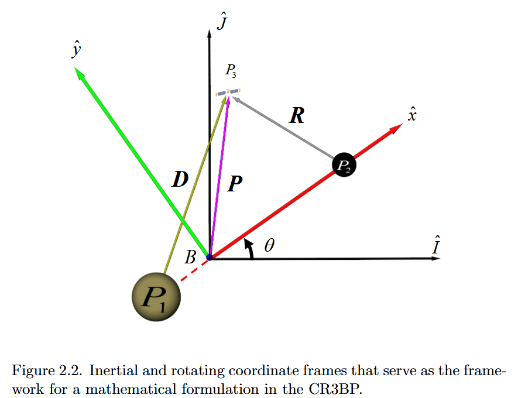
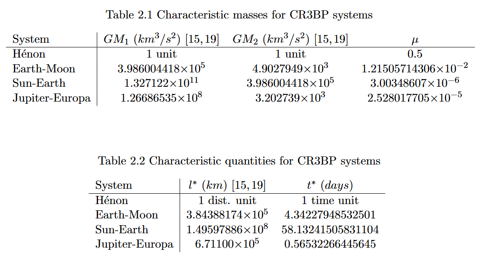

# 圆型限制性三体问题（CR3BP）

## 1. CR3BP数学模型定义

**CR3BP** 是 **Circular Restricted Three-Body Problem** 的缩写，直译为圆型限制性三体问题。这是一个在天体力学和航天动力学中一个非常经典且广泛使用的数学模型。

该模型主要用于研究一个质量极小的“第三体”（如航天器、探测器或小行星），在两个大质量天体（如地球和月球、太阳和地球）引力作用下的运动规律。

由于直接处理三个物体彼此影响的一般三体问题很难，因此在研究 CR3BP 问题时，会引入 2 个简化假设：

- 圆形：两个大质量天体在相互引力作用下，围绕它们的共同质心做匀速圆周运动。
- 限制性：第三个天体的质量微乎其微（视为零），它虽然会受到两个大天体的引力影响，但它对两个大天体的运动轨迹没有任何反向引力干扰。

为方便起见，研究 CR3BP 时，常选取一个跟随两个大天体旋转的坐标系，并通过选择长度、质量和时间单位的方式，让方程组尽可能简洁。

## 2. 常规三体问题的复杂性

如果一个质量为 \(M\) 的天体位于原点，另一个物体相对于它的位置向量为

\[ \boldsymbol r= \begin{bmatrix} x\\y\\z \end{bmatrix}, \qquad r=\|\boldsymbol r\|=\sqrt{x^2+y^2+z^2}, \]

那么后一个物体受到的引力加速度是

\[ \boldsymbol a=-\frac{GM}{r^3}\boldsymbol r. \]

这里：

- \(G\) 是万有引力常数；
- \(M\) 是产生引力的天体质量；
- \(\boldsymbol r\) 指向“从天体到物体”；
- 负号意味着引力反向指向天体；
- \(r=\|\boldsymbol r\|\) 是距离。

把三个物体按质量从大到小记为：

$$
m_1\ge m_2\ge m_3,
$$

对应物体 $P_1,P_2,P_3$。其中：

- $P_1$：质量最大的天体；
- $P_2$：质量第二大的天体；
- $P_3$：我们关心的小物体。

$P_1$ 和 $P_2$ 合称两个**主天体**（primaries）。

在二体问题里，两个物体的相对运动可以化为经典的开普勒轨道：圆、椭圆、抛物线或双曲线。但加入第三个物体后，每个物体都会同时被另外两个物体吸引，三个轨道互相耦合，不能先独立算出其中两个，再把第三个简单地放进去。

我们使用 $\boldsymbol r_{ij}$ 表示从 $P_i$ 指向 $P_j$ 的向量。若三个物体在惯性空间中的位置分别为 $\boldsymbol q_1,\boldsymbol q_2,\boldsymbol q_3,$ 那么 $\boldsymbol r_{ij}=\boldsymbol q_j-\boldsymbol q_i.$

例如：$\boldsymbol r_{13}=\boldsymbol q_3-\boldsymbol q_1$ 表示从 $P_1$ 到 $P_3$；$\boldsymbol r_{23}=\boldsymbol q_3-\boldsymbol q_2$ 表示从 $P_2$ 到 $P_3$。

二阶导数 $\boldsymbol r_{ij}''$ 是两物体的相对加速度。这里撇号表示对有量纲时间 $t$ 求导。

这里给出三体问题的物理表达式：

$$
\boldsymbol r_{j3}''
+G\frac{m_3+m_j}{r_{j3}^3}\boldsymbol r_{j3}
=Gm_k\left(
\frac{\boldsymbol r_{3k}}{r_{3k}^3}
-\frac{\boldsymbol r_{jk}}{r_{jk}^3}
\right),
$$

其中 $j,k\in\{1,2\}$，并且 $j\ne k$。

这一个写法压缩了两条向量方程：

- 取 $j=1,k=2$，描述 $P_3$ 相对于 $P_1$ 的运动；
- 取 $j=2,k=1$，描述 $P_3$ 相对于 $P_2$ 的运动。

理解右边的差值是关键。相对加速度满足

$$
\boldsymbol a_{3/j}=\boldsymbol a_3-\boldsymbol a_j.
$$

所以当我们问“$P_3$ 相对于 $P_j$ 如何加速”时，不仅要计算第三个天体 $P_k$ 对 $P_3$ 的拉动，还要减去 $P_k$ 对参考点 $P_j$ 的拉动。

这就像在一辆正在加速的列车上观察乘客：乘客相对于列车的加速度，不等于乘客相对于地面的加速度，因为列车自己也在加速。

因此，我们可以说一般的三体问题，没有简洁的通用解。

因为两条相对位置向量 $\boldsymbol r_{13},\boldsymbol r_{23}$ 随时间的变化，需要六个位置分量和六个速度分量，共十二个标量初始数据。

经典三体系统有十个常见的积分常数：

- 3 个与总线动量有关；
- 3 个与质心运动有关；
- 3 个总角动量分量；
- 1 个总能量。

它们不足以把一般三体问题完全化成可直接积分的形式。这里的含义不是“三体问题无法计算”，而是：一般没有像二体开普勒轨道那样，适用于任意初始条件的简洁闭式解；通常需要数值积分。

## 3. 问题简化—假设三体中第三者无引力作用

这里继续延续上文的定义，做出CR3BP数学模型中最关键的假设：让 $P_3$ 成为试验粒子。

令 $m_3\ll m_1,m_2.$ 忽略 $P_3$ 对 $P_1,P_2$ 的引力影响，但仍保留 $P_1,P_2$ 对 $P_3$ 的引力影响。

例如在太阳—地球—航天器系统中：太阳和地球决定航天器怎样飞；航天器不会可观测地改变太阳或地球的轨道。

这就是“限制性”（restricted）的真正含义。它限制的是第三个物体的动力学反作用，不是限制第三个物体只能在某个小区域中运动。

完成这一步后，问题被拆成两层：

1. $P_1,P_2$ 构成一个独立的二体系统；
2. 在两个主天体产生的时变引力场中，求 $P_3$ 的运动。

另外，$P_3$ 自己的质量会从加速度方程中约掉。以 $P_1$ 对 $P_3$ 的作用为例：

$$
m_3\boldsymbol a
=-\frac{Gm_1m_3}{D^3}\boldsymbol D.
$$

两边除以 $m_3$：

$$
\boldsymbol a
=-\frac{Gm_1}{D^3}\boldsymbol D.
$$

这与真空中不同质量物体具有相同自由落体加速度是同一个道理。

## 4. CR3BP 模型中的质心

两个主天体（$P_1,P_2$）围绕共同质心 $B$ 运动。质心位置是

$$
\boldsymbol q_B
=\frac{m_1\boldsymbol q_1+m_2\boldsymbol q_2}{m_1+m_2}.
$$

若把质心选为原点，则

$$
m_1\boldsymbol q_1+m_2\boldsymbol q_2=\boldsymbol 0.
$$

质心可以类比为跷跷板的平衡点：较重的物体离平衡点近；较轻的物体离平衡点远。

因此地球—月球质心并不位于二者正中间，而是非常靠近地球。太阳—地球质心则更加靠近太阳。

## 5. 问题再简化—让两个主天体做匀速圆周运动

孤立二体系统的束缚轨道一般是椭圆，圆只是椭圆的特殊情况。为了进一步简化，假设 $P_1,P_2$ 绕质心做匀速圆周运动。

这带来两个重要结果：

1. 两个主天体之间的距离不变；
2. 二者连线以恒定角速度转动。

“限制性”加上“圆型”两项假设，便得到 **圆型限制性三体问题**（CR3BP）。

到这里，我们可以列出CR3BP模型的主要假设：

- 三个物体均视为质点；
- 只考虑牛顿万有引力；
- $P_3$ 的质量可以忽略；
- $P_1,P_2$ 围绕质心做匀速圆周运动；
- 不考虑推力、太阳光压、非球形引力、其他天体和相对论修正。

CR3BP 不是“真实宇宙的完整模型”，而是一幅经过精心简化的动力学骨架。它保留了两个引力源共同作用产生的核心结构，同时把问题简化到可以系统分析的程度。

## 6. 坐标系：选择一个与“主天体一起旋转的转盘”

即使主天体做最简单的圆周运动，在普通惯性坐标系中，它们的位置仍然随时间变化。两个引力源一直在绕圈，方程右边便显式依赖时间。解决办法是选择一个跟着主天体一起旋转的坐标系。

**惯性坐标系 $I$**

惯性系的单位基向量记为

$$
\hat{\boldsymbol I},\quad
\hat{\boldsymbol J},\quad
\hat{\boldsymbol K}.
$$

其特点是：

- 原点位于质心 $B$；
- 坐标轴不随两个主天体转动；
- $\hat{\boldsymbol K}$垂直于主天体轨道平面。



**旋转坐标系 $R$**

旋转系的单位基向量记为

$$
\hat{\boldsymbol x},\quad
\hat{\boldsymbol y},\quad
\hat{\boldsymbol z}.
$$

它与惯性系拥有同一个原点 $B$，但会跟随主天体一起转动：

- $\hat{\boldsymbol x}$始终从质心指向 $P_2$；
- $\hat{\boldsymbol z}$ 与 $\hat{\boldsymbol K}$重合，是旋转轴；
- $\hat{\boldsymbol y}$ 位于轨道平面内，并使三个轴组成右手系。

右手系意味着

$$
\hat{\boldsymbol x}\times\hat{\boldsymbol y}
=\hat{\boldsymbol z}.
$$

旋转系最宝贵的性质是：

> $P_1$ 和 $P_2$ 在旋转坐标系中固定不动。

可以把它想象成一个巨大的旋转木马。站在地面上看，木马上的两匹马不断绕圈；坐到木马上看，它们的位置始终不变。

付出的代价是：旋转系不是惯性系。要在这个坐标系里使用牛顿第二定律，必须计入科里奥利效应和离心效应。

如图2.2所示：两个坐标系之间相差一个绕 $z$ 轴的转角 $\theta.$

这里使用方向余弦矩阵：

$$
{}^I L^R=
\begin{bmatrix}
\cos\theta&-\sin\theta&0\\
\sin\theta&\cos\theta&0\\
0&0&1
\end{bmatrix}.
$$

左上角的 $2\times2$ 部分，就是线性代数中熟悉的平面旋转矩阵。第三行和第三列表示 $z$ 轴不变。

该矩阵是正交矩阵，所以

$$
({}^I L^R)^{-1}=({}^I L^R)^T.
$$

需要留意一个常见的符号差异：

- 主动旋转一个向量；
- 保持几何向量不动，只改变描述它的坐标基；

这两种操作会使用互为转置的矩阵。因此不同教材中的正负号可能相反。只要始终采用同一套“从哪个坐标系变到哪个坐标系”的约定，物理结果不会改变。

旋转系的角速度向量为

$$
{}^I\boldsymbol\omega^R
=\frac{d\theta}{dt}\hat{\boldsymbol z}.
$$

方向沿 $z$ 轴，大小是转角的变化率。

## 7. CR3BP 的三条标准运动方程的推导

### 7.1 $P_3$ 的惯性加速度

对任意向量 $\boldsymbol a,$

基本运动学方程是

$$
\left(\frac{d\boldsymbol a}{dt}\right)_I
=
\left(\frac{d\boldsymbol a}{dt}\right)_R
+\boldsymbol\omega\times\boldsymbol a.
$$

下标 $I,R$ 不是幂，而是在说明“由哪一个观察者求导”。

理解它的最好办法，是考虑一根固定在旋转木马上的箭头：

- 木马上的人认为箭头完全不变，所以旋转系导数为零；
- 地面上的人看见箭头方向不断改变，所以惯性系导数不为零。

即使向量在旋转系中不变，坐标基自身的旋转仍产生$\boldsymbol\omega\times\boldsymbol a$这一项。

设 $P_3$ 相对于质心的位置为 $\boldsymbol\rho.$

惯性观察者看到的**速度**为

$$
\boldsymbol v_I
=\dot{\boldsymbol\rho}
+\boldsymbol\omega\times\boldsymbol\rho.
$$

第一项是物体相对于转盘的运动，第二项是转盘本身带着物体转动产生的速度。

再求一次惯性导数得到加速度：

$$
\boldsymbol a_I
=\ddot{\boldsymbol\rho}
+2\boldsymbol\omega\times\dot{\boldsymbol\rho}
+\dot{\boldsymbol\omega}\times\boldsymbol\rho
+\boldsymbol\omega\times
(\boldsymbol\omega\times\boldsymbol\rho).
$$

四部分分别是：

| 项                                                           | 含义                       |
| ------------------------------------------------------------ | -------------------------- |
| $\ddot{\boldsymbol\rho}$                                     | 旋转系内观察到的相对加速度 |
| $2\boldsymbol\omega\times\dot{\boldsymbol\rho}$              | 科里奥利项                 |
| $\dot{\boldsymbol\omega}\times\boldsymbol\rho$               | 欧拉项，角速度变化时才存在 |
| $\boldsymbol\omega\times(\boldsymbol\omega\times\boldsymbol\rho)$ | 与向心／离心效应相关的项   |

主天体做匀速圆周运动，所以

$$
\dot{\boldsymbol\omega}=0,
$$

欧拉项消失。这正体现了圆轨道假设带来的便利。

在有量纲变量中，$P_3$ 的惯性加速度等于两个主天体的引力之和：

$$
\boldsymbol P''
=-\frac{Gm_1}{D^3}\boldsymbol D
-\frac{Gm_2}{R^3}\boldsymbol R.
$$

这里：

$$
D=\|\boldsymbol D\|,
\qquad
R=\|\boldsymbol R\|.
$$

每一项都是“向量除以距离三次方”（见第2节）。负号使加速度指回相应主天体。但这个方程仍然带着公里、秒、千克和引力常数。因此使用无量纲化清理这些单位。

### 7.2 科里奥利效应：旋转观察者看到的侧向偏转

先单独理解加速度展开式中的科里奥利项：

$$
2\boldsymbol\omega\times\dot{\boldsymbol\rho}.
$$

它并不是某个天体额外施加的新引力，而是因为观察者使用了**旋转坐标系**而出现的运动学修正。

想象一个匀速旋转的圆盘，以及分别站在地面和圆盘上的两位观察者。圆盘上的人把一个小球沿盘面推出。忽略摩擦时：

- 地面上的惯性观察者看到小球近似沿直线运动；
- 圆盘上的旋转观察者却看到小球轨迹向侧面弯曲，因为圆盘在小球下方持续转动。

两人观察的是同一个物体。轨迹之所以不同，不是小球突然受到了一种新的相互作用，而是圆盘观察者的坐标轴正在改变方向。为了在旋转系中继续使用“加速度等于各作用之和”的形式，需要加入一个表观的侧向加速度，这就是科里奥利加速度。

> 科里奥利效应出现需要同时满足两个条件：坐标系正在旋转，并且物体相对于该旋转系正在运动。

如果物体相对于旋转系静止，即$\dot{\boldsymbol\rho}=\boldsymbol 0,$那么科里奥利项立即消失。

旋转观察者所使用的科里奥利表观加速度为

$$
\boxed{
\boldsymbol a_{\mathrm{cor}}
=-2\boldsymbol\omega\times\boldsymbol v_R
}
$$

其中 $\boldsymbol v_R=\dot{\boldsymbol\rho}$ 是物体相对于旋转坐标系的速度。

这里需要特别注意符号。前面的惯性加速度展开式写成

$$
\boldsymbol a_I
=\boldsymbol a_R
+2\boldsymbol\omega\times\boldsymbol v_R
+\dot{\boldsymbol\omega}\times\boldsymbol\rho
+\boldsymbol\omega\times
(\boldsymbol\omega\times\boldsymbol\rho).
$$

所以在**惯性加速度展开式**中看到的是

$$
+2\boldsymbol\omega\times\boldsymbol v_R.
$$

若把它移到旋转系运动方程的右侧，作为旋转观察者感受到的表观加速度，就变成

$$
-2\boldsymbol\omega\times\boldsymbol v_R.
$$

两种写法描述的是同一个效应，只是项位于等式的不同侧，因而符号相反。

CR3BP 的旋转轴沿 $z$ 轴，因此：

$$
\boldsymbol\omega
=n\hat{\boldsymbol z}
=
\begin{bmatrix}
0\\0\\n
\end{bmatrix},
$$

其中 $n$ 是旋转坐标系角速度的大小。此处先保留一般的 $n$；完成后文的无量纲化以后会得到 $n=1$。

而相对速度为

$$
\boldsymbol v_R
=
\begin{bmatrix}
\dot x\\\dot y\\\dot z
\end{bmatrix}.
$$

计算叉乘：

$$
\boldsymbol\omega\times\boldsymbol v_R
=
\begin{bmatrix}
-n\dot y\\
n\dot x\\
0
\end{bmatrix}.
$$

因此惯性加速度展开式中的科里奥利项为

$$
\boxed{
2\boldsymbol\omega\times\boldsymbol v_R
=
\begin{bmatrix}
-2n\dot y\\
2n\dot x\\
0
\end{bmatrix}
}
$$

这解释了后面分量方程中为什么会出现交叉速度项：$-2n\dot y$，出现在 $x$ 方向方程中，而
$+2n\dot x$ 出现在 $y$ 方向方程中。它们不是“同方向速度产生同方向加速度”，而是使轨迹发生侧向偏转。

若把运动方程整理成“旋转系相对加速度等于什么”，科里奥利表观加速度则是

$$
\boxed{
\boldsymbol a_{\mathrm{cor}}
=
\begin{bmatrix}
2n\dot y\\
-2n\dot x\\
0
\end{bmatrix}
}
$$

例如，在本文坐标方向和旋转方向的约定下：

| 相对于旋转系的运动 | 科里奥利偏转方向 |
| ------------------ | ------------------ |
| $\dot x>0,\ \dot y=0$，向 $+x$ 运动 | $-y$ 方向 |
| $\dot x<0,\ \dot y=0$，向 $-x$ 运动 | $+y$ 方向 |
| $\dot y>0,\ \dot x=0$，向 $+y$ 运动 | $+x$ 方向 |
| $\dot y<0,\ \dot x=0$，向 $-y$ 运动 | $-x$ 方向 |

这张表采用 $\boldsymbol\omega=n\hat{\boldsymbol z}$ 的旋转方向约定；如果坐标系反向旋转，$\boldsymbol\omega$ 反向，所有科里奥利偏转方向也会反向。

科里奥利项的具备的三个重要性质

1. 它依赖相对速度。物体在旋转系中静止时，科里奥利效应为零。
2. 它与速度方向垂直。叉乘保证 $\boldsymbol a_{\mathrm{cor}}\perp\boldsymbol v_R$，所以它主要改变速度方向，而不直接改变速度大小。
3. 它不直接做功。因为

   $$
   \boldsymbol v_R\cdot\boldsymbol a_{\mathrm{cor}}=0.
   $$

   这也是推导雅可比常数时科里奥利交叉项会相互抵消的原因。

可以直接用分量验证第三点：

$$
\begin{aligned}
\boldsymbol v_R\cdot\boldsymbol a_{\mathrm{cor}}
&=
\dot x(2n\dot y)
+\dot y(-2n\dot x)\\
&=0.
\end{aligned}
$$

科里奥利效应和离心效应都来自旋转坐标系，但二者不能混为一谈：

| 效应 | 依赖量 | 物体相对旋转系静止时是否存在 | 在 CR3BP 中的形式 |
| ---- | ------ | ---------------------------- | ----------------- |
| 科里奥利效应 | 速度 $\dot x,\dot y$ | 不存在 | $-2n\dot y,\ 2n\dot x$（标准分量方程左侧） |
| 离心效应 | 位置 $x,y$ | 通常存在 | 移项后为 $n^2x,\ n^2y$ |

由于普通势函数只依赖位置，离心效应可以与引力一起收入后文的有效势函数 $\Omega(x,y,z)$；科里奥利效应依赖速度，不能由 $\nabla\Omega$ 产生，必须以 $-2\dot y$ 和 $2\dot x$ 的形式单独保留在运动方程中。

### 7.3 无量纲处理

无量纲化有几个实际作用：

- 同一组方程可以描述太阳—地球、地球—月球等不同系统；
- 数值大小更规整，适合计算机积分；
- 主天体间距、总质量、角速度都可以归一化为 1；
- 系统本质上只剩一个重要参数 \(\mu\)。

这里选择三个自然尺度：

#### 特征长度

$$
l^*
=\|\overrightarrow{BP_1}\|
+\|\overrightarrow{BP_2}\|.
$$

因为质心位于两个主天体之间，这就是主天体间距：

$$
l^*=\|P_1P_2\|.
$$

以后用它作为“1 个长度单位”。于是无量纲模型中，两个主天体相距 1。

#### 特征质量

$$
m^*=m_1+m_2.
$$

以后用主天体总质量作为“1 个质量单位”。

#### 特征时间

$$
t^*=\sqrt{\frac{l^{*3}}{Gm^*}}.
$$

这个看似突然的定义，是为了让运动方程两边的系数恰好抵消。令

$$
\boldsymbol P=l^*\boldsymbol\rho,
\qquad
t=t^*\tau,
$$

则加速度尺度为

$$
\boldsymbol P''
=\frac{l^*}{t^{*2}}\ddot{\boldsymbol\rho}.
$$

引力加速度的自然尺度为

$$
\frac{Gm^*}{l^{*2}}.
$$

要求二者相等：

$$
\frac{l^*}{t^{*2}}
=\frac{Gm^*}{l^{*2}},
$$

立即得到

$$
t^*=\sqrt{\frac{l^{*3}}{Gm^*}}.
$$

所以这个时间尺度是由方程自然决定的，不是随意猜出来的。

> 无量纲时间为
> $$
> \tau=\frac{t}{t^*}.
> $$
>
> 这里用圆点表示对 $\tau$求导：
>
> $$
> \dot x=\frac{dx}{d\tau},
> \qquad
> \ddot x=\frac{d^2x}{d\tau^2}.
> $$
>
> 撇号通常表示对有量纲时间 $t$ 求导，圆点则表示对无量纲时间 $\tau$求导。阅读时不要混淆二者。

#### 一个参数压缩整个主天体系统

定义质量参数

$$
\mu=\frac{m_2}{m_1+m_2}.
$$

于是两个主天体的无量纲质量分别为

$$
P_1:1-\mu,
\qquad
P_2:\mu.
$$

因为约定 $m_1\ge m_2$，所以通常

$$
0<\mu\le\frac12.
$$


| 系统           |           $\mu$ 约为 | 直观含义                 |
| -------------- | -------------------: | ------------------------ |
| 等质量理想系统 |                $0.5$ | 两个主天体一样重         |
| 地球—月球      | $1.215\times10^{-2}$ | 月球约占总质量的 $1.2\%$ |
| 木星—木卫二    | $2.528\times10^{-5}$ | 木星高度占主导           |
| 太阳—地球      | $3.003\times10^{-6}$ | 太阳几乎占全部质量       |

在完成归一化以后，不同天体系统之间最核心的区别就浓缩在 $\mu$这一个参数中。

#### 主天体的位置坐标

设两个主天体在无量纲旋转坐标系中的 $x$ 坐标为 $x_1,x_2$。主天体间距已经归一化为 1，所以

$$
x_2-x_1=1.
$$

质心位于原点，所以

$$
(1-\mu)x_1+\mu x_2=0.
$$

联立两式得到

$$
x_1=-\mu,
\qquad
x_2=1-\mu.
$$

因此

$$
P_1=(-\mu,0,0),
\qquad
P_2=(1-\mu,0,0).
$$

图像上是：

```text
        P1                 B                         P2
   质量 1-μ               质心                       质量 μ
     x=-μ                 x=0                       x=1-μ

     <---------------- 主天体间距恒为 1 ---------------->
```

当地球—月球系统的 $\mu\approx0.01215$时：

$$
x_{\rm Earth}\approx-0.01215,
\qquad
x_{\rm Moon}\approx0.98785.
$$

质心显然更靠近较重的地球。

#### 无量纲角速度

圆轨道的有量纲角速度为

$$
N=\sqrt{\frac{Gm^*}{l^{*3}}}.
$$

无量纲角速度定义为

$$
n=Nt^*.
$$

代入特征时间：

$$
n
=\sqrt{\frac{Gm^*}{l^{*3}}}
\sqrt{\frac{l^{*3}}{Gm^*}}
=1.
$$

通过此前的单位选择，我们让无量纲角速度的值恰好为 1。

但要注意：角速度为 1 不等于一圈只需要 1 个时间单位。转一圈对应角度 

$$
2\pi,
$$

所以无量纲轨道周期是 $T=2\pi.$

有量纲轨道周期为

$$
T_{\rm physical}=2\pi t^*.
$$

例如：

- 地球—月球的 $t^*\approx4.3423$ 天，因此周期约为 $27.28$ 天；
- 太阳—地球的 $t^*\approx58.1324$ 天，因此周期约为 $365.26$ 天；
- 木星—木卫二的 $t^*\approx0.5653$ 天，因此周期约为 $3.55$ 天。

表 2.2 中的时间数值是 $t^*$，不是一整个公转周期。



### 7.4 把 $P_3$ 的惯性加速度展开成 $x,y,z$ 分量

先求 $P_3$ 到两个主天体的向量和距离：

令 $P_3$ 的无量纲位置为

$$
\boldsymbol\rho=
\begin{bmatrix}
x\\y\\z
\end{bmatrix}.
$$

从 $P_1$ 到 $P_3$ 的向量是

$$
\boldsymbol d
=\boldsymbol\rho-
\begin{bmatrix}
-\mu\\0\\0
\end{bmatrix}
=
\begin{bmatrix}
x+\mu\\y\\z
\end{bmatrix}.
$$

从 $P_2$ 到 $P_3$ 的向量是

$$
\boldsymbol r
=\boldsymbol\rho-
\begin{bmatrix}
1-\mu\\0\\0
\end{bmatrix}
=
\begin{bmatrix}
x-1+\mu\\y\\z
\end{bmatrix}.
$$

相应距离为

$$
d=\|\boldsymbol d\|
=\sqrt{(x+\mu)^2+y^2+z^2},
$$

$$
r=\|\boldsymbol r\|
=\sqrt{(x-1+\mu)^2+y^2+z^2}.
$$

这两个平方根没有新的物理内容，只是三维空间中的欧氏距离公式。

无量纲引力方程于是变成

$$
\ddot{\boldsymbol\rho}_I
=-\frac{(1-\mu)\boldsymbol d}{d^3}
-\frac{\mu\boldsymbol r}{r^3}.
$$

左边特别标了下标 $I$，因为它仍然是**惯性观察者看到的加速度**。接下来结合7.1节的公式：

取

$$
\boldsymbol\omega=n\hat{\boldsymbol z},
\qquad
\boldsymbol\rho=x\hat{\boldsymbol x}
+y\hat{\boldsymbol y}
+z\hat{\boldsymbol z}.
$$

速度相关的叉乘为

$$
2\boldsymbol\omega\times\dot{\boldsymbol\rho}
=-2n\dot y\,\hat{\boldsymbol x}
+2n\dot x\,\hat{\boldsymbol y}.
$$

转动相关的双重叉乘为

$$
\boldsymbol\omega\times
(\boldsymbol\omega\times\boldsymbol\rho)
=-n^2x\,\hat{\boldsymbol x}
-n^2y\,\hat{\boldsymbol y}.
$$

因此惯性观察者看到的加速度是

$$
\boldsymbol a_I
=(\ddot x-2n\dot y-n^2x)\hat{\boldsymbol x}
+(\ddot y+2n\dot x-n^2y)\hat{\boldsymbol y}
+\ddot z\hat{\boldsymbol z}.
$$

这里出现了三个值得分辨的结构：

- $\ddot x,\ddot y,\ddot z$是旋转系中的相对加速度；
- $-2n\dot y,\quad 2n\dot x$是科里奥利项；
- $-n^2x,\quad -n^2y$来自坐标系旋转，移到方程右边后表现为离心项。

$z$ 方向没有离心项，因为坐标系绕 $z$ 轴旋转，离心效应只与到旋转轴的垂直距离有关。

### 7.5 标准运动方程

把上一节的惯性加速度与两个主天体产生的引力加速度逐分量相等，得到

$$
\ddot x-2n\dot y-n^2x
=-\frac{(1-\mu)(x+\mu)}{d^3}
-\frac{\mu(x-1+\mu)}{r^3},
$$

$$
\ddot y+2n\dot x-n^2y
=-\frac{(1-\mu)y}{d^3}
-\frac{\mu y}{r^3},
$$

$$
\ddot z
=-\frac{(1-\mu)z}{d^3}
-\frac{\mu z}{r^3}.
$$

因为无量纲角速度 $n=1$，通常整理成更常见的形式：

$$
\boxed{
\ddot x-2\dot y
=x
-\frac{(1-\mu)(x+\mu)}{d^3}
-\frac{\mu(x-1+\mu)}{r^3}
}
$$

$$
\boxed{
\ddot y+2\dot x
=y
-\frac{(1-\mu)y}{d^3}
-\frac{\mu y}{r^3}
}
$$

$$
\boxed{
\ddot z
=-\frac{(1-\mu)z}{d^3}
-\frac{\mu z}{r^3}
}
$$

并且

$$
d=\sqrt{(x+\mu)^2+y^2+z^2},
$$

$$
r=\sqrt{(x-1+\mu)^2+y^2+z^2}.
$$

给每一项贴上物理标签：

$x$ 方向可以读成

$$
\ddot x
=\underbrace{2\dot y}_{\text{科里奥利}}
+\underbrace{x}_{\text{离心}}
-\underbrace{\frac{(1-\mu)(x+\mu)}{d^3}}_{P_1\text{ 的引力加速度 }x\text{ 分量}}
-\underbrace{\frac{\mu(x-1+\mu)}{r^3}}_{P_2\text{ 的引力加速度 }x\text{ 分量}}.
$$

$y$ 方向可以读成

$$
\ddot y
=\underbrace{-2\dot x}_{\text{科里奥利}}
+\underbrace{y}_{\text{离心}}
-\underbrace{\frac{(1-\mu)y}{d^3}}_{P_1\text{ 的引力加速度 }y\text{ 分量}}
-\underbrace{\frac{\mu y}{r^3}}_{P_2\text{ 的引力加速度 }y\text{ 分量}}.
$$

$z$ 方向则只有引力：

$$
\ddot z
=-\underbrace{\frac{(1-\mu)z}{d^3}}_{P_1\text{ 拉向轨道平面}}
-\underbrace{\frac{\mu z}{r^3}}_{P_2\text{ 拉向轨道平面}}.
$$

最终方程虽然看起来复杂，但每一项的来源都很清楚：两个主天体产生的真实引力加速度，加上因为我们站在旋转坐标系中而出现的两类运动学项。

## 8. 有效势（伪势）函数

结合7.5节的运动方程，可以把其中所有**只依赖位置**的加速度项写成一个标量函数的梯度。定义 CR3BP 常用的伪势函数 $\Omega$，使其满足

$$
\boxed{
\nabla\Omega
=\boldsymbol a_{\mathrm{cf}}
+\boldsymbol a_1
+\boldsymbol a_2
}
$$

其中 $\boldsymbol a_{\mathrm{cf}}$ 是离心加速度，$\boldsymbol a_1$ 和 $\boldsymbol a_2$ 分别是两个主天体产生的引力加速度。科里奥利加速度依赖速度，不能由只依赖位置的 $\Omega(x,y,z)$ 产生，因此不包含在 $\nabla\Omega$ 中。

满足上述关系的伪势函数为

$$
\boxed{
\Omega(x,y,z)
=
\underbrace{
\frac12(x^2+y^2)
}_{\text{离心效应对应的伪势贡献}}
+
\underbrace{
\frac{1-\mu}{d}
}_{P_1\text{ 引力对应的伪势贡献}}
+
\underbrace{
\frac{\mu}{r}
}_{P_2\text{ 引力对应的伪势贡献}}
}
$$

这里必须区分“势函数项”和“加速度”：

- $\frac12(x^2+y^2)$ 是标量，不是离心加速度；对它求梯度后才得到离心加速度。
- $\frac{1-\mu}{d}$ 是标量，不是 $P_1$ 的引力或引力加速度；对它求梯度后才得到 $P_1$ 的引力加速度。
- $\frac{\mu}{r}$ 同理，是 $P_2$ 引力对应的伪势贡献，而不是引力本身。

因此，“离心效应”和“$P_1,P_2$ 的引力”只能用来说明三项的物理来源，不能把这些标量项与相应的向量加速度直接画等号。

> $\Omega$ 看起来像势函数——对它求梯度可以得到一部分加速度——但它不是由真实物理相互作用产生的普通势能，也不能单独产生完整的旋转系运动方程。它是为了在旋转坐标系中整理方程而构造的一个**有效数学函数**，里面同时混合了：
>
> 1. 两个主天体的真实引力；
> 2. 旋转坐标系产生的虚拟离心效应；
> 3. CR3BP 特有的整体符号约定。
>
> Ω 只能生成运动方程的位置相关部分，不能生成完整动力学。

### 8.1 $\Omega$ 的引力项为正号

传统的单位质量引力势带负号：

$$
\Phi_1=-\frac{1-\mu}{d},
\qquad
\Phi_2=-\frac{\mu}{r},
$$

对应的引力加速度满足

$$
\boldsymbol a_1=-\nabla\Phi_1,
\qquad
\boldsymbol a_2=-\nabla\Phi_2.
$$

如果采用传统符号定义单位质量有效势，可以写成

$$
U_{\mathrm{eff}}
=-\frac12(x^2+y^2)
-\frac{1-\mu}{d}
-\frac{\mu}{r}.
$$

此时位置相关的加速度采用熟悉的负梯度形式：

$$
\boldsymbol a_{\mathrm{position}}
=-\nabla U_{\mathrm{eff}}.
$$

CR3BP 文献通常定义

$$
\boxed{
\Omega=-U_{\mathrm{eff}}
}
$$

所以同一个关系变成

$$
-\nabla U_{\mathrm{eff}}
=\nabla\Omega.
$$

因此，$\Omega$ 中的 $\frac{1-\mu}{d}$ 和 $\frac{\mu}{r}$ 是传统单位质量引力势的负值。正号来自 CR3BP 对 $\Omega$ 的符号约定，并不表示引力变成了排斥作用。

### 8.2 对各伪势项求梯度

梯度把标量函数变成向量：

$$
\nabla\Omega
=
\begin{bmatrix}
\dfrac{\partial\Omega}{\partial x}\\[6pt]
\dfrac{\partial\Omega}{\partial y}\\[6pt]
\dfrac{\partial\Omega}{\partial z}
\end{bmatrix}.
$$

离心伪势项满足

$$
\nabla\left[\frac12(x^2+y^2)\right]
=
\begin{bmatrix}
x\\y\\0
\end{bmatrix}
=\boldsymbol a_{\mathrm{cf}}.
$$

第一个主天体对应的伪势项满足

$$
\nabla\left(\frac{1-\mu}{d}\right)
=-\frac{1-\mu}{d^3}
\begin{bmatrix}
x+\mu\\y\\z
\end{bmatrix}
=\boldsymbol a_1.
$$

第二个主天体对应的伪势项满足

$$
\nabla\left(\frac{\mu}{r}\right)
=-\frac{\mu}{r^3}
\begin{bmatrix}
x-1+\mu\\y\\z
\end{bmatrix}
=\boldsymbol a_2.
$$

所以严谨的对应关系是

$$
\boxed{
\underbrace{\Omega}_{\text{标量伪势函数}}
\xrightarrow{\ \nabla\ }
\underbrace{
\boldsymbol a_{\mathrm{cf}}
+\boldsymbol a_1
+\boldsymbol a_2
}_{\text{位置相关的向量加速度}}
}
$$

逐分量计算可得

$$
\frac{\partial\Omega}{\partial x}
=x
-\frac{(1-\mu)(x+\mu)}{d^3}
-\frac{\mu(x-1+\mu)}{r^3},
$$

$$
\frac{\partial\Omega}{\partial y}
=y
-\frac{(1-\mu)y}{d^3}
-\frac{\mu y}{r^3},
$$

$$
\frac{\partial\Omega}{\partial z}
=-\frac{(1-\mu)z}{d^3}
-\frac{\mu z}{r^3}.
$$

于是三条运动方程可简写为

$$
\ddot x-2\dot y=\frac{\partial\Omega}{\partial x},
$$

$$
\ddot y+2\dot x=\frac{\partial\Omega}{\partial y},
$$

$$
\ddot z=\frac{\partial\Omega}{\partial z}.
$$

### 8.3 与拉格朗日点的关系

如果一个物体要在旋转系中始终静止，则

$$
\dot x=\dot y=\dot z=0,
\qquad
\ddot x=\ddot y=\ddot z=0.
$$

此时科里奥利项也为零，运动方程要求

$$
\boxed{
\nabla\Omega=\boldsymbol 0
}
$$

这些平衡位置就是著名的五个拉格朗日点 $L_1,\ldots,L_5$。需要注意，$\nabla\Omega=\boldsymbol 0$ 只说明该处是平衡点，并不自动保证平衡稳定；稳定性还需要研究平衡点附近的线性化动力学。


## 9. 计算机求解的表示方法

计算机数值积分通常采用一阶状态方程。定义

$$
v_x=\dot x,\qquad
v_y=\dot y,\qquad
v_z=\dot z,
$$

状态向量为

$$
\boldsymbol X=
\begin{bmatrix}
x&y&z&v_x&v_y&v_z
\end{bmatrix}^T.
$$

CR3BP 可以写成

$$
\dot x=v_x,
\qquad
\dot y=v_y,
\qquad
\dot z=v_z,
$$

$$
\dot v_x
=2v_y+x
-\frac{(1-\mu)(x+\mu)}{d^3}
-\frac{\mu(x-1+\mu)}{r^3},
$$

$$
\dot v_y
=-2v_x+y
-\frac{(1-\mu)y}{d^3}
-\frac{\mu y}{r^3},
$$

$$
\dot v_z
=-\frac{(1-\mu)z}{d^3}
-\frac{\mu z}{r^3}.
$$

给定六维初始状态

$$
\boldsymbol X(0)
=
\begin{bmatrix}
x_0&y_0&z_0&v_{x0}&v_{y0}&v_{z0}
\end{bmatrix}^T,
$$

就能使用 Runge–Kutta 等方法逐步计算后续轨迹。

## 10. 将无量纲结构转换为真实单位

数值积分输出的是无量纲量。换回物理量时：

$$
\text{实际长度}=l^*\times\text{无量纲长度},
$$

$$
\text{实际时间}=t^*\times\text{无量纲时间}.
$$

速度和加速度尺度分别为

$$
v^*=\frac{l^*}{t^*},
\qquad
a^*=\frac{l^*}{t^{*2}}.
$$

以地球—月球系统为例：

$$
l^*\approx3.8439\times10^5\ \mathrm{km},
\qquad
t^*\approx4.3423\ \mathrm{days}.
$$

如果积分得到某次飞行经历无量纲时间

$$
\Delta\tau=2,
$$

实际时间约为

$$
\Delta t=2t^*\approx8.68\ \mathrm{days}.
$$

如果某时刻无量纲坐标为 $x=0.8$，则相对于质心的实际 $x$ 坐标约为

$$
0.8l^*\approx3.08\times10^5\ \mathrm{km}.
$$

轨道动力学中 $G$ 与 $M$ 总是成对出现，而且 $GM$ （单位通常为$\mathrm{km^3/s^2}$）往往比单独的质量测得更准确，因此工程上经常直接使用 $GM$。质量参数也可以直接写成
$$
\mu=\frac{GM_2}{GM_1+GM_2}.
$$

## 11. 本文涉及的符号术语表

| 符号                                                         | 含义                                     |
| ------------------------------------------------------------ | ---------------------------------------- |
| $P_1,P_2$                                                    | 两个主天体                               |
| $P_3$                                                        | 质量可忽略的第三个物体                   |
| $m_1,m_2,m_3$                                                | 三个物体的质量                           |
| $B$                                                          | 两个主天体的共同质心                     |
| $I$                                                          | 惯性坐标系                               |
| $R$                                                          | 随主天体旋转的坐标系                     |
| $\hat{\boldsymbol I},\hat{\boldsymbol J},\hat{\boldsymbol K}$ | 惯性系单位基向量                         |
| $\hat{\boldsymbol x},\hat{\boldsymbol y},\hat{\boldsymbol z}$ | 旋转系单位基向量                         |
| $\boldsymbol P$                                              | 有量纲的 $B\to P_3$ 位置向量             |
| $\boldsymbol D,\boldsymbol R$                                | 有量纲的 $P_1\to P_3$、$P_2\to P_3$ 向量 |
| $\boldsymbol\rho$                                            | 无量纲的 $B\to P_3$ 位置向量             |
| $\boldsymbol d,\boldsymbol r$                                | 无量纲的 $P_1\to P_3$、$P_2\to P_3$ 向量 |
| $d,r$                                                        | $P_3$ 到 $P_1,P_2$ 的无量纲距离          |
| $l^*$                                                        | 主天体间距，特征长度                     |
| $m^*$                                                        | 主天体总质量，特征质量                   |
| $t^*$                                                        | 特征时间                                 |
| $\mu=m_2/(m_1+m_2)$                                          | 质量参数                                 |
| $\Phi_1,\Phi_2$                                              | 两个主天体的传统单位质量引力势（均为负值） |
| $U_{\mathrm{eff}}$                                          | 传统符号的单位质量有效势，本文中满足 $U_{\mathrm{eff}}=-\Omega$ |
| $\Omega$                                                     | CR3BP 的标量伪势函数，不是力或加速度本身 |
| $\nabla\Omega$                                              | 离心加速度与两个主天体引力加速度的向量和 |
| $\boldsymbol\omega$                                         | 旋转坐标系相对于惯性系的角速度向量       |
| $\boldsymbol v_R=\dot{\boldsymbol\rho}$                    | 物体相对于旋转坐标系的速度               |
| $\boldsymbol a_{\mathrm{cor}}=-2\boldsymbol\omega\times\boldsymbol v_R$ | 科里奥利表观加速度 |
| $N$                                                          | 有量纲平均角速度                         |
| $n$                                                          | 无量纲角速度，在本文单位下等于 1         |
| $'$                                                          | 对有量纲时间 $t$ 求导                    |
| $\dot{(\ )}$                                                 | 对无量纲时间 $\tau$ 求导                 |

> 我们坐在一个以恒定角速度旋转的转盘上。两个固定的引力中心分别位于 $x=-\mu$ 和 $x=1-\mu$。一个质量可忽略的小物体在二者的引力、离心效应和科里奥利效应共同作用下运动——这就是 CR3BP。
