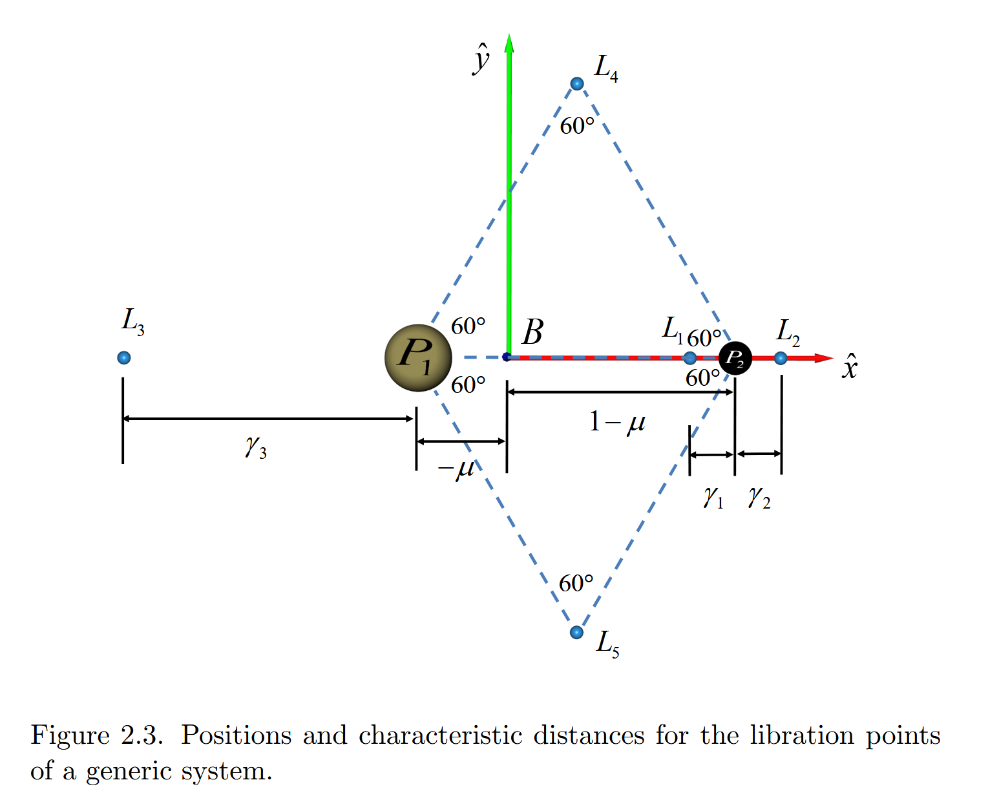
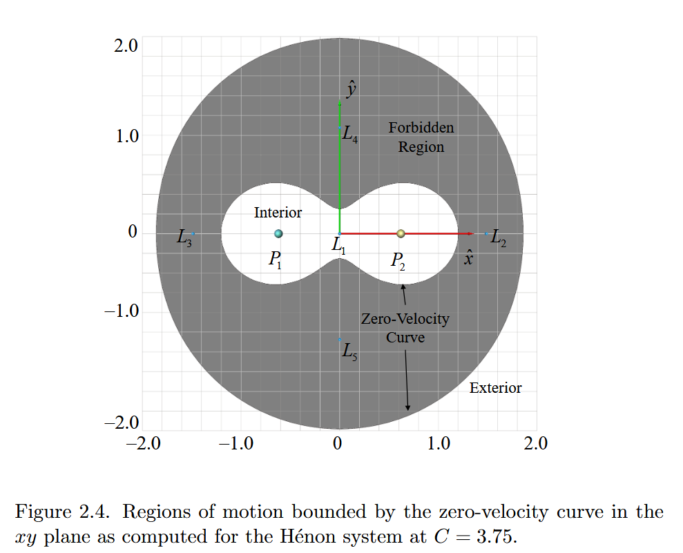
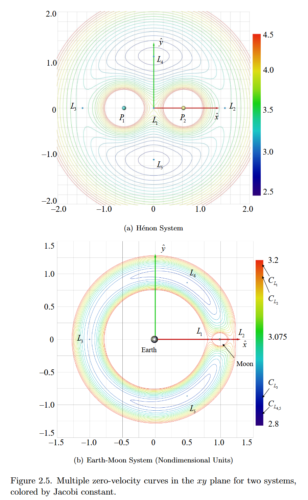

# 圆型限制性三体问题（CR3BP）：平衡点、雅可比常数与零速度面

本文承接《圆型限制性三体问题》前 11 节。此前已经建立 CR3BP 的旋转坐标系、无量纲运动方程和伪势函数。本篇从伪势函数出发，继续讨论五个拉格朗日点、雅可比常数以及零速度曲线／零速度面。

沿用此前的定义：两个主天体分别位于

$$
P_1=(-\mu,0,0),
\qquad
P_2=(1-\mu,0,0),
$$

第三体的位置为

$$
\boldsymbol\rho=
\begin{bmatrix}
x&y&z
\end{bmatrix}^T,
$$

它到两个主天体的距离分别是

$$
d=\sqrt{(x+\mu)^2+y^2+z^2},
$$

$$
r=\sqrt{(x-1+\mu)^2+y^2+z^2}.
$$

无量纲伪势函数为

$$
\boxed{
\Omega(x,y,z)
=\frac12(x^2+y^2)
+\frac{1-\mu}{d}
+\frac{\mu}{r}
}
$$

运动方程可以写成

$$
\ddot x-2\dot y=\Omega_x,
$$

$$
\ddot y+2\dot x=\Omega_y,
$$

$$
\ddot z=\Omega_z,
$$

其中下标表示偏导数，例如

$$
\Omega_x=\frac{\partial\Omega}{\partial x}.
$$

部分文献使用 $\Upsilon$ 表示同一个伪势函数。只要定义一致，$\Omega$ 和 $\Upsilon$ 只是符号不同。本文继续沿用前一篇笔记中的 $\Omega$。

## 12. CR3BP 的平衡解

### 12.1 “平衡”是相对于旋转坐标系静止

平衡点指第三体在旋转坐标系中保持固定位置。因此它在旋转系中的速度和加速度均为零：

$$
\dot x=\dot y=\dot z=0,
$$

$$
\ddot x=\ddot y=\ddot z=0.
$$

代入运动方程可得

$$
\boxed{
\Omega_x=\Omega_y=\Omega_z=0
}
$$

或写成向量形式：

$$
\boxed{
\nabla\Omega=\boldsymbol 0
}
$$

这意味着平衡点是伪势函数的驻点。

此时科里奥利项也自动消失，因为科里奥利效应依赖旋转系相对速度：

$$
\boldsymbol a_{\mathrm{cor}}
=-2\boldsymbol\omega\times\boldsymbol v_R.
$$

当 $\boldsymbol v_R=\boldsymbol 0$ 时，$\boldsymbol a_{\mathrm{cor}}=\boldsymbol 0$。所以平衡点处真正参与平衡的是：

$$
\boxed{
\text{两个主天体的引力加速度}
+\text{离心加速度}
=\boldsymbol 0
}
$$

这里的“静止”只对旋转观察者成立。在惯性坐标系中，平衡点仍然和两个主天体一起绕质心旋转。

可以把它想象成旋转木马上的一个固定标记：坐在木马上的人认为它没有移动；站在地面上的人却看到它持续绕圆运动。

### 12.2 五个平衡点都在 $xy$ 平面

伪势函数的 $z$ 方向偏导数为

$$
\Omega_z
=-\frac{(1-\mu)z}{d^3}
-\frac{\mu z}{r^3}.
$$

提取 $z$：

$$
\Omega_z
=-z\left(
\frac{1-\mu}{d^3}
+\frac{\mu}{r^3}
\right).
$$

平衡条件要求 $\Omega_z=0$。括号中的两项均为正数，因此只有

$$
\boxed{z=0}
$$

才能满足条件。

所以 CR3BP 的所有平衡点都位于两个主天体的轨道平面内。

### 12.3 五个拉格朗日点的总体分布

CR3BP 共有五个平衡点，也叫**拉格朗日点**或平动点（libration points）：

```text
                              L4
                              ●
                             / \
                            /   \
          L3        P1    L1     P2        L2
          ●---------●-----●------●---------●------→ x
                            \   /
                             \ /
                              ●
                              L5
```

- $L_1$ 位于两个主天体之间；
- $L_2$ 位于较小主天体 $P_2$ 的外侧；
- $L_3$ 位于较大主天体 $P_1$ 的另一侧；
- $L_4,L_5$ 与两个主天体构成等边三角形。

其中 $L_1,L_2,L_3$ 是共线点，通常需要数值求解；$L_4,L_5$ 是等边三角形点，可以直接得到解析坐标。

> 平衡点不等于稳定点。$\nabla\Omega=\boldsymbol 0$ 只说明物体精确位于该点且相对速度为零时，瞬时合加速度为零。稍微偏离后是返回还是继续远离，需要另外研究平衡点附近的线性化动力学。

## 13. 三个共线拉格朗日点 $L_1,L_2,L_3$

### 13.1 共线点的标量方程

共线点位于 $x$ 轴，所以

$$
y=z=0.
$$

此时 $\Omega_y=\Omega_z=0$ 自动成立，只需解

$$
\Omega_x=0.
$$

由此前的伪势梯度可得

$$
\boxed{
f(x)=\Omega_x
=x
-\frac{(1-\mu)(x+\mu)}{|x+\mu|^3}
-\frac{\mu(x-1+\mu)}{|x-1+\mu|^3}
=0
}
$$

绝对值不能随意忽略，因为三个点位于不同区间：

| 平衡点 | 所在区间 |
| ------ | -------- |
| $L_3$ | $x<-\mu$ |
| $L_1$ | $-\mu<x<1-\mu$ |
| $L_2$ | $x>1-\mu$ |

例如 $L_1$ 位于两个主天体之间，所以

$$
x+\mu>0,
\qquad
x-1+\mu<0.
$$

同一个距离项在不同区间具有不同方向符号。把分母直接写成 $(x+\mu)^3$ 或 $(x-1+\mu)^3$ 而不检查所在区间，很容易得到错误方程。

### 13.2 用 $\gamma_i$ 表示到最近主天体的距离

为了让未知量始终为正数，常用 $\gamma_1,\gamma_2,\gamma_3$ 表示共线点到最近主天体的距离。



#### $L_1$ 点

$L_1$ 位于 $P_2$ 左侧。若 $\gamma_1$ 是 $P_2$ 到 $L_1$ 的距离，则

$$
x_{L_1}=1-\mu-\gamma_1.
$$

$L_1$ 到 $P_1$ 和 $P_2$ 的距离分别为

$$
d=1-\gamma_1,
\qquad
r=\gamma_1.
$$

代入 $\Omega_x=0$ 可得

$$
\boxed{
1-\mu-\gamma_1
=\frac{1-\mu}{(1-\gamma_1)^2}
-\frac{\mu}{\gamma_1^2}
}
$$

#### $L_2$ 点

$L_2$ 位于 $P_2$ 右侧。若 $\gamma_2$ 是 $P_2$ 到 $L_2$ 的距离，则

$$
x_{L_2}=1-\mu+\gamma_2.
$$

相应距离为

$$
d=1+\gamma_2,
\qquad
r=\gamma_2.
$$

平衡方程为

$$
\boxed{
1-\mu+\gamma_2
=\frac{1-\mu}{(1+\gamma_2)^2}
+\frac{\mu}{\gamma_2^2}
}
$$

#### $L_3$ 点

$L_3$ 位于 $P_1$ 左侧。若 $\gamma_3$ 是 $P_1$ 到 $L_3$ 的距离，则

$$
x_{L_3}=-(\mu+\gamma_3).
$$

平衡方程为

$$
\boxed{
\mu+\gamma_3
=\frac{1-\mu}{\gamma_3^2}
+\frac{\mu}{(1+\gamma_3)^2}
}
$$

这三个方程经过整理后都会产生五次多项式。一般五次方程没有适用于任意系数的简单根式解，因此通常使用数值求根方法。

### 13.3 数值求根的基本想法

可以采用：

- 二分法；
- Newton–Raphson 法；
- 割线法；
- regula falsi，即假位法。

以 Newton–Raphson 法为例，若要求 $g(\gamma)=0$，迭代形式为

$$
\gamma^{(k+1)}
=\gamma^{(k)}
-\frac{g(\gamma^{(k)})}{g'(\gamma^{(k)})}.
$$

每一步都用当前点处的切线近似函数，再用切线与横轴的交点作为下一次猜测。

这里最重要的不是背下迭代公式，而是先用几何位置确定正确区间。否则数值算法可能收敛到另一个平衡点，或者跨过主天体位置处的奇点。

### 13.4 地球—月球系统的共线点

地球—月球系统的质量参数约为

$$
\mu\approx0.01215.
$$

论文给出的无量纲结果为：

| 量 | $L_1$ | $L_2$ | $L_3$ |
| -- | ----: | ----: | ----: |
| 到最近主天体的距离 $\gamma_i$ | $0.1509342$ | $0.1678327$ | $0.9929121$ |
| 质心坐标 $x_{L_i}$ | $0.8369152$ | $1.1556821$ | $-1.0050626$ |

其中：

- $\gamma_1$ 是 $L_1$ 到月球的距离；
- $\gamma_2$ 是 $L_2$ 到月球的距离；
- $\gamma_3$ 是 $L_3$ 到地球的距离；
- $x_{L_i}$ 则是相对于地月质心的坐标。

因此 $\gamma_i$ 和 $x_{L_i}$ 不能混为一谈。

若取地月特征长度

$$
l^*\approx3.8439\times10^5\ \mathrm{km},
$$

则 $L_1$ 到月球的距离约为

$$
\gamma_1l^*
\approx0.1509342\times3.8439\times10^5
\approx5.80\times10^4\ \mathrm{km}.
$$

## 14. 等边三角形点 $L_4,L_5$

### 14.1 从 $y$ 方向平衡条件出发

对于 $L_4,L_5$，有

$$
y\ne0.
$$

$y$ 方向平衡条件为

$$
\Omega_y
=y
-\frac{(1-\mu)y}{d^3}
-\frac{\mu y}{r^3}
=0.
$$

因为 $y\ne0$，可以除以 $y$：

$$
1
-\frac{1-\mu}{d^3}
-\frac{\mu}{r^3}
=0.
$$

再与 $x$ 方向平衡条件联立，可以得到

$$
\boxed{d=r=1}.
$$

这表示 $L_4$ 或 $L_5$ 到两个主天体的距离，都等于两个主天体之间的距离。

因此 $P_1,P_2,L_4$ 和 $P_1,P_2,L_5$ 分别构成等边三角形。

### 14.2 $L_4,L_5$ 的解析坐标

两个主天体之间的中点坐标为

$$
x_{\mathrm{mid}}
=\frac{-\mu+(1-\mu)}{2}
=\frac12-\mu.
$$

单位边长等边三角形的高度是

$$
\frac{\sqrt3}{2}.
$$

所以

$$
\boxed{
x_{L_{4,5}}=\frac12-\mu
}
$$

以及

$$
\boxed{
y_{L_{4,5}}=\pm\frac{\sqrt3}{2}
}
$$

即

$$
L_4=
\left(
\frac12-\mu,
\frac{\sqrt3}{2},
0
\right),
$$

$$
L_5=
\left(
\frac12-\mu,
-\frac{\sqrt3}{2},
0
\right).
$$

按照本文采用的旋转方向约定，$L_5$ 是 trailing point，即拖后点。

对于地球—月球系统：

$$
x_{L_4}=x_{L_5}
\approx0.4878494,
$$

$$
y_{L_4}\approx0.8660254,
\qquad
y_{L_5}\approx-0.8660254.
$$

注意，$y$ 坐标在无量纲模型中与 $\mu$ 无关，但转换成公里后仍要乘以不同系统各自的特征长度 $l^*$。

## 15. 雅可比积分

积分常数可以降低动力系统中相互独立的状态维数，并帮助判断轨迹的总体行为。CR3BP 在旋转坐标系中存在一个非常重要的守恒量：雅可比常数。

### 15.1 将运动方程分别与速度相乘

三条运动方程为

$$
\ddot x-2\dot y=\Omega_x,
$$

$$
\ddot y+2\dot x=\Omega_y,
$$

$$
\ddot z=\Omega_z.
$$

分别乘以 $\dot x,\dot y,\dot z$ 并相加：

$$
(\ddot x-2\dot y)\dot x
+(\ddot y+2\dot x)\dot y
+\ddot z\dot z
=\Omega_x\dot x
+\Omega_y\dot y
+\Omega_z\dot z.
$$

展开左边：

$$
\ddot x\dot x
-2\dot x\dot y
+\ddot y\dot y
+2\dot x\dot y
+\ddot z\dot z.
$$

两个科里奥利交叉项恰好抵消：

$$
-2\dot x\dot y+2\dot x\dot y=0.
$$

因此

$$
\ddot x\dot x
+\ddot y\dot y
+\ddot z\dot z
=\Omega_x\dot x
+\Omega_y\dot y
+\Omega_z\dot z.
$$

科里奥利项能够抵消并不是巧合。科里奥利加速度始终垂直于旋转系速度，所以它不直接改变速度大小：

$$
\boldsymbol v_R\cdot\boldsymbol a_{\mathrm{cor}}=0.
$$

### 15.2 把两边识别成全导数

左边是速度平方的一半对时间的导数：

$$
\ddot x\dot x
+\ddot y\dot y
+\ddot z\dot z
=\frac{d}{d\tau}
\left[
\frac12
(\dot x^2+\dot y^2+\dot z^2)
\right].
$$

右边根据多元函数链式法则为

$$
\frac{d\Omega}{d\tau}
=\Omega_x\dot x
+\Omega_y\dot y
+\Omega_z\dot z.
$$

所以

$$
\frac{d}{d\tau}
\left[
\frac12
(\dot x^2+\dot y^2+\dot z^2)
-\Omega
\right]
=0.
$$

括号里的量沿轨迹保持常数。为了符合 CR3BP 文献中的习惯，把积分常数写成 $-C/2$：

$$
\frac12
(\dot x^2+\dot y^2+\dot z^2)
=\Omega-\frac C2.
$$

定义旋转坐标系中的速度大小

$$
v=\sqrt{\dot x^2+\dot y^2+\dot z^2},
$$

得到雅可比积分：

$$
\boxed{
v^2=2\Omega-C
}
$$

以及雅可比常数：

$$
\boxed{
C=2\Omega-v^2
}
$$

### 15.3 雅可比常数与普通机械能的区别

$C$ 很像能量守恒式，因为它把位置项和速度项联系在一起。但它不是惯性坐标系中通常所说的机械能：

- $v$ 是相对于旋转坐标系的速度；
- $\Omega$ 混合了真实引力和虚拟离心效应；
- $C$ 的速度项带负号；
- $C$ 的定义依赖 CR3BP 的无量纲化和旋转坐标系。

比较安全的表述是：

> 雅可比常数是 CR3BP 在旋转坐标系中的一个能量型守恒量。

对于同一条理想 CR3BP 轨迹，$C$ 应当始终不变。因此在计算机数值积分中，可以沿轨迹重复计算

$$
C(\tau)=2\Omega(\tau)-v^2(\tau).
$$

如果 $C(\tau)$ 出现明显的系统性漂移，可能意味着：

- 积分步长过大；
- 数值积分器精度不足；
- 运动方程或坐标转换实现有误；
- 计算中加入了推力或其他非保守作用，此时原始 CR3BP 的 $C$ 不再严格守恒。

### 15.4 平衡点处的雅可比常数

平衡点在旋转系中的速度为零，因此

$$
v=0.
$$

每个拉格朗日点对应的临界雅可比常数是

$$
\boxed{
C_{L_i}=2\Omega(L_i)
}
$$

地球—月球系统的数值约为：

| 平衡点 | 临界雅可比常数 |
| ------ | --------------: |
| $L_1$ | $3.188341$ |
| $L_2$ | $3.172160$ |
| $L_3$ | $3.012147$ |
| $L_4,L_5$ | $2.987997$ |

$L_4$ 与 $L_5$ 的雅可比常数相等，因为二者关于 $x$ 轴对称，而 $\Omega$ 对 $y$ 的依赖只通过 $y^2$ 和距离出现。

## 16. 零速度曲线与零速度面

### 16.1 从“速度平方不能为负”出发

雅可比积分给出

$$
v^2=2\Omega-C.
$$

真实速度必须是实数，因此

$$
v^2\ge0.
$$

所以给定雅可比常数 $C$ 后，允许的位置必须满足

$$
\boxed{
2\Omega(x,y,z)-C\ge0
}
$$

空间因此被分成三类：

| 条件 | 含义 |
| ---- | ---- |
| $2\Omega-C>0$ | 允许区域，可以存在实数速度 |
| $2\Omega-C=0$ | 零速度边界，此处所需速度为零 |
| $2\Omega-C<0$ | 禁区，因为方程要求 $v^2<0$ |

禁区不是由一堵真实的墙围成，也不是那里存在无限大的斥力。它表示：在保持同一个雅可比常数的前提下，该位置所要求的速度平方为负数，因此不可能被真实轨迹访问。

### 16.2 零速度面和零速度曲线

令 $v=0$，有

$$
C=2\Omega.
$$

展开后：

$$
\boxed{
C
=x^2+y^2
+\frac{2(1-\mu)}{d}
+\frac{2\mu}{r}
}
$$

在三维位置空间中，这个方程定义一个曲面，称为**零速度面**（zero-velocity surface）。

令 $z=0$，得到零速度面与 $xy$ 平面的交线，称为**零速度曲线**（zero-velocity curve）。

“零速度”描述的是边界上由雅可比积分推得的瞬时速度大小，并不意味着黑色曲线本身是一条航天器轨道。

### 16.3 降低 $C$ 会扩大允许区域

允许条件是

$$
2\Omega\ge C.
$$

如果把右边的 $C$ 降低，这个不等式会在更多位置成立。因此一般有

$$
\boxed{
C\ \text{降低}
\quad\Longrightarrow\quad
\text{允许区域扩大、禁区收缩}
}
$$

虽然 $C$ 不是普通机械能，但从可达区域角度，可以粗略地把“较低的 $C$”理解为“较高的可用能量水平”。

### 16.4 拉格朗日点为什么成为通道

在拉格朗日点处

$$
\nabla\Omega=\boldsymbol 0,
$$

并且临界值满足

$$
C_{L_i}=2\Omega(L_i).
$$

当系统的 $C$ 穿过某个 $C_{L_i}$ 时，零速度边界恰好在相应拉格朗日点处发生拓扑变化：

- $C>C_{L_i}$ 时，通道关闭；
- $C=C_{L_i}$ 时，边界在 $L_i$ 处刚好接触；
- $C<C_{L_i}$ 时，通道打开并随着 $C$ 继续下降而变宽。

可以把它类比成山口：山口不是整个地形中最低的点，却是从一个山谷通往另一个山谷时最先可以翻越的位置。拉格朗日点在零速度边界中扮演类似“鞍口”的角色。

### 16.5 Hénon 对称系统中通道打开的顺序

Hénon 系统取

$$
\mu=0.5,
$$

所以两个主天体质量相等，图形关于 $y$ 轴对称。其临界值约为

$$
C_{L_1}=4.0,
$$

$$
C_{L_2}=C_{L_3}=3.456796,
$$

$$
C_{L_4}=C_{L_5}=2.75.
$$

随着 $C$ 下降：

1. 当 $C>4.0$ 时，两个主天体附近的允许区域彼此隔离；
2. 当 $3.456796<C<4.0$ 时，$L_1$ 通道打开，两个主天体附近可以互通；
3. 当 $2.75<C<3.456796$ 时，$L_2,L_3$ 附近的通道也打开，内部区域可以与外部连通；
4. 当 $C<2.75$ 时，零速度禁区从整个 $xy$ 平面中消失。



图 2.4 取
$$
C=3.75.
$$

因为

$$
C_{L_2,L_3}<3.75<C_{L_1},
$$

所以此时：

- $L_1$ 通道已经打开；
- 两个主天体附近的内部允许区域连成花生形；
- $L_2,L_3$ 外部通道仍然关闭；
- 内部允许区域与远处外部允许区域仍被禁区隔开。

下面的交互图使用同一个 Hénon 系统。拖动 $C$，可以观察 $L_1,L_2,L_3$ 附近的通道如何依次打开。

<iframe src="./圆型限制性三体问题（二）.assets/cr3bp-zero-velocity.html" title="雅可比常数如何改变可达区域" width="100%" height="614" frameborder="0" scrolling="no" style="width:100%; border:0;"></iframe>

### 16.6 地球—月球系统中的不对称性

地球—月球系统的

$$
\mu\approx0.01215
$$

远小于 $0.5$。因此地球占据绝大部分质量，质心靠近地球，整个伪势结构也不再左右对称。

地月系统中：

- $L_1,L_2$ 都位于月球附近；
- $C_{L_1}\ne C_{L_2}\ne C_{L_3}$；
- 三个通道在不同的 $C$ 值下依次打开；
- 地球一侧的允许区域比 Hénon 对称系统中更加占主导地位。

根据上文（15.4）列出的临界值，地月系统随 $C$ 下降的大致顺序是：$L_1\quad\longrightarrow\quad L_2\quad\longrightarrow\quad L_3\quad\longrightarrow\quad L_4,L_5.$



### 16.7 三维零速度面的含义

二维零速度曲线只是三维零速度面在 $z=0$ 平面上的切片。

在三维图像中，二维的“开口”变成具有有限横截面的颈部或隧道。例如：

- $L_1$ 通道允许两个主天体附近的三维区域相互连接；
- $L_2,L_3$ 通道允许内部区域与外部空间连接；
- 隧道在 $x,y,z$ 三个方向上的宽度可以不同；
- 随着 $C$ 降低，通道通常逐渐变宽。

但是零速度面只回答：

> 给定这个 $C$，某个位置在能量条件上是否可能访问？

它并不直接回答：

> 从当前给定的初始位置和速度出发，是否真的存在一条轨道到达那里？

允许区域只是必要条件，不是充分条件。真实转移轨道还取决于完整运动方程、初始状态、稳定与不稳定流形等动力学结构。

## 17. 概念梳理

**伪势的二次项对应离心效应，不对应科里奥利效应**
$$
\frac12(x^2+y^2)
$$

是离心效应对应的伪势项。

科里奥利效应依赖速度，保留在

$$
-2\dot y,
\qquad
2\dot x
$$

两个交叉速度项中，不能由只依赖位置的标量势产生。

**拉格朗日点在旋转系静止，不是在惯性系静止**

精确位于拉格朗日点的物体与两个主天体保持固定的相对几何位置，但三者仍共同绕质心旋转。

**平衡不等于稳定**
$$
\nabla\Omega=\boldsymbol0
$$

只给出平衡条件。稳定性需要研究小扰动在时间中是衰减、保持有界还是增长。

**零速度曲线不是轨道**

零速度曲线是 $2\Omega=C$ 的等值线，是允许区域与禁区的边界。航天器一般不会沿着这条线运动。

**允许访问不等于一定能够到达**

$2\Omega-C\ge0$ 只说明该位置不会要求虚数速度。它没有保证某个具体初始条件一定能到达该位置。

**$C$ 越小，可达区域通常越大**

这与“能量越大越容易越过障碍”的直觉是一致的，但应注意：雅可比常数的定义是$C=2\Omega-v^2,$所以在这种符号约定下，较高的能量型水平对应较低的 $C$。

## 18. 本篇涉及的符号术语表

| 符号 | 含义 |
| ---- | ---- |
| $L_1,L_2,L_3$ | 位于 $x$ 轴上的三个共线拉格朗日点 |
| $L_4,L_5$ | 与两个主天体构成等边三角形的拉格朗日点 |
| $\gamma_1$ | $L_1$ 到 $P_2$ 的无量纲距离 |
| $\gamma_2$ | $L_2$ 到 $P_2$ 的无量纲距离 |
| $\gamma_3$ | $L_3$ 到 $P_1$ 的无量纲距离 |
| $v$ | 第三体相对于旋转坐标系的速度大小 |
| $C$ | 雅可比常数 |
| $C_{L_i}$ | 第 $i$ 个拉格朗日点对应的临界雅可比常数 |
| $2\Omega-C>0$ | 允许区域，存在实数速度 |
| $2\Omega-C=0$ | 零速度边界 |
| $2\Omega-C<0$ | 禁区，要求 $v^2<0$ |
| zero-velocity curve | 零速度面与 $xy$ 平面的交线 |
| zero-velocity surface | 三维位置空间中的零速度边界 |

## 19. 本篇总结

从前一篇笔记的伪势函数出发，CR3BP 的平衡条件是

$$
\boxed{
\nabla\Omega=\boldsymbol0
}
$$

它产生五个拉格朗日点：三个数值求解的共线点 $L_1,L_2,L_3$，以及两个具有解析坐标的等边三角形点 $L_4,L_5$。

将三条运动方程分别与速度相乘后，科里奥利交叉项抵消，得到雅可比积分：

$$
\boxed{
C=2\Omega-v^2
}
$$

速度平方必须非负，因此给定 $C$ 后的允许区域满足

$$
\boxed{
2\Omega-C\ge0
}
$$

其边界

$$
\boxed{
2\Omega=C
}
$$

就是零速度面。随着 $C$ 降低，允许区域扩大，零速度边界会依次在拉格朗日点附近打开通道。

> $\Omega$ 描述位置相关的有效作用，$C$ 把位置与速度约束在同一个守恒关系中，而零速度面把这种约束变成可以直接观察的几何边界。

可以把本篇的核心逻辑压缩成：

$$
\boxed{
\text{伪势函数}
\ \longrightarrow\
\text{拉格朗日点}
\ \longrightarrow\
\text{雅可比常数}
\ \longrightarrow\
\text{零速度边界与可达区域}
}
$$
