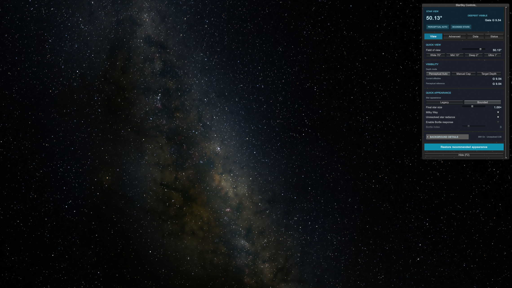
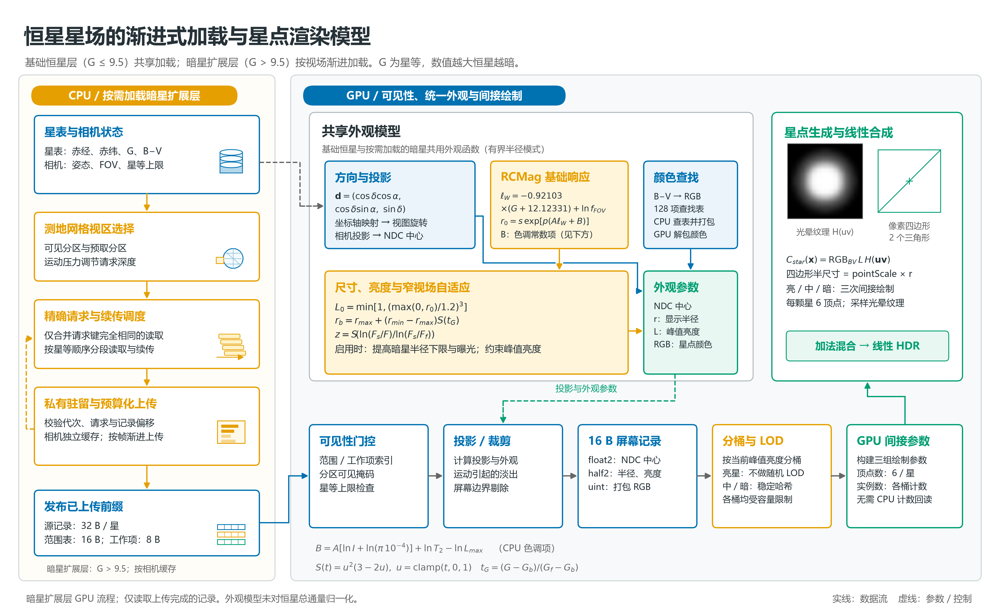
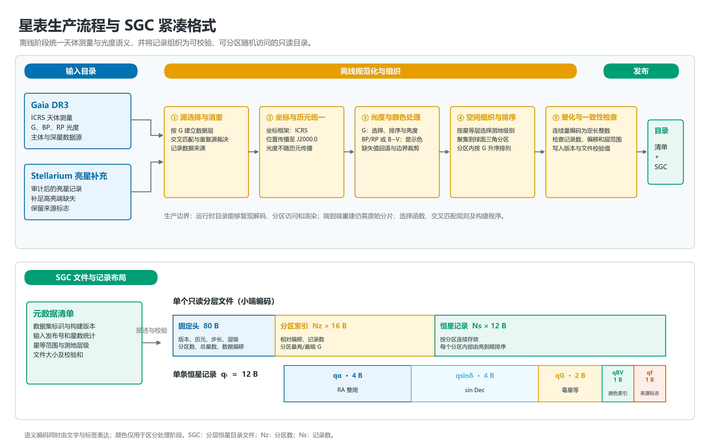
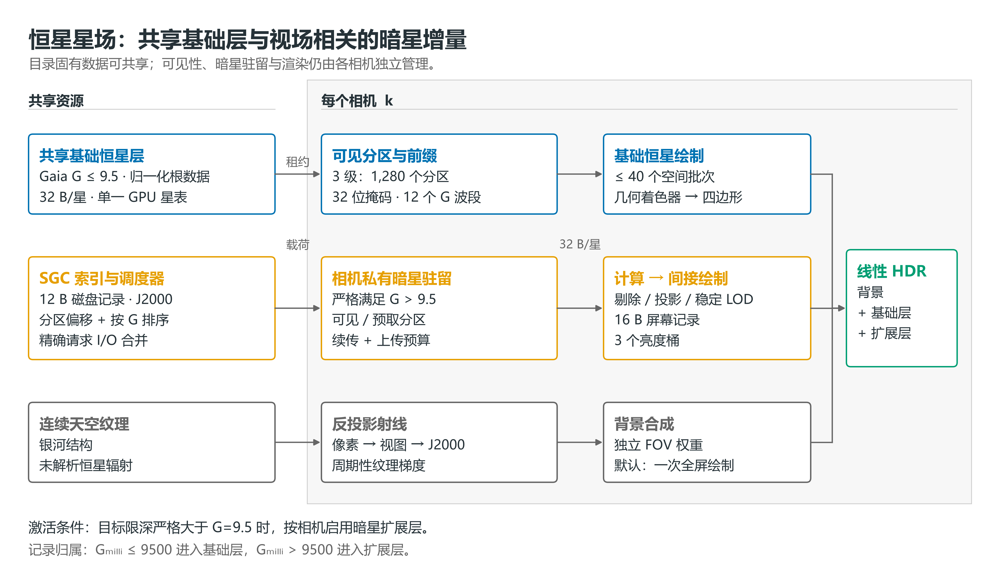
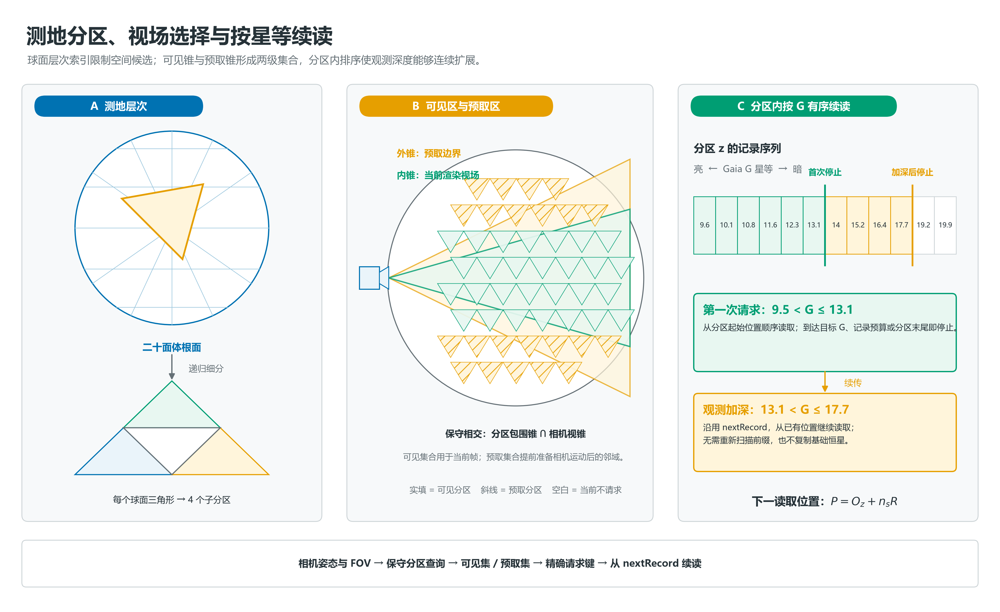
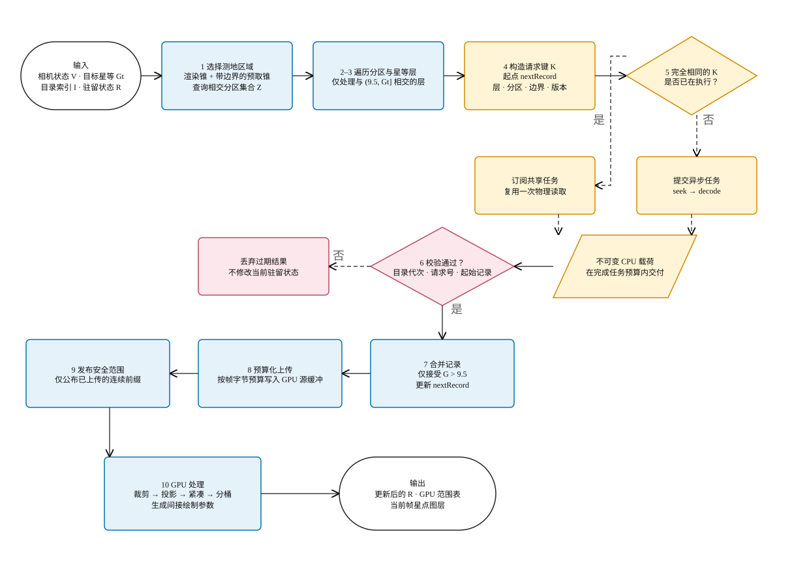
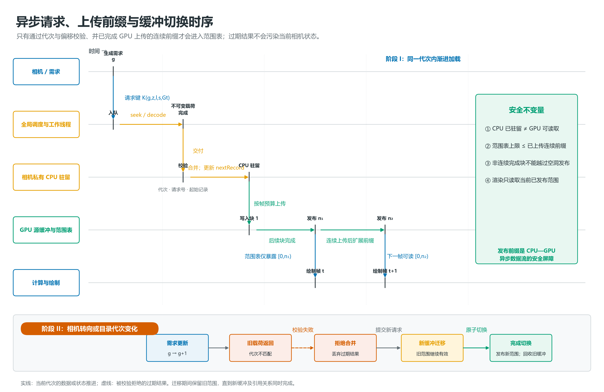
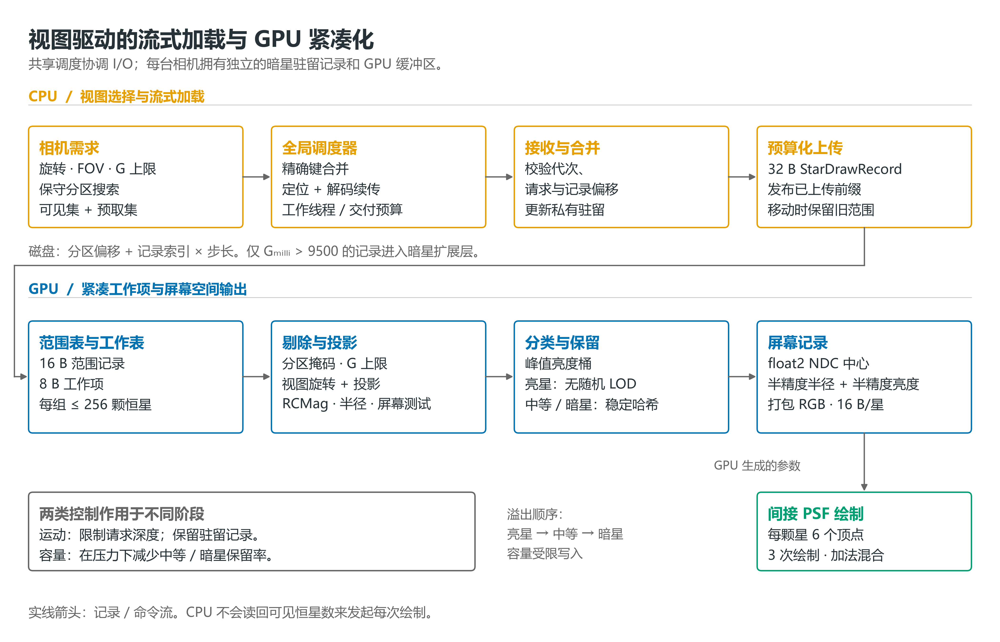
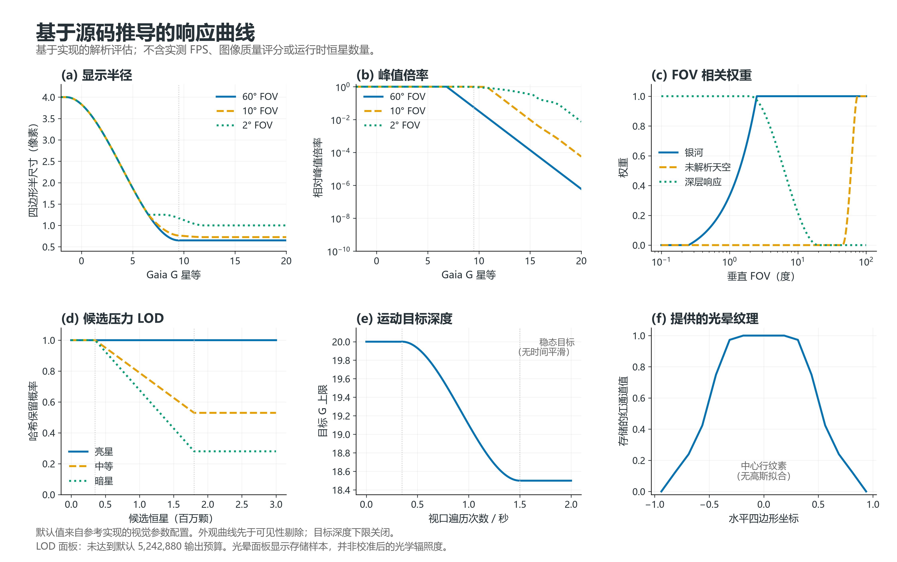
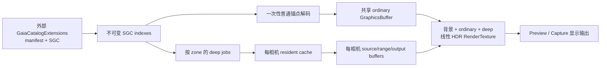

# 从十亿级星表到多相机实时星空——面向大规模恒星星表的视场驱动实时渲染方法

## 摘要

面向天文可视化、虚拟观测和沉浸式仿真等应用，大规模恒星星场渲染需要同时处理星表数据规模、相机视场差异、GPU 可见性筛选以及星点感知外观等问题。将完整星表常驻显存会产生显著的存储与候选处理开销，而仅将恒星预烘焙为天空纹理又难以支持观测深度变化、多相机独立视场和可查询的恒星属性。

本文提出一种基于分层数据所有权和视场驱动渐进加载的实时恒星渲染方法。该方法将星场分解为连续天空背景、跨相机共享的基础恒星层以及按相机维护的暗星扩展层；利用测地网格组织天球空间，通过按星等排序的分区记录实现可续传的局部读取；在 GPU 端采用范围表和紧凑工作项完成可见性判断、投影、感知外观计算、屏幕记录压缩及亮度分桶，并由 GPU 直接生成间接绘制参数。星点外观由星等、视场角、B−V 颜色和点扩散纹理共同确定，并以加法混合写入线性高动态范围（high dynamic range, HDR）目标。该方法在复用多相机公共目录数据的同时，使暗星工作集能够适应各相机独立的观测方向和限深，为大规模恒星目录的实时图形化表达提供一种可复现的工程框架。

**关键词：** 恒星星场；实时渲染；星表；流式加载；GPU 驱动绘制；点扩散函数

## 1 引言

恒星星场是天文可视化系统中的基础视觉对象，其渲染目标并非简单复现离散光点，而是在有限的计算与显示条件下维持方向、亮度、颜色和空间密度之间的一致关系。Gaia 等全天巡天已提供大规模天体测量和多通带光度数据[1–3]。对于小规模场景，将恒星作为普通粒子或预先写入天空纹理即可获得可接受结果。然而，当数据源扩展到大型恒星目录，且系统需要支持宽视场浏览、窄视场观测、动态星等上限以及多台独立相机时，传统方法会暴露出明显局限。完整目录一次性进入显存会放大加载、上传和逐帧筛选成本；为每台相机复制数据会造成资源冗余；固定天空纹理则无法保留恒星属性，也难以响应观测深度变化。

上述矛盾的根源在于，恒星数据与相机状态具有不同的所有权。恒星的天球方向、星等和颜色由恒星数据集决定，在相同数据源下具有共享条件；可见分区、预取范围、加载深度、屏幕投影和输出缓冲则由相机视场决定，必须独立维护。基于这一认识，本文采用分层星场表示，将稳定且高频使用的亮星组织为基础恒星层，将只有在更深观测中才需要的暗星组织为视场相关的扩展层，并将连续银河结构纹理与未解析恒星辐亮度纹理保留为背景场。后者用于表达宽视场下密集暗星的连续外观，不保存可查询的单星记录。该结构避免了恒星数据在“全部共享”与“全部复制”之间作简单折中，而是依据数据产生机制划分共享边界。

现有数字星空表达大体可分为三类：预计算全天纹理具有固定成本和良好连续性，却难以保留可查询的单星属性，且无法在不同的相机FOV参数下维持星点大小不变；逐星粒子或公告板能够保留目录语义，但在十亿级目录下受到内存、候选遍历和提交数量约束；基于空间索引的分块加载可以显著缩小工作集，却仍需处理多相机资源重复与异步上传一致性。Stellarium 等开源天文软件展示了目录驱动天空模拟的实用价值[4]。本文工作的侧重点不在于天文历算或目录服务，而是将目录点源以明确的空间、光度与资源所有权映射到实时图形管线。

本文关注恒星目录数据流的实时图形化方法，旨在使相关显示输出尽量接近天文摄影效果，以实现可视化仿真目标。研究内容包括星表到屏幕坐标的数据表征、测地分区上的渐进加载、GPU 可见性与紧凑化、星点感知外观以及多相机数据组织。整体流程如图 1 所示：

*图 1　视场驱动的恒星星场渐进加载与星点渲染流程*

本文的主要贡献包括三方面：第一，建立从 Gaia/Hipparcos 离线目录到运行时定长记录的数据表征方法，明确天体测量、光度、颜色和来源标志在渲染阶段的语义；第二，提出“目录固有数据共享、视场相关状态隔离”的多相机所有权模型，并以严格星等边界消除基础层与扩展层的记录重叠；第三，构建由磁盘续读、CPU 驻留、GPU 上传前缀、范围表紧凑化和间接绘制组成的预算约束流水线。

## 2 系统框架与恒星数据表征

### 2.1 研究数据与目录组成

Gaia 是以高精度天体测量为核心的全天巡天任务，Gaia DR3 数据集提供位置、自行、视差及多波段光度等信息[1–3]。本文所采用的主数据集以 Gaia DR3 的 $G<18$ 源为主体，并加入 1,553 条经审计的 Hipparcos 亮星补充记录，以减小高亮端因目录匹配或光度字段缺失造成的不完整性。两个补充数据集分别包含主表中因 Gaia 蓝/红光度（BP/RP）缺失、无效或超出颜色变换适用区间而未被纳入的 $G<18$ 源，以及 $18\leq G\leq20$ 的深星源。相关星表数据集在处理时，复用了开源项目 Stellarium 公开的成果[4]。

表 1 给出研究数据的组成。三个数据集在运行时保持逻辑独立，访问时先索引主数据集，再按观测限深组合补充数据集，从而避免在初始化阶段重新合并约 12 GiB 的目录文件（`.sgc文件`仅保留图形化渲染的必要数据字段，以压缩数据集体积）。统计量对应本文使用的数据版本。

*表 1　研究所用复合恒星目录的组成*

| 数据集 | 选择范围与作用 | 记录数 | SGC 层数 | 测地层级 |
|---|---|---:|---:|---|
| `gaia-g-lt-18-primary-mixed` | $G<18$ 主体及 Hipparcos 亮星补充 | 296,641,262 | 9 | 0–8 |
| `gaia-g-lt-18-color-supplement` | $G<18$ 颜色缺失或越界源补充 | 8,300,611 | 8 | 1–8 |
| `gaia-g-18-to-20` | $18\leq G\leq20$ 超深星层 | 755,530,258 | 1 | 9 |
| **合计** | — | **1,060,472,131** | **18** | — |

### 2.2 星表预处理与属性语义

从原始天文目录到运行时星表及背景纹理的处理可以概括为以下六个环节。

1. **源选择与补充。** 以 Gaia DR3 为主源，按 Gaia G 星等建立 $G<18$ 主数据集和 $18\leq G\leq20$ 深星数据集；在亮星端引入 Hipparcos 记录，并通过来源标记区分 Gaia 主源、Gaia 光度补充、Hipparcos 回退及混合补充。交叉匹配与重复源消解在离线阶段完成，实时阶段不再执行天体名称匹配。
2. **历元与坐标统一。** 坐标框架采用 ICRS，天体测量位置被传播或归一化到参考历元 J2000.0（JD 2451545.0）。Gaia 的观测 G 光度以及亮星补充所用目录光度不随坐标历元传播，也不进行距离模数修正；本文将其视为目录给定的观测光度，而不是由传播后位置重新推导的物理量。
3. **光度与颜色处理。** 排序、分层、加载上限和点源亮度使用实测 Gaia G 或带来源标记的合成 G；亮星补充记录可由 Johnson V 与有效 Gaia BP−RP 估计 G，部分记录则标记为由 Johnson V 与 Stellarium B−V 合成。颜色使用 Johnson B−V 语义，并预量化为运行时颜色表索引。缺色回退和颜色边界处理需与直接测光结果区分；颜色只控制显示色，不参与星等分层。具体光度关系见第 2.2.1 节。
4. **空间划分与排序。** 恒星按星等区间写入不同测地层级，再按球面三角分区聚集；每个分区内部按 G 从亮到暗升序排列。这一顺序是运行时按层跳过、星等上限早停和续传读取成立的前提。
5. **量化与一致性检查。** 连续量被编码为定长整数记录，数据集身份、星数、星等范围、记录步长和来源统计写入元数据清单。预处理结果通过构建版本和文件校验值建立数据可追溯性，使相同数据标识对应唯一的目录内容。
6. **天球背景准备。** 运行时分别使用连续银河结构图和未解析恒星辐亮度图。前者表达银河大尺度结构与尘埃暗带，后者提供密集暗星的连续外观；两者均不保留可查询的单星属性。现存未解析图为线性 EXR 等距柱状纹理，但其离线生产程序已遗失。第 4.2 节依据 Gaia Physical HEALPix12 Baked Skybox 的设计给出可复现的构建方法，并区分该参考设计与现存 EXR 的已知属性。

#### 2.2.1 Gaia 测光数据与恒星的亮度颜色

一颗恒星的亮度和颜色来自不同的测光信息。星表使用 Gaia G 星等控制恒星的可见性与亮度；颜色则由 Gaia BP、RP 波段数据预处理为 Johnson B−V 色指数。

预处理时，程序先计算 \(C=BP-RP\)，再使用 Gaia DR3 的转换关系：

\[ \begin{aligned} G-V&=-0.02704+0.01424C-0.2156C^2+0.01426C^3,\\ G-B&=\phantom{-}0.01448-0.6874C-0.3604C^2+0.06718C^3-0.006061C^4,\\ B-V&=(G-V)-(G-B). \end{aligned} \]

得到的 B−V 不以浮点数直接写入发布的星表，而是量化为一个 0–127 的索引：

\[ i=\operatorname{clip}_{[0,127]} \left(\operatorname{trunc}\bigl((B-V+0.5)\times31.75\bigr)\right). \]

每条运行时记录保存的是这个1 字节 B−V 索引和单独编码的 Gaia G 星等，不保存原始 BP/RP。渲染时，程序用索引查询从 Stellarium 移植的 128 项 RGB 色表，再按 G 星等计算出的亮度调节星点显示。换句话说，B−V 决定星色，G 主要决定星点有多亮；最终外观还会受到星点大小、曝光和光晕纹理的影响。

这个转换有适用范围。主星表默认只对 \(-0.5<BP-RP<4.0\) 的有效颜色数据使用上述关系；颜色补充星表对部分范围外数据采用边界颜色，对缺少可用 BP/RP 的恒星使用 \(B-V=0.65\) 的暖白色回退值。

> Stellarium 项目的公开脚本以 $B=G-Q(c)$ 近似 Johnson $B$，其中 $Q(c)=-0.006061c^4+0.06718c^3-0.3604c^2-0.6874c+0.01448$，故在常规分支中 $B-V=P(c)-Q(c)$[6–7]。脚本对 $c>2.2$ 的红端改取 $B=G+0.5c+1.6$；在 BP−RP 缺失而 G 已知的批量处理分支中，回退为估计的 $V=G$ 和 $B-V=0.65$。有 Gaia XP 合成 Johnson 测光时，其生成笔记本优先使用合成 $B-V$，多项式作为近似途径[6]。

项目将 Gaia G 定为恒星的统一亮度口径。Gaia 主体、颜色补充星表和 \(18\leq G\leq20\) 深星扩展，均直接采用星表目录中的 Gaia 星等 G，用它决定星等分层、区域内排序、可见性截止和点源亮度。在星等计算时，由于来自不同恒星数据集的 $G$、$G_{\rm BP}$、$G_{\rm RP}$ 与 Johnson $V$ 对应不同通带，不能将 $V$​ 直接作为 Gaia G 的测量值。记 $c=G_{\rm BP}-G_{\rm RP}$。Gaia EDR3 的经验关系给出 $G-V=P(c)$；用于 Stellarium 星表制作的公开脚本采用等价方向 $V=G-P(c)$[5–6]，本文在处理星表数据集时，沿用该公式：
$$
P(c)=-0.02704+0.01424c-0.2156c^2+0.01426c^3,
\qquad G_{\rm syn}=V+P(c).
$$

当记录同时具有可靠的 Gaia G 时，仍使用实测值；最后一式只用于已有 Johnson $V$、需要估计 Gaia G 的情形。Gaia 文档给出的适用颜色范围为 $-0.5<c<5.0$，拟合散布约为 0.03017 mag[5]。由此得到的 $G_{\rm syn}$ 是经验估计而非新的 Gaia 测量。

> 需要特殊处理的是 Hipparcos 亮星补丁。其中有观测 Gaia G 的恒星直接使用观测值；缺少可信 G 的 在离线阶段合成 G：利用 Johnson V 和 Gaia BP−RP，按 \(G_{\mathrm{syn}}=V+(G-V)(BP-RP)\) 计算；缺失 Gaia BP−RP 的恒星使用 Stellarium 项目数据集提供的 B−V 反求近似 BP−RP数据，再计算合成 G。数据同时记录星等来源，使观测值与合成值可以区分。发布为 `.sgc` 数据文件时量化为千分之一星等的整数。

### 2.3 紧凑目录格式与记录解码

为降低磁盘占用并支持分区随机访问，本文采用由元数据清单和只读分层文件组成的紧凑目录格式。分层文件使用小端编码，由 80 B 固定头、每分区 16 B 的索引项和连续的 12 B 恒星记录组成。文件头描述格式版本、测地层级、记录步长、分区数、历元、星等范围、总星数、索引与数据偏移以及“分区内按星等排序”标志；索引项给出分区数据相对偏移、记录数和分区星等上下界。读取阶段对格式标识、版本、J2000 历元、步长、分区数、偏移一致性、记录计数和文件完整性进行检查，以防止不兼容或截断数据进入渲染流程。

设一条磁盘记录为

$$
q_i=(q_{\alpha},q_{\sin\delta},q_G,q_{BV},q_f),
\tag{1}
$$

其中 $q_{\alpha}$ 为无符号 32 位整周赤经，$q_{\sin\delta}$ 为有符号 32 位正弦赤纬，$q_G$ 为有符号 16 位毫星等，$q_{BV}$ 与 $q_f$ 分别为 8 位颜色索引和来源标志。其解码关系为

$$
\alpha=2\pi\frac{q_{\alpha}}{2^{32}},\qquad
\sin\delta=\mathrm{clamp}\left(\frac{q_{\sin\delta}}{2^{31}-1},-1,1\right),\qquad
G=10^{-3}q_G.
\tag{2}
$$

颜色索引指向 128 项 B−V 颜色查找表；来源标志按 2 bit 一组记录天体测量模式、数据源类别、颜色模式和星等模式。逐帧着色仅使用方向、G 和颜色索引，来源标志则用于数据审计、异常定位及后续模型扩展。与直接保存四个浮点属性相比，12 B 记录降低了磁盘占用和随机读取带宽；进入 GPU 前，记录被展开为适合内存对齐和并行访问的 32 B 源记录。

图 2 汇总了从 Gaia DR3 与 Hipparcos 亮星补充记录到运行时目录的离线处理链，输入目录经源选择、历元统一、光度与颜色处理、测地分区、排序和量化后，形成元数据清单及可随机访问的分层文件。

*图 2　星表离线生产流程与 SGC 紧凑格式*

### 2.4 连续天空背景：从星表通量到全天辐亮度

项目用两张全天纹理构成连续背景：银河结构图描述银河带的大尺度形态，未解析恒星图描述大量暗星汇聚后的弥散星光。前者来自银河Milky Way 全天图；后者由预处理星表离线计算，保存为 \(1024\times512\) 的线性 HDR EXR，以记录的是按天区面积归一化的RGB 等效面亮度。

**离线生成未解析恒星图**

对星表中的第 \(i\) 颗恒星，取 Gaia G 星等 \(G_i\) 和 B−V 色表给出的颜色 \(\mathbf c_i\)。构建程序将星等换成相对通量，并用权重 \(w(G_i)\) 控制它进入背景图的比例：

\[ \mathbf f_i=\mathbf c_i\,10^{-0.4G_i}w(G_i), \qquad w(G)=t^2(3-2t), \qquad t=\operatorname{clamp}_{[0,1]} \left(\frac{G-(G_c-\Delta G)}{\Delta G}\right). \]

当前构建参数取 \(G_c=9\)、\(\Delta G=1\)，读取星表至 \(G=18\)。因此 \(G\leq8\) 的星对这张图没有贡献，\(8<G<9\) 的贡献平滑增加，\(G\geq9\) 时取完整权重。这里的权重只用于生成背景图；当前运行时的点星绘制是独立的，背景图并可由FOV视场调整相应亮度。

程序根据恒星的 J2000 单位方向 \(\mathbf d=(d_x,d_y,d_z)\) 计算赤经与赤纬：

\[ \alpha=\operatorname{atan2}(d_y,d_x)\pmod{2\pi}, \qquad \delta=\arcsin(d_z). \]

随后将其放入全天等经纬网格：

\[ x=\left\lfloor W\frac{\alpha}{2\pi}\right\rfloor,\qquad y=\left\lfloor H\left(\frac{\delta}{\pi}+\frac12\right)\right\rfloor,\qquad \mathbf A_{xy}=\sum_{i\to(x,y)}\mathbf f_i. \]

\(\mathbf A_{xy}\) 仍是像素内累积的通量。由于等经纬图靠近两极的像素覆盖天区更小，程序为每个赤纬行计算立体角：

\[ \Omega_y=\frac{2\pi}{W} \left(\sin\delta_{y+1}-\sin\delta_y\right),\qquad \delta_y=-\frac{\pi}{2}+\frac{\pi y}{H}. \]

将 \(\Omega_y\) 换算为平方角分后，使用代码中的标定常数 \(K\) 得到面亮度：

\[ \mathbf R^{(0)}_{xy} =\frac{K\,\mathbf A_{xy}} {\Omega_y(10800/\pi)^2}, \qquad K=2(2025000)(3600)\,10^{-0.4(12.12331)}. \]

最后对 \(\mathbf R^{(0)}\) 做角度高斯模糊，当前标准差为 \(0.5^\circ\)。经度方向的像素角宽随 \(\cos\delta\) 缩小，因此模糊半径按赤纬逐行调整；经度接缝循环取样，越过两极时则翻转纬度并平移半圈经度。模糊后，程序还按通道校正全天球面积分，尽量保持模糊前后的总光量。所得 \(\mathbf R\) 才写入 EXR。

**运行时采样与合成**

绘制背景时，着色器为每个屏幕像素依据当前相机投影重建视线，转换到 J2000 方向 \(\mathbf d\)，再分别查询两张全天图。未解析恒星图使用标准赤经、赤纬坐标：

\[ (u_{\rm star},v_{\rm star}) = \left(\frac{\alpha}{2\pi}, \frac{\delta}{\pi}+\frac12\right). \]

银河结构图沿用其自身的纹理方向约定：

\[ (u_{\rm MW},v_{\rm MW}) = \left( \frac{\operatorname{atan2}(d_x,d_y)}{2\pi}, \frac{\arccos(-d_z)}{\pi} \right). \]

两张图的横向坐标都具有周期性。采样器会把跨越经度接缝的纹理梯度折回最短周期，再选择 mip 级别，避免接缝出现模糊条带。

两层背景按视场角分别淡入。令 \(S(t)=t^2(3-2t)\)，默认权重为：

\[ w_{\rm MW} =\operatorname{clamp}_{[0,1]} \left(\frac{\mathrm{FOV}-0.25^\circ}{2.5^\circ-0.25^\circ}\right), \qquad w_{\rm star} =S\!\left( \operatorname{clamp}_{[0,1]} \left(\frac{\mathrm{FOV}-45^\circ}{75^\circ-45^\circ}\right) \right). \]

银河样本经过亮度、色调和饱和度调整；未解析图先计算亮度
\(Y=0.2126R+0.7152G+0.0722B\)，再把整组 RGB 乘以显示适应后的亮度比 \(Y_{\rm display}/Y\)，并施加强度与 \(w_{\rm star}\)。两层结果在 HDR 缓冲区相加，点星随后由独立路径绘制。这样，相机转向时背景始终按同一 J2000 天球方向采样；缩放时，则从强调单颗恒星逐渐过渡到银河结构和弥散星光。

### 2.5 分层星场与多相机数据所有权

对于第 $k$ 台相机，线性空间中的星场图像可表示为

$$
C_k=C_{\mathrm{bg},k}
+\sum_{i\in A_k}C_{i,k}
+\sum_{j\in E_k}C_{j,k},
\tag{3}
$$

其中，$C_{\mathrm{bg},k}$ 表示银河结构图和未解析恒星图构成的连续背景，$A_k$ 表示基础恒星集合，$E_k$ 表示暗星扩展集合。基础恒星层取 $G\leq9.5$ 的记录，其内容由目录本身决定，因此可在使用同一目录根的相机之间共享；暗星扩展层取严格满足 $G>9.5$ 的记录，其选择、驻留和 GPU 输出依赖当前相机的观测方向、视场角与星等上限。二者在点源记录所有权上互不重叠，扩展层只增加暗星细节，而不复制基础恒星。未解析背景与暗星点源属于不同表示，可能覆盖相同的星等范围；式（3）是图像合成关系，不意味着逐源通量不存在重叠。

该系统的资源关系如图 3 所示。目录索引和基础恒星 GPU 缓冲属于可共享资源，每台相机仍保留自己的可见掩码、投影参数、材质状态与命令缓冲。暗星扩展层进一步按相机维护请求状态、驻留缓存、源记录缓冲、屏幕记录缓冲和间接绘制参数。连续背景同样需要逐相机重建观察射线并写入各自的渲染目标。

*图 3　恒星星场的分层资源组织*

在单相机条件下，目录索引、视区选择、异步分区解码、CPU/GPU 缓存和绘制命令可以由同一渲染上下文维护。这种组织方式数据路径较短，但直接扩展到多相机后，$G\leq9.5$ 的稳定亮星会随相机数量被重复解码和上传。由于这些记录只由目录和固定星等边界决定，而不依赖具体视场，将其复制到每个相机上下文并非必要。

基于上述观察，本文将数据所有权拆分为三类：进程级目录资源保存不可变的基础恒星 GPU 缓冲；相机级基础恒星状态保存可见掩码、投影参数和绘制命令；相机级暗星状态保存视场相关的请求、驻留、源记录与输出缓冲。未解析恒星背景纹理的天球采样与条件启用的暗星增量均按相机计算。研究数据中的基础恒星层包含 294,513 条 $G\leq9.5$ 记录，按 32 B GPU 源记录计算约占 8.99 MiB。对 $N$ 台使用同一目录的相机，该划分可避免约 $(N-1)\times8.99$ MiB 的基础恒星源缓冲复制，但相机私有投影、光栅化和输出成本仍随相机数量增加。

### 2.6 从赤道坐标到引擎方向

解码后的赤经 $\alpha$ 和赤纬 $\delta$ 首先转换为 J2000 赤道坐标系中的单位方向

$$
\mathbf d=
(\cos\delta\cos\alpha,\ \cos\delta\sin\alpha,\ \sin\delta).
\tag{4}
$$

随后，方向向量根据图形引擎的坐标轴约定完成映射，并通过相机旋转与投影得到归一化设备坐标。恒星被视为无限远点，因此相机平移不改变其屏幕位置；相机旋转、视场角、画幅比例和投影形式构成主要几何变量。该建模方式使目录方向保持静态，而视图相关计算可以在 GPU 中逐帧并行完成。

本文采用如下从 J2000 坐标到图形坐标的轴映射：

$$
(x_g,y_g,z_g)=(y_{J2000},z_{J2000},-x_{J2000}).
\tag{5}
$$

未解析恒星背景纹理、基础恒星路径、暗星计算路径和几何校验使用相同的轴约定。若任一路径交换坐标轴、反转赤经或遗漏相机滚转，合成结果会出现背景镜像或点源错位。

### 2.7 测地分区与星等有序访问

为了支持观测相机的局部访问功能，星表按照测地网格划分天球。网格以二十面体为根，每一级将球面三角形继续细分为四个子区域。相机视锥与分区包围锥进行保守相交，从而得到可见分区及其外围预取分区。每个分区内部按星等排序，任一后续读取位置可写为

$$
P=O_z+n_sR,
\tag{6}
$$

其中，$O_z$ 为分区在文件中的起始偏移，$n_s$ 为已读取记录数，$R$ 为单条磁盘记录长度。式（6）允许系统在观测深度增加时从已有位置继续读取，而无需重新扫描整个分区，也为按帧控制 I/O 和上传量提供了基础。

图 4 将上述机制分为三个相互关联的尺度：测地层次描述球面三角形的一对四递归细分；双视锥示意当前可见集合与外围预取集合；单个分区内的星等有序序列则说明目标限深增加时如何从 `nextRecord` 继续读取。可见锥决定当前渲染分区，扩大后的预取锥准备邻近分区；分区内按 G 升序排列的记录支持从既有偏移继续加深读取。图中的二维视锥截面仅用于解释集合关系，实际查询在单位球面上以分区包围锥进行保守相交。

*图 4　测地分区、视场选择与按星等续读原理*

## 3 视场驱动的渐进加载与驻留管理

### 3.1 从可见视锥到稳定的分区需求

暗星扩展层的工作集随相机视场变化。系统从测地网格的根三角形出发，用分区包围锥与扩展视锥的保守相交测试逐级剪枝，再区分当前用于绘制的分区与视场边缘的预取分区。搜索范围包含一定角度余量，使相机缓慢转向时，邻近分区有机会先于画面边界进入加载流程。对待加载的分区，系统以分区中心方向 $\mathbf c_z$ 与视线中心 $\mathbf v$ 的点积 $p_z=\mathbf c_z\cdot\mathbf v$ 作为中心优先级；较大的 $p_z$ 通常先获得请求机会。这样，有限的加载名额优先服务画面中心，而外围预取用于降低随后转向时的等待。

分区选择也不必响应每一次极小的浮点变化。缓存的选择状态记录视线中心、搜索 FOV、扩展余量、点源所有权边界、目录代次和参与搜索的数据层。默认情况下，方向变化不超过 $0.05^\circ$、搜索 FOV 变化不超过 $0.01^\circ$，且原有分区余量仍覆盖新视场时，可以复用上次选择；数据层或目录拓扑改变则重新搜索。迟滞减少缓慢移动时反复遍历网格和改写请求队列，同时仍由保守余量保证视场覆盖。快速转向会触发新的选择，已经离屏的请求随之取消；迟到的结果在合并前仍须通过代次和请求校验。

### 3.2 续读、合并与异步结果校验

系统将分区编号、起始记录、星等上限、排他下限、数据标记和格式版本组合为请求键。只有请求键完全相同的任务才共享一次物理读取和不可变的 CPU 载荷；部分重叠的视场不会自动合并成同一个任务。每台相机仍独立保存其订阅、续读位置与驻留状态。为避免滑块或 FOV 的微小变化反复发起相近请求，目标加载星等先以默认 $\Delta G=0.1$ mag 向上量化，再受分区及目录上限约束。近似地，可写为

\[
G_{\rm load}=\Delta G\left\lceil\frac{G_{\rm target}}{\Delta G}\right\rceil,
\qquad \Delta G=0.1\ \mathrm{mag}.
\]

这一量化值决定预先读到哪里，最终绘制仍采用当前精确的可见星等上限。若某分区已读至 $G=16.2$，目标加深为 $G=17.0$，工作线程便从保存的记录偏移继续顺序解码，直到达到新的星等上限、记录预算或分区末尾。后台线程只处理文件访问与记录解码；`GraphicsBuffer` 创建、扩容和上传命令仍在主线程进行。完成载荷进入相机缓存前，要核对目录代次、请求编号和预期记录偏移。相机转向、目录切换或续读位置改变后，旧结果不能写入新的驻留状态。图 5 概括了这一过程。

*图 5　单个相机的视场驱动增量更新流程*

图中的相同请求合并只作用于物理读取和不可变 CPU 载荷，异步校验则是载荷进入当前相机驻留状态之前的安全屏障。

### 3.3 局部预算与进程级准入

渐进处理受两级预算约束。单台相机可以限制未完成请求数、每帧接收并合并的分区数、每帧新增候选分区数，以及每个实际渲染帧录制的源缓冲上传量；进程级调度器再对所有相机共同使用的物理工作线程、完成交付和上传带宽施加总量限制。当前参考配置中，每台相机的上限分别为 8 个未完成请求、12 个完成分区、128 个新增候选分区和 16 MiB 源记录上传；进程级对应的主要上限为 8 个物理工作线程、每帧 24 次完成交付及 32 MiB 源记录上传。这些值是可调的工程预算，不代表每台相机独占同等数量的线程或带宽。

设第 $k$ 台相机本帧实际上传量为 $U_k$，本地限额为 $B_k$，进程级上传限额为 $B_{\rm global}$，则调度目标满足

\[
0\leq U_k\leq B_k,
\qquad \sum_k U_k\leq B_{\rm global}.
\]

因此，将一台相机的局部上限调高，只是允许它提出更多需求；多相机并发时仍需经过进程级准入。预算抑制突发工作量，但单帧成本还受缓冲扩容、命令提交和实际星点覆盖面积影响，不能仅由请求数量推断。

### 3.4 驻留缓存、GPU 容量与渐进发布

完成解码的暗星先进入相机私有的驻留缓存。不可见分区默认可保留 360 帧，以便短时间转回时复用；超过保留时间或默认 256 MiB 的缓存预算时，系统优先淘汰不可见且最久未使用的分区，当前可见分区不会仅为满足缓存预算而被直接删除。该预算依据仍被持有的记录和批次估算占用触发淘汰，不能等同于设备上已分配显存的硬上限：每台深空相机另有一个容纳已上传源记录的 `GraphicsBuffer`，其容量通常按历史峰值增长，缓存淘汰后也不会立即随活记录数收缩。若分配容量为 $C_{\rm source}$ 条，则仅源记录缓冲的占用约为

\[
M_{\rm source}=32 C_{\rm source}\ \mathrm{bytes},
\]

这还未计入范围表、工作表、屏幕输出桶和渲染目标。分配器复用空闲区间，并按批次容量增长；全局源缓冲扩容还受设备单缓冲大小约束，在估算上扣除 1–16 MiB 安全余量，并按 65,536 条记录对容量上限对齐。若已达到安全容量，系统保留现有暗星，暂停继续加深与新增请求，等待不可见记录释放可复用区间。

从驻留记录生成的 GPU 源记录固定为 32 B：`float4` 保存 J2000 单位方向与 Gaia G，随后依次保存打包 RGB、分区编号、数据集标记和填充字段。B−V 索引在 CPU 端查询 128 项颜色表并打包为 RGB，使 GPU 端的普通星与深空星使用一致的方向、光度和颜色语义。源缓冲上传通过相机 `CommandBuffer` 中的 `SetBufferData` 按帧推进，大批次可以拆成多帧；默认单相机上传预算为每个实际渲染帧 16 MiB，并同时受进程级准入限制。

CPU 已驻留不意味着对应 GPU 记录已经完整可读。对于一个按顺序上传的批次，范围表只公布已上传完成的连续前缀。若批次共有 $N$ 条记录，本帧仅完成前 $n$ 条，则提交给 Compute 的范围满足 $0\leq N_{\rm published}\leq n\leq N$；尚未写入的后缀不会成为候选。源缓冲需要扩容或搬迁时，新缓冲按预算分批写入，旧范围继续服务当前绘制，直到新布局完整可用才切换，旧缓冲在切换后延迟约两帧释放。

图 6 展示异步读取与上传前缀的先后关系，图 7 总结这一路径如何把相机需求转成可供 GPU 筛选的范围。

*图 6　异步请求、上传前缀与缓冲切换时序*

*图 7　暗星扩展层的渐进加载和 GPU 数据准备*

相机快速旋转或缩放时，持续追求原始最深星等会增加无效请求和短期候选数量。系统因此根据视口遍历速度生成运动压力，在配置范围内降低当前请求与绘制的深空星等上限，并以较快进入、较慢恢复的时间响应避免反复振荡。此过程不清空已有驻留记录；相机稳定后可从保存的续读位置继续加深。第 4.2 节进一步说明运动限深与 GPU 密度抽样如何共同控制星点绘制。

## 4 GPU 可见性、外观计算与星点生成

### 4.1 目录点源的 GPU 生成

上传到 GPU 的源记录仍是潜在候选。系统使用范围记录描述源缓冲中的连续区段及其可见掩码，并将每个范围进一步拆分为至多 256 条记录的工作项。计算着色器以工作项为调度单位，依次执行范围合法性判断、分区掩码测试、星等上限测试、视图旋转、投影、外观计算、运动淡出和屏幕边界剔除。通过筛选的 32 B 源记录被压缩为 16 B 屏幕记录，后者仅保存归一化设备坐标（normalized device coordinates, NDC）中心、半精度半径和亮度以及打包颜色。该压缩减少了后续绘制阶段的数据访问量，并使绘制缓冲只包含实际可见的星点。

星点外观由星等、FOV、显示适应参数和颜色共同决定。系统首先构造与星等相关的对数项

$$
\ell_W=-0.92103(G+12.12331)+\ln f_{\mathrm{FOV}},
\tag{7}
$$

再计算原始 RCMag 半径

$$
r_0=s\exp\{p(A\ell_W+B)\},
\tag{8}
$$

其中，$A$ 表示世界与显示适应指数之比，$B$ 汇集输入尺度、适应中间项和最大显示亮度等与单颗恒星无关的色调常数。设相对和绝对星点尺度分别为 $s_r$ 与 $s_a$，参考实现取 $p=0.7s_r$、$s=(70s_a)^{0.7s_r}$；默认 $s_r=s_a=1$。基础峰值亮度定义为

$$
L_0=\min\left[1,
\left(\frac{\max(0,r_0)}{1.2}\right)^3\right].
\tag{9}
$$

在有界星点模式下，显示半径不直接等于 $r_0$，而是根据星等在最大与最小半径之间进行平滑插值：

$$
r_b=r_{\max}+(r_{\min}-r_{\max})S(t_G),
\qquad
S(t)=u^2(3-2u),
\quad u=\mathrm{clamp}(t,0,1).
\tag{10}
$$

其中，$t_G=(G-G_b)/(G_f-G_b)$，$G_b$ 和 $G_f$ 分别表示最大半径与最小半径对应的星等。峰值亮度与屏幕覆盖范围由此可以分别控制，从而限制极亮恒星的屏幕扩张，并为暗星保留最小可见尺寸。窄视场条件下的自适应权重表示为

$$
z=S\left(
\frac{\ln(F_s/F)}{\ln(F_s/F_f)}
\right),
\tag{11}
$$

其中，$F$ 为当前 FOV，$F_s$ 和 $F_f$ 分别为响应开始与完全生效的视场阈值。随着 $F$ 减小，$z$ 增大，系统可以提高暗星半径包络和曝光档位，并通过随星等变化的峰值上限维持亮度层次。该过程面向有限分辨率显示中的视觉可读性，不能直接视为能量守恒或科学测光模型。图 8 给出了相关公式在默认参数下的解析响应。

*图 8　星点半径、峰值亮度、视场响应、候选压力 LOD 和光晕纹理的解析曲线*

表 2 汇总图 8 及式（7）—（11）采用的主要默认参数。世界与显示适应亮度、显示峰值和伽马值共同进入式（8）中的常量项；其余参数控制有界半径和窄视场暗星增强。默认值描述参考实现的视觉标定点，而非普适的天文测光常数。

*表 2　星点外观模型的主要默认参数*

| 参数 | 默认值 | 作用 |
|---|---:|---|
| 世界适应亮度 | 1.0 | RCMag 世界端适应量 |
| 显示适应亮度 | 50.0 | RCMag 显示端适应量 |
| 最大显示亮度 | 100.0 | 峰值归一化上限 |
| 显示伽马 | 2.2222 | 显示适应曲线参数 |
| 相对/绝对星点尺度 | 1.0 / 1.0 | 控制式（8）的 $p$ 与 $s$ |
| $G_b,G_f$ | $-1.5,9.5$ | 有界半径插值端点 |
| $r_{\min},r_{\max}$ | 0.65 px / 4.0 px | 基础屏幕半径范围 |
| $F_s,F_f$ | $20^\circ,2^\circ$ | 窄视场响应开始/完全生效阈值 |
| 暗星尺寸过渡星等 | 8.0–12.0 | 半径包络的星等区间 |
| 暗星半径包络 | 1.25–1.0 px | 完全窄视场响应下的半径下限 |
| 曝光补偿星等区间 | 15.5–18.0 | 暗星曝光增强区间 |
| 最大曝光补偿 | 2.0 档（stops） | 线性亮度最多放大 4 倍后截断 |
| 最暗端峰值上限 | 0.16 | 限制完全窄视场响应下的暗星峰值 |

B−V 索引通过查找表转换为恒星颜色，并与半径、亮度和投影中心共同写入屏幕记录。可见记录随后按照峰值亮度划分为亮、中、暗三个输出桶。

> 亮星不采用随机细节层次（level of detail, LOD）抽样，中等和暗星则使用由源记录索引与分区索引构造的稳定哈希进行选择。当源布局和观察状态稳定时，该方法能够避免逐帧随机选择造成的闪烁。实现细节见 4.2、5.1节。

各桶的实例数量由 GPU 原子计数获得，随后由另一计算内核生成间接绘制参数，CPU 无需读回可见恒星总数。绘制阶段将每颗恒星展开为由两个三角形组成的屏幕四边形，并在片元阶段采样共享的光晕纹理 $H(\mathbf{uv})$。最终星点颜色可写为

$$
C_{\mathrm{star}}(\mathbf{x})
=\mathrm{RGB}_{BV}\,L\,H(\mathbf{uv}).
\tag{12}
$$

其中，$\mathrm{RGB}_{BV}$ 为颜色查找结果，$L$ 为峰值亮度。所有星点采用加法混合写入线性 HDR 目标，连续背景、基础恒星层和暗星扩展层在同一线性空间完成合成，随后再进入曝光、色调映射、显示或科学捕获流程。

### 4.2 深空星点的 LOD：先控制深度，再控制密度

超深空视场可能同时包含数百万条候选恒星。项目采用两级 LOD 控制绘制负担：相机快速移动时收浅深空星等上限；候选星过于密集时，在 GPU 上稳定地减少中、暗星数量。普通视场共享的 \(G\leq9.5\) 亮星层不受运动深度控制影响。

运动 LOD 根据相机转动和视场角变化，估算每秒跨越多少个当前视场。默认从 \(0.35\) 个视场/秒开始施加压力，到 \(1.5\) 个视场/秒达到最大压力。若原本请求显示到 \(G=20\)，最大压力时会将深空增量的有效上限逐渐收至 \(G=18.5\)；若请求上限本来更亮，则不额外收浅。压力以较快的速度进入、较慢的速度退出，星等边界也有短暂淡出，避免相机刚停下时大量暗星同时跳回。已加载的星表数据仍留在缓存中，因此恢复深度通常无需重新读盘。

第二级发生在 Compute 绘制路径。CPU 先从可见分区中截取满足当前星等上限的记录，得到候选数 \(N\)。默认在 \(N>350\,000\) 时开始降低密度，到 \(N=1\,800\,000\) 达到预设强度。令

\[ p=\operatorname{clamp}_{[0,1]} \left(\frac{N-350\,000}{1\,800\,000-350\,000}\right), \]

中亮星与暗星的保留率分别为

\[ r_{\rm medium}=1-(1-\sqrt{0.28})p,\qquad r_{\rm faint}=1-(1-0.28)p. \]

因此在最大预设压力下，约保留 53% 的中亮星和 28% 的暗星。这个 \(N\) 是逐星投影和屏幕裁剪前的候选数，并非最终画面中的星数。

GPU 为每颗候选星计算投影位置、半径和峰值亮度，然后按峰值亮度分为亮、中、暗三桶。默认亮度达到 \(0.35\) 的星直接进入亮桶；亮度在 \(0.05\) 到 \(0.35\)​ 之间的星进入中桶；更暗的星进入暗桶。亮桶直接写入；中、暗桶则计算

\[ h_i= \frac{ H\!\left(\text{sourceIndex}_i\ \oplus\ (\text{zoneIndex}_i\cdot\mathtt{0x9e3779b9})\right) \ \&\ \mathtt{0x00ffffff} }{2^{24}}, \]

仅当 \(h_i\leq r_{\rm medium}\) 或 \(h_i\leq r_{\rm faint}\) 时写入相应桶。\(H\) 是固定的整数混合函数，输入不含帧号；因此源记录布局和观察状态稳定时，同一颗星每帧会得到相同结果，不会因逐帧重新掷随机数而闪烁。

当候选数超过配置的输出预算 \(C\) 时，系统还会依据 \(C/N\) 进一步压低中、暗星保留率。亮星不参与哈希抽样，但输出桶各有容量：亮桶满后尝试转写中桶，中桶满后尝试暗桶，最终仍可能因容量耗尽而截断。由此，LOD 优先保留视觉上突出的恒星，同时为密集深空视场提供可控的 GPU 绘制规模。

## 5 方法性质与复杂度

### 5.1 深空暗星的计算流程与并行组织

深空恒星的 GPU 绘制从一张紧凑的工作表开始。CPU 根据当前可见的空间分区和已上传的星等前缀，为每段连续星表记录建立一个 `range`，其中保存源缓冲区偏移、记录数、可见分区掩码等信息。每个 `range` 再按 256 颗候选星切分为工作项，因此需要启动的计算线程组数为

\[ N_{\mathrm{groups}}=\sum_i\left\lceil\frac{N_i}{256}\right\rceil , \]

其中 \(N_i\) 是第 \(i\) 段的候选记录数。这样的组织方式让每个线程组对应一段实际存在的记录，避免为了容纳最长分段而给大量短分段分配空线程。

第一个 Compute kernel `CullProjectRanges` 每组启动 256 个线程，原则上由一个线程处理一颗候选星。线程先检查分区掩码和当前星等上限，再把恒星方向投影到屏幕，计算星点半径与峰值亮度，并排除落在视口之外或亮度过低的记录。通过检查后，它将屏幕中心、半径、亮度和颜色压入一条 16 字节的 `ScreenStarRecord`。亮度决定记录进入亮、中、暗哪个输出桶；中星和暗星还会用源记录索引及分区索引构造稳定哈希，按当前 LOD 保留率决定是否写入。亮星跳过这一步随机抽样，但三个桶仍受输出容量保护。

筛选结束后，第二个 Compute kernel `BuildIndirectArgs` 读取三个桶的 GPU 计数，为每个桶写入一组间接绘制参数：

\[ \mathrm{args}_b= \bigl(6,\ \min(C_b,K_b),\ 0,\ 0\bigr), \qquad b\in\{\text{亮、中、暗}\}, \]

其中 \(C_b\) 是桶计数，\(K_b\) 是桶容量。“6”表示每颗星使用 6 个顶点组成两枚三角形，实例数则是该桶最终绘制的星数。随后程序分别对暗、中、亮三个桶调用一次 `DrawProceduralIndirect`。每个桶一次绘制，每颗入选恒星只作为其中一次绘制的一个实例。顶点着色器通过 `SV_InstanceID` 读取屏幕记录并展开星点四边形，片元着色器再采样光晕纹理。桶内星数始终留在 GPU 上，CPU 不必为每帧的可见计数执行回读。

当设备支持 Compute、间接参数缓冲和实例化等功能时，采用上述 Compute 筛选 + 三桶间接绘制 流程。若这些条件不满足，则进入几何着色器回退路径：程序按可见空间批次提交 `DrawProcedural(Points)`，由几何着色器逐点完成筛选、投影和四边形展开。两条路径沿用相同的星表颜色、光度与光晕语义，但工作分配不同：默认路径的绘制提交数固定为三个桶，回退路径的提交数随可见批次数变化，并让更多候选点进入图形管线。

项目中共享的普通亮星（\(G\leq9.5\)）另由普通星渲染器按批次走点与几何着色器路径，不属于这里的三次深空间接绘制。

### 5.2 存储与计算复杂度

表 3 列出研究数据和核心中间表示的规模。磁盘总量与记录数由目录元数据统计，基础层数量由 $G\leq9.5$ 的所有权规则确定，GPU 记录大小由数据布局给出。

*表 3　项目数据规模与核心记录布局*

| 指标 | 数值 | 含义 |
|---|---:|---|
| 目录记录总数 | 1,060,472,131 | 三个数据集记录数之和 |
| 分层目录总大小 | 12,865,492,061 B（约 11.98 GiB） | 不计说明性元数据文件 |
| 磁盘恒星记录步长 | 12 B | 随机读取的最小定长记录 |
| 主数据集层数 | 9（level 0–8） | 星等区间与空间层级联合组织 |
| $18\leq G\leq20$ 分区数 | 5,242,881 | level 9 分区及一个附加全局槽 |
| 共享基础层记录数 | 294,513 | 满足 $G\leq9.5$ 的记录 |
| 共享基础层 GPU 源缓冲 | 9,424,416 B（约 8.99 MiB） | $294,513\times32$ B |
| 暗星 GPU 源/屏幕记录 | 32 B / 16 B | 紧凑化前后的单记录大小 |

对 $N$ 台使用同一目录根的有效相机，若每台均持有一份基础恒星源缓冲，则该部分显存为 $N M_o$；共享后为 $M_o+\sum_k M_{v,k}$，其中 $M_o\approx8.99$ MiB，$M_{v,k}$ 表示相机私有的材质、可见掩码、命令及输出状态。因而仅基础恒星源记录一项的理论节省量为

$$
\Delta M=(N-1)M_o.
\tag{13}
$$

式（13）量化了本文所有权重构中可严格共享的那一部分。

设第 $k$ 台相机在一帧内公布的 GPU 候选记录数为 $N_{c,k}$，紧凑后的可见记录数为 $N_{v,k}$，新读取记录数为 $\Delta N_{s,k}$。分区索引使磁盘工作量与新增记录近似成正比，即 $O(\Delta N_{s,k})$，而非与完整目录规模成正比。GPU 裁剪与外观计算对每个候选执行常数次操作，复杂度为 $O(N_{c,k})$；紧凑后的光栅化和片元开销由 $N_{v,k}$、星点覆盖面积及输出分辨率共同决定。对 $K$ 台相机，点源数据的总体存储可表示为

$$
M_{\mathrm{total}}
=M_o+\sum_{k=1}^{K}
\left(M_{\mathrm{resident},k}+M_{\mathrm{output},k}+M_{\mathrm{view},k}\right),
\tag{14}
$$

其中 $M_o$ 为共享基础层，后三项分别表示暗星驻留、GPU 输出和相机视图状态。式（14）说明，共享策略消除的是目录固有数据的重复副本，而不能消除与相机视场和像素输出相关的线性增长项。

## 6 讨论

本文所述方法的主要特征在于把数据规模问题转化为所有权与工作集问题。基础恒星层的集合不依赖具体视场，因此可以按目录根共享不可变 GPU 缓冲；暗星扩展层的可见范围和加载深度由相机决定，因而采用独立驻留与独立 GPU 输出。相同请求的物理读取与 CPU 载荷可以短期共享，但不同相机的源缓冲、屏幕记录、投影与渲染目标仍需分别维护。这一边界使多相机系统能够减少重复数据准备，但是逐相机像素成本仍会随分辨率和相机数量增长。

计算着色器中的紧凑化把星表记录与实际绘制实例分离。其优势不仅体现在减少无效绘制，还体现在避免 CPU 读取 GPU 可见计数。范围表、工作项和屏幕记录构成显式的中间表示，使上传完整性、分区可见性、候选规模和输出容量均可独立观察。运动与稳定哈希 LOD 则在候选压力较高时提供连续的密度退化方式，以满足特定的性能需求。

外观模型将星等映射为屏幕亮度与半径，并在窄视场中提高暗星可读性。该策略适合实时展示和观测交互，但其输出受到显示分辨率、光晕纹理、颜色空间、采样过滤、曝光和色调映射共同影响。式（7）—（12）描述的是感知渲染响应，而非经过仪器标定的光学辐照度。若系统用于定量天文分析，应另外建立从目录光度到传感器响应的标定关系。

所提方法仍存在若干适用边界。恒星采用无限远方向模型，未在本文流程中引入自行、周年视差或光行差；解析投影需要针对非对称投影、抖动投影和双目渲染分别考察。

## 7 结论

本文提出一种面向大型恒星目录的视场驱动实时渲染方法。该方法在 ICRS 框架下将天体测量位置统一到参考历元 J2000.0，以 Gaia G 和 B−V 颜色索引统一光度与显示语义，并用 Gaia BP−RP 经验关系处理部分仅有 Johnson V 的亮星补充。星场由连续银河与未解析恒星辐亮度纹理、共享基础恒星层和相机私有暗星扩展层组成，并通过测地分区与星等有序记录限制磁盘工作集。续传读取、驻留缓存和上传前缀共同形成受预算约束的渐进数据通路；范围表与紧凑工作项则在 GPU 上完成可见性筛选、投影、感知外观计算、亮度分桶和间接绘制参数生成，最终在线性 HDR 空间合成背景辐亮度与离散星点。

项目实践表明，静态目录数据的复用降低了多相机数据冗余，视场相关状态的隔离保持了独立观测行为，GPU 紧凑化则使绘制规模与实际可见工作集相关联。所提方法因而适用于同时要求宽视场稳定性、窄视场暗星细节和多相机扩展能力的实时天文可视化场景。

## 参考文献

[1] PRUSTI T, DE BRUIJNE J H J, BROWN A G A, et al. The Gaia mission[J]. *Astronomy & Astrophysics*, 2016, 595: A1. DOI: 10.1051/0004-6361/201629272.

[2] GAIA COLLABORATION, VALLENARI A, BROWN A G A, et al. Gaia Data Release 3: Summary of the content and survey properties[J]. *Astronomy & Astrophysics*, 2023, 674: A1. DOI: 10.1051/0004-6361/202243940.

[3] JORDI C, GEBRAN M, CARRASCO J M, et al. Gaia broad band photometry[J]. *Astronomy & Astrophysics*, 2010, 523: A48. DOI: 10.1051/0004-6361/201015441.

[4] ZOTTI G, HOFFMANN S M, WOLF A, et al. The Simulated Sky: Stellarium for Cultural Astronomy Research[J]. *Journal of Skyscape Archaeology*, 2021, 6(2): 221–258. DOI: 10.1558/jsa.17822.

[5] ESA Gaia DPAC. Gaia Early Data Release 3 Documentation, §5.5.1: Relationships with other photometric systems[EB/OL]. [Gaia photometric relationships](https://gea.esac.esa.int/archive/documentation/GEDR3/Data_processing/chap_cu5pho/cu5pho_sec_photSystem/cu5pho_ssec_photRelations.html).

[6] LEUNG H. *stellarium_star_catalogs*: Gaia photometry conversion and star-catalogue generation notebooks[EB/OL]. GitHub, commit ff2311bb21fb1066237a77352d538fdb45b6331d. [Source repository](https://github.com/henrysky/stellarium_star_catalogs/tree/ff2311bb21fb1066237a77352d538fdb45b6331d).

[7] WISCHNEWSKI E. Johnson B und B−V aus Gaia-Helligkeiten berechnen[EB/OL]. *BAV Rundbrief*, 2022(3). [Photometric relation note](https://www.bav-astro.eu/Rundbriefe/RB2022-3/171.pdf).

[8] GÓRSKI K M, HIVON E, BANDAY A J, et al. HEALPix: A Framework for High-Resolution Discretization and Fast Analysis of Data Distributed on the Sphere[J]. *The Astrophysical Journal*, 2005, 622: 759–771. DOI: 10.1086/427976.

[9] ESA Gaia DPAC. Gaia Data Release 3 Documentation, §20.1.1: Gaia source data model[EB/OL]. [Gaia DR3 source identifier](https://gea.esac.esa.int/archive/documentation/GDR3/Gaia_archive/chap_datamodel/sec_dm_main_source_catalogue/ssec_dm_gaia_source.html).

## 附录 A　术语与基础概念

为避免天文学中的观测量、图形学中的屏幕量以及流式系统中的资源状态相互混淆，本附录统一本文使用的基础术语。除特别说明外，角度计算使用弧度，面向配置和界面显示的视场角使用度，屏幕半径使用像素。

### A.1 天文学术语

| 术语 | 基本定义 | 本文中的含义 |
|---|---|---|
| 天球（celestial sphere） | 以观测者为中心、半径任意的假想球面，用方向而非真实距离表示天体位置 | 恒星被视为位于无穷远，其目录位置转换为天球上的单位方向；相机平移不改变星点位置 |
| 国际天球参考系（ICRS） | 由河外射电源方向定义的准惯性天球参考系 | 星表方向所属的坐标框架；ICRS 本身不等同于某一观测历元 |
| 参考历元 J2000.0 | 儒略日 JD 2451545.0，对应 2000-01-01 12:00 TT 的标准参考时刻 | 星表中的天体测量位置被传播或归一化到该参考历元 |
| 赤经（right ascension, RA）$\alpha$ | 赤道坐标系中的经度，通常以时、分、秒或角度表示，沿天球赤道向东增加 | 经量化后存储为一个无符号 32 位整周值，解码范围为 $[0,2\pi)$ |
| 赤纬（declination, Dec）$\delta$ | 赤道坐标系中的纬度，范围为 $[-90^\circ,90^\circ]$ | 以 $\sin\delta$ 的有符号 32 位量化值保存，再恢复为三维单位方向 |
| 自行（proper motion） | 恒星在天球上的长期角位置变化，通常以 mas/yr 表示 | 离线预处理可据此把目录位置传播到 J2000.0；实时渲染不再逐帧计算自行 |
| 周年视差（annual parallax） | 由观测者绕太阳运动引起的恒星视位置周期变化 | 本文的无穷远方向模型不在运行时引入该效应 |
| 视星等（apparent magnitude） | 描述观测亮度的对数尺度，数值越小表示越亮 | 星等差 $\Delta G$ 对应的通量比为 $10^{-0.4\Delta G}$，因此星等不能按线性亮度处理 |
| Gaia G、BP、RP | Gaia 的宽波段 G 光度及蓝、红光度通道 | G 用于选择、排序、加载上限和星点亮度；BP/RP 用于推导显示颜色 |
| 颜色指数 B−V | Johnson B 与 V 波段星等之差，用于近似描述恒星颜色和有效温度趋势 | 被量化为颜色查找表索引，只影响显示色，不参与 Gaia G 星等分层 |
| 极限星等（limiting magnitude） | 给定观测或显示条件下仍被纳入或可辨识的最暗星等 | 本文区分目录加载上限、GPU 可见上限和感知显示阈值，三者不必相同 |
| 点源与未解析恒星背景 | 点源可作为独立恒星辨识；未解析恒星背景以连续辐亮度参与图像合成 | 运行时将线性 EXR 作为连续背景独立采样；$9.5<G\leq15$ 是本文提出的重建筛选范围，原 EXR 的逐源组成因生产源码遗失而无法验证 |

### A.2 图形学术语

| 术语 | 基本定义 | 本文中的含义 |
|---|---|---|
| 视图变换（view transform） | 将世界或天球方向转换到相机坐标系 | 由相机姿态决定；对无穷远恒星只使用旋转，不使用相机平移 |
| 投影变换（projection） | 将相机空间位置或方向映射到裁剪空间 | 与 FOV、画幅比例和投影类型共同决定星点的屏幕位置 |
| 视场角（field of view, FOV） | 相机能够覆盖的角范围，通常指垂直或水平张角 | 决定可见天区、测地分区搜索范围和窄视场外观响应 |
| 视锥体（view frustum） | 透视相机可见空间的几何边界 | 与分区包围锥进行保守相交，用于选择渲染区和预取区 |
| 归一化设备坐标（NDC） | 透视除法后的标准化屏幕坐标 | 紧凑屏幕记录保存星点 NDC 中心，便于后续生成屏幕四边形 |
| 计算着色器（compute shader） | 不依赖传统光栅化阶段的通用 GPU 并行程序 | 执行分区掩码测试、星等筛选、投影、外观计算、紧凑化和计数 |
| 工作项与调度（thread/dispatch） | GPU 并行执行的基本线程及其批量启动方式 | 每个范围被拆成有限长度工作项，多个范围在一次二维调度中处理 |
| 结构化缓冲（structured buffer） | 由固定步长记录组成、可由 GPU 随机访问的缓冲区 | 保存 32 B 源记录、16 B 屏幕记录以及范围表 |
| 紧凑化（compaction） | 将满足条件的稀疏候选写入连续输出区域 | 把可见恒星从源缓冲压缩到亮、中、暗三个屏幕记录桶 |
| 间接绘制（indirect draw） | 绘制数量由 GPU 缓冲中的参数给出，无需 CPU 读回计数 | GPU 根据原子计数生成绘制参数，CPU 只提交固定数量的绘制命令 |
| 公告板（billboard） | 始终面向相机的二维图元 | 每颗恒星被展开为由两个三角形组成的屏幕对齐四边形 |
| 点扩散函数（PSF） | 点源经过成像系统后在图像平面形成的空间响应 | 以共享光晕纹理近似星点中心到边缘的亮度衰减，不等同于标定后的真实光学 PSF |
| 加法混合（additive blending） | 将新片元颜色与目标颜色相加的混合方式 | 用于叠加未解析恒星背景纹理与离散星点的辐射亮度；结果需在线性颜色空间解释 |
| 线性 HDR | 在色调映射前保存大于显示范围的线性高动态范围颜色 | 承载星点峰值和多层累加结果，之后再执行曝光与色调映射 |
| 色调映射（tone mapping） | 将 HDR 亮度范围映射到显示设备可表示范围 | 位于星点合成之后，会影响最终可见亮度但不改变目录星等 |
| 细节层次（LOD） | 按观察条件或负载降低几何、采样或实例密度 | 候选压力较高时稳定抽样中、暗星；亮星保持完整 |

### A.3 流式数据与资源术语

| 术语 | 基本定义 | 本文中的含义 |
|---|---|---|
| 测地网格（geodesic grid） | 由二十面体球面三角形递归细分形成的层次空间划分 | 用于按天区组织目录、搜索视场相交分区和建立局部读取范围 |
| 分区（zone） | 测地网格中的一个球面三角区域 | 分区内部记录按星等排序，是磁盘读取和续传状态的基本单位 |
| 驻留集（resident set） | 已进入内存或显存、可被后续处理直接使用的数据集合 | 暗星驻留集按相机维护，基础恒星缓冲则可跨相机共享 |
| 预取（prefetch） | 在数据进入精确可见区域前提前读取 | 在渲染视场外围增加角度边界，以降低相机移动时的可见延迟 |
| 续传位置（continuation offset） | 上次读取结束后可继续访问的位置 | 由分区起始偏移和已读取记录数确定，增加限深时无需从头扫描 |
| 上传前缀（uploaded prefix） | 已完成 CPU 到 GPU 传输的连续记录前缀 | 范围表只公布该前缀，防止 GPU 读取尚未完成写入的记录 |
| 请求键（request key） | 判断两个数据请求是否完全等价的字段组合 | 只有数据层、分区、起始记录、星等边界和格式标记均相同的请求才共享物理读取 |
| 资源所有权（resource ownership） | 决定资源由谁创建、共享、更新和释放的生命周期规则 | 目录固有数据按目录共享，视场相关驻留、投影和输出按相机隔离 |
| 不可变载荷（immutable payload） | 发布后不再被修改的数据块 | 相同请求可共享一次解码结果，但各相机仍独立维护驻留和上传进度 |
