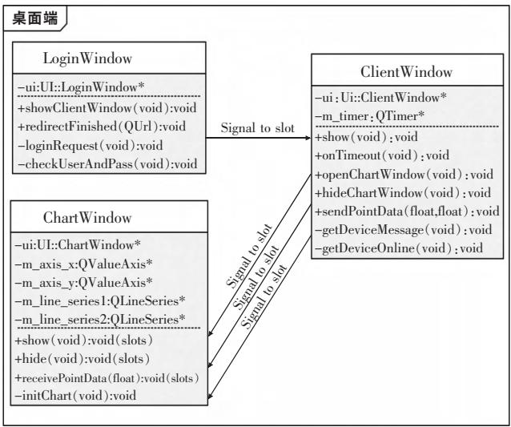
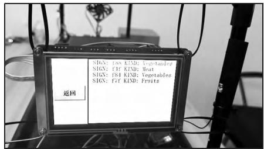
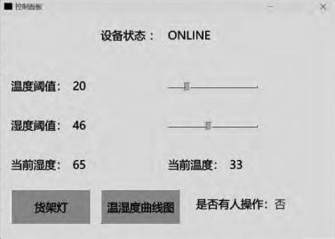
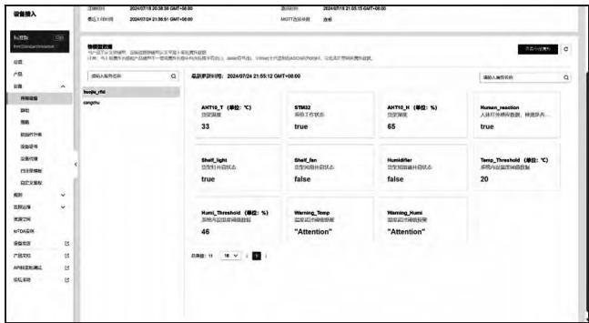

# 基于RFID的智能仓储管理系统设计

**摘要：**为提升和改善仓储管理的效率和品质，提出一种融合RFID技术与物联网的智能仓储一体化设计方案。以STM32F407为核心，使用温湿度、红外传感器监测模块采集仓储环境状况；利用RFID模块设计独立手持机，完成物品快速读取、识别；应用不同通信模式，实现多平台数据传输与同步。搭建试验装置，完成系统测试。结果表明，当温、湿度超过所设阈值条件时，货架风扇、加湿器将启动运行；读卡器可以完成单个或批量货物的出入库且发出提示音；一旦成功读取电子标签，主控终端实时刷新货物数据，并与Web端同步；PC端应用与华为云平台、主控终端三者之间能够保持数据同步。验证了系统的稳定性与可靠性，为仓储智能化提供低成本、高兼容性解决方案。

**关键词：**仓储管理；物联网；微控制器；无线传感网络；射频识别

**Design of Intelligent Warehouse Management System Based on RFID**

**Abstract: **To improve the efficiency and quality of warehouse management, an intelligent warehouse design solution integrating RFID technology and Internet of things architecture is proposed. With STM32F407 as the core controller, the temperature and humidity and infrared sensor modules are used to monitor and collect the storage environment. With the utilization of RFID module, an independent handset is developed to complete the rapid reading and identification of items. Different communication modes are applied to realize multi-platform data transmission and information synchronization. A device was built and the test was obtained. The results show that when the temperature and humidity exceed the set threshold conditions, shelf fans, humidifier will start to run. RFID reader can complete the function of single or batch goods in and out of the warehouse, and then send alarm to alert. Once the RFID reader successfully reads the electronic tag data, the display screen of the main control terminal can refresh the cargo data in real-time and keep in sync with the Web. The PC application can always maintain data synchronization with the Huawei cloud platform and the main control terminal. It verifies the stability and reliability of the system, and the solution scheme with low-cost and high-compatibility for intelligent warehousing is put forward.

**Key words: **warehouse management; Internet of things (IoT); microcontroller; wireless sensor network; radio frequency identification (RFID)

随着电子商务的全球化，当前仓储管理面临许多挑战，众所周知，传统管理方式依赖人工操作，错

误频发, 信息失准, 效率低下。近年来, 射频识别 (RFID)[1]技术迅速发展, 为智能仓储管理提供了新

的解决方案[2-3]。智能仓储管理系统是基于电子信息、计算机和自动化技术对仓库进行综合管理的系统[4],融合多种传感器和智能设备,通过对仓库货物智能存储、运输跟踪和实时监控而实现仓储智能化管理的一种形式。

为进一步提升仓储管理的库存准确性和物品追踪效率，开发一套基于RFID的智能仓储管理系统，实现物品的实时追踪和快速出入库管理[5]、库存状态实时监控，增强人机交互性。借助多传感器融合、云端同步和边缘控制技术，能够实现实时调控仓储环境、库存数据的即时更新和共享，优化库存管理流程[6]。

## 1 系统总体方案

### 1.1 系统架构设计

系统架构设计如图1所示，采用分层和模块化设计，主要有感知层、网络层、接入层、数据层、业务层、展示层和用户访问层。

图1 系统总体架构  
Fig.1 Overall architecture of the system

感知层利用各种传感器监控、采集仓储环境和货物信息，如温湿度、人员流动、货物标签等，并上传至云端，为大数据分析提供基础。

网络层负责数据传输和设备通信，主控设备通过4G和MQTT协议上传数据至华为云平台，手持机与主控设备内网通信，同时设置WAF隔离内外网，保护数据私有性，并通过代理Server简化开发流程。

数据层采用MySQL和华为云消息数据库，支持多种系统和语言，利用华为云影子存储读取历史数据，降低成本。架构遵循高内聚低耦合设计，各层独立运作且交互便捷，通过鉴权认证增强网络安全。

业务层满足工作人员、用户和管理人员等需求，用户可通过网站或APP查看货物信息，工作人员管理物流，开发人员调试工具，管理人员进行人员管

理、出入库查询和权限分配。

展示层提供直观界面，支持多平台访问，可实时了解仓储物流情况。系统采用算法和安全策略，保障高性能、安全性和可维护性，覆盖范围广，后续可引入分布式数据库和RAID技术，进一步提升可靠性和可扩展性。

### 1.2 系统总体结构

系统总体结构如图2所示，主要有货架控制管理终端、独立RFID手持机、外围和执行系统、仓储管理系统服务器和基于华为云的数据管理系统，支持多层级架构的智能化管理[7]，各子系统之间并非完全独立而是彼此联系的。

图2 系统总体结构  
Fig.2 System general structure

## 2 硬件设计

硬件主要有主控终端、电源与外设拓展板以及RFID手持机三部分。其中，电源与外设拓展板用于降压、稳压和供电，支持多路继电器并联拓展，以便接入和控制货架灯、风扇、加湿器等。

主控终端是货架管理系统的核心,搭载STM32F407芯片,可通过4.3英寸LCD触控屏显示数据,利用板载AHT10模块检测温、湿度,分别通过蓝牙、WiFi模块与RFID手持机、服务器通信。其引出的信号线

(PB4、PB5)用于控制风扇、货架灯等外设，通过US-ART6与显示屏通信，采集用户触屏输入信息。

RFID手持机以STM32为控制单元，串口连接RFID读卡器，主板连接蓝牙和RFID模块，分别用于无线通信和电子标签数据读取。手持机电路设计如图3所示，配备0.91英寸OLED条形屏和LED灯，用于显示和指示工作状态；还板载蜂鸣器，以成功读取电子标签后发出提示音。读卡器选用超高频RFID模块，型号CPH-305/307，具备非接触式快速盘存，可根据厂家提供的通信协议自定义开发。

图3手持机电路设计  
Fig.3 Handset circuit design

## 3 软件设计

软件部分可分为三大模块：主控系统、手持设备和云端平台。

主控系统基于FreeRTOS运行，优化多任务调度和内存动态分配[8]，用于接收并转发来自手持设备的RFID读卡信息，处理显示和控制逻辑（温湿度、仓储信息和货架灯、风扇、加湿器）。手持设备处理高频RFID盘存信息，并经蓝牙传至主控系统。云端平台接收仓储数据并存储，同时提供外部接口实现数据双向交互。

采用面向对象编程，将关键功能抽象为独立对象，实现高内聚、低耦合，提升可扩展和可维护性；引入休眠函数，优化上下文切换[9]，严格控制函数时间复杂度（大部分在O(1)级）；采用异步处理机制，提升CPU利用率和执行效率，确保系统在多任务和复杂环境下高效稳定运行。

### 3.1 主控系统程序设计

主控程序主要完成RFID信息处理、显示屏逻辑控制和云端数据上报3个任务（Task）。

在rfid_main任务中，系统监听串口、接收RFID数据，解码后通过ESP8266以优化的数据压缩与传输协议[10]发送POST或GET请求至内网服务器，确保数据可靠上传。

screen_main 任务从服务器拉取仓储信息，刷新界面并处理触控信息及其他模块反馈，通过 STM32 串口指令执行相关控制操作，如控制风扇运行和启动货架灯等。

而 heart Tick 任务充当心跳包，定时收集传感器数据并上报至华为云平台，支持断电记忆，确保数据实时性与系统健壮性。

系统采用双缓冲技术避免屏幕卡顿，通过异步处理机制确保多平台数据同步。STM32串口通过DMA（直接内存访问）加速数据传输，实现读写异步化，提高效率。由图4可知，显示屏控制、RFID数据转发与云端数据上报三大逻辑任务在RTOS支持下独立运行，通过时间片分配实现并行处理，利用内存池机制，优化内存管理，减少开销。

### 3.2 手持机软件设计

图5为手持机程序流程。主程序运行后，系统通过串口向高频RFID模块持续发送指令，启动盘存操作，并异步监听返回消息，将接收到的串口数据强制

图4 主控程序流程  
Fig.4 Main control program flow chart

转换为4字节整数倍大小的RFID_READHEADER结构体，以便提取RFID信息，并解码获取name和cate字段，分别作为仓储信息的名称和分类号。

其中，name字段通过EPC分区数据的按位异或运算和十六进制求和进行sign校验。若读取到多个RFID信息，系统将选择优先级最高的进行处理，且仅在用户按键确认出入库操作后，才上报给主控系统，否则数据将被丢弃。

图5手持机程序流程  
Fig.5 Handset program flow chart

手持机的OLED显示屏以I2C协议实现高速数据传输，支持按键模式切换，采用外部中断设计，以快速响应用户操作。为实现高效的RFID读卡和屏幕反馈，在算法层面进行深度优化，以尽可能地发挥芯片性能。

### 3.3 云端通讯设计

系统架构中，ESP8266模块作为服务器与主控之间的通信桥梁，负责关键数据传输。为提升系统实时性，优化云端与本地协同机制[11]，采取调度策略，控制ESP8266的操作时序，降低仓储信息拉取频率，为主控指令处理预留一定时间，将延迟降至最低

服务器的核心功能在于提供外部API，用于处理与本地的通信，如图6所示。数据上传时，先将数据打包为POST请求，类型为text，包含2个关键参数，即name和cate；再由服务器解码后，利用SQL语句存储于数据库中。

图6 云端通信流程
Fig.6 Cloud communication flow chart

查询仓储信息时，服务器通过SQL查询所有数据，格式化后返回给通信模块，供主控系统显示当前状态。删除操作时，POST请求仅需包含name参数，服务器利用SQL语句查询所有与该name相关的记录并批量删除。这种简化的参数设计和SQL应用，实现了高效的仓储数据增删查操作，有效提升系统响应速度。

### 3.4 用户侧PC端应用

PC端应用基于华为SDK和Qt6机制开发，利用其跨平台特性，设计出三部分，即登录界面（Login-Window）、控制面板（ClientWindow）和温湿度图表（ChartWindow），图7为其UML结构。

LoginWindow 通过 POST 请求向服务器验证用户身份。

ClientWindow主要用于展示或控制主控设备信息或状态，如在线状态、温湿度阈值、当前温湿度、人员存在情况和货架灯控制等。上线后，系统通过QTimer定期查询华为云平台的影子数据，并将其同步至界面显示；当用户修改数据时，系统向云平台发送更新请求并实时刷新界面

当收到华为云下发的设备影子数据时，ChartWindow会即时更新图表，提供数据可视化和实时监控。

图7PC端应用UML框图  
Fig.7 UML block diagram on PC

### 3.5 Web网站设计

前端页面采用CSS和Bootstrap构建，支持实时仓储信息查询。一旦手持机读取有关仓储信息，会即时同步至数据库，并在页面渲染显示。另外，管理员拥有快速账户管理、仓储统计数据查看等权限。

后端使用 Nginx 和 PHP 架构。基于 PHP 的后端架构因其简单便携性，常被用于快速构建业务逻辑层并与 Nginx 协同工作[12]。Nginx 作为轻量级反向代理，保障高并发时的网络稳定。数据库采用 MySQL，具备高可靠性和易扩展性，适用于仓储信息管理等结构化数据场景[13]。Web 站点作为管理员和工作人员的交互平台，还开放了专门外部接口供终端平台上传信息。

## 4 系统测试

根据设计方案，搭建简易模型开展测试。硬件设计使用EDA软件完成，通过原理图设计、PCB打样、器件焊接实现硬件电路组装。

### 4.1 系统测试

系统上电，单片机正常启动，电源降压模块运行稳定，表明硬件设计满足系统要求，随后进入软件测试阶段。

### 4.2 测试结果分析

测试发现，主控终端可触屏控制货架风扇、加湿器、货架灯等设备的开启和关闭。当RFID读卡器成功读取电子标签数据时，主控终端显示屏能够实时刷新货物数据，如图8所示，并与Web端保持同步，如图9所示；RFID读卡器可快捷切换出入库模式，且能在手持机OLED上显示。

图8 货架控制管理终端显示界面

Fig.8 Shelf control management terminal display interface  
图9仓储管理Web界面  
Fig.9 Warehouse management Web interface

PC端桌面应用，可实时显示设备状态、温、湿度数值及其阈值，如图10所示，并同步至华为云平台；当温度大于所设阈值时，货架风扇将开启运行；当湿度低于设定阈值时，则加湿器启动运行。

图10 PC端应用  
Fig.10 PC application

华为云平台可将消息下发，并实时控制货架灯开后(true)或关闭(false)，并同步刷新终端显示屏货架灯状态。若人体红外传感器检测附近有人操作终端显示屏，华为云平台则实时显示人体红外感应数据为true，否则为false。

测试内容还包括云端下发指令、云平台查看温湿度数据、云平台报警功能等。

测试结果表明，RFID读卡器可以完成单个或批量货物的出入库，且在操作完成后发出提示声音；PC端桌面应用与华为云平台、主控终端三者之间能够始终保持同步，即任一终端的数据修改均能在另二者上同步更新。图11为华为云物联网平台界面

图11 华为云平台界面  
Fig.11 Huawei cloud platform interface

## 5 结语

以STM32为主控制器、基于RFID技术设计了一套智能仓储管理系统，通过硬件与软件的高度协同，展现了以下优势：①依托RFID非接触式识别技术，运用FreeRTOS系统，实现了高效出入库、多任务并行处理、数据同步及设备控制，即使在高并发读卡场景下依然保持性能稳定；②硬件设计成一体化智能货架终端，软件采用模块化设计，遵循高内聚、低耦合原则，构建了云平台、PC端应用及Web管理系统的多终端协同体系，便于功能定制与运维更新；③应用多平台数据同步机制，实现“一次操作，全局更新”，简化了操作流程，降低了设备成本。另外，网络层采用鉴权认证机制与内网隔离策略，防范数据泄露风险；利用心跳包检测、断电记忆恢复等功能，确保系统快速自愈，兼顾系统安全性与可靠性。

## 参考文献

[1] 章登科,韩国程,俞朝晖,等.RFID技术及其在智能包装中的应用[J].包装工程,2018,39(1):6-11.  
[2] 刘莹.RFID技术原理及其应用分析[J].中央民族大学学报（自然科学版），2006(4)：358-361.  
[3] 王东升, 王中训, 高阳. 融合RFID技术的智慧仓储管理系统设计[J]. 电子设计工程, 2022, 30(21): 156-160.  
[4] 张璇, 王利强. RFID 技术在智能仓储系统中的应用综述[J]. 电子产品世界, 2024, 31(5): 13-17.  
[5] 贺彩玲,殷锋社.RFID技术在仓储物流行业中的应用研究[J].电子设计工程,2013,21(14):12-14.  
[6] 罗风.RFID在供应链物流管理中的应用研究[D].成都：西南交通大学，2009.  
[7] 周小平. 浅谈物联网技术在仓储物流中的应用[J]. 中国物流与采购, 2024(4):100-101.
[8] 刘滨, 王琦, 刘丽丽. 嵌入式操作系统FreeRTOS 的原理与实现[J]. 单片机与嵌入式系统应用, 2005(7):8-11.  
[9] 周晓炯, 傅涛. 物联网技术在智能仓储供应链管理系统中的应用 [J]. 集成电路应用, 2024, 41(10): 212-213.  
[10] 董鹏. RFID 技术支持下的物流仓储管理系统设计探讨[J].现代盐化工, 2024, 51(3):97-99.  
[11] 王瑞娜. 基于RFID技术的智能仓储管理系统研究[J]. 湖南邮电职业技术学院学报, 2023, 22(1): 29-31+36.
[12] Lytvyn V, Vysotska V, Kuchkovskiy V, et al. Development of the system to integrate and generate content considering the cryptographic needs of users[J]. Eastern-European Journal of Enterprise Technologies, 2019, 1(2): 18-39.  
[13] Dinariyana A A B, Artana K B, Sambodho K, et al. Pengembangan prototype software real-time monitoring berbasis data automatic identification system (AIS) [J].IPTEK Journal of Proceedings Series.DOI: 10.12962/j23546026.y2018i1.3359.