# 基于STM32的便携式信号采集设备研究

## 摘要

随着我国铁路及轨道交通网络的快速扩容，列车运行控制系统的可靠性直接关系到运营效率与乘客安全。针对当前现场维护中，测试设备便携性差、功能单一及智能化程度不足的痛点，本文设计并实现了一款基于STM32的便携式多功能轨道交通信号采集与分析系统，实现对轨道交通ZPW-2000A移频信号和25Hz相敏轨道电路信号的高精度波形采集、特征参数解调与干扰定量评估，旨在为现场设备的日常维护与故障初判提供智能化测试手段。

该系统以STM32F103C8T6微控制器为核心，构建了嵌入式前端基础测量与上位机深度分析相协同的系统架构。硬件设计上，搭建了具备宽电压前端调理与双通道同步采样能力的便携式终端，实现了现场信号的高保真数字化；软件实现上，下位机结合前后台调度与DMA传输保障了实时性，而基于Python开发的上位机则深度集成了轨道专用算法。具体而言，针对ZPW-2000A移频信号，提出基于希尔伯特变换的解调与频谱重心校正算法，精准提取载频与低频信息；针对25Hz相敏信号，采用互相关与单频点DFT算法，有效克服了低采样率限制与栅栏效应，实现高精度相位测量与工频干扰评估。

系统综合测试结果表明：在基础测量中，系统可稳定捕获10kHz以内典型波形，USB通讯链路支持100kS/s数据流稳定吞吐；在轨道专用功能测试中，ZPW-2000A载频测量误差控制在±0.3Hz以内，低频解调误差保持在±0.1Hz范围内并能准确识别码位与行车逻辑；25Hz相敏信号在叠加11%工频干扰下仍能实现高精度相位差测量与干扰分离。该系统具备便携、低成本及专用分析能力强的优势，能够满足轨道交通信号设备的日常维护与精准“状态修”需求，具有重要的工程应用价值。

**关键词：** 嵌入式系统；STM32；信号采集；ZPW-2000A；25Hz相敏轨道电路；故障诊断

## 第一章 绪论

### 1.1 研究背景

随着我国铁路及轨道交通网络的快速扩容，列车运行控制系统作为保障行车安全的核心，其可靠性直接关系到运营效率与行车安全。轨道电路作为列车位置检测与行车许可传递的关键设备，其信号的实时采集与分析是日常维护与故障诊断的基础。

ZPW-2000A无绝缘轨道电路自动闭塞系统与25Hz相敏轨道电路是我国铁路系统广泛采用的两种关键轨道电路制式。ZPW-2000A主要承担着轨道区段占用检测与机车信号信息传输的重任；25Hz相敏轨道电路则在复杂电磁环境下（如50Hz工频牵引电流干扰）承担高可靠的轨道占用检测。

对这两类关键信号进行精确测量的需求，来源于行车安全的刚性约束。信号的质量（如载频精度、低频信息完整性及相位偏差等）直接关系到列车的行车许可与安全，参数一旦超限便可能导致机车信号误显示、继电器误动作，甚至引发“红光带”故障或列车冒进。在维护作业层面，现场信号工需要定期巡检轨道电路发送端与接收端的电压、频率及相位参数，判断设备是否工作在正常范围。

然而，当前轨道交通现场维护面临的突出矛盾是：一方面，传统的人工记录方式效率低下，且无法捕捉瞬态干扰或偶发性波形畸变。尤其是在面对“闪红”或“掉码”等间歇性故障时，由于缺乏有效的波形记录与回溯手段，维护人员难以精准分析是否存在工频干扰、电缆绝缘不良或调谐单元失效等深层问题；另一方面，现有测量设备在便携性、专用分析能力以及设备成本之间往往难以兼顾，导致现场作业人员缺乏能够高效、全面评估信号质量的智能化综合测试工具。

因此，突破传统测量局限，实现信号特征的完整采集与分析，研发一款高性价比、便携化、智能化的专用信号采集设备，能够辅助完成信号质量评估与故障初判，对于提升"天窗期"内的作业效率、实现信号设备的精准"状态修"（即基于设备实际运行状态而非固定周期的精准维修）具有重要的工程应用价值。

### 1.2 现有测量方法及局限性

当前，信号采集与分析设备的技术发展呈现明显的分层格局，针对轨道交通信号的测量手段主要包括以下几类，但均存在不同程度的适用性局限：

在高端通用仪器领域，以 Keysight、Tektronix 为代表的台式示波器虽具备 GHz 级带宽与深存储深度，但其性能指标远超轨道交通低频控制信号（基波小于 3kHz）的实际需求，造成资源与成本的冗余。此外，受限于体积、市电依赖及接地要求等物理约束，此类设备难以部署于隧道、高架等空间受限且环境复杂的现场作业场景。

在便携式通用仪器领域，国产手持示波表虽解决了便携与供电问题，但多为通用型设计，缺乏针对铁路信号特征的专用分析功能。例如，传统设备仅能提供时域波形与基础 FFT 频谱，无法直接解调 ZPW-2000A 的载频与低频信息，也不能精确计算 25Hz 相敏信号的双通道相位差；同时在瞬态波形捕捉、长时数据记录及智能化故障研判方面仍存在不足，依赖人工经验，大大降低了诊断效率。

在行业专用测试工具领域，现有设备往往功能单一，呈现“一表一功能”的碎片化特征。部分 ZPW-2000A 测试仪仅能读取解调后的数值，无法显示原始波形，当出现干扰或畸变时难以追溯根源；25Hz 相位测试仪虽能测量相位，但缺乏对 50Hz 工频干扰强度的同步评估能力。这种功能割裂增加了现场作业的设备携带负担与数据综合研判难度。

从信号处理算法实现角度分析，现有测量方法存在若干关键局限性。由于 ZPW-2000A 信号的能量分布于两个边频（$f_{c}  ± 11 Hz$ ，$f_c$ 为中心载频），传统基于 FFT 峰值搜索的测频算法容易锁定边频而非载频中心，若不加修正将引入原理性偏差。相位测量受栅栏效应制约是 25Hz 相敏信号检测的技术瓶颈，标准 FFT 算法将频谱离散化为等间距频点，当信号频率（如 25Hz）无法与频点对齐时，能量会通过频谱泄露分散到多个频点，导致峰值频点处的相位值严重偏离真实初相位。在采样率受限的嵌入式系统中，实现整周期采样或高精度插值算法的复杂度较高。抗干扰能力弱是现场测量的突出挑战。轨道交通现场电磁环境复杂，牵引电流谐波、开关电源噪声及无线电信号交织，传统线性滤波器在抑制噪声的同时往往会模糊信号边缘特征，导致 FSK 跳变沿失真或相位测量偏差。如何在去噪与保真之间取得平衡，是算法设计的关键难点。

近年来，嵌入式技术的发展为低成本专用仪表提供了新路径。基于 ARM Cortex-M 系列微控制器（如 STM32）的高集成度方案，配合针对性的模拟调理电路与优化算法，已具备在有限资源下实现精确采集的潜力。特别是其内置的多通道同步 ADC 与 DMA 机制，为双通道相位差测量与高采样率数据吞吐提供了硬件基础，使得研发一款集便携性、专用性与智能化于一体的现场维护设备成为可能。

### 1.3 本文研究内容及章节安排

#### 1.3.1 本文研究内容

为解决上述现场测量手段存在的诸多局限性，本文旨在研发一套基于嵌入式架构的便携式多功能信号采集与分析系统。研究遵循“硬件便携化—采集高精度化—算法专用化—软硬协同化”的技术路线，通过嵌入式前端基础测量与上位机深度分析相协同的系统架构，实现通用示波器功能与行业专用分析能力的有机融合。本文的研究工作主要围绕便携式采集终端的硬件构建、嵌入式下位机的底层软件与算法实现、可视化上位机的综合分析软件开发，以及系统的整体联调与性能评估层层展开。

在硬件终端的设计上，本文以嵌入式微控制器为核心构建了紧凑型的电路架构。为了适应现场复杂的电磁环境，设计重点攻克了宽电压信号调理难题，搭建了高精度的双通道同步采样链路，并辅以液晶显示与人机交互模块，最终实现了设备的小型化与低功耗运行。

在软件层面，下位机的开发聚焦于底层驱动的稳定性与高速数据传输链路的优化。针对嵌入式平台资源受限的特点，本文在下位机中实现了基础的数字信号处理与高精度测频算法，切实保障了ZPW-2000A与25Hz相敏信号等轨道交通典型信号采集的实时性与准确性。同时，为了进一步提升系统的数据分析能力，本文基于跨平台框架开发了桌面端可视化综合分析软件。该上位机程序不仅实现了与下位机的高速数据协同，还深度集成了希尔伯特变换、互相关分析等高级算法，能够对特定轨道信号进行深度解调与特征提取，并为现场作业人员提供直观友好的图形化交互界面。

最后，为验证系统设计的可靠性与实用性，本文搭建了标准信号源测试环境，对系统的各项功能模块与整体性能进行了严谨的联调与测试评估，以确保设备能够充分满足现场维护与故障诊断的实际需求。

#### 1.3.2 论文章节安排

本文围绕便携式信号采集设备的设计与实现展开，共分为六章，具体安排如下：

- 第一章 绪论：阐述课题的研究背景与工程意义，分析现有轨道交通信号测量方法的局限性，明确本文的研究目标与主要内容，并介绍论文的章节组织结构。
- 第二章 系统总体方案设计：根据现场测试需求制定系统的主要性能指标，提出嵌入式前端基础测量与上位机深度分析相协同的总体架构，并对核心主控芯片、信号调理及通信策略等关键技术方案进行初步选型与论证。
- 第三章 系统硬件电路设计：详细介绍下位机采集终端的硬件实现，包括核心控制器电路、接口与人机交互电路以及宽电压模拟前端调理电路的设计原理与参数计算。
- 第四章 下位机嵌入式软件系统设计：详细阐述下位机嵌入式软件的控制流与数据流设计，重点分析多通道同步采样、DMA数据传输、软硬件协同测频等关键程序的代码实现。
- 第五章 上位机数据分析系统设计：阐述基于Python的上位机分析软件架构，重点论述通信解析、ZPW-2000A信号的包络解调与测频、以及25Hz相敏信号相位提取等高级处理算法的数学原理与实现过程。
- 第六章 系统测试与总结展望：展示系统的实物原型，分别对设备各项基础测量功能及轨道交通专用分析功能进行测试与评估，对全文研究工作进行总结，并提出后续改进方向。

## 第二章 系统总体方案设计

### 2.1 被测轨道信号特征分析

本系统主要针对 ZPW-2000A 移频信号与 25Hz 相敏轨道电路信号这两种信号的物理特征进行深度解析与参数测量。为了实现精准的采集与分析，首先需要明确这两种被测信号的核心特征。

ZPW-2000A 是一种无绝缘轨道电路自动闭塞系统，主要用于实现轨道区段占用检测和机车信号信息传输。其核心机制是以频率参数作为控制信息载体，采用频移键控（FSK）调制方式。具体而言，系统将低频控制信号（信息码）“搬移”到较高的载频上，形成一种振幅恒定、频率随低频信号周期性变化的调频信号。实际发送的信号是以载频为中心、按低频周期在两个边频之间交替切换的移频信号，频偏 $\Delta f$ 为 $\pm 11\text{ Hz}$。

如图 2-1 所示，该移频信号的特征主要体现在两个方面：首先，上方子图展示了瞬时频率的低频方波特性，即中心频率受低频信号调制，在上下边频间作周期性跳变；其次，下方子图呈现了载波时域波形，局部放大表明在频率切换时刻，载波振幅保持连续恒定，仅周期发生改变。该调频机制构成了后续数字信号处理链路的解调基础。

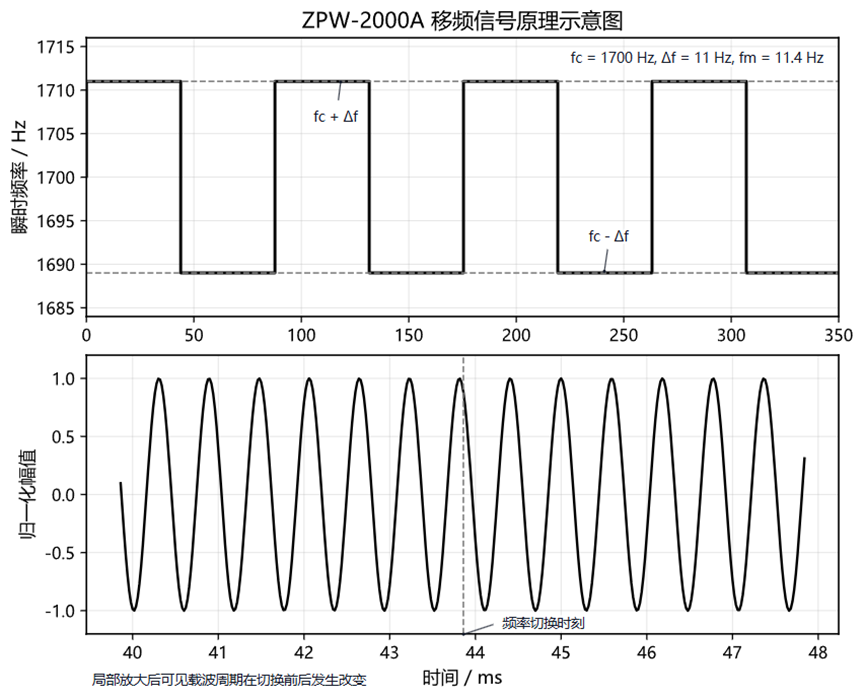

图 2-1 ZPW2000A移频信号原理示意图

在载频特性方面，ZPW-2000A 拥有 4 种中心频率（1700 Hz、2000 Hz、2300 Hz、2600 Hz）。为了实现相邻轨道区段的电气隔离，系统为每种中心频率设置了“-1”（中心频率 +1.4Hz）和“-2”（中心频率 -1.3Hz）两种偏移版本，从而形成两组共 8 种实际使用的载频信号，分别用于上下行方向，具体规定如下表所示：

表 2-1 ZPW2000A中的8种载频信号

|  下行  | 信号频率（Hz） |  上行  | 信号频率（Hz） |
| :----: | :------------: | :----: | :------------: |
| 1700-1 |     1701.4     | 2000-1 |     2001.4     |
| 1700-2 |     1698.7     | 2000-2 |     1998.7     |
| 2300-1 |     2301.4     | 2600-1 |     2601.4     |
| 2300-2 |     2298.7     | 2600-2 |     2598.7     |

ZPW-2000A 定义了 18 种标准低频信息码（10.3Hz 至 29Hz，步长 1.1Hz）。在本系统的采集与分析中，重点关注这18种低频调制频率的精确解调以及载波中心频率的识别，以验证被测信号的物理特性是否达标。

25Hz 相敏轨道电路是一种广泛应用于中国铁路系统中的轨道占用检测系统。该系统以 25Hz 交流电源作为激励信号，通过检测钢轨回路中信号的幅值与相位特性，实现对轨道区段状态的可靠判别。

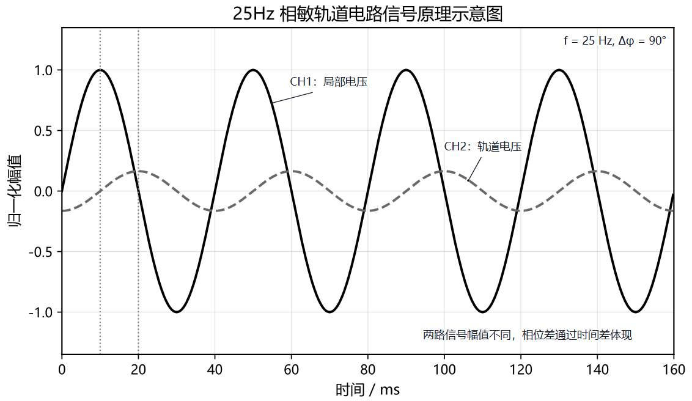

图 2-2 25Hz相敏轨道电路信号原理图

其核心优势在于引入了相位敏感机制。该机制不仅依赖信号的幅值强度，更依据局部线圈电压与轨道线圈电压之间的固定相位关系（理想状态下为 90°）来进行状态判断。此外，在电气化铁路环境中，牵引电流（如 50Hz 工频及其高次谐波）极易对轨道电路造成干扰。25Hz 相敏轨道电路正是通过 25Hz 频率分离与 90° 相位鉴别的双重机制，有效抑制了此类工频干扰。

针对 25Hz 相敏信号的特征，本采集系统需具备高精度的 25Hz 基波幅值测量能力、精确的 90° 相位差检测能力，以及对 50Hz 等工频干扰谐波的评估分析能力，从而保障信号特征分析的全面性与准确性。

上述针对两种核心轨道信号物理特性的深度剖析，为整个系统的软硬件架构设计提供了直接的理论依据。以此需求为导向，本课题进一步确立了如下的总体设计目标与各项关键性能指标。

### 2.2 系统设计目标与主要性能指标

本课题的总体设计目标是面向轨道交通信号维护需求，构建一款“前端便携采集+后端深度分析”相协同的低成本、智能化信号测试系统。在硬件采集层面，系统需实现对现场复杂交直流信号的宽电压接入与双通道同步高速采集（最高采样率目标 500kSps ），以充分捕获低频控制信号及其高次谐波特征。在系统集成与便携性层面，终端设备需配备可视化人机交互界面，并内置独立电池供电与电源管理系统，以保障外场作业的续航与脱机使用能力；同时，系统需提供高速稳定的通信链路，支撑波形数据向上位机的实时透传。

在专业信号分析能力上，系统需针对轨道交通核心信号实现高精度的特征提取与状态评估。借助上下位机协同处理架构，系统在完成基础波形参数测量的同时，需重点攻克 ZPW-2000A 移频信号的高精度载频识别与低频解调（精度分别需达 ±0.3Hz 与 ±0.1Hz ），以及 25Hz 相敏轨道电路信号的基波幅值测量与高精度相位差检测（相位精度±1°），并具备对 50Hz 工频干扰的定量分析能力。通过上述设计，系统最终旨在为现场设备的日常维护与故障初判提供高度集成的专业测试手段。

### 2.3 关键技术方案选型

主控芯片选用 STM32F103C8T6 芯片，该选型主要基于其独特的双 ADC 架构与 DMA 支持。该芯片内置的两个 12 位 ADC 支持"双重规则同步模式"，这是实现双通道信号严格相位同步采集的关键技术基础，对于 25Hz 相敏轨道电路相位差的精确测量至关重要。同时，其支持的 DMA 传输机制，能够在不占用 CPU 资源的情况下将 ADC 数据高速搬运至内存，有效保证了高采样率下系统的实时响应能力。此外，Cortex-M3 内核 72MHz 的主频配合丰富的开发资料与低廉的成本，使其成为本设计的最佳性价比选择。

模拟前端采用了"分压衰减 + 运算放大器"的组合架构以适应现场复杂的电磁环境与信号特征。设计中通过分压网络构建了 1MΩ的输入阻抗，以匹配标准示波器探头，最大限度减小接入对被测电路的负载效应。针对轨道交通信号多为含负半周的交流信号这一特点，设计采用了反相加法电路引入直流偏置，将双极性信号平移至单电源 MCU ADC 的线性区间（0-3.3V）。同时，为运放提供±5V 双电源供电，确保了信号在过零点附近的线性度，有效避免了单电源运放常见的轨对轨失真问题。

在数据通信与处理策略方面，系统采用了 USB CDC 协议作为通信接口。该方案将 STM32 的 USB 接口模拟为标准串口，实现了即插即用且无需专用驱动，同时提供了远高于传统 UART 串口的传输速率，满足了实时波形传输的带宽需求。处理策略上，系统采取了“上下位机协同”的计算模式：下位机（MCU）专注于处理采样控制、触发判定及基础波形绘制等高实时性任务；上位机（PC）则承担长点数 FFT、希尔伯特变换解调等高算力需求任务。这种任务分配机制既保证了手持设备的运行流畅度，又实现了复杂的专业分析功能，达成了便携性与高性能的平衡。

### 2.4 系统总体架构

系统整体采用嵌入式前端基础测量与上位机深度分析相协同的分层架构设计。下位机作为前端感知节点，主要负责信号的模拟调理、高速数字化采集、本地波形显示及数据上传；上位机作为后端处理中心，负责接收原始数据流，运行复杂的数字信号处理算法，并提供可视化交互与数据管理功能。

下位机硬件平台以 STM32F103C8T6 微控制器为核心，集成了模拟前端、测频模块、主控单元、人机交互及电源管理等关键模块。模拟前端通过交直流耦合切换、精密电阻分压衰减、阻抗匹配及信号放大与电平平移电路，将现场的高压或负压信号调理为 ADC 可识别的 0-3.3V 标准信号。测频模块利用滞回比较器将模拟信号整形为方波，进而通过 MCU 定时器捕获单元实现频率的精确测量。主控单元充分利用 STM32 内部的双 ADC 资源，在 DMA 驱动下执行双重规则同步采样，从硬件层面保证了双通道数据的相位一致性。人机交互模块通过 TFT 屏幕实时刷新波形，并利用编码器和按键完成时基、电压档位等参数的配置。电源管理模块则负责将单节锂电池电压转换为系统所需的数字 3.3V、模拟±5V 及高精度 ADC 参考电压，确保各模块稳定运行。

上位机软件基于 Python 语言开发。其通信模块通过 USB 虚拟串口接收下位机上传的实时采样数据流；数据处理模块对原始数据进行去噪处理与物理量还原；专业算法模块集成了希尔伯特变换、FFT、互相关分析等高级算法，专门用于 ZPW-2000A 信号解调及 25Hz 相敏信号分析；GUI 界面模块则提供了波形视窗、频谱视窗、仪表盘及数据记录等丰富的功能组件，构建了完整的信号分析环境。

系统整体架构如图 2-3 所示。

图 2-3 系统总体架构图

## 第三章 系统硬件电路设计

在明确了系统的总体架构与关键技术选型后，本章将详细阐述下位机便携式采集终端的具体硬件实现方案。硬件电路是获取高质量信号的基础，其设计的核心在于如何在有限的体积与功耗约束下，实现对复杂现场信号的高精度调理与稳定采集。本章将从硬件整体资源分配出发，依次对人机交互接口、模拟前端调理电路、核心测频电路以及电源管理系统进行深入剖析。

### 3.1 接口配置与人机交互电路

本设计以 STM32F103C8T6 为控制核心，构建了完整的嵌入式测量系统。硬件架构主要由模拟前端调理与滞回比较测频电路、人机交互电路（集成显示屏、按键及编码器）、系统支撑电路（核心控制器电路、电源管理电路）以及通用通信接口组成。

在具体的引脚分配策略上，系统优先保障了对实时性与精度要求极高的双路 ADC 采样与输入捕获通道；同时，将 SPI 显示与按键输入等数字外设合理穿插于剩余的 GPIO 引脚，以尽量避开可能的高频数字干扰。具体的 MCU 引脚功能分配情况如下表所示：

表 3-1 MCU引脚功能分配表

| **功能模块**        | **引脚名称**       | **硬件连接/协议**     | **备注**       |
| ------------------- | ------------------ | --------------------- | -------------- |
| **1.8" TFT 显示屏** | PA5, PA7, PB5-PB8  | SPI (SCK/MOSI) + GPIO | 控制显示及背光 |
| **信号采集 (ADC)**  | PA3, PA4           | ADC1_CH3, ADC2_CH4    | 双路同步采样   |
| **频率捕获**        | PA6, PA1           | TIM3_CH1, TIM2_CH2    | 定时器输入捕获 |
| **交互输入**        | PB13-PB15, PA8     | GPIO（外部中断）      | 独立按键       |
| **旋转编码器**      | PB4, PB3, PB9      | GPIO（外部中断）      | EC11 调节参数  |
| **通讯/调试**       | PA11, PA12, PA9/10 | USB CDC / UART1       | 数据传输与调试 |

在完成了核心控制器的资源分配后，为提升便携式设备的易用性与扩展性，系统首先设计了必要的外围接口与人机交互模块，这包括 USB Type-C 接口、TFT 液晶显示屏、按键输入及编码器模块。这些模块共同构成了用户与设备之间信息交互的桥梁。

如图3-1所示，系统采用USB Type-C接口兼顾供电与数据通讯功能。硬件设计上遵循标准规范，配置了相应的下拉识别电阻及差分信号线阻抗匹配，以确保与上位机通信的可靠性。

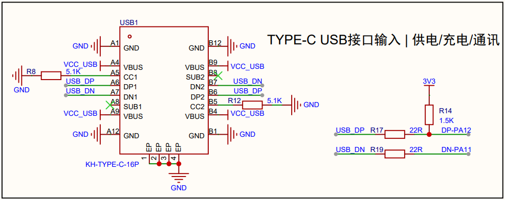

图 3-1 Type-C 接口电路图

如图3-2所示，系统选用1.8寸TFT LCD屏幕（分辨率128x160），驱动芯片为ST7735。该屏幕通过SPI接口与MCU通信，用于实时显示系统状态、参数设置菜单及测量数据。

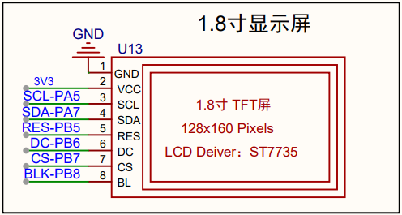

图 3-2 显示屏接口电路图

如图3-3所示，系统通过四个独立按键与一个旋转编码器（EC11）结合的方式构建输入模块，连接至微控制器的外部中断引脚，用于实现菜单导航、时基切换与功能确认等快捷操作。

<table>
  <tr>
    <td align="center">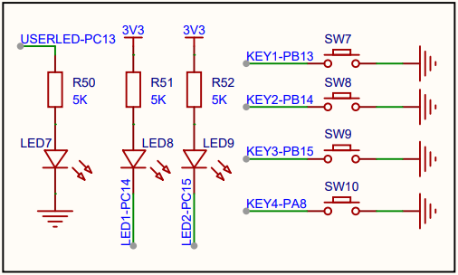</td>
    <td align="center">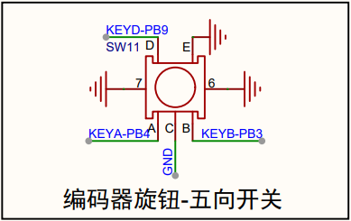</td>
  </tr>
</table>

图 3-3 按键与编码器输入电路图

如图3-4所示，系统预留了PWM输出接口，连接至定时器通道PA2。该接口可用于输出占空比可调的PWM波形，用于便携式信号采集设备的波形自检功能。

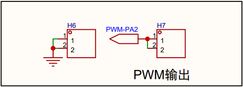

图 3-4 PWM 输出接口电路图

在保障了良好的人机交互体验与基础接口功能之后，系统面临的最核心挑战是如何在复杂电磁环境下准确获取真实的物理信号。这就要求系统具备高性能的模拟前端处理能力。

### 3.2 模拟前端调理电路

模拟前端的设计直接决定了系统的测量精度与动态范围。由于轨道交通现场信号具有电压波动范围大、含负半周、叠加高频干扰等复杂特征，因此模拟前端调理电路必须完成衰减、耦合、电平平移及滤波四项核心功能，将待测信号平滑地处理至 STM32 ADC 引脚可接受的电压范围（0~3.3V）。模拟前端调理流程如图 3-5 所示，具体电路如图 3-6 所示。

图 3-5 模拟前端调理流程图

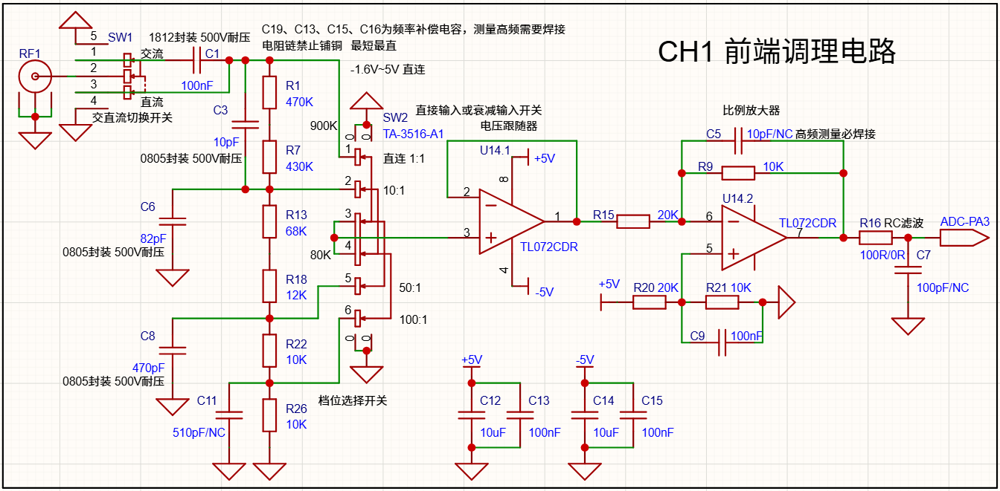

图 3-6 模拟前端调理电路图

（1）输入耦合方式选择

为了实现上述调理流程，信号首先需要经过耦合选择与分压衰减网络。如图3-6所示在硬件设备上可以通过拨动开关 SW1 选择信号进入方式。DC 耦合方式将信号直连，保留直流分量。AC 耦合则用于测量交流电，通过串联电容 $C_1$ 与后级分压电阻网络（总阻抗约 $1\text{M}\Omega$）构成高通滤波器，滤除直流。

（2）1MΩ精密电压衰减网络

为了测量高电压信号，电路设计了由 $R_1, R_7, R_{13}, R_{18}, R_{22}, R_{26}$ 构成的精密电阻分压网络，由 SW2 旋转开关决定信号的衰减倍数，共设计四个档位。设前端电路在特定档位下的整体衰减倍数为 $K_{att}$，其值由该档位分压节点到地的等效电阻与总阻抗之比决定。同时，为了补偿分布电容对高频信号的影响，在不同衰减档位并联了相应的频率补偿电容（$C_3, C_6, C_8$），以确保全频带内的幅频特性平坦。各档位的详细参数配置（包括对地电阻与对应的 $K_{att}$ 值）详见表 3-2。

（3）电压跟随器

信号经过上述无源分压网络后，由于其输出阻抗显著增加，若直接接入后级处理电路，极易引发严重的负载效应并导致测量失真。为此，本设计在分压网络之后引入了由 TL072CDR 构成的电压跟随器（U14.1），以实现关键的阻抗变换。其核心原理基于运算放大器的“虚短”与“虚断”特性，同相输入端（Pin 3）的信号电压直接“传递”到了反相输入端（Pin 2）。因为输出端（Pin 1）与反相输入端短接，故有 $V_out=V_in$。TL072 作为 JFET 输入型双运放，相比于普通的双极型运放，其输入阻抗高达 $10^{12}\Omega$，输入偏置电流极低，“虚断”特性更接近理想状态，有利于高阻抗信号源的采集。

（4）反向比例放大

经过跟随器的高保真缓冲后，信号已具备足够的驱动能力。然而，由于 STM32 的 ADC 仅能采集 $0 \sim 3.3\text{V}$ 的正电压，而前级跟随器输出的信号 $V_{out1}$ 可能包含负压成分且幅值范围较大，因此必须通过比例放大电路进行缩放与平移。本设计采用由 TL072（U14.2）构成的反相加法/比例放大拓扑。

在该线性电路中，输出电压 $V_{ADC}$ 是输入信号 $V_{out1}$ 与同相端偏置电压 $V_+$ 共同作用的结果。由于该比例放大电路工作于线性区，依据线性叠加原理，其输出端响应可分解为直流偏置响应与交流信号响应两部分。

首先，分析直流偏置回路。同相输入端由 $+5\text{V}$ 参考电源经 $R_{20}$ 与 $R_{21}$ 分压网络建立 $V_+ \approx 1.667\text{V}$ 的偏置电压。当仅考虑直流激励时，电路等效为同相放大拓扑，其静态输出基准 $V_{ADC1}$ 可表示为：

$$
V_{ADC1} = V_+ \cdot \left(1 + \frac{R_9}{R_{15}}\right) = 1.667\text{V} \cdot \left(1 + \frac{10\text{k}\Omega}{20\text{k}\Omega}\right) = 2.5\text{V}
$$

其次，分析交流信号传输通路。当输入信号 $V_{out1}$ 单独激励时，电路等效为反相衰减器，其动态输出响应 $V_{ADC2}$ 为：

$$
V_{ADC2} = -V_{out1} \cdot \left(\frac{R_9}{R_{15}}\right) = -0.5 \cdot V_{out1}
$$

综合上述交、直流响应，可推导出模拟前端调理电路的完整传递函数：

$$
V_{ADC} = V_{ADC1} + V_{ADC2} = 2.5\text{V} - 0.5 \cdot V_{out1}
$$

考虑到微控制器内部 12 位 ADC 的量化特性（参考电压 $V_{ref} = 3.3\text{V}$），量化后的数字值 $ADC_{raw}$ 与实际输入电压满足线性映射关系。结合前级分压网络的衰减系数 $K_{att}$，可建立从 ADC 采样值至原始待测信号 $V_{in}$ 的逆向重构模型：

$$
V_{in} = \frac{1}{K_{att}} \cdot V_{out1} = \frac{1}{K_{att}} \cdot \left[ 5 - 2 \cdot \left( \frac{ADC_{raw}}{4095} \cdot 3.3 \right) \right]
$$

为确保硬件电路运行的安全边界及模数转换的线性度，ADC 端口的输入电压 $V_{ADC}$ 必须被严格钳位在 $0\text{V} \sim 3.3\text{V}$ 区间。将该约束条件代入上述传递函数的逆映射中，可解算得前级电压跟随器的安全输出动态范围为 $[-1.6\text{V}, +5\text{V}]$。基于该动态边界与各档位的衰减系数 $K_{att}$，系统在不同增益配置下的理论测量量程得以确定，具体参数详见表 3-2。

表 3-2 前端分压网络各衰减档位参数及测量范围

| 档位选择 | 采样节点 (对地电阻) | 衰减倍数 $K_{att}$ | 补偿电容 | 理论测量范围 |
| :---: | :---: | :---: | :---: | :---: |
| 1x (SW2 Pin 1) | 直接输入 ($1\text{M}\Omega$) | $1$ | 无 | $-1.6\text{V} \sim +5\text{V}$ |
| 10x (SW2 Pin 2) | $R_{13}$ 下端 ($100\text{k}\Omega$) | $1/10$ | $C_3$ ($10\text{pF}$) | $-16\text{V} \sim +50\text{V}$ |
| 50x (SW2 Pin 5) | $R_{18}$ 下端 ($20\text{k}\Omega$) | $1/50$ | $C_6$ ($82\text{pF}$) | $-80\text{V} \sim +250\text{V}$ |
| 100x (SW2 Pin 6) | $R_{22}$ 下端 ($10\text{k}\Omega$) | $1/100$ | $C_8$ ($470\text{pF}$) | $-160\text{V} \sim +500\text{V}$ |

经过上述模拟前端的线性调理，复杂的外部模拟信号已安全平移并缩放至 ADC 的合法采样区间。除了幅度测量，轨道信号的频率参数同样至关重要。若仅依靠软件对 ADC 采样序列进行过零点提取来计算频率，不仅会大幅增加 MCU 的算法开销，且容易受限于采样率和高频残余噪声的干扰。为此，系统在前端调理电路的输出端并联了一级专用的硬件波形整形网络，将测频任务从数字软件层面前置到模拟硬件底层。

### 3.3 滞回比较器测频电路

滞回比较器测频电路专门用于测量采集信号的精确频率。为了精确测量频率，信号经前端调理处理后进入 LM393 滞回比较器被整形为标准方波。由于常规比较器在信号含有微小噪声时容易在过零点产生多次翻转，从而导致定时器捕获产生误计数，本电路巧妙地引入了正反馈网络（如 $R_{10}$ 等）构建了滞回特性。滞回比较器的核心在于通过正反馈将输出端的电平状态回馈至同相输入端，从而动态改变比较器的基准电压。电路中通过引入高阻值的正反馈电阻 $R_{5}$ ($510\text{k}\Omega$)，构成了极窄的弱滞回区间，有效平衡了抗噪能力与微弱信号的捕获灵敏度。

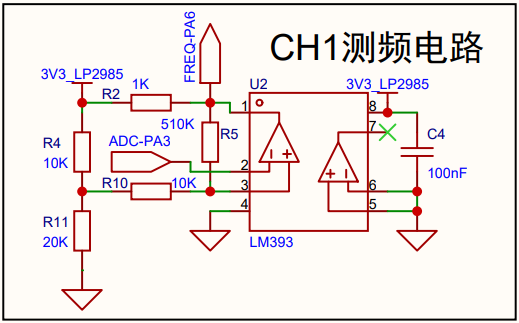

图 3-7 滞回比较器测频电路

在不考虑反馈时，同相输入端（Pin 3）的电压由 $R_{4}$ ($10\text{k}\Omega$) 和 $R_{11}$ ($20\text{k}\Omega$) 对 $3.3\text{V}$ 电源分压决定。其戴维南等效电压为：

$$
V_{th} = 3.3\text{V} \cdot \frac{R_{11}}{R_{4} + R_{11}} = 3.3 \cdot \frac{20\text{k}}{30\text{k}} = 2.2\text{V}
$$

等效电阻为：$R_{eq\_div} = 10\text{k} // 20\text{k} \approx 6.67\text{k}\Omega$。由于中间串联了 $R_{10}$ ($10\text{k}\Omega$)，同相端的总等效输入电阻为 $R_{eq} = 16.67\text{k}\Omega$。

当比较器输出高电平时，LM393 内部输出管截止，输出端通过 $R_{2}$ ($1\text{k}\Omega$) 上拉。此时 $3.3\text{V}$ 经由反馈支路对同相端产生微弱的拉升作用。

计算等效上拉电阻 $R_{up}$：

$$
R_{up} = R_{4} // (R_{2} + R_{5} + R_{10}) = \frac{10\text{k} \cdot 521\text{k}}{10\text{k} + 521\text{k}} \approx 9.812\text{k}\Omega
$$

利用分压公式计算上限阈值：

$$
V_{THH} = 3.3\text{V} \cdot \frac{R_{11}}{R_{up} + R_{11}} = 3.3 \cdot \frac{20\text{k}}{9.812\text{k} + 20\text{k}} \approx 2.214\text{V}
$$

当比较器输出为低电平时，LM393 内部输出管饱和导通，输出端（Pin 1）近似接地（0V）。此时，反馈支路变为下拉状态。

计算等效下拉电阻 $R_{down}$：

$$
R_{down} = R_{11} // (R_{10} + R_{5}) = \frac{20\text{k} \cdot 520\text{k}}{20\text{k} + 520\text{k}} \approx 19.259\text{k}\Omega
$$

利用分压公式计算下限阈值：

$$
V_{THL} = 3.3\text{V} \cdot \frac{R_{down}}{R_{4} + R_{down}} = 3.3 \cdot \frac{19.259\text{k}}{10\text{k} + 19.259\text{k}} \approx 2.172\text{V}
$$

滞回电压宽度 $\Delta V$ 为：

$$
\Delta V = V_{THH} - V_{THL} = 2.214\text{V} - 2.172\text{V} = 42\text{mV}
$$

本电路设计的 $42\text{mV}$ 滞回窗口能够有效滤除信号中的微小高频噪声，防止在过零点附近产生误触发。由于回差极小，该电路能够对峰峰值仅为 $50\text{mV}$ 左右的微弱信号进行准确的频率捕获，兼顾了测量精度与稳定性。$2.2\text{V}$ 左右的阈值中心与前级 AFE 在处理正向摆动信号时的动态区间高度匹配，保证了信号在宽量程下的测量可靠性。

### 3.4 综合电源管理电路

本设计对电源的稳定性、噪声水平以及多电压轨的需求较高，专门设计了一套包含锂电池充电、过放保护、开关升降压及多级线性稳压的综合电源管理系统。整个系统的电源流向清晰地划分为：为数字电路供电的大电流 3.3V 轨道、为模拟运放供电的高精度 ±5V 对称轨道，以及为 ADC 采样提供极低噪声的独立参考基准源。

在电源输入的源头，系统采用单节 $3.7 \mathrm{~V}$ 锂电池供电，通过 USB Type-C 接口结合 TP4056 线性充电芯片及 DW01A 保护电路实现充放电管理。为实现 USB 供电与电池供电的无缝切换，设计了基于 PMOS 和肖特基二极管的路径切换电路，确保系统在拔插外部电源的过程中不掉电。

<table>
  <tr>
    <td align="center">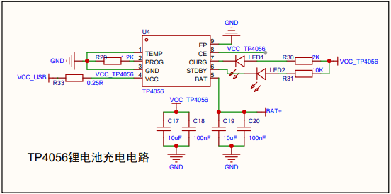</td>
    <td align="center">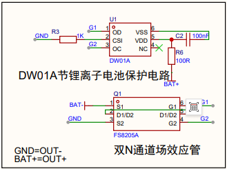</td>
  </tr>
</table>

图 3-8 锂电池充放电与保护电路图

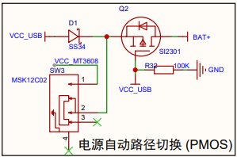

图 3-9 电源路径切换电路图

在确立了稳定的供电来源后，为满足不同模块的特殊电压需求，系统进一步设计了多轨电压变换网络。系统中的模拟运算放大器需要对称的 ±5V 供电， 因此设计了升压与电荷泵倒相电路。采用 MT3608 升压芯片将电池电压或 USB 电压提升至 7.2V。利用电荷泵芯片 MC7660 将升压后的正压转换为负压，为后续产生负线性稳压提供基础电压。

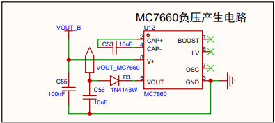

图 3-10 正负偏置电源产生电路图

为了降低电源纹波对模拟信号的干扰，系统采用了多路 LDO 进行二次稳压。AMS1117-3.3 电路负责单片机、显示屏等数字模块供电，电流驱动能力强。MIC5219-5.0 电路具有低噪声、低压差特性，专门为模拟放大电路供电。TPS7A30 电路作为高精度负压 LDO，将电荷泵输出的负压稳压至 -5V，确保模拟电路电源的对称性与稳定性。LP2985-33 电路专门用于提供超低噪声的 3.3V 电压，作为 ADC 采集的基准源。

<table>
  <tr>
    <td align="center">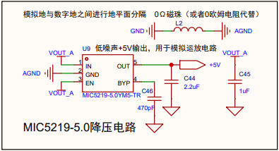</td>
    <td align="center">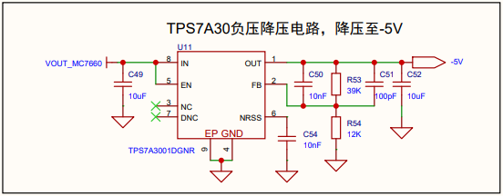</td>
  </tr>
  <tr>
    <td align="center">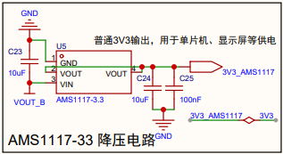</td>
    <td align="center">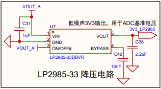</td>
  </tr>
</table>

图 3-11 各路 LDO 稳压电路图

尽管上述多路 LDO 能够提供良好的二次稳压能力，但在开关电源向 LDO 级联的过程中，由于系统采用了 $\mathrm{MT}3608$ 开关型 $\mathrm{DC}-\mathrm{DC}$ 升压芯片，其在工作时会产生较大的高频开关噪声。为了防止该噪声耦合至后端的敏感模拟电路 (如 ADC 基准和运放电源)，在升压输出端设计了多级 $\pi$ 型滤波电路 (见图 3-12 中的 $L_{3} 、 C_{41} 、 L_{4} 、 C_{42}$组成的网络)。

这种结构利用电容对电压突变的吸收作用和电感/磁珠对高频电流的阻碍作用，形成低通滤波特性，从而显著降低开关噪声。通过 $\pi$ 型滤波器初次滤除高频噪声后，再经过 MIC5219 和 TPS7A30 这种具有高电源抑制比 (PSRR) 的 LDO 进行二次稳压，最终为模拟电路提供极度平滑的“纯净”电源。

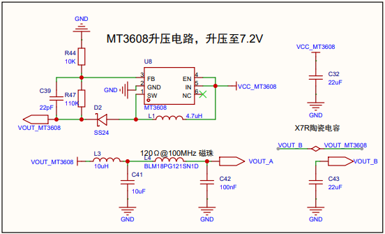

图 3-12 MT3608 及 π 型滤波器电路图

为了最大程度发挥电路设计的性能，在 PCB 布局时进行了数模分区与单点接地处理。在 PCB 上将数字电路（Type-C、TP4056、AMS1117）与模拟电路（运放、TPS7A30、LP2985）进行物理分区。模拟地与数字地两地之间通过磁珠进行单点连接。这种做法能防止数字电路的高频回流噪声干扰模拟信号的参考电平。

## 第四章 下位机嵌入式软件系统设计

在完成了硬件采集平台的搭建之后，如何通过软件调度充分释放硬件潜力、实现高效的数据采集与流畅的交互体验，成为了系统设计的另一大核心。本章将详细阐述下位机嵌入式软件的整体控制流与数据流设计，重点剖析前后台架构调度机制、基于 DMA 的高速数据传输链路优化，以及针对屏幕显示的渲染算法和波形触发机制。

### 4.1 前后台系统架构设计

为了在有限的微控制器计算资源内，完美兼顾高采样率下的数据吞吐与复杂的 UI 交互逻辑处理，下位机软件在整体设计上采用了经典且高效的“前后台系统（裸机）架构”。该架构依托 STM32 HAL 库，将程序的执行流清晰地划分为两个协同工作的维度：负责繁重业务处理的“前台主循环”与负责高实时性硬件响应的“后台中断服务”。

系统架构如图 4-1 所示。系统主函数 `main()` 在完成各项硬件外设与系统时钟的初始化后，便会进入无限轮询的前台主循环。前台主循环则承担了复杂的业务逻辑与人机交互任务。程序会持续轮询检测 ADC 数据就绪标志。当数据就绪时，系统在缓冲区中执行软件触发算法，寻找满足触发电平的边沿以锁定波形显示的起始点，并遍历数据计算各通道的峰峰值。若 USB 连接已开启，系统会调用传输函数将原始数据打包发送至上位机。在用户交互方面，主循环会检查输入标志，若检测到按键或编码器动作，则调用相应接口执行功能逻辑，例如切换时基、调整电压档位或切换耦合模式。最后，系统根据处理完毕的波形数据与当前设置参数，重新绘制示波器网格、波形曲线及参数数值，并通过 SPI 接口将显存数据刷写至 TFT 屏幕，完成界面刷新。

后台中断主要负责高实时性与硬件事件的快速响应，在设计上尽量减少执行时间以避免阻塞。其中，DMA 中断主要服务于 ADC 采样。系统将 ADC 配置为循环模式，当 DMA 传输完成半个缓冲区或整个缓冲区时触发中断，并置位相应的全局标志，通知前台主循环处理最新的采样数据块。定时器中断则包含捕获中断与更新中断，前者在输入信号产生跳变时触发，用于高精度频率测量；后者处理定时器溢出计数，以扩展低频信号的测量量程。USB 中断负责处理物理层的数据包收发，将发送缓冲区内的波形数据通过 USB 总线传输至 PC。此外，系统对旋转编码器与独立按键均采用基于外部中断的驱动方式。中断服务程序仅负责记录触发状态及必要的硬件状态捕获，并将耗时的业务逻辑与防抖判断转移至主循环中执行，从而保证响应实时性。

图 4-1 下位机软件架构图

### 4.2 高速数据采集与 DMA 传输优化

信号采集设备的核心指标取决于模拟前端的采样率与系统的数据吞吐能力。本设计采用了 STM32 的 ADC 双重规则同步模式配合 DMA 循环传输机制，构建了零 CPU 干预的高速采集链路。首先，为了实现对两路输入信号的同步观测，并确保相位测量的精确性，系统配置 ADC1 为主设备，ADC2 为从设备，工作在双重规则同步模式。

在硬件通道映射方面，系统将采集通道 1 映射至 ADC1 通道 3，将采集通道 2 映射至 ADC2 通道 4。为了建立可靠的同步触发机制，系统配置 TIM1_CC1 事件作为 ADC1 的外部触发源。将 TIM1 配置为 PWM 模式，相较于传统的翻转模式，能够确保触发频率与定时器溢出频率严格一致。通过调节 TIM1 的预分频器与重装载值，系统可精确控制采样率。其采样率计算公式为：

$$
f_{s} = \frac{f_{CLK}}{(PSC+1)(ARR+1)}
$$

其中 $f_{clk}$ 为系统时钟主频，在本系统中配置为 72 MHz。

此外，为优化数据传输效率，系统采用了 32 位数据对齐策略。在双重同步模式下，ADC2 的 12 位转换结果会自动填充至 ADC1 数据寄存器的高 16 位，而 ADC1 的结果则位于低 16 位。如此一来，一次 32 位 DMA 传输即可同时搬运两个通道的采样数据，极大地提高了总线传输效率。

在确立了高效的 ADC 同步采样与数据对齐机制后，为了保证波形数据的连续性并避免因 CPU 处理延迟导致的“盲区”，系统进一步启用了 DMA1 Channel 1 的循环传输模式（Circular Mode），并在 SRAM 中划分专用存储区域作为流式数据缓冲区。

在软件逻辑层面，系统采用了双缓冲策略，通过利用 DMA 的半传输与传输完成中断，实现了数据流处理的有效解耦。具体而言，在前半段处理阶段，当 DMA 填满缓冲区的前 50% 时会触发半传输中断，CPU 随即锁定前半段数据，执行触发搜索算法与波形绘制。与此同时，DMA 控制器在后台继续向缓冲区的后 50% 写入新数据，两者互不干扰。在后半段处理阶段，当 DMA 填满整个缓冲区时触发传输完成中断，DMA 指针自动回绕至数组头部以覆盖旧数据，CPU 则转而处理后半段数据。

数据采集部分的架构如图4-2所示。这种机制确保了数据采集（由硬件 DMA 负责）与数据处理（由软件 CPU 负责）在时间轴上的并行执行，有效避免了传统轮询或单次中断模式下的数据读取冲突，从而消除波形显示的“撕裂”与“丢帧”现象。

图 4-2 高速数据采集与DMA传输双缓冲架

在数据被高速搬运至内存后，如何将这些庞大且杂乱的原始数据转化为屏幕上稳定、清晰的波形，是下位机软件面临的最后一道难关。这涉及到精准的相位锁定以及高效的像素渲染机制。

### 4.3 波形捕获与实时渲染算法

为了在资源受限的微控制器上呈现流畅且不抖动的示波器视图，系统构建了一条包含“触发锁定、坐标映射、局部刷新”在内的完整数据可视化管线。首先在触发锁定环节，为了保证每一帧图像在屏幕上显示的起始相位严格一致，消除波形左右飘移的现象，系统设计了基于软件的数字触发算法。

在 DMA 完成数据传输后，CPU 会遍历缓冲区中的原始采样数据，寻找满足特定条件的采样点索引作为波形显示的起始锚点。系统默认采用下降沿触发模式，并针对采集数据执行专门的触发算法。首先，系统设定触发阈值电平为 ADC 量程的中点，以此来准确捕获交流信号的过零点。其次，考虑到信号在阈值附近可能因高频噪声产生微小抖动并引发误触发，算法特别引入了滞回区间。只有当信号大幅度穿越该设定区间时，系统才会将其认定为有效触发。在具体的下降沿判决过程中，对于缓冲区内的连续两个采样点，当且仅当前一时刻的采样值高于阈值与滞回电压之和，且当前时刻的采样值降至阈值及以下时，判定当前时刻为有效触发点：

$$
\begin{cases} 
   V_{t-1} > (V_{th} + \Delta V) \\
   V_t \leq V_{th} 
   \end{cases}
$$

该逻辑确保了触发点始终位于信号从高电平向低电平穿越且具有一定斜率的时刻，从而准确锁定了波形在屏幕上的起始相位。

完成触发相位的精准锁定后，下一步是将庞大的时域数据转化为屏幕坐标。系统以该触发点为原点基准，根据用户当前设定的时基参数执行数据抽取。在不同的水平扫描速度下，程序采取了不同的步长间隔进行数据提取。当观测高频细节（小步长）时，屏幕基本以原始采样率绘制；当需要宏观观测长时波形趋势时，系统则执行软件级别的降采样，从而实现水平方向的平滑缩放。

完成时域抽取后，系统必须将 12 位 ADC 的原始数值（0-4095）映射为 TFT 屏幕有限的物理 Y 坐标轴上。为了规避微控制器执行浮点数运算所带来的巨大性能开销，系统在纯整数域内采用了高效的线性插值公式进行坐标转换：

$$
Y_{\text {screen }} = Y_{\text {top }} + 1 + \frac{ADC_{\text {val }} \times \left(Y_{\text {bottom }} - Y_{\text {top }} - 2\right)}{4096}
$$

其中，\(Y_{\text {top }}\) 和 \(Y_{\text {bottom }}\) 分别定义了波形显示视窗在屏幕物理坐标系下的上、下边界。通过该公式，ADC 的最小值被精准映射至波形区域的顶端，最大值映射至底端。结合硬件前端的交直流偏置与衰减特性，该映射算法确保了波形在屏幕纵向上的按比例无失真还原。

当坐标数据映射准备就绪后，可视化管线进入 TFT 显示屏局部刷新阶段，此时的挑战在于图形的高效输出显示。系统采用的 1.8 英寸 TFT 屏幕基于 ST7735S 控制器。由于 STM32F103C8T6 仅有 20KB 的 SRAM 资源，根本无法开辟出足够容纳全屏色彩数据的帧缓冲区。若采用传统的逐点写入“画点”函数，频繁的 SPI 地址设置指令开销将导致严重的屏幕刷新卡顿。

针对这一瓶颈，本设计创新性地提出了一种基于 DMA 垂直条带刷新的显存优化方案。系统在 SRAM 中仅划拨了一个极小的一维数组作为临时缓冲区，专门用于缓存当前扫描列（单列垂直像素）的颜色数据。在渲染管线中，波形绘制函数按从左至右的顺序逐列进行画面合成：CPU 首先判断当前列的 X 坐标，在缓冲区中预填黑色背景或灰色的网格虚线颜色；随后，提取映射好的 Y 坐标，将信号波形的彩色像素点直接“覆盖”至该缓冲区的对应位置。

为防止在显示频率极高的陡峭边沿时出现波形断裂的视觉瑕疵，渲染算法还内置了纵向连线机制：程序会自动在前后两列的 Y 坐标间执行线性插值，利用信号通道特定的颜色补全中间跨越的垂直像素。单列数据合成完毕后，系统将 TFT 控制器的写入窗口限制为当前这一列的物理坐标范围，并直接启动 SPI-DMA 传输，将整列缓冲区的数据一次性刷写至屏幕显存中。

该方案降低了显存资源的开销，通过 DMA 控制器接管了耗时的外设数据搬运任务。实测表明，在复杂多通道波形同时显示的场景下，屏幕仍能保持极高的刷新率，肉眼观测无丝毫频闪与撕裂。

在解决了设备本地的显示难题后，系统还需将更高维度的数据处理任务交由上位机完成，这就依赖于一条稳定高效的数据传输链路。

### 4.4 USB 数据通讯协议设计

为了支持上位机执行复杂的后处理任务（如 FFT 频谱分析、轨道电路信号解调），下位机通过 USB CDC 接口构建了一条高速数据回传链路。在通讯协议的制定上，为了兼顾数据流同步的可靠性与不同采样深度下传输需求的灵活性，系统采用了“定长帧头 + 变长负载”的混合结构数据帧格式。

表4-1 本设计采用的USB通信协议

| 字节偏移 | 字段名称    | 长度     | 说明                                  |
| -------- | ----------- | -------- | ------------------------------------- |
| 0        | Header H    | 1 Byte   | 固定帧头 0xAA                         |
| 1        | Header L    | 1 Byte   | 固定帧头 0x55                         |
| 2        | Timebase ID | 1 Byte   | 当前时基索引 ID，用于上位机还原时间轴 |
| 3-4      | Payload Len | 2 Bytes  | 后续负载数据的字节长度                |
| 5...N    | Payload     | Variable | 原始 ADC 数据                         |

在明确了数据帧格式之后，为了确保大数据量的高效且稳定传输，系统实现了基于块传输的流控机制，并采用了分片发送策略。首先，系统会构建包含同步字与元数据的 5 字节帧头，并以此作为一次独立传输，确保上位机能优先锁定帧边界。随后，庞大的 ADC 原始数据会被切割为若干个数据块依次发送。在整个分包发送过程中，系统引入了阻塞与超时机制：在发送每个数据块时，系统会轮询检查 USB 发送状态；为了防止因上位机处理不及时而导致下位机程序死锁，程序中特别设置了软件超时计数器，一旦超过 1000 次循环仍未发送成功，系统将主动丢弃当前数据包，以此优先保证下位机系统的实时响应与持续采集能力。

## 第五章 上位机数据分析系统设计

下位机受限于处理能力与屏幕尺寸，主要侧重于现场数据的实时采集与基础波形观测。而对于轨道交通领域特定的复杂控制信号（如 ZPW-2000A 的移频特征与 25Hz 轨道电路的高精度相位），深度的解析与研判则依赖于上位机的强大算力支持。相比于嵌入式端，上位机系统具备更强的算力支持、大尺寸屏幕显示能力以及更灵活的算法迭代空间，能够满足铁路现场调试对实时性、数据吞吐量及复杂后处理的需求。

为了实现跨平台架构的兼容性与高效的开发，本系统选用 Python 3 结合 PySide6 框架进行开发。该技术栈具备若干工程优势，兼顾了开发效率与界面美观性：Python 拥有成熟且丰富的科学计算库，为信号处理算法提供了坚实基础；PySide6 封装了成熟的 Qt C++ 库，确保了 GUI 的流畅响应；系统底层计算则由高度优化的 C/C++ 扩展（如 NumPy）完成，有效平衡了开发便捷性与运行效率。得益于这套强大的技术底座，上位机分析软件得以成为整个便携式系统的处理核心，从容承担起高速数据接收与可视化、信号特征智能解调与辅助故障诊断等多项高阶任务。本章将从数据处理管线、可视化交互界面设计，以及核心算法的数学推导与代码实现三个层面，详细阐述系统的上位机解决策略。

### 5.1 数据接收与预处理管线

为保证接收和处理高采样率数据时 UI 界面不卡顿，系统设计了双线程协作架构。

通讯线程专门负责串口的高速监听与原始数据包解析。该线程对下位机发送的 $\text{0xAA 0x55}$ 帧头进行校验，并采用双通道数据解算逻辑。UI主线程则负责波形的高速渲染、仪表盘数据更新以及用户交互逻辑。

通讯线程与UI主线程之间通过 Qt Signals/Slots 机制通信，构建无锁数据管道，实现了零拷贝内存共享。当通讯线程解析完一帧数据（4000 字节）后，触发相应信号，将处理后的数组传递给主线程进行绘图。

原始 ADC 采样数据无法直接用于处理分析，需要先进行物理量转换与误差修正。根据硬件分压电路特性，将 ADC 数值映射为实际输入电压。程序通过引入增益（Gain）和偏移（Offset）校正系数，通过公式 $v_{real} = v_{raw} * gain + offset$ （其中 $v_{real}$ 为采集电压值、$v_{raw}$ 为上位机上传的 ADC 原始数据值）计算出真实电压值，消除硬件电路的静态误差。系统支持“自动归零”与“自动增益”功能，通过统计多次采样的均值自动计算校准参数。

为抑制信号链路中固有高频噪声并提升波形信噪比，系统引入了数字滤波与异常剔除机制。针对随机噪声，程序可选配置 3 点移动平均算法作为低通滤波器。对于离散信号序列 $x[n]$，算法通过计算当前点及其前后相邻点的算术平均值来生成新的序列 $y[n]$：

$$
y[n] = \frac{1}{3}(x[n-1] + x[n] + x[n+1])
$$

这种处理能有效平滑掉单点的尖峰噪声。此外，为增强系统鲁棒性，算法集成了峰峰值异常过滤器，剔除因接触不良或瞬态干扰产生的异常数据包，从而为后续的高级处理提供了高质量、可信赖的数据基础。

在打通了稳定可靠的数据获取与清洗链路后，系统必须通过直观友好的图形界面将这些冰冷的数据转化为工程师能够轻松理解的视觉信息。

### 5.2 可视化交互界面设计

人机交互界面作为上位机系统与用户直接沟通的窗口，其设计遵循了“信息分层，操作直观，重点突出”的原则。为了适应现场复杂的调试需求，整个 GUI 界面在空间布局上被科学地划分为三大功能区块：交互控制区、核心绘图区与数据仪表盘区。

在核心的波形渲染方面，系统采用了基于 GraphicsView 框架与 NumPy 切片优化的 PyQtGraph 绘图组件，从而实现了高采样率下毫秒级的波形流畅刷新。绘图区提供了多维度的信号观测视角。在时域层面，系统不仅能够实时绘制双通道电压波形，还支持 X/Y 轴视图锁定、自动量程调整以及连续滚屏等高级示波器功能，充分满足了从瞬态捕捉到长时趋势不同时间尺度的观测需求；在频域层面，系统支持同步显示信号的频谱分布，并允许用户在线性与对数坐标系间自由切换，从而更加直观地识别微弱的谐波与干扰分量；此外，针对 ZPW-2000A 移频信号的特殊性，系统在特定模式下会动态增加“解调频率-时间”曲线视图，将原本抽象的频率跳变规律以直观的图形化方式呈现出来。

为了提升参数读取的效率，界面右侧提供了实时仪表盘。该仪表盘不仅负责持续刷新峰峰值、频率、相位等基础电气指标，还能动态展示经过专用算法解析后的轨道信号高阶特征参数，例如具体的 ZPW-2000A 载频类型与低频码位，或是 25Hz 相敏信号的精确相位差。同时，仪表盘引入了颜色编码机制，通过绿色代表正常、红色代表存在干扰或超限，为用户提供直观的信号质量视觉反馈。

在辅助分析与数据留存方面，系统内置了数字化的光标测量工具。用户可以通过鼠标拖动 X 轴时间光标与 Y 轴电压光标，由上位机自动计算并显示两点间的时间差、电压差以及推算出的瞬时频率值，极大地方便了对波形细节的精细化分析。此外，系统还具备完善的数据管理功能，支持将当前屏幕定格的单帧波形或连续长时采集的原始数据连同时间戳与采样率等元数据一并导出为 CSV 格式文件，为后续的离线复盘与深度故障诊断提供了可靠的数据支撑。上位机可视化界面如图 5-1 所示。

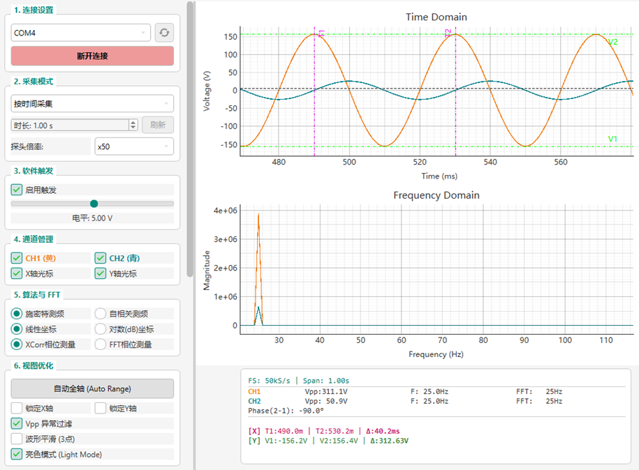

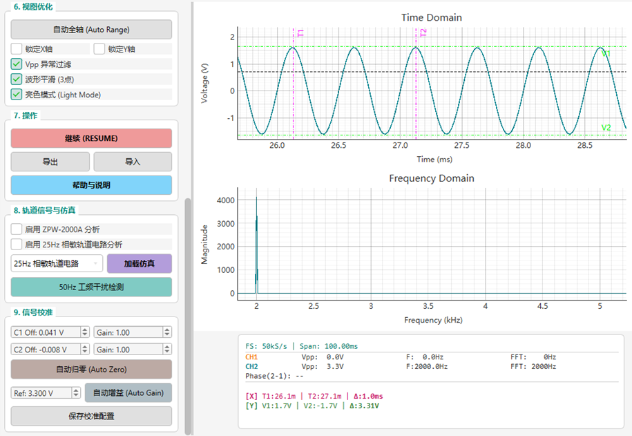

图 5-1 上位机可视化交互界面

### 5.3 轨道信号处理专用算法实现

针对轨道交通领域的特定信号类型，本系统在完成基础的频率与相位测量的基础上，集成了针对 ZPW-2000A 移频信号与 25Hz 相敏轨道电路的专用数字信号处理算法。

#### 5.3.1 ZPW-2000A移频信号解调算法

ZPW-2000A 轨道电路采用的是 FSK（频移键控）调制方式，更准确地说是 CPFSK（连续相位频移键控）。其信号模型可以表示为：

$$
x(t) = A \cos\left( 2\pi f_c t + 2\pi \Delta f \int_{-\infty}^{t} m(\tau) d\tau + \phi_0 \right)
$$
其中 $f_c$ 为中心载频（如 1701.4Hz、2001.4Hz 等），$\Delta f = \pm 11\text{Hz}$ 为频偏，$m(t)$ 为取值 $\pm 1$ 的低频方波调制信号（频率 $f_m \in [10.3, 29]\text{Hz}$）。理想情况下，信号的瞬时频率在 $f_c - 11\text{Hz}$ 与 $f_c + 11\text{Hz}$ 之间周期性跳变。值得注意的是，由于能量分布于两个边带频点，直接采用 FFT 峰值法估计载频将引入约 $11\text{Hz}$ 的系统性偏差。为此，本系统设计了一套基于希尔伯特变换的专用移频信号解调算法。相较于传统的过零检测法，该算法具有更高的抗噪性和频率分辨率。整个解调过程可划分为瞬时频率提取、载频精确估计以及低频特征解调三个核心步骤。

（1）基于希尔伯特变换的瞬时频率提取

在解调开始前，首先需要对信号进行宽带线性相位滤波预处理。为避免传统窄带跟踪滤波器引入的非线性相位失真，系统采用覆盖全部 ZPW-2000A 频段（1700–2600Hz）的固定宽带贝塞尔带通滤波器。该滤波器具备最大平坦群延迟特性，能够使通带内各频率成分延迟一致，有效抑制“振铃”效应。通带设定为 600–6000Hz，以完整保留载频及其高阶边带分量，确保时域上方波跳变沿的完整性。同时，为彻底消除滤波器的相位滞后，算法在离散域应用了前向与后向两次滤波的零相位滤波技术。基于预处理后的数据，系统利用希尔伯特变换构造解析信号 $z(t)$。对于实信号 $x(t)$，其解析信号 $z(t)$ 定义为：

$$
z(t) = x(t) + j\mathcal{H}[x(t)] = A(t) e^{j\Phi(t)}
$$
其中 $\mathcal{H}[\cdot]$ 是希尔伯特变换。由此推导出瞬时相位 $\Phi(t)$ 为：

$$
\Phi(t) = \arctan\left( \frac{\mathcal{H}[x(t)]}{x(t)} \right)
$$
算法对提取出的瞬时相位进行解卷绕处理后，对连续相位进行差分求导以获取瞬时频率：

$$
f_{inst}(t) = \frac{1}{2\pi} \frac{d\Phi(t)}{dt}
$$
得益于前端滤波器的优良时域保真特性，解调所得 $f_{\text{inst}}(t)$ 呈现高质量方波形态，精确反映了 $f_c \pm 11\text{Hz}$ 的频率跳变过程。

（2）基于截断平均的载频精确估计

针对 ZPW-2000A 低频调制信号占空比约为 50% 的先验特性，瞬时频率在上下边频的驻留时间具有统计对称性，其数学期望自然收敛于中心载频：

$$
E[f_{\text{inst}}(t)] \approx \frac{(f_c + \Delta f) + (f_c - \Delta f)}{2} = f_c
$$
然而，直接微分运算往往会引入显著的脉冲噪声。为抑制这一干扰，算法采用了截断平均值策略：对瞬时频率序列进行整体排序，剔除首尾各 10% 的离群值，再计算剩余数据的算术平均值作为精确载频估计 $\hat{f}_c$。该方法巧妙利用了宽带滤波保留的丰富边带信息，通过统计平均自动抵消 $\pm 11\text{Hz}$ 的频偏分量，将载频测量误差降至 0.1Hz 量级，在精度上显著优于传统的频谱峰值法。

（3）结合中值滤波与频谱重心的低频解调

由于直接微分得到的瞬时频率序列中仍含有部分由采样离散化放大的尖峰噪声，传统的线性滤波器（如均值滤波）会模糊方波的边缘，导致低频解调失真。为此，系统对瞬时频率序列施加了非线性的中值滤波。对于一维离散信号序列 $x[n]$，中值滤波器的输出 $y[n]$ 定义为：

$$
y[n] = \text{median}(x[n-k], \dots, x[n+k])
$$
其中，$k$ 为窗口半径，窗口总长度 $L = 2k + 1$，$\text{median}(\cdot)$ 表示对窗口内 L 个数据排序后取中间值。中值滤波在成功滤除微分放大噪声的同时，完美保留了频移键控信号跳变沿的陡峭方波形态。随后，程序进入低频调制频率 $f_m$ 的提取阶段。算法首先去除瞬时频率序列中的直流分量（即中心载频），仅保留反映低频跳变的交流成分。对加注汉宁窗的序列执行快速傅里叶变换（FFT）后，为了突破 FFT 固有的频率分辨率限制（$\Delta f = F_s / N$），系统采用了频谱重心法进行校正。假设峰值索引为 $k$，峰值邻域幅值为 $A_{k-1}, A_k, A_{k+1}$，对应频率为 $f_{k-1}, f_k, f_{k+1}$，利用峰值及其左右相邻点的幅值进行加权平均：

$$
\hat{f} = \frac{\sum_{i=k-1}^{k+1} f_i \cdot A_i}{\sum_{i=k-1}^{k+1} A_i}
$$

通过应用上述频谱重心公式，系统计算出校正后的低频调制频率，将频率估计精度提高到 FFT 分辨率的 $1/10$ 甚至更高，从而在有限的数据长度内实现了高精度的频率识别。

综上所述，该解调算法体系从宽带零相位滤波的预处理起步，经由希尔伯特变换与截断平均完成载频的精准锁定，最终借助中值滤波与频谱重心法实现低频特征的高精度提取。这一套层层递进的数字信号处理链路，有效克服了传统分析方法的固有缺陷，为 ZPW-2000A 轨道电路的数字化接收与实时故障诊断提供了坚实可靠的理论基础与工程实现方案。

#### 5.3.2 25Hz相敏轨道电路检测算法

针对离散化的 25Hz 轨道电路信号，其核心检测任务涵盖了能量评估、相位提取以及干扰分析三个维度。为此，系统针对性地设计了一套包含离散有效值计算、双模式相位测量以及工频干扰锁定的综合检测算法。

（1）基于离散积分的电压有效值计算

电压有效值是衡量轨道信号能量最直接的指标。系统首先计算 25Hz 交流电压的有效值，通过 ADC 采集并经过预处理（去直流分量）后的电压序列为 $x[n]$，其有效值计算严格遵循离散时间 RMS 定义。假设采样点数为 $N$，第 $n$ 个采样点的电压值为 $x[n]$，则有效值 $V_{rms}$ 的计算公式为：

$$
V_{rms} = \sqrt{\frac{1}{N} \sum_{n=0}^{N-1} (x[n])^2}
$$
在算法实现过程中，系统依次计算每个离散样本的平方值，求取其算术平均数后再进行开方运算。相比于传统的通过峰值推算有效值（即 $V_{rms} \approx V_{peak}/\sqrt{2}$）的方法，这种基于离散积分的直接计算法在处理含有畸变、高次谐波或瞬态干扰的非标准正弦波时，能够提供更为准确的能量评估。

（2）基于互相关与抛物线插值的时域相位测量

完成能量层面的评估后，进一步的挑战在于相位信息的精确提取，这也是判断 25Hz 相敏轨道电路区段状态的核心依据。针对该需求，系统设计了两种相位计算模式，第一种便是基于互相关法结合抛物线插值的时域补偿算法。互相关函数 $R_{xy}[m]$ 能够衡量两个信号 $x[n]$（参考信号/局部电压）和 $y[n]$（轨道信号）在不同时间延迟 $m$ 下的相似程度。当 $R_{xy}[m]$ 达到最大值时，对应的延迟量 $m_{peak}$ 即为两个信号的时间差（以采样点数为单位）。离散互相关公式定义为：

$$
R_{xy}[m] = \sum_{n=0}^{N-1-|m|} x[n] \cdot y[n+m]
$$
在实际实现中，系统通过高效的滑动点积计算离散互相关序列，并初步锁定互相关函数的粗略峰值位置 $k_{max}$。然而，由于采样率 $f_s$ 是有限的，真实的互相关峰值通常位于两个采样点之间。直接使用整数索引 $k_{max}$ 会引入量化误差。为了突破采样率限制，系统假设峰值附近的互相关函数曲线符合抛物线特征 $y(x) = ax^2 + bx + c$，利用峰值点及其左右相邻点进行插值拟合。设互相关序列在粗略峰值点及其左右的值分别为 $y_0 = R[k_{max}]$（峰值点）、$y_{-1} = R[k_{max}-1]$（左邻点）、$y_{+1} = R[k_{max}+1]$（右邻点）。为了找到真实峰值相对于 $k_{max}$ 的偏移量 $\delta$，推导得到的偏移量 $\delta$ 计算公式为：

$$
\delta = \frac{y_{-1} - y_{+1}}{2(y_{-1} - 2y_0 + y_{+1})}
$$
通过计算该修正值 $\delta$，算法对粗略的整数延迟量进行了浮点补偿。最终的精确相位差 $\phi$（单位：度）由下式给出：

$$
\phi = - \left( \frac{(k_{max} + \delta) \cdot f_{signal}}{f_{s}} \right) \times 360^\circ
$$
其中 $f_{signal}$ 为信号频率（25Hz），$f_{s}$ 为采样率。这一机制将相位测量精度提升至亚采样点级别，有效解决了低采样率下相位分辨率不足的问题。

（3）基于单频点DFT的频域相位高精度提取

除了时域上的互相关法，系统还实现了第二种频域计算模式——基于单频点离散傅里叶变换（Single Bin DFT）的相位差测量方法。标准 FFT 算法将信号频谱离散化为 $N$ 个等间距的频点。只有当被测信号的频率 $f_0$ 恰好等于某个 FFT 频点时，提取的相位才是准确的。然而，在实际应用中，信号频率（如 25Hz）往往无法保证与 FFT 频点完全对齐，进而引发“栅栏效应”导致相位值严重偏离真实初相位。

为克服这一固有限制，本设计充分利用了 25Hz 相敏轨道电路信号频率已知且固定的先验知识，绕过全频谱 FFT 计算，直接执行高效的单频点 DFT。根据欧拉公式，算法构建了一个旋转频率严格等于目标频率 $f_{hint}$（即 25Hz）的复指数序列：

$$
e[n] = e^{-j 2\pi f_{hint} \frac{n}{f_s}}, \quad n = 0, 1, ..., N-1
$$
随后执行相关投影步骤，将参考信号 $x[n]$ 和轨道信号 $y[n]$ 分别与该基向量进行内积运算，得到目标频率处的复频谱值：

$$
X(f_{hint}) = \sum_{n=0}^{N-1} x[n] \cdot e[n]
$$

$$
Y(f_{hint}) = \sum_{n=0}^{N-1} y[n] \cdot e[n]
$$

此过程本质上是计算 DFT 在任意指定频率 $f_{hint}$ 处的精确值。由于复数的辐角 $\theta$ 代表了该频率分量的初相位，算法通过提取两个信号在 $f_{hint}$ 处的初相位 $\phi_x$ 和 $\phi_y$，求得其差值即为相位差 $\Delta\phi = \phi_y - \phi_x$。最后，通过模运算将计算得到的弧度差值转换为角度，并进行归一化处理，使其严格落在 $[-180^\circ, 180^\circ]$ 区间内。该方法的核心优势在于相位测量精度不再受 FFT 频率分辨率的限制，且通过在整个信号周期内进行积分的方式，有效抑制了随机噪声的影响。

（4）基于FFT谐波锁定的工频干扰分析

在完成对 25Hz 有用信号的有效值与相位解析后，为了全面评估现场的电磁环境，系统还需要对 50Hz 工频信号进行干扰评估。针对电气化铁路常见的工频干扰，系统设计了 FFT 谐波锁定算法。系统在进行傅里叶变换前，会先减去信号的平均值以消除 0Hz（直流）分量，防止其淹没低频段的微弱干扰信号。随后对时域信号进行 FFT 转换，重点关注基波干扰（50 Hz）及其二次谐波（100 Hz）和三次谐波（150 Hz）。

在频域中，第 $k$ 条谱线对应的实际电压幅值 $V_{freq}$ 可通过以下公式从 FFT 模值 $|X[k]|$ 换算得出（考虑双边谱折叠到单边谱的能量守恒）：

$$
V_{freq} \approx \frac{2 \cdot |X[k_{freq}]|}{N}
$$
干扰占比（Ratio）定义为 50Hz 干扰幅值与频谱中最大主波峰（通常为 25Hz 有用信号）幅值的比值：

$$
Ratio = \frac{Amp_{50Hz}}{Amp_{max}} \times 100\%
$$

在具体的算法执行流程中，系统首先在频率轴上锁定 50Hz 所对应的离散频谱索引，进而提取该频点的模值并换算为干扰电压的实际幅值。最后，通过计算该干扰幅值与基波最大幅值的百分比，得出准确的工频干扰占比。这一处理流程能够快速分离出工频特征，为现场的电磁兼容性评估及牵引电流不平衡度分析提供了直观且量化的数据依据。

## 第六章 系统测试与总结展望

经过前文各章节的软硬件协同设计与专项算法开发，系统已初步具备了便携式多功能信号采集与分析的整体能力。为客观评估该系统的工程应用价值与各项技术指标的达成度，本章搭建了标准化的综合测试平台，依次开展了仪器基础测量功能、数据高速通讯链路以及轨道信号专用解调算法的一系列验证性实验，并对全文的研究成果与未来演进方向进行了总结与展望。

### 6.1 系统基础测量与通讯性能综合测试

为验证便携式采集设备作为通用示波器的基础可靠性，首先开展了波形采集与显示性能测试。本实验采用标准任意波形发生器作为信号源，向设备的模拟前端注入多种典型波形（如不同频率的正弦波、方波、三角波等）。

相关测试结果如图 6-1 所示。实验结果清晰表明，在处理 1kHz 至 10kHz 频段内的各类基础信号时，下位机内置的软件滞回触发算法均能够准确捕捉信号过零点，屏幕显示的波形相位锁定稳定，无左右漂移或随机抖动现象。同时，得益于 DMA 局部刷新机制的加持，TFT 屏幕的波形渲染极其平滑，肉眼观测无“频闪”与“撕裂”瑕疵，在响应速度与视觉体验上满足使用需求。

<table>
  <tr>
    <td align="center"><b>1kHz 方波</b> </td>
    <td align="center"><b>2.5kHz 正弦波</b> </td>
  </tr>
  <tr>
    <td align="center"><b>5kHz 半波</b> </td>
    <td align="center"><b>10kHz 三角波</b> </td>
  </tr>
</table>

图 6-1 不同频率与波形的基础采集测试

本系统设计有信号发生器功能，通过按钮导航至信号发生器界面并启用方波输出功能，将采集设备的 CH2 通道连接至设备上的 PWM 输出引脚，测试设备的波形自检功能，结果如图 6-2 所示。

<table>
  <tr>
    <td align="center"><b>信号源</b> </td>
    <td align="center"><b>1kHz 方波 频率</b> </td>
    <td align="center"><b>1kHz 方波 峰峰值</b> 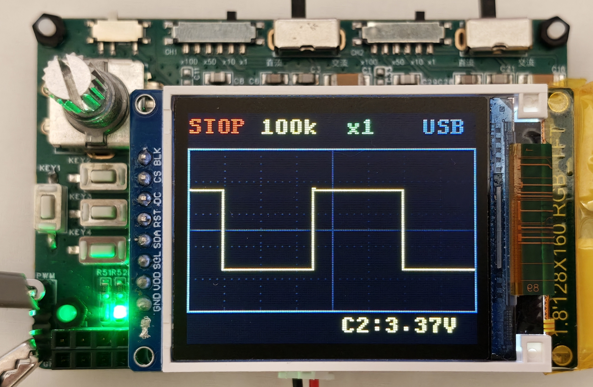</td>
  </tr>
</table>

图 6-2 内部信号发生器自检测试

在验证了本地波形采集的可靠性后，为了评估“上下位机协同”架构下的数据吞吐极限，本环节进一步对系统的 USB 虚拟串口通讯链路进行了压力测试。在轨道交通低频控制信号（如 ZPW-2000A 的 3kHz 以内频带）的应用场景下，系统通常运行在数万次每秒的采样率级别。

在实机连调测试中，使用标准信号源生成 2000Hz 的基准正弦信号注入下位机，同时在下位机侧启用全速 USB 数据上报功能。在 PC 侧，上位机软件同步开启数据接收与渲染管线。如图 6-3 的联合测试结果所示，面对持续、高密度的数据流，通讯链路展现出了极佳的稳定性。对于测试中 100 kS/s 以内的数据包吞吐，上位机界面不仅能够毫秒级无延迟地复现实时波形，且 FFT 频谱图中的 2000Hz 主峰尖锐纯净，无频谱泄露及干扰杂散，充分验证了上下位机联调方案的成功。

<table>
  <tr>
    <td align="center"><b>2kHz 正弦波 - 采集设备界面</b> </td>
    <td align="center"><b>2kHz 正弦波 - 信号发生器界面</b> </td>
  </tr>
  <tr>
    <td align="center" colspan="2"><b>测试结果 - 上位机界面</b> 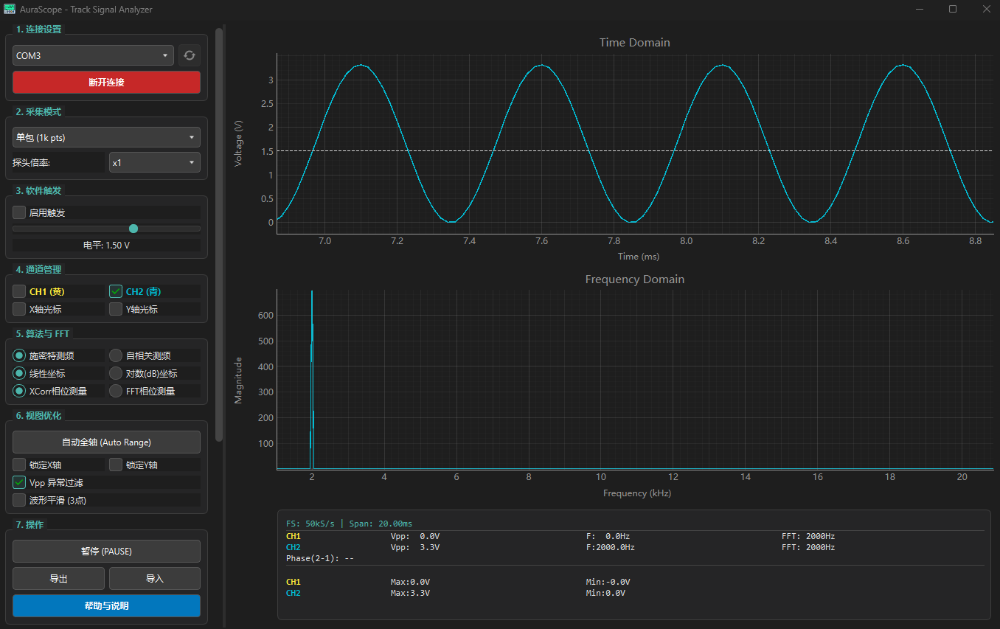</td>
  </tr>
</table>

图 6-3 USB 高速数据通信联合测试

### 6.2 轨道专用功能验证

本节重点对轨道信号分析算法进行仿真测试，采用 Python 程序生成标准 ZPW-2000A 与 25Hz 相敏数字仿真信号，并将其导入上位机，以验证系统的频率解调精度与抗干扰性能。

本节以载频1698.7Hz（1700-2型）、低频13.6Hz（“LU”码）的ZPW-2000A仿真信号作为典型工况进行分析。如图6-4所示，经上位机算法解算，系统实测载频为1698.7Hz，测量误差小于0.1Hz；解调低频为13.57Hz，绝对误差为-0.03Hz。同时，系统基于解调所得的特征频率，准确识别出“LU”低频码位，并正确输出“前方2个闭塞分区空闲”的行车逻辑指示。

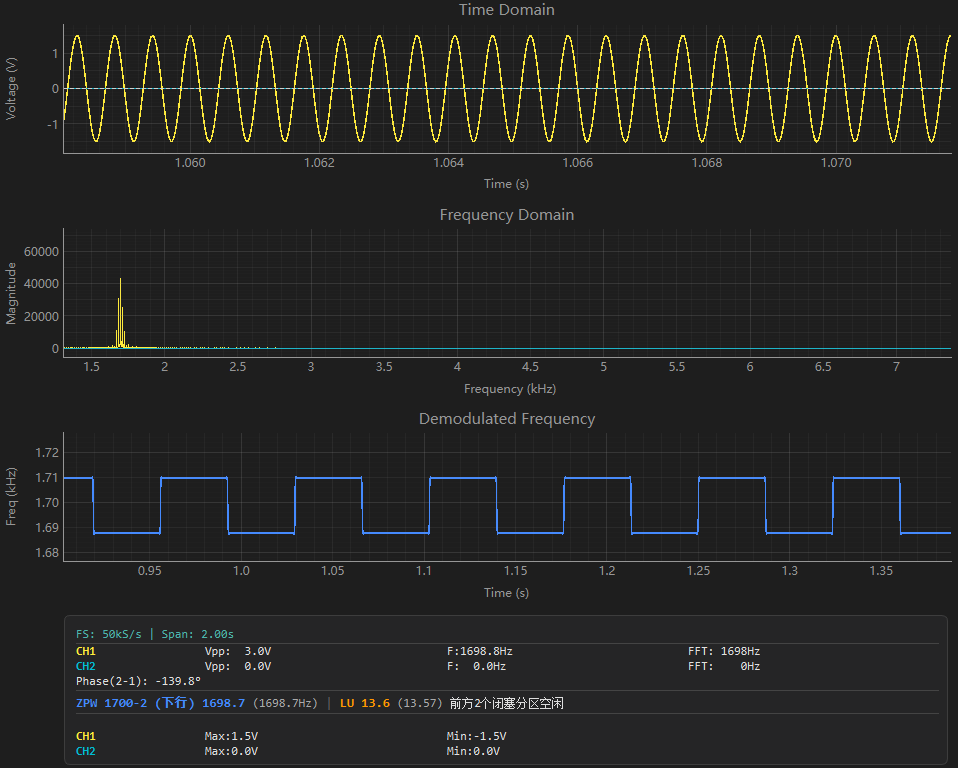

图 6-4 典型工况信号解调测试结果

在ZPW-2000A移频信号解调测试环节，为全面验证系统的解调精度与多频段适应性，本研究选取了多种载频与低频调制组合进行综合测试。限于篇幅，前文仅详细展示了典型工况的解调结果，各组载频与低频码组合的完整联合解调测试数据与码型识别结果详见表 6-1。

表 6-1 ZPW-2000A移频信号解调测试结果

| 信号类型 | 载频设定/实测(Hz) | 载频误差(Hz) | 目标低频码型 | 实测低频(Hz) | 低频误差(Hz) |
| :------: | :---------------: | :----------: | :----------: | :----------: | :----------: |
|  1700-2  |  1698.7 / 1698.7  |    ＜0.1     | LU (13.6Hz)  |    13.57     |    -0.03     |
|  2000-1  |  2001.4 / 2001.5  |     +0.1     | U2 (14.7Hz)  |    14.65     |    -0.05     |
|  2300-2  |  2298.7 / 2298.7  |    ＜0.1     |  H (29.0Hz)  |    29.00     |    ＜0.01    |
|  2600-1  |  2601.4 / 2601.4  |    ＜0.1     | JC (27.9Hz)  |    27.93     |    +0.03     |
|  2000-2  |  1998.7 / 1998.8  |     +0.1     | L5 (21.3Hz)  |    21.35     |    +0.05     |

由表 6-1 可知，系统在处理不同区段、不同码型的 ZPW-2000A 信号时，载频测量误差均控制在 ±0.3Hz 以内，低频解调误差保持在 ±0.1Hz 范围内，且均能完全正确识别对应码位与行车逻辑。结果表明，基于希尔伯特变换的解调算法不仅在低信噪比下具备高鲁棒性，同时对各类标准频段均具有极高的测量精度。

在成功验证了 ZPW-2000A 移频信号的解调能力之后，本研究进一步开展了 25Hz 相敏轨道电路参数测量的验证实验。实验向系统输入两路频率为 25 Hz 的正弦测试信号，并人为叠加 50 Hz 工频干扰，设定两路信号的理论相位差为 90°。测试结果显示（见图 6-5），系统测得的实际相位差为 90.0°，交流信号有效值（RMS）计算准确，且成功分离并量化了干扰信号的幅值。

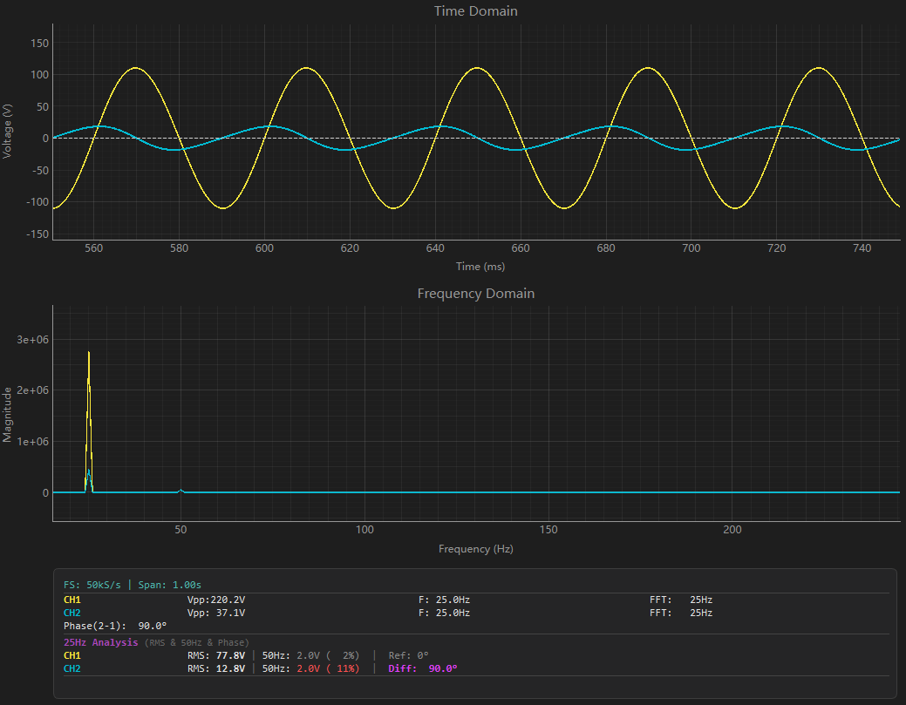

图 6-5 25Hz 相敏轨道电路含工频干扰测试结果

结果表明，即使在叠加 50 Hz 工频干扰（工频干扰占比约 11%）的情况下，系统仍能通过 FFT 谐波锁定准确分离干扰分量。系统不仅有效抑制了工频噪声，其相位测量误差与有效值计算偏差均严格控制在设计指标范围内。

### 6.3 总结与展望

本文针对当前轨道交通信号维护领域对便携化、高性价比及智能化测试设备的迫切需求，设计并实现了一套基于 STM32 的嵌入式信号采集与分析系统。

在硬件架构方面，系统以 STM32F103C8T6 微控制器为核心，结合高输入阻抗的模拟前端调理电路与电源管理模块，构建了紧凑可靠的采集终端。特别是利用 MCU 内置的双 ADC 资源配合 DMA 传输机制，实现了双通道信号的严格同步采样，有效解决了相敏轨道电路相位差测量的硬件基础问题。

在软件算法层面，创新性地提出了基于希尔伯特变换的 ZPW-2000A 移频信号解调算法与基于互相关及 FFT 的 25Hz 相敏轨道电路相位测量算法，并开发了嵌入式前端基础测量与上位机深度分析相协同的综合工作平台。

实验结果表明，该系统不仅具备通用示波器的波形观测功能，更能对特定轨道交通信号进行高精度的频率识别与相位分析，在采样精度、实时性及便携性方面均达到了预期的设计指标，为轨道交通信号设备的日常巡检与故障初判提供了一种高效、低成本的解决方案。

尽管本系统已完成了预定的设计目标并在实验室环境下验证了其有效性，但受限于硬件资源与开发周期，仍存在一定的优化与改进空间。

首先，当前主控芯片的运算能力与存储资源限制了系统的最高采样率与复杂 DSP 算法的片上实现，未来可考虑升级至更高性能的 Cortex-M4 或 M7 架构处理器（如 STM32F4/H7 系列），以支持更宽频带的信号采集与更高级的实时分析功能。

其次，在人机交互与智能化方面，现有的 1.8 英寸屏幕与物理按键操作略显局限，后续研究可引入更大尺寸的触摸屏及无线通信模块（如 Wi-Fi/蓝牙），实现数据的无线传输与云端同步。

此外，针对复杂的现场故障诊断需求，可进一步探索将轻量级神经网络或边缘计算技术融入系统，构建具备自动特征提取与故障模式识别能力的智能诊断终端，从而进一步提升轨道交通信号维护的智能化水平与作业效率。

## END 致谢

凡是过往，皆为序章。愿历尽千帆，心中仍有山海。
