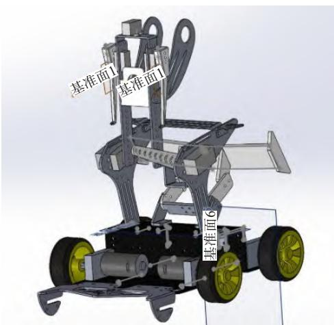
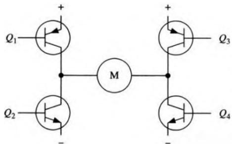

# 基于STM32的四轮移动机器人设计

DOI: 10.15913/j.cnki.kjycx.2025.17.021

**摘要：**为实现机器人在复杂环境下高效稳定地自主运行，设计了一种基于STM32的四轮移动机器人系统，该系统集成动态平衡控制、环境感知与人机交互模块。通过优化硬件架构，构建包含多模态传感器阵列、运动控制单元与安全保护电路的系统，以提高机器人系统性能。通过PID控制算法优化电机响应速度和精度，并融合不同传感器数据，提高环境感知的准确性。实验表明，该系统在复杂环境下可保持稳定运行，达到  $\pm 0.8^{\circ}$  航向跟踪精度，伺服响应时间小于等于2s，具备灵敏的避障能力，综合性能指标满足设计要求。

**关键词：**STM32单片机；运动平衡；环境感知；人机交互

近年来，智能机器人在各个领域的应用日益广泛，涵盖了家庭、医疗、教育及商业等多个方面。从工业生产线上的自动化操作，到日常生活中的服务协助，机器人的身影无处不在。在众多机器人类型中，基于STM32的智能四轮移动机器人凭借其独特的优势，逐渐崭露头角，成为研究与应用的热点。

智能四轮机器人融合传感器技术、控制算法与驱动系统，能够在复杂环境中展现优越的适应性。本文提出了一种基于STM32微控制器的四轮移动机器人设计方案。该方案通过硬件架构创新与分层控制策略，实现精确运动控制与环境交互功能，并结合文献调研与实验测试，实现了四轮移动机器人原型开发。

本研究通过完整的功能实践案例，不仅验证了基于STM32平台的四轮式机器人在实际应用场景中的有效性，更为中小型智能移动载体的嵌入式开发提供了可复用的设计范式和技术实施路径。

## 1 移动机器人系统机械设计

该机器人采用模块化设计理念，其机械结构分为底盘、支撑框架和传感器安装平台3个部分。底盘采用碳纤维材料，具有良好的强度和轻量化特性，能够有效降低机器人整体重量，同时可提供足够的刚性以承受工作过程中的各种冲击与振动。底盘的设计考虑了传感器的布置及其他电子元件的安装位置，以确保机器人的重心合适，提升运动稳定性[1]。

传感器的安装位置对机器人整体性能有显著影响。为了实现最佳的感知效果，传感器装配位置设计

考虑了各传感器的视角、探测范围以及相互之间的干扰。所有传感器均被安装在离地适当高度的支撑框架上，以确保其在工作时具有良好的视野。此外，模块化的设计允许传感器的更换和升级，方便未来的扩展和改进。

四轮移动机器人整体外观示意图如图1所示。

  
图1 四轮移动机器人整体外观示意图

本研究采用直径为  $90 \mathrm{~mm}$  的橡胶轮胎，增加其抓地力，以优化机器人的运动速度与爬坡性能。此外，机器人通过安装舵机实现了运动变形的功能。

## 2 移动机器人系统硬件设计

### 2.1 传感模块选型与设计

本系统设计了多通道光电传感循迹模块、颜色传感模块、避障模块和姿态传感模块，以实现高效的运动姿态控制[2]。

#### 2.1.1 多通道光电传感循迹模块

为实现路径跟踪的稳定运动控制，本系统采用自主设计的单节点光学传感器单元，如图2所示。其由高功率发光二极管(LED)、限流电阻网络、PIN光敏二极管及分压式可调电阻器构成标准化检测模块。其工作原理基于反射式光强检测技术，当发射端  $450\mathrm{nm}$  波段光源经地面反射后，光敏器件通过感测反射光强变化形成对应的光电流信号，经可变增益调节及信号调理电路后输出线性化电压信号。通过实时采集传感器节点动态电压值，可精确量化地表灰阶差异，为运动控制系统提供闭环反馈参数。本研究设计的多通道光电传感阵列具备14节点同步采样能力，采用高密度印刷电路板布设方案实现全方位路径覆盖率。

  
图2 单节点光学传感器单元原理图

针对四轮移动平台运动学特性，创新性提出双平面传感阵列部署架构，通过在车辆行进前后对称配置两套独立传感器单元，显著增强动态环境下的轨迹预测与补偿能力。为突破微控制器硬件资源限制，开发基于数字逻辑电路的资源复用扩展系统，通过GPIO端口时序控制，采用硬件级多路复用技术实现前/后阵列信号的有序选通，配合精密模拟开关芯片构建低损耗信号路径，建立时序可调的双通道采样系统。此设计方案在保证12bitADC精度的同时减少了大量的IO资源占用率，有效解决传统单控制器多传感器系统存在的资源瓶颈问题。

#### 2.1.2 颜色传感模块

该移动机器人选用E18-F10NK颜色传感器来探查地面标记，完成地图边界判定、识别路径等操作。该传感器是集发射与接收于一体的色标传感器，通过发出调制光并接收被测物体的反射光，根据接收光信号的强弱来区分不同的颜色，能够有效避免环境可见光干扰，并通过双透镜的设计延长了探测范围[3]。

#### 2.1.3 避障模块

避障模块选用型号E18-D80NK的红外光电接近开关，其通过发射红外线并检测反射信号强度变化，实时感知障碍物的接近程度，输出数字信号（如低电平触发）以触发控制逻辑。红外光电接近开关在四轮移动机器人避障系统中发挥着关键作用[4]。

#### 2.1.4 姿态传感模块

为了增强机器人的姿态控制能力，陀螺仪被集成到控制系统中。该模块选用HWT101型单Z轴陀螺仪，实时监测机器人的偏航角变化，帮助机器人完成精准的转向运动，实现动态环境下的稳定行驶和运动控制[5]。

### 2.2 电源管理与电路保护设计

电源稳压电路是确保四轮移动机器人各模块稳定工作的关键部分，其作用是将锂电池输出的电压转换为各模块所需的稳定电压。在本设计中，锂电池输出的电压为  $24\mathrm{V}$ ，为了保证机器人的运动能力，同时为了防止电源电压波动引起的电机转速不稳定问题，可通过稳压模块将电压降至  $19\mathrm{V}$  后，接入电机驱动板中，以驱动电机运动。

系统采用TPS5450模块将  $19\mathrm{V}$  电压进行二次降压至稳定的  $5\mathrm{V}$  电压输出。该模块支持  $5.5\sim 36\mathrm{V}$  宽电压输入和5A宽电流输出，能够满足舵机工作、传感器阵列等高功耗负载需求。同时，为了降低效率损耗，采用MP2166双路同步降压稳压器将  $5\mathrm{V}$  降压至  $3.3\mathrm{V}$ ，为STM32运行电路和光电传感器阵列两部分进行独立供电。

为避免电源与负载的动态特性、环境扰动及机械异常可能导致电气回路产生瞬态过流或短路的风险，通过设计基于PW1515的电流保护电路作为关键电路保护器件。限流芯片通过内置电流传感电路实时检测负载电流，当电流超过预设阈值(0.5~3A可调)时，芯片在微秒级时间内切断供电路径，防止电机驱动板、传感器或主控芯片因过流而损坏，通过实时监测与智能响应机制，显著提升了系统的可靠性与安全性。

PW1515限流保护电路如图3所示

  
图3 PW1515限流保护电路

### 2.3 主控电路设计

本系统以STM32F407ZGT6微控制器作为核心控制芯片，采用分层式嵌入式架构设计，母板核心层与功能子板通过  $2.54 \mathrm{~mm}$  间距排阵实现信号拓扑连接。主控功能子板示意图如图4所示。其中，主控功能子板构建板载人机交互单元，包含五轴导航按键与机械编码

开关组成的参数输入矩阵，配合驱动OLED显示屏，实现了人机交互菜单系统的设计。

  
图4 主控功能子板示意图

同时，为防止舵机工作时对控制器和传感器系统产生的浪涌电流干扰，为舵机驱动电路设计了独立的供电回路[6]。存储系统集成AT24C02EEPROM芯片实现非易失性参数存储，其I²C总线采用上拉电阻分时复用方案。

双平面传感阵列创新采用CH440R模拟复用开关芯片，构建14通道复用式ADC接口，实现前后双灰度传感器模块的时分复用采样，通过寄存器直接内存访问(DMA)技术，快速完成全通道数据采集。

### 2.4 电机驱动与运动机构

电机驱动模块作为机电系统的核心功率转换单元，其核心功能在于将上位控制单元生成的PWM（脉冲宽度调制)控制信号转化为高功率机电能量输出，驱动运动机构完成精确运动学响应。本系统采用基于全桥拓扑(H-bridge)的功率驱动架构，构建由4个功率MOSFET组成的桥式电路网络，通过动态调控各桥臂开关器件的通断时序，实现电机端口极性反转与转速调节的双模态控制。具体来说，通过输入信号的逻辑组合控制H桥的导通状态，从而实现电机的正反转控制。电机驱动模块通过PWM技术作为调速基准，通过调整PWM占空比动态改变等效输出平均电压。H桥电机驱动结构如图5所示。

图5 H桥电机驱动结构

在本四轮移动机器人架构中，运动机构采用高转矩金属齿舵机(MG3015型，额定输出扭矩  $30\mathrm{kg}\cdot \mathrm{cm}$  ）作为主动变形单元驱动器，可动态调节机器人质心分

布与机身高度，以满足复杂地形下的运动学适配需求。推进运动模块采用Z型轴向叠压直流减速电机，相比常规圆柱齿轮减速电机，在满足扭矩和转速要求的前提下，能大幅缩减轴向长度，以实现紧凑型轮毂嵌入式布局。

## 3 移动机器人系统软件设计

### 3.1 自动寻迹算法

自动寻迹算法依托于PID控制器。PID控制器是根据系统输入  $r(t)$  与系统输出值  $y(t)$  之间的误差随时间变化的函数  $e(t) = r(t) - y(t)$ ，通过对比例调节  $P$ 、积分调节  $I$  和微分调节  $D$  进行线性组合构成控制量  $u(t)$ ，实现对被控制对象的实时调节[7]。

在本研究中，对每路光电传感器记录的灰度数据进行5次连续采集，将所获得的数据经过去极值化处理后，计算剩余数据的平均值。每路灰度平均值被存储于一个数组中，通过对数组元素计算加权和，对其进行比例计算处理求得误差，该误差用于量化机器人偏离目标线路的程度。

在自主寻迹算法中，传感器阵列加权定位算法的数学建模[8]如下。

设传感器阵列包含  $N$  个红外接收管，其物理排布满足式(1)。

$$
x _ {i} = L \cdot \frac {2 i - (N + 1)}{N - 1} (i = 1, 2, \dots , N) \tag {1}
$$

式中： $x_{i}$  为第  $i$  个传感器的横向坐标； $L$  为有效检测宽度。

加权误差计算满足式(2)。

$$
e = \frac {\sum_ {i = 1} ^ {N} w _ {i} \cdot s _ {i} \cdot x _ {i}}{\sum_ {i = 1} ^ {N} w _ {i} \cdot s _ {i}} \tag {2}
$$

式中： $w_{i}$  为预设权重系数，采用高斯分布加权； $s_{i}$  为第  $i$  个传感器的二值化信号。

由于快速移动的机器人对于动态响应要求高且存在积分累积风险，本系统基于式(1)、式(2)计算得到的加权误差，选择采用比例-微分控制算法控制四轮机器人的智能巡线。比例项  $(P)$  直接响应路径偏差，微分项  $(D)$  抑制偏差变化率，防止因剧烈转向导致的失衡，从而增强系统的整体导航性能和稳定性[9]。

### 3.2 环境感知数据处理

系统通过机身前后的多通道光电传感阵列，识别感知地面的灰度信息，以此判断地面路径、识别拐角和交叉路口。通过DMA传输方式，提高ADC数值读取的实时性，显著降低了软件资源的占用。

系统通过串口读取陀螺仪模块的回传数据，使得

四轮移动机器人能够进行方位感知。基于PID控制算法实现机器人航向角闭环调节，以偏航角偏差作为控制输入，通过实时计算比例、积分、微分项输出，构建双电机差速控制量，实现  $\pm 0.8^{\circ}$  级别的角度跟踪精度。该方法通过动态补偿系统惯性与摩擦扰动，在消除稳态误差的同时保持转向过程的平滑性。

闭环转向系统如图6所示。

  
图6 闭环转向系统

### 3.3 人机交互系统的设计

为提升智能四轮机器人的用户交互体验，本研究在其人机交互系统设计中引入了OLED屏幕及五向按键的组合。这一设计允许用户通过模拟换页的方式进入不同的功能子模块，从而实现对多种操作的访问，包括但不限于参数设置、复杂路面测试及相关传感器数据（如灰度值与陀螺仪数值）的查询。同时，利用串口与语音模块通信，以实现对语音指令的识别，执行预设的动作或响应，形成自然的人机交互体验[10]。

## 4 移动机器人系统调试

在调试过程中，逐步验证各模块的功能与性能，确保系统整体协同工作。通过模块化地编写控制程序，实现传感器数据采集、运动控制和人机交互等功能，确保软件系统与硬件的良好配合。系统整体表现稳定，具体测试结果如下。

### 4.1 路径跟踪性能

机器人搭载14节点光电传感阵列的灰度寻迹系统，能够成功识别复杂的交叉路径分叉口，在寻迹过程中，得益于PID自主寻迹算法，机器人拥有良好的鲁棒

性。移动机器人测试图如图7所示

  
图7 移动机器人测试图

### 4.2 感知响应能力

系统色标传感器检测距离离散度控制在  $\pm 3.8\%$  ，能够有效进行地面标记识别，红外光电开关成功实现了 $5\sim 80~\mathrm{cm}$  动态检测距离调节，触发信号延迟低，安全余量高。

### 4.3 姿态控制精度

闭环转向系统的偏航角分辨率达  $\pm 0.8^{\circ}$  。在动态扰动测试中，系统通过PID转向仅需2s恢复至预定航向，航向偏离量峰值控制在  $\pm 2.6^{\circ}$  范围内。

### 4.4 安全保护机制

通过PW1515电流保护芯片实现动态限流机制，短路工况下能够迅速断开供电电路，分模块独立供电的设计，有效抑制了系统的浪涌电流。

### 4.5 人机交互设计

实现了OLED多层级菜单式交互，并具备语音指令识别的能力，人机交互效果良好。

## 5 结束语

本研究基于STM32平台成功构建了四轮移动机器人系统，具备动态平衡控制、多模态环境感知与模块化人机交互的能力。实验验证了PID控制算法在路径跟踪中的有效性，以及多通道光电传感阵列加权算法的环境适应性。未来研究将聚焦于强化学习算法的嵌入与多模态传感器的协同优化，以提升四轮机器人在动态场景下的自主运动能力。

## 参考文献：

[1] 雷羽虹，杭晨旋，游心懿，等.巡逻机器人底盘防御策略优化[J].机械制造，2024，62（11）：10-15.  
[2] 王昕煜.移动机器人多传感信息融合位姿估计与速度控制研究[D].无锡：江南大学，2021.  
[3] 郭娟娟, 赵秀萍. 如何选用色标和颜色传感器[J]. 印刷杂志, 2009(10):46-48.  
[4] 陈智.基于STM32的智能循迹避障系统设计[J].无线互联科技，2024，21(8)：8-11.
[5]钟智杰, 杨昊旋, 崔鹏, 等. 基于STM32的智能四轮全向移动可重构避障机器人 [J]. 传感器与微系统, 2020, 39(09): 112-5+8.
[6]赵娟.传感器接口电路的抗干扰技术应用[J].电子技术,2024,53(11):22-23.
[7]何芝强. PID控制器参数整定方法及其应用研究 [D], 2005.
[8]王晶. 智能小车运动控制技术的研究 [D], 2009.
[9]王述彦, 师宇, 冯忠绪. 基于模糊PID控制器的控制方法研究 [J]. 机械科学与技术, 2011, 30(01): 166-72.
[10]王晓冉, 曲立国, 方明星. 基于STM32的人机语音交互系统 [J]. 电子世界, 2017, (13): 104-6.