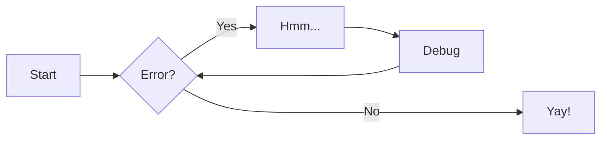

# 在 Zensical 中高效写作：Markdown 高级语法完全指南

Zensical 是一个现代化、高性能的静态站点生成器，兼容 MkDocs 与 Material for MkDocs 的生态，并对 Markdown 扩展进行了深度优化。它不仅支持标准 Markdown 语法，还集成了 代码注解、可折叠提示框、Mermaid 图表、数学公式、内容标签页 等强大功能，助你写出专业、交互性强、视觉美观的技术文档或博客。

> 💡 提示：Zensical 的 Markdown 语法与 Material for MkDocs 完全兼容，因此大多数 MkDocs 主题用户可无缝迁移。

本文将结合官方文档，系统讲解 Zensical 中最实用的高级写作语法，并提供可直接复用的配置与示例。

更多细节内容及配置请参考官方文档 [zensical.org](https://zensical.org/docs/)。

!!! tip "Zensical 构建命令"

    * [`zensical new`][new] - 创建新项目  
    * [`zensical serve`][serve] - 启动本地 Web 服务器  
    * [`zensical build`][build] - 构建你的网站  

      [new]: https://zensical.org/docs/usage/new/  "跳转官方说明"
      [serve]: https://zensical.org/docs/usage/preview/  "跳转官方说明"
      [build]: https://zensical.org/docs/usage/build/  "跳转官方说明"

## 提示框（Admonitions）

提示框（Admonitions），又称“警示框”或“Call-out”，能在不打断正文流的前提下，突出重要信息、警告或建议。

> 详情参见 [官方文档](https://zensical.org/docs/authoring/admonitions/)

### 基础用法

```markdown
!!! note
    这是一个 **note（提示）** 类型的提示框，用于提供有用的信息。

!!! warning
    这是一个 **warning（警告）** 类型的提示框，请小心！
```

!!! note

    这是一个 **note（提示）** 类型的提示框，用于提供有用的信息。

!!! warning

    这是一个 **warning（警告）** 类型的提示框，请小心！

### 自定义标题

```markdown
!!! tip "小技巧：提升写作效率"
    使用 `zensical serve` 实时预览文档变更。
```

!!! tip "小技巧：提升写作效率"
    使用 `zensical serve` 实时预览文档变更。

### 可折叠区块（Details）

通过 `???` 替代 `!!!`，可创建可折叠区块，非常适合 FAQ 或长说明：

> 详情参见 [文档](https://zensical.org/docs/authoring/admonitions/#collapsible-blocks)

```markdown
??? info "点击展开查看更多信息"
    
    此内容默认隐藏，点击后展开。  
    非常适合用于常见问题（FAQ）或较长的说明。
```

??? info "点击展开查看更多信息"
    
    此内容默认隐藏，点击后展开。  
    非常适合用于常见问题（FAQ）或较长的说明。

> 📌 **注意**：若想默认展开，使用 `???+`。

### 内联侧边栏（Inline Admonitions）

将提示框置于段落右侧（或左侧），实现杂志式排版：

```markdown
!!! info inline end "快速参考"
    这个函数返回布尔值。
```
!!! info inline end "快速参考"
    这个函数返回布尔值。

必须**在目标段落前声明**，且在移动端会自动转为全宽。

### 支持的类型

Zensical 内置 12 种提示类型，每种对应不同语义与图标：

| 类型       | 用途     |
| ---------- | -------- |
| `note`     | 一般提示 |
| `abstract` | 摘要     |
| `info`     | 信息说明 |
| `tip`      | 使用技巧 |
| `success`  | 成功状态 |
| `question` | 常见问题 |
| `warning`  | 警告     |
| `failure`  | 失败提示 |
| `danger`   | 严重风险 |
| `bug`      | 已知缺陷 |
| `example`  | 示例     |
| `quote`    | 引用     |

> 🔧 **自定义图标**：可在 `zensical.toml` 中替换任意类型的图标（支持 Lucide、FontAwesome、Octicons 等）。

## 代码块（Code Blocks）

代码高亮是技术文档的核心。Zensical 使用 Pygments 实现构建时语法高亮，并支持**行号、高亮、注解、复制按钮**等功能。

> 详情参见 [官方文档](https://zensical.org/docs/authoring/code-blocks/)

### 基础语法
````markdown
```python title="hello.py"
def greet(name):
print(f"Hello, {name}!")
```
````
```python title="hello.py"
def greet(name):
    print(f"Hello, {name}!")
```

### 高亮特定行

````marrkdown
```python hl_lines="2" title="高亮第2行"
def greet(name):
    print(f"Hello, {name}!")  # 这行被高亮
```
````

```python hl_lines="2" title="高亮第2行"
def greet(name):
    print(f"Hello, {name}!")  # 这行被高亮
```

### 代码注解（Code Annotations）

在代码注释后添加 `(1)!`，并在下方写注解内容：

````markdown
```python title="Code blocks"
def greet(name):
    print(f"Hello, {name}!") # (1)!

greet("Python")
```

1.  代码注解（Code annotations）可用于为代码行添加注释说明。
````

```python title="Code blocks"
def greet(name):
    print(f"Hello, {name}!") # (1)!

greet("Python")
```

1.  代码注解（Code annotations）可用于为代码行添加注释说明。

> ✅ 注解支持任意 Markdown 内容：`**加粗**`、`链接`、甚至 `:rocket:` 表情！

### 行内代码高亮

```markdown
Zensical 支持行内高亮：`#!python print("Hello")`。
```

Zensical 支持行内高亮：`#!python print("Hello")`。

### 相关配置项

!!! tip "功能开关（按需启用）"

    - 复制按钮：`features = ["content.code.copy"]`
    - 行选按钮：`features = ["content.code.select"]`
    - 注解：`features = ["content.code.annotate"]`


## 内容标签页（Content Tabs）

将不同语言、平台或配置方案分组展示，提升可读性。

> 详情参见 [官方文档](https://zensical.org/docs/authoring/content-tabs/)

### 分组代码块

```markdown
=== "Python"
    ```python
    print("Hello from Python!")
    ```

=== "Rust"
    ```rs
    println!("Hello from Rust!");
    ```
```

=== "Python"

    ``` python
    print("Hello from Python!")
    ```

=== "Rust"

    ``` rs
    println!("Hello from Rust!");
    ```

> 💡 当标签页仅包含单个代码块时，Zensical 会自动去除内边距，使外观更紧凑。

### 嵌套内容

标签页可嵌套列表、表格甚至更多标签页：

```markdown
=== "特性"
    - 支持 Mermaid
    - 内置数学公式
    - 响应式设计

=== "兼容性"
    1. 兼容 MkDocs
    2. 支持 Instant Navigation
```

=== "特性"
    - 支持 Mermaid
    - 内置数学公式
    - 响应式设计

=== "兼容性"
    1. 兼容 MkDocs
    2. 支持 Instant Navigation

### 跨页联动（Linked Tabs）

在`Zensical.toml`中启用 `content.tabs.link` 后，点击任意页面的 “Python” 标签，全站所有同名标签页自动切换。

## 图表（Diagrams）

通过 [Mermaid.js](https://mermaid.js.org/)，用纯文本绘制专业图表。

> 详情参见 [官方文档](https://zensical.org/docs/authoring/diagrams/)

### 支持的图表类型

- **流程图（Flowchart）**
- **时序图（Sequence Diagram）**
- **状态图（State Diagram）**
- **类图（Class Diagram）**
- **实体关系图（ER Diagram）**

### 示例:流程图

````markdown

````


> ✅ 自动适配深色/浅色主题，且与 Instant Navigation 兼容。

## 脚注（Footnotes）

为特定词句添加补充说明，不打断阅读流。

> 详情参见 [官方文档](https://zensical.org/docs/authoring/footnotes/)

```markdown
这是一句带有脚注的句子。[^1]

将鼠标悬停其上即可看到提示。

[^1]: 这是脚注内容。
```

这是一句带有脚注的句子。[^1]

将鼠标悬停其上即可看到提示。

[^1]: 这是脚注内容。

### 启用悬浮提示

在配置中开启 `content.footnote.tooltips`，脚注将变为**内联悬浮提示**，用户体验更佳。

## 文本格式（Formatting）

> 详情参见 [官方文档](https://zensical.org/docs/authoring/formatting/)

超越基础 Markdown，实现更丰富的排版。

```markdown
- ==这是高亮标记的文字==          → <mark>效果
- ^^这是下划线插入的文字^^        → <ins>效果
- ~~这是删除线文字~~              → <del>效果
- H~2~O                         → H₂O（下标）
- A^T^A                         → AᵀA（上标）
- ++ctrl+alt+del++              → 键盘按键样式
```

- ==这是高亮标记的文字==
- ^^这是下划线插入的文字^^
- ~~这是删除线文字~~
- H~2~O（下标）
- A^T^A（上标）
- ++ctrl+alt+del++（键盘按键）

> ⚙️ 需启用 `pymdownx.caret`, `pymdownx.mark`, `pymdownx.tilde`, `pymdownx.keys`。

## 图标与表情符号（Icons & Emojis）

Zensical 内置 **10,000+ 图标**（Lucide、FontAwesome、Material Icons、Octicons、Simple Icons）和数千个 Emoji。

> 详情参见 [官方文档](https://zensical.org/docs/authoring/icons-emojis/)

### 使用方式

```markdown
图标：
* :sparkles: `:sparkles:`
* :fontawesome-brands-python: `:fontawesome-brands-python:`
* :lucide-git-pull-request: `:lucide-git-pull-request:`
表情：
* :rocket: `:rocket:`
* :tada: `:tada:`
* :memo: `:memo:`
* :eyes: `:eyes:`
```

图标：

  * :sparkles: `:sparkles:`
  * :fontawesome-brands-python: `:fontawesome-brands-python:`
  * :lucide-git-pull-request: `:lucide-git-pull-request:`

表情：

  * :rocket: `:rocket:`
  * :tada: `:tada:`
  * :memo: `:memo:`
  * :eyes: `:eyes:`

### Zensical 内置的图标集

以下图标集随 Zensical 一起打包提供（链接指向各图标集的搜索页面）：

- :simple-lucide: - [Lucide]
- :material-material-design: – [Material Design]
- :fontawesome-brands-font-awesome: – [FontAwesome]
- :octicons-mark-github-16: – [Octicons]
- :simple-simpleicons: – [Simple Icons]

  [Lucide]: https://lucide.dev/
  [Material Design]: https://pictogrammers.com/library/mdi/
  [FontAwesome]: https://fontawesome.com/search?m=free
  [Octicons]: https://octicons.github.com/
  [Simple Icons]: https://simpleicons.org/

### 自定义样式

通过 Attribute Lists 添加 CSS 类：

```markdown
:fontawesome-brands-github:{ .github-icon }
```

然后在 `extra.css` 中定义颜色或动画。

## 数学公式（Maths）

支持 **KaTeX**（轻量快速）或 **MathJax**（功能全面）。

> 详情参见 [官方文档](https://zensical.org/docs/authoring/math/)

### 行内公式

```latex
质能方程：$E = mc^2$
```

质能方程：$E = mc^2$

### 块级公式

```latex
$$
\cos x = \sum_{k=0}^{\infty} \frac{(-1)^k}{(2k)!} x^{2k}
$$
```

$$
\cos x = \sum_{k=0}^{\infty} \frac{(-1)^k}{(2k)!} x^{2k}
$$

!!! warning "需要配置"
    **注意**：需手动配置 JS 。Zensical **默认不启用**数学渲染，以避免性能开销。

    推荐 KaTeX：加载更快，适合大多数场景。
    你可以在`<script>`标签中手动引入 js ，为单页文件开启数学渲染。
    ```js
    <script id="MathJax-script" async src="https://unpkg.com/mathjax@3/es5/tex-mml-chtml.js"></script>
    <script>
      window.MathJax = {
        tex: {
          inlineMath: [["\\(", "\\)"]],
          displayMath: [["\\[", "\\]"]],
          processEscapes: true,
          processEnvironments: true
        },
        options: {
          ignoreHtmlClass: ".*|",
          processHtmlClass: "arithmatex"
        }
      };
    </script>
    ```

## 任务列表（Task Lists）

创建可勾选的任务清单，适用于教程或部署检查表。

> 详情参见 [官方文档](https://zensical.org/docs/authoring/lists/#using-task-lists)

```markdown
* [x] 安装 Zensical
* [x] 配置 `zensical.toml`
* [x] 编写出色的文档
* [ ] 部署到任意平台
```

* [x] 安装 Zensical
* [x] 配置 `zensical.toml`
* [x] 编写出色的文档
* [ ] 部署到任意平台

> 需启用 `pymdownx.tasklist`，并设置 `custom_checkbox = true` 以使用自定义样式。

## 工具提示（Tooltips）

为链接或图标添加悬浮说明。

### 链接提示

> 详情参见 [官方文档](https://zensical.org/docs/authoring/tooltips/)

```markdown
[将鼠标悬停在此处][example]

[example]: https://example.com "我是一个工具提示！"
```

[将鼠标悬停在此处][example]

[example]: https://example.com "我是一个工具提示！"

### 缩写词提示

定义缩写词：

```markdown
*[API]: Application Programming Interface
*[CLI]: Command-Line Interface
```

*[API]: Application Programming Interface
*[CLI]: Command-Line Interface

当文中出现 `API` 时，自动显示提示，例如 API、CLI。

> 🔧 启用 `content.tooltips` 后，提示样式更美观。

## 结语

Zensical 具备 **简洁的 Markdown 语法** 与 **强大的扩展能力** 。这使得其在以下应用场景中表现出色：

- 构建交互式技术文档
- 编写多语言 API 参考
- 制作教学教程与实验手册
- 搭建个人知识库或博客

Zensical 出色的拓展特性让我们能够专注于内容本身，而非格式细节！祝您写作愉快！