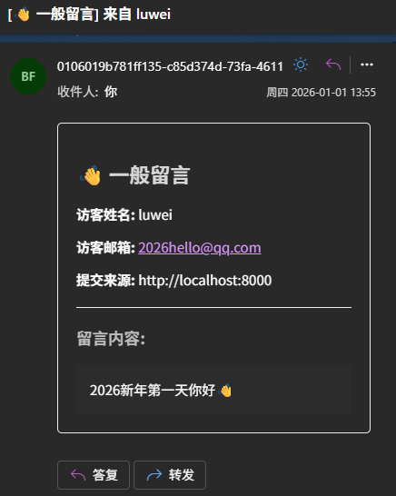

# 📝 零成本给 Zensical 博客添加联系表单功能

作为一个静态博客生成器，**Zensical** 以简洁的文档风格和极速的加载体验深受开发者喜爱。但静态博客最大的痛点在于**缺乏后端交互**。

想让访客留言、反馈 Bug 或申请友链，通常只能用 mailto:（体验差）、第三方表单（样式突兀、有广告）或者评论系统（太重）。

今天，我们来通过 **Cloudflare Workers** (无服务器计算) 和 **Resend** (现代化邮件 API)，为博客搭建一个**完全免费、自定义样式、且自带防跨域保护**的联系表单。

## ✨ 效果预览

不同于普通的嵌入式表单，我们这个方案具备以下亮点：

- 原生体验：UI 深度集成 Zensical 样式，支持明暗主题自动切换。
- 功能丰富：支持下拉选择“友链/反馈/一般留言”，后端自动映射中文标题。
- 细节满满：响应式网格布局、随机名言页脚、发送状态实时反馈。
- 安全防暴：基于 Cloudflare 的跨域白名单机制。

你可以在这里查看部署后的示例：[示例页面](././basic/contact-form/)

## 🛠️ 准备工作

1. Resend 账号：注册 Resend.com，添加你的域名并完成 DNS 验证。获取 API Key。
2. Cloudflare 账号：用于部署后端 Worker。

## 第一步：准备 Resend API

Resend 是目前开发者体验最好的邮件发送服务之一，免费额度（每月 3000 封）对个人博客绰绰有余。

1.  注册 [Resend.com](https://resend.com)。
2.  在 **Domains** 中添加你的域名（例如 `example.com`），并按指引去 DNS 服务商处添加 TXT/MX 记录进行验证。
3.  在 **API Keys** 中创建一个新的 Key，权限选择 "Sending access" 即可。
4.  **复制保存好这个 Key** (`re_12345...`)，稍后要用。

!!! example
    在 Add API Key 时，需要选择域名进行添加。如果你想配置发件邮箱名为 bot@example.com，此步添加的域名应为`example.com`，而不是`bot.example.com`。

## 第二步：部署 Cloudflare Worker

我们需要一个后端来保护 Resend API Key 不暴露在前端代码中。

 1.  登录 [Cloudflare Dashboard](https://dash.cloudflare.com/)，进入 **Workers & Pages**。
 2.  点击 **Create Application** -> **Create Worker**，命名为 `blog-contact-form`（此处可以自定义命名），点击部署。
 3.  点击 **Edit code**，将默认代码清空，粘贴以下代码：

```javascript
export default {
  async fetch(request, env) {
    // ============================================================
    // 1. 安全配置：允许的来源域名白名单
    // ============================================================
    // ⚠️ 请务必修改为你自己的博客域名
    const ALLOWED_ORIGINS = [
      "https://example.com",       
      "https://www.example.com",   
      "http://127.0.0.1:8000",     // 本地预览地址
      "http://localhost:8000"      
    ];

    const origin = request.headers.get("Origin");
    const isAllowed = ALLOWED_ORIGINS.includes(origin);
    
    // 构造 CORS 头
    const corsHeaders = {
      "Access-Control-Allow-Origin": isAllowed ? origin : "null",
      "Access-Control-Allow-Methods": "POST, OPTIONS",
      "Access-Control-Allow-Headers": "Content-Type",
    };
    
    // ============================================================
    // 2. 处理预检请求 (OPTIONS)
    // ============================================================
    if (request.method === "OPTIONS") {
      return new Response(null, { headers: corsHeaders });
    }

    if (request.method !== "POST") {
      return new Response("Method Not Allowed", { status: 405, headers: corsHeaders });
    }

    // 简单的来源校验
    if (origin && !isAllowed) {
       return new Response(JSON.stringify({ success: false, error: "Domain not allowed" }), {
         status: 403,
         headers: { ...corsHeaders, "Content-Type": "application/json" }
       });
    }

    try {
      // ============================================================
      // 3. 解析数据与字段映射
      // ============================================================
      const formData = await request.json();
      const { name, email, message, subject } = formData;

      if (!name || !email || !message) {
        throw new Error("请填写所有必填字段");
      }

      // 映射前端传来的 value 到可读中文
      const subjectMap = {
        "friend_link": "🔗 申请友链",
        "article_feedback": "📝 文章反馈",
        "general": "👋 一般留言"
      };
      
      const readableSubject = subjectMap[subject] || "📩 未分类留言";

      // ============================================================
      // 4. 准备发送给 Resend 的邮件内容
      // ============================================================
      // ⚠️ 修改这里的 from 和 to
      // from: 必须是你在 Resend 验证过的域名邮箱，如 bot@yourdomain.com
      // to: 你想接收通知的个人邮箱
      const sendData = {
        from: "Blog Form <bot@example.com>", 
        to: ["your-personal-email@qq.com"], 
        subject: `[${readableSubject}] 来自 ${name}`,
        html: `
          <div style="font-family: sans-serif; padding: 20px; border: 1px solid #eee; border-radius: 5px;">
            <h2 style="color: #333;">${readableSubject}</h2>
            <p><strong>访客姓名:</strong> ${name}</p>
            <p><strong>访客邮箱:</strong> <a href="mailto:${email}">${email}</a></p>
            <p><strong>提交来源:</strong> ${origin || 'Direct/Unknown'}</p>
            <hr style="border: 0; border-top: 1px solid #eee; margin: 20px 0;" />
            <h3 style="color: #555;">留言内容:</h3>
            <div style="background-color: #f9f9f9; padding: 15px; border-radius: 4px; white-space: pre-wrap; line-height: 1.6;">${message}</div>
          </div>
        `,
        reply_to: email 
      };

      // ============================================================
      // 5. 调用 Resend API
      // ============================================================
      const resendResponse = await fetch("https://api.resend.com/emails", {
        method: "POST",
        headers: {
          "Authorization": `Bearer ${env.RESEND_API_KEY}`,
          "Content-Type": "application/json",
        },
        body: JSON.stringify(sendData),
      });

      const responseData = await resendResponse.json();

      if (!resendResponse.ok) {
        throw new Error(responseData.message || "Resend API Error");
      }

      return new Response(JSON.stringify({ success: true }), {
        status: 200,
        headers: { ...corsHeaders, "Content-Type": "application/json" },
      });

    } catch (error) {
      return new Response(JSON.stringify({ success: false, error: error.message }), {
        status: 500,
        headers: { ...corsHeaders, "Content-Type": "application/json" },
      });
    }
  },
};
```

!!! tip "4.重要配置"
    *   在代码中找到 `ALLOWED_ORIGINS`，把 `example.com` 改成你自己的域名。
    *   在代码中找到 `from` 字段，必须改成你在 Resend 验证过的域名地址。
    *   保存并部署 (Save and deploy)。

!!! tip "5.设置环境变量"
    *   回到 Worker 的 **Settings** -> **Variables and Secrets**。
    *   点击 **Add**，Type类型选择`Text`，变量名填写 `RESEND_API_KEY`，值填入第一步获取的 Resend Key。
    *   点击右下角的 **Deploy** 部署保存。

!!! failure "重要提醒"
    请为部署的 Cloudflare Worker 项目绑定**自定义域名**，默认域名国内访问会被阻断，导致无法向 Worker 发送请求。

## 第三步：在 Zensical 中创建表单联系页面

现在后端已经就绪，我们在 Zensical 中创建一个 `contact.md` 页面（示例，路径与名称可以自命名），并将该页面添加至 `nav` 导航配置中。我们会利用 Zensical 原生的主题色，让表单看起来更和谐。

在 `docs/contact.md` 中写入：

```markdown
---
title: 联系表单
tags:
  - 帮助支持
icon: material/card-account-mail
hide:
  - tags
---

# 联系表单

???+ tip "在留言前请阅读"

    欢迎与我联系！为了提高沟通效率，请参考以下说明：

    === "🔗 申请友链"
        如果您想申请交换友链，请在留言中包含以下信息：

        ```yaml title="友链格式示例/本站信息"
        站点名称: 你的站点名称
        站点地址 (URL): 你的站点链接
        站点描述: 你的站点描述
        图标地址 (Avatar/Logo): 你的站点头像链接
        ```

    === "📝 文章反馈"
        如果您发现文章有错误或有建议，请注明：
        
        *   **文章标题** 或 **链接**
        *   具体的问题描述或修正建议
    
    === "👋 商务/其他"
        欢迎任何形式的友好交流或合作咨询。

<!-- 表单容器 -->
<div class="md-typeset form-container">
  <form id="contactForm">

    <div class="form-grid">
      <!-- 主题：全宽 -->
      <div class="grid-item full-width">
        <label for="subject">主题</label>
        <div class="select-wrapper">
          <select id="subject" name="subject" required>
            <option value="general" selected>👋 一般留言 / 交流</option>
            <option value="friend_link">🔗 申请友链</option>
            <option value="article_feedback">📝 文章反馈 / 捉虫</option>
          </select>
        </div>
      </div>
    
      <!-- 姓名 -->
      <div class="grid-item">
        <label for="name">称呼</label>
        <input type="text" id="name" name="name" placeholder="我该如何称呼您？" required>
      </div>
      
      <!-- 邮箱 -->
      <div class="grid-item">
        <label for="email">邮箱</label>
        <input type="email" id="email" name="email" placeholder="接收回复用（不会公开）" required>
      </div>
      
      <!-- 内容：全宽 -->
      <div class="grid-item full-width">
        <label for="message">内容</label>
        <textarea id="message" name="message" rows="5" placeholder="请在此输入留言..." required></textarea>
      </div>
    </div>
    
    <!-- 底部栏 -->
    <div class="form-footer">
      <div class="footer-quote" id="randomQuote">
        保持热爱，奔赴山海。
      </div>
      <div class="footer-actions">
        <span id="statusMsg" class="status-text"></span>
        <button type="submit" id="submitBtn" class="md-button md-button--primary compact-btn">
          <span>发送</span>
          <svg xmlns="http://www.w3.org/2000/svg" viewBox="0 0 24 24"><path d="M2.01 21L23 12 2.01 3 2 10l15 2-15 2z"/></svg>
        </button>
      </div>
    </div>

  </form>
</div>

<style>
  /* 1. 表单容器 */
  .form-container {
    width: 100%;
    /* 使用负边距抵消主题默认的段落间距 */
    margin-top: -0.3rem; 
    padding-top: 0;
    padding-bottom: 0.5rem;
  }

  /* 2. 网格布局 */
  .form-grid {
    display: grid;
    grid-template-columns: 1fr 1fr;
    gap: 0.6rem 0.8rem;
    margin-bottom: 0.4rem;
  }

  .full-width { grid-column: span 2; }

  /* 3. 元素样式 */
  .grid-item label {
    display: block;
    font-size: 0.85rem;
    font-weight: 700;
    margin-bottom: 0.2rem;
    color: var(--md-default-fg-color--light);
  }

  .grid-item input,
  .grid-item textarea,
  .grid-item select {
    width: 100%;
    box-sizing: border-box;
    padding: 7px 10px;
    font-size: 0.9rem;
    border: 1px solid var(--md-default-fg-color--lighter);
    border-radius: 4px;
    background: var(--md-default-bg-color);
    color: var(--md-default-fg-color);
    transition: all 0.2s;
  }

  .grid-item input:focus,
  .grid-item textarea:focus,
  .grid-item select:focus {
    border-color: var(--md-primary-fg-color);
    box-shadow: 0 0 0 3px var(--md-primary-fg-color--transparent);
    outline: none;
  }

  /* 4. 底部栏 */
  .form-footer {
    display: flex;
    justify-content: space-between;
    align-items: center;
    border-top: 1px solid var(--md-default-fg-color--lighter);
    padding-top: 0.6rem;
    gap: 1rem;
  }

  .footer-quote {
    font-size: 0.8rem;
    color: var(--md-default-fg-color--light);
    font-style: italic;
    opacity: 0.8;
    max-width: 60%;
    white-space: nowrap;
    overflow: hidden;
    text-overflow: ellipsis;
  }

  .footer-actions {
    display: flex;
    align-items: center;
    gap: 0.8rem;
    flex-shrink: 0;
  }

  /* 5. 发送按钮 */
  .compact-btn {
    display: flex;
    align-items: center;
    gap: 4px;
    padding: 3px 12px;
    font-size: 0.8rem;
    font-weight: bold;
    border-radius: 50px;
    height: auto;
    min-height: 28px;
    line-height: 1.2;
  }

  .compact-btn svg { 
    width: 17px;
    height: 17px;
    transform: translateY(1.5px);
    fill: currentColor; 
  }

  .compact-btn:active { transform: scale(0.96); }

  /* 6. 状态信息 */
  .status-text {
    font-size: 0.75rem;
    opacity: 0;
    transition: opacity 0.3s;
  }
  .status-text.visible { opacity: 1; }
  .status-success { color: var(--md-code-hl-string-color); }
  .status-error { color: var(--md-code-hl-function-color); }

  /* 7. 移动端适配 */
  @media screen and (max-width: 600px) {
    .form-grid {
      grid-template-columns: 1fr;
      gap: 0.5rem;
    }
    .full-width { grid-column: span 1; }
    
    .form-footer {
      flex-direction: column-reverse;
      align-items: flex-end;
      padding-top: 0.5rem;
    }
    .footer-quote {
      max-width: 100%;
      text-align: right;
    }
  }
</style>

<script>
  const quotes = [
    "保持热爱，奔赴山海。",
    "Code is poetry.",
    "Stay hungry, stay foolish.",
    "凡是过往，皆为序章。",
    "Talk is cheap. Show me the code.",
    "星光不问赶路人。",
    "知行合一。",
    "Less is more."
  ];

  function loadQuote() {
    const quoteEl = document.getElementById('randomQuote');
    if(quoteEl) {
      const randomQuote = quotes[Math.floor(Math.random() * quotes.length)];
      quoteEl.innerText = randomQuote;
    }
  }
  loadQuote();

  document.getElementById('contactForm').addEventListener('submit', async function(e) {
    e.preventDefault();
    
    const btn = document.getElementById('submitBtn');
    const msg = document.getElementById('statusMsg');
    const originalBtnContent = btn.innerHTML;
    
    const WORKER_URL = "https://form.9420000.xyz";
    
    const formData = {
      subject: document.getElementById('subject').value,
      name: document.getElementById('name').value,
      email: document.getElementById('email').value,
      message: document.getElementById('message').value
    };
    
    btn.disabled = true;
    btn.innerHTML = "<span>...</span>"; 
    msg.innerText = "";
    msg.className = "status-text";
    
    try {
      const response = await fetch(WORKER_URL, {
        method: "POST",
        headers: { "Content-Type": "application/json" },
        body: JSON.stringify(formData)
      });
    
      const result = await response.json();
    
      if (response.ok && result.success) {
        msg.innerText = "✅ 已发送";
        msg.className = "status-text visible status-success";
        document.getElementById('contactForm').reset();
        loadQuote();
      } else {
        throw new Error(result.error || "未知错误");
      }
    } catch (error) {
      console.error(error);
      msg.innerText = "❌ 发送失败";
      msg.className = "status-text visible status-error";
    } finally {
      btn.disabled = false;
      btn.innerHTML = originalBtnContent;
      setTimeout(() => { msg.classList.remove('visible'); }, 5000);
    }
  });
</script>
```

## 第四步：测试与验证

1.  运行 `zensical serve` 在本地启动博客。
2.  进入`contact.md`文件被配置的路径，打开页面填写测试信息。
3.  点击发送。
4.  查看你的 Cloudflare Worker 日志（如果出错的话）、Resend Emails 界面（检查是否有发信请求）或者直接查看你的收件箱。

**🎉 成功效果：**

你会收到一封格式精美的邮件，标题清楚地标明了 `[🔗 申请友链] 来自 张三`，且由于我们在代码中设置了 `reply_to`，你直接在邮件客户端点击“回复”，收件人就会自动变成访客填写的邮箱。

例如：



## 总结

通过这个方案，我们实现了：

1.  **安全性**：Resend Key 不泄露，且只有指定域名的请求会被处理。
2.  **用户体验**：前端无跳转，样式与 Zensical 主题统一。
3.  **可维护性**：邮件模板和逻辑都在 Cloudflare Worker 中，修改无需重新部署博客。

希望本文对您有帮助！🚀